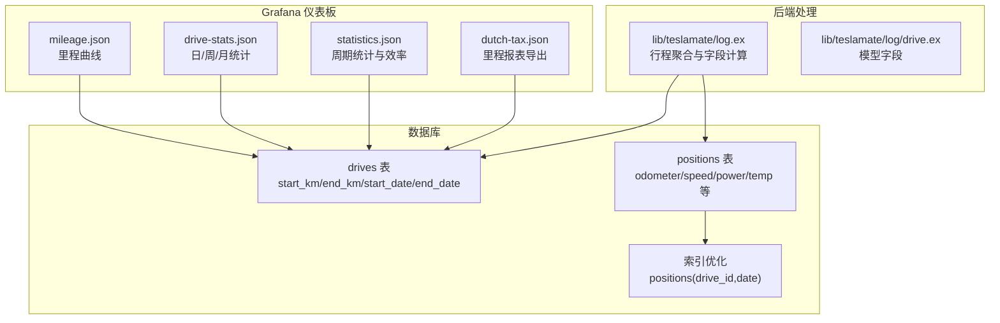
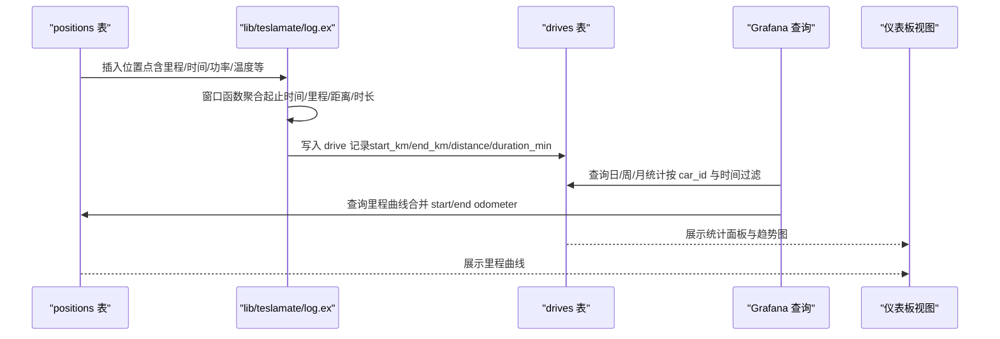
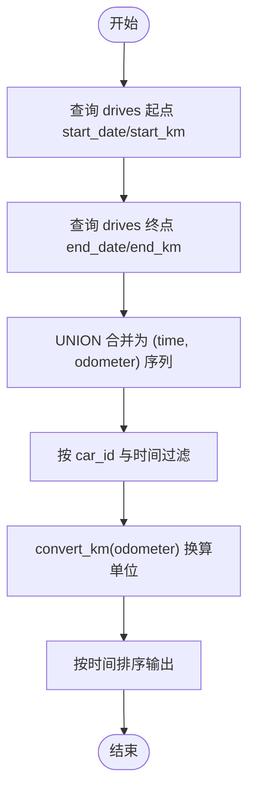
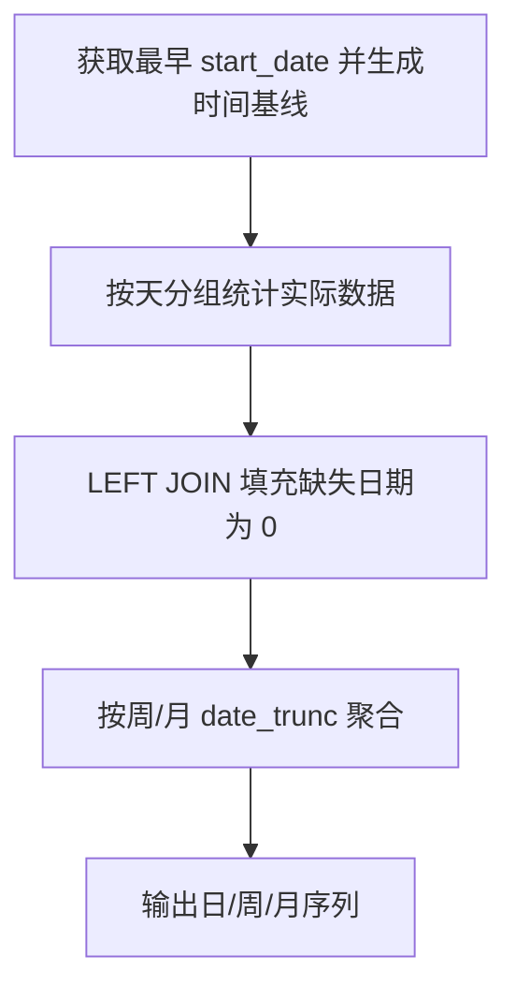
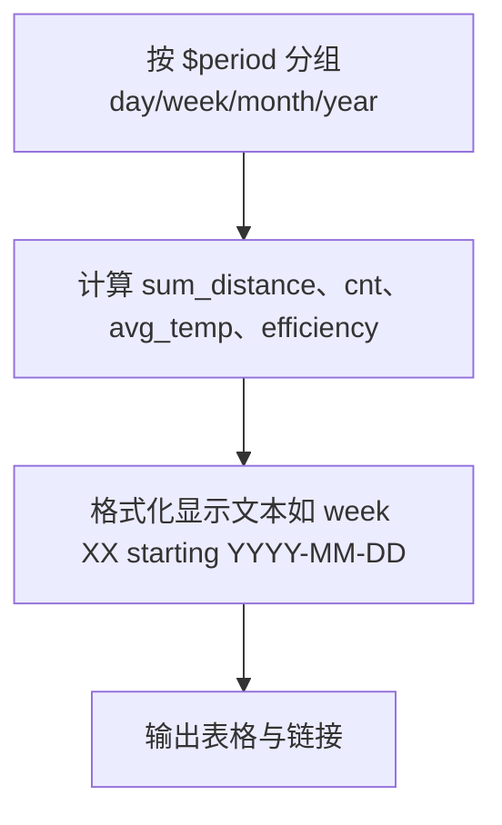
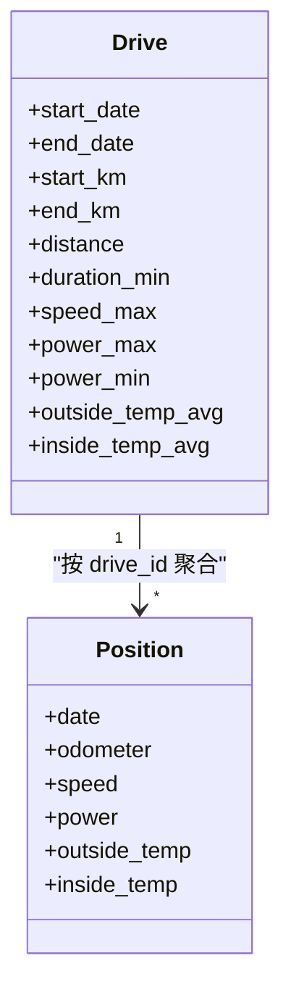
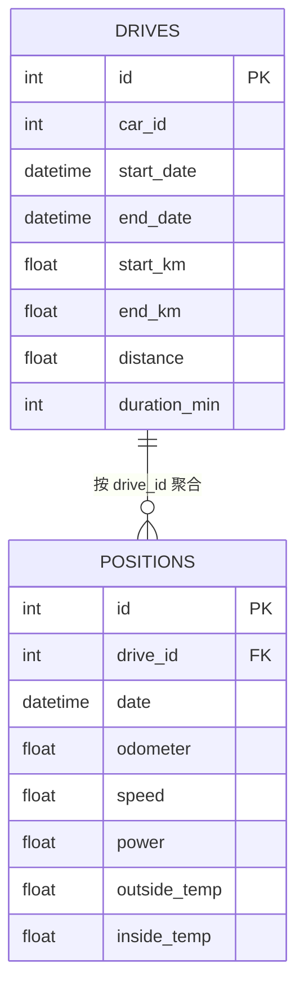

# 里程统计分析

<cite>
**本文引用的文件**
- [mileage.json](file://grafana/dashboards/mileage.json)
- [drive-stats.json](file://grafana/dashboards/drive-stats.json)
- [statistics.json](file://grafana/dashboards/statistics.json)
- [log.ex](file://lib/teslamate/log.ex)
- [drive.ex](file://lib/teslamate/log/drive.ex)
- [20190812191616_rename_trips_to_drives.exs](file://priv/repo/migrations/20190812191616_rename_trips_to_drives.exs)
- [20190729181314_fix_trip_efficiency.exs](file://priv/repo/migrations/20190729181314_fix_trip_efficiency.exs)
- [20190821155748_drop_consumption_columns.exs](file://priv/repo/migrations/20190821155748_drop_consumption_columns.exs)
- [20230417225712_composite_index_to_position.exs](file://priv/repo/migrations/20230417225712_composite_index_to_position.exs)
- [dutch-tax.json](file://grafana/dashboards/reports/dutch-tax.json)
</cite>

## 目录
1. [简介](#简介)
2. [项目结构](#项目结构)
3. [核心组件](#核心组件)
4. [架构总览](#架构总览)
5. [详细组件分析](#详细组件分析)
6. [依赖关系分析](#依赖关系分析)
7. [性能考量](#性能考量)
8. [故障排查指南](#故障排查指南)
9. [结论](#结论)
10. [附录：操作指南与最佳实践](#附录操作指南与最佳实践)

## 简介
本文件面向使用 TeslaMate 的用户与运维人员，系统化阐述“里程统计分析”在仪表板中的实现方式与使用方法。重点覆盖：
- 车辆总里程与周期性里程（日/周/月）的统计方法与数据来源
- 里程分布与驾驶频率统计的可视化与计算逻辑
- 跨周期行程数据的处理策略
- 里程趋势图、同比/环比分析思路
- 使用里程数据评估车辆使用强度的方法
- 自定义统计周期与导出里程报告的操作指南

## 项目结构
围绕“里程统计分析”，涉及的关键文件与职责如下：
- Grafana 仪表板：负责查询与展示
  - 里程曲线与单位换算：mileage.json
  - 日/周/月统计与驾驶频率：drive-stats.json
  - 周期维度统计与效率指标：statistics.json
  - 报表导出：dutch-tax.json
- 后端数据处理：lib/teslamate/log.ex
  - 驱动行程聚合与字段计算（距离、时长、起止里程等）
- 数据模型与迁移：lib/teslamate/log/drive.ex 及相关迁移
  - 表结构演进与索引优化

图表来源
- [mileage.json](file://grafana/dashboards/mileage.json#L160-L212)
- [drive-stats.json](file://grafana/dashboards/drive-stats.json#L97-L233)
- [statistics.json](file://grafana/dashboards/statistics.json#L64-L723)
- [log.ex](file://lib/teslamate/log.ex#L246-L327)
- [drive.ex](file://lib/teslamate/log/drive.ex#L33-L78)
- [20230417225712_composite_index_to_position.exs](file://priv/repo/migrations/20230417225712_composite_index_to_position.exs#L1-L8)

章节来源
- [mileage.json](file://grafana/dashboards/mileage.json#L160-L212)
- [drive-stats.json](file://grafana/dashboards/drive-stats.json#L97-L233)
- [statistics.json](file://grafana/dashboards/statistics.json#L64-L723)
- [log.ex](file://lib/teslamate/log.ex#L246-L327)
- [drive.ex](file://lib/teslamate/log/drive.ex#L33-L78)
- [20230417225712_composite_index_to_position.exs](file://priv/repo/migrations/20230417225712_composite_index_to_position.exs#L1-L8)

## 核心组件
- 里程曲线（mileage.json）
  - 通过合并行程起点与终点的里程值，按时间序列展示累计里程曲线；支持长度单位切换（km/mi）。
- 日/周/月统计（drive-stats.json）
  - 提供每日驾驶次数、日行驶距离、日耗电量等指标的时间序列；支持按天、周、月聚合。
- 周期统计与效率（statistics.json）
  - 按选定周期（日/周/月/年）汇总距离、效率、能耗等，支持链接跳转到具体周期明细。
- 行程聚合与字段计算（lib/teslamate/log.ex）
  - 基于 positions 窗口函数计算每条 drive 的起止时间、起止里程、距离、时长等关键字段。
- 报表导出（dutch-tax.json）
  - 导出包含起止里程、地址、时长、距离等字段的表格，便于人工核对或税务用途。

章节来源
- [mileage.json](file://grafana/dashboards/mileage.json#L160-L212)
- [drive-stats.json](file://grafana/dashboards/drive-stats.json#L97-L233)
- [statistics.json](file://grafana/dashboards/statistics.json#L64-L723)
- [log.ex](file://lib/teslamate/log.ex#L246-L327)
- [dutch-tax.json](file://grafana/dashboards/reports/dutch-tax.json#L321-L334)

## 架构总览
下图展示了从原始位置点到最终统计结果的数据流路径。

图表来源
- [log.ex](file://lib/teslamate/log.ex#L246-L327)
- [mileage.json](file://grafana/dashboards/mileage.json#L180-L210)
- [drive-stats.json](file://grafana/dashboards/drive-stats.json#L97-L233)

## 详细组件分析

### 组件A：里程曲线（mileage.json）
- 数据来源
  - drives 表的起止时间与里程，通过 UNION 合并起点与终点两条记录，形成“里程随时间变化”的序列。
- 时间聚合与单位换算
  - 使用时间过滤器 $__timeFilter，按 car_id 过滤；里程值通过 convert_km 进行单位换算。
- 可视化要点
  - 折线图展示累计里程，支持 km/mi 单位切换；legend 显示最小/最大值。

图表来源
- [mileage.json](file://grafana/dashboards/mileage.json#L180-L210)

章节来源
- [mileage.json](file://grafana/dashboards/mileage.json#L160-L212)

### 组件B：日/周/月统计（drive-stats.json）
- 日度统计
  - 驾驶次数：按天分组计数
  - 日行驶距离：按天求和 distance
  - 日耗电量：按天求和 net 能耗
- 周/月聚合
  - 使用 date_trunc 对 start_date 进行周/月聚合，生成完整时间基线，再 LEFT JOIN 实际数据，保证空区间显示为 0。
- 重要过滤条件
  - end_date 不为空，确保完整行程被纳入统计。

图表来源
- [drive-stats.json](file://grafana/dashboards/drive-stats.json#L97-L233)

章节来源
- [drive-stats.json](file://grafana/dashboards/drive-stats.json#L97-L233)

### 组件C：周期统计与效率（statistics.json）
- 周期维度
  - 支持按 day/week/month/year 聚合，显示周期起止时间戳、周期名称、距离、平均气温、次数、效率等。
- 效率计算
  - 基于 range_diff 与 distance 的比值估算效率；仅对满足精度条件的行程进行统计。
- 可视化与交互
  - 表格单元格可点击跳转到对应周期的“Trip”或“Charging stats”等仪表板。

图表来源
- [statistics.json](file://grafana/dashboards/statistics.json#L64-L723)

章节来源
- [statistics.json](file://grafana/dashboards/statistics.json#L64-L723)

### 组件D：行程聚合与字段计算（lib/teslamate/log.ex）
- 关键字段
  - 起止时间、起止里程、距离、时长（分钟）、最高/最低速度、功率、内外温度等。
- 计算逻辑
  - 使用窗口函数 over(w) 对同一 drive_id 的 positions 进行聚合，计算首尾值与差值，得到 distance 与 duration_min。
- 数据完整性
  - 仅当满足最小位移与最少采样点时才写入有效 drive 记录，避免噪声数据影响统计。

图表来源
- [log.ex](file://lib/teslamate/log.ex#L246-L327)
- [drive.ex](file://lib/teslamate/log/drive.ex#L33-L78)

章节来源
- [log.ex](file://lib/teslamate/log.ex#L246-L327)
- [drive.ex](file://lib/teslamate/log/drive.ex#L33-L78)

### 组件E：报表导出（dutch-tax.json）
- 输出字段
  - 行程标识、起止时间戳、起止里程（km/mi）、起止地址、时长、距离（km/mi）。
- 适用场景
  - 税务或审计需要的结构化导出，便于人工复核与归档。

章节来源
- [dutch-tax.json](file://grafana/dashboards/reports/dutch-tax.json#L321-L334)

## 依赖关系分析
- 表结构与索引
  - drives 表存储行程元信息（起止时间、里程、距离、时长等）。
  - positions 表存储细粒度位置点，复合索引 positions(drive_id, date) 提升查询性能。
- 字段演进
  - 历史迁移将 trips 表重命名为 drives，并调整外键与索引命名；删除旧的消耗字段以统一统计口径。
- 数据一致性
  - 行程聚合在后端完成，确保统计口径一致且不受前端过滤干扰。

图表来源
- [drive.ex](file://lib/teslamate/log/drive.ex#L33-L78)
- [20190812191616_rename_trips_to_drives.exs](file://priv/repo/migrations/20190812191616_rename_trips_to_drives.exs#L1-L23)
- [20190821155748_drop_consumption_columns.exs](file://priv/repo/migrations/20190821155748_drop_consumption_columns.exs#L1-L10)
- [20230417225712_composite_index_to_position.exs](file://priv/repo/migrations/20230417225712_composite_index_to_position.exs#L1-L8)

章节来源
- [drive.ex](file://lib/teslamate/log/drive.ex#L33-L78)
- [20190812191616_rename_trips_to_drives.exs](file://priv/repo/migrations/20190812191616_rename_trips_to_drives.exs#L1-L23)
- [20190729181314_fix_trip_efficiency.exs](file://priv/repo/migrations/20190729181314_fix_trip_efficiency.exs#L1-L21)
- [20190821155748_drop_consumption_columns.exs](file://priv/repo/migrations/20190821155748_drop_consumption_columns.exs#L1-L10)
- [20230417225712_composite_index_to_position.exs](file://priv/repo/migrations/20230417225712_composite_index_to_position.exs#L1-L8)

## 性能考量
- 索引优化
  - 复合索引 positions(drive_id, date) 显著提升按行程与时间范围的查询性能，尤其在大规模历史数据场景。
- 聚合策略
  - 在数据库侧完成按日/周/月的聚合，减少前端渲染压力；仅在需要时进行单位换算。
- 数据清洗
  - 仅统计 end_date 存在且满足最小位移的行程，降低噪声对日均距离与频率的影响。

章节来源
- [20230417225712_composite_index_to_position.exs](file://priv/repo/migrations/20230417225712_composite_index_to_position.exs#L1-L8)
- [drive-stats.json](file://grafana/dashboards/drive-stats.json#L97-L233)

## 故障排查指南
- 里程曲线不连续
  - 检查 drives 中是否存在未关闭的行程（end_date 为空），这类行程不会出现在里程曲线上。
- 日/周/月统计出现空洞
  - 确认是否正确生成时间基线并使用 LEFT JOIN；检查 $__timeFilter 参数是否覆盖目标时间段。
- 效率异常偏高/偏低
  - 查看是否启用了“更精确”的行程筛选条件（如 range_diff 条件），以及 preferred_range 设置是否符合预期。
- 导出数据缺少地址
  - 地址在导入/同步过程中异步补全，重启后可能延迟可见；可等待一段时间或手动触发地址解析任务。

章节来源
- [mileage.json](file://grafana/dashboards/mileage.json#L180-L210)
- [drive-stats.json](file://grafana/dashboards/drive-stats.json#L97-L233)
- [statistics.json](file://grafana/dashboards/statistics.json#L64-L723)

## 结论
通过将原始位置点在后端聚合为标准化的行程记录，并结合 Grafana 的时间序列与周期聚合能力，系统实现了：
- 总里程与周期性里程的准确统计
- 驾驶频率与里程分布的多维可视化
- 跨周期行程的稳健处理
- 基于周期维度的同比/环比分析思路
- 可导出的结构化里程报告

这些能力共同支撑了以里程为核心的车辆使用强度评估与运营分析。

## 附录：操作指南与最佳实践

### 如何评估车辆使用强度
- 日均行驶距离：取“总距离/总天数”或“日均距离”面板数值，结合“驾驶频率”判断日常使用强度。
- 周期效率：参考“周期统计与效率”面板中的效率列，关注低效周期（如极端天气或拥堵时段）。
- 里程分布：结合“日/周/月统计”观察出行高峰与低谷，识别用车模式变化。
- 异常识别：关注里程曲线的断层与突增，结合行程详情定位异常原因（如设备离线、重复行程等）。

章节来源
- [drive-stats.json](file://grafana/dashboards/drive-stats.json#L97-L233)
- [statistics.json](file://grafana/dashboards/statistics.json#L64-L723)

### 自定义统计周期
- 在“周期统计与效率”面板中选择 period（day/week/month/year），即可切换不同周期粒度的统计视图。
- 若需自定义聚合粒度，可在相应查询中调整 date_trunc 的参数（例如按季度或年度）。

章节来源
- [statistics.json](file://grafana/dashboards/statistics.json#L64-L723)

### 导出里程报告
- 打开“里程报表导出”仪表板，选择目标时间段与车辆，导出包含起止里程、地址、时长、距离等字段的表格，便于人工复核与归档。

章节来源
- [dutch-tax.json](file://grafana/dashboards/reports/dutch-tax.json#L321-L334)