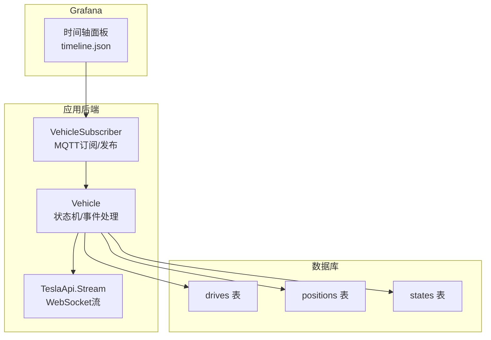
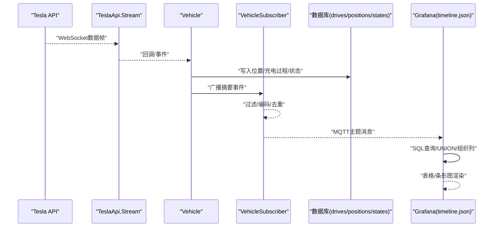
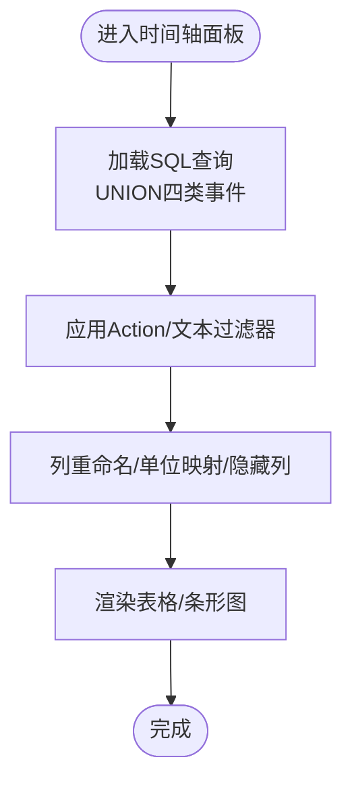
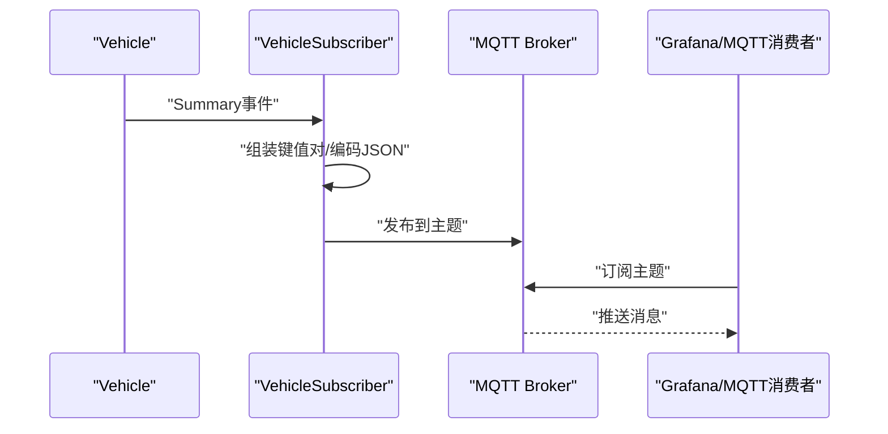
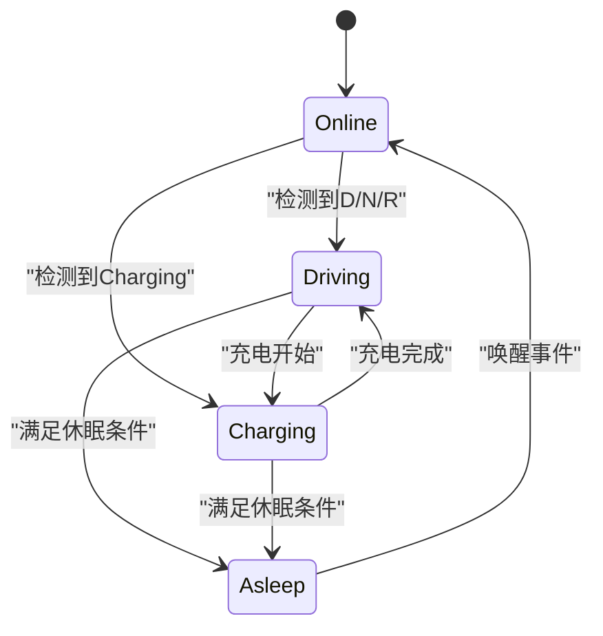
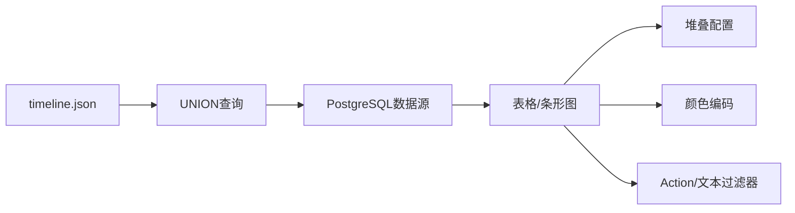

# 时间轴视图

<cite>
**本文引用的文件**
- [grafana/dashboards/timeline.json](file://grafana/dashboards/timeline.json)
- [lib/teslamate/mqtt/pubsub/vehicle_subscriber.ex](file://lib/teslamate/mqtt/pubsub/vehicle_subscriber.ex)
- [lib/teslamate/vehicles/vehicle.ex](file://lib/teslamate/vehicles/vehicle.ex)
- [lib/tesla_api/stream.ex](file://lib/tesla_api/stream.ex)
- [lib/teslamate/log/drive.ex](file://lib/teslamate/log/drive.ex)
- [priv/repo/migrations/20190330160000_create_trips.exs](file://priv/repo/migrations/20190330160000_create_trips.exs)
- [priv/repo/migrations/20190330170000_create_positions.exs](file://priv/repo/migrations/20190330170000_create_positions.exs)
- [priv/repo/migrations/20190330180000_create_states.exs](file://priv/repo/migrations/20190330180000_create_states.exs)
- [test/teslamate/vehicles/vehicle/charging_test.exs](file://test/teslamate/vehicles/vehicle/charging_test.exs)
- [test/teslamate/vehicles/vehicle/suspend_test.exs](file://test/teslamate/vehicles/vehicle/suspend_test.exs)
</cite>

## 目录
1. [简介](#简介)
2. [项目结构](#项目结构)
3. [核心组件](#核心组件)
4. [架构总览](#架构总览)
5. [详细组件分析](#详细组件分析)
6. [依赖关系分析](#依赖关系分析)
7. [性能考量](#性能考量)
8. [故障排查指南](#故障排查指南)
9. [结论](#结论)
10. [附录](#附录)

## 简介
本文件面向TeslaMate用户与开发者，系统化阐述“时间轴视图”（Timeline）的多维度事件叠加展示机制，包括：
- 如何将驾驶事件、充电事件、车辆唤醒/休眠事件在统一时间轴上对齐显示；
- Grafana条形图/表格面板的堆叠配置与颜色编码策略；
- TeslaMate.PubSub事件流如何被转换为时间序列数据点；
- 如何调整时间粒度（小时/天/周），过滤特定事件类型，以及通过正则表达式高亮显示特定驾驶模式。

## 项目结构
围绕时间轴视图的关键位置如下：
- Grafana仪表盘：grafana/dashboards/timeline.json
- MQTT订阅与发布：lib/teslamate/mqtt/pubsub/vehicle_subscriber.ex
- 车辆状态机与事件处理：lib/teslamate/vehicles/vehicle.ex
- Tesla API WebSocket流：lib/tesla_api/stream.ex
- 数据模型（驱动、位置、状态）：lib/teslamate/log/drive.ex 及对应迁移脚本

图表来源
- [grafana/dashboards/timeline.json](file://grafana/dashboards/timeline.json#L1-L759)
- [lib/teslamate/mqtt/pubsub/vehicle_subscriber.ex](file://lib/teslamate/mqtt/pubsub/vehicle_subscriber.ex#L1-L217)
- [lib/teslamate/vehicles/vehicle.ex](file://lib/teslamate/vehicles/vehicle.ex#L862-L896)
- [lib/tesla_api/stream.ex](file://lib/tesla_api/stream.ex#L1-L92)
- [lib/teslamate/log/drive.ex](file://lib/teslamate/log/drive.ex#L1-L79)
- [priv/repo/migrations/20190330160000_create_trips.exs](file://priv/repo/migrations/20190330160000_create_trips.exs#L1-L29)
- [priv/repo/migrations/20190330170000_create_positions.exs](file://priv/repo/migrations/20190330170000_create_positions.exs#L1-L28)
- [priv/repo/migrations/20190330180000_create_states.exs](file://priv/repo/migrations/20190330180000_create_states.exs#L1-L18)

章节来源
- [grafana/dashboards/timeline.json](file://grafana/dashboards/timeline.json#L1-L759)

## 核心组件
- Grafana时间轴面板（timeline.json）
  - 使用PostgreSQL数据源查询drives、charging_processes、updates等表，通过UNION组合生成统一时间轴数据集，并以表格形式呈现。
  - 提供Action过滤器（驾驶/充电/停车/缺失/更新）与文本过滤器，支持按地址关键字筛选。
  - 内置模板变量控制单位（长度/温度/范围偏好）与时间窗口。
- MQTT订阅与发布（VehicleSubscriber）
  - 订阅车辆摘要事件，将关键字段转换为MQTT主题消息并发布，便于外部系统或可视化集成。
- 车辆状态机（Vehicle）
  - 驾驶/充电/休眠等状态切换时触发事件，连接/断开WebSocket流，写入位置与充电记录。
- Tesla API WebSocket流（TeslaApi.Stream）
  - 建立与Tesla Streaming API的WebSocket连接，订阅实时遥测数据。

章节来源
- [grafana/dashboards/timeline.json](file://grafana/dashboards/timeline.json#L500-L759)
- [lib/teslamate/mqtt/pubsub/vehicle_subscriber.ex](file://lib/teslamate/mqtt/pubsub/vehicle_subscriber.ex#L61-L116)
- [lib/teslamate/vehicles/vehicle.ex](file://lib/teslamate/vehicles/vehicle.ex#L862-L896)
- [lib/tesla_api/stream.ex](file://lib/tesla_api/stream.ex#L1-L92)

## 架构总览
下图展示了从MQTT到Grafana时间轴的数据链路与事件叠加逻辑：

图表来源
- [lib/tesla_api/stream.ex](file://lib/tesla_api/stream.ex#L1-L92)
- [lib/teslamate/vehicles/vehicle.ex](file://lib/teslamate/vehicles/vehicle.ex#L862-L896)
- [lib/teslamate/mqtt/pubsub/vehicle_subscriber.ex](file://lib/teslamate/mqtt/pubsub/vehicle_subscriber.ex#L61-L116)
- [grafana/dashboards/timeline.json](file://grafana/dashboards/timeline.json#L500-L759)

## 详细组件分析

### 组件A：Grafana时间轴面板（timeline.json）
- 多维度事件叠加
  - 通过UNION组合四类事件：Driving、Charging、Parking（基于drives_and_charging_processes窗口计算）、Missing（跨行程地址不一致且里程变化）与Updating（软件版本）。
  - 每类事件包含开始/结束时间、地址、SoC、能耗、里程差、续航差、温度等字段，形成统一时间轴。
- 堆叠与颜色策略
  - 该面板为表格类型，未使用条形图堆叠；如需堆叠可视化，可参考其他面板的堆叠配置（见“依赖关系分析”中的条形图堆叠设置）。
- 过滤与高亮
  - Action过滤器：支持多选过滤（驾驶/充电/停车/缺失/更新）。
  - 文本过滤器：按起止地址关键字过滤。
  - 正则高亮：通过字段匹配器（byRegexp）对温度、里程、续航差等字段进行单位与显示名映射，便于识别。
- 时间粒度与时间窗口
  - 时间窗口默认最近7天；可通过Grafana时间选择器调整。
  - 若需按小时/天/周聚合，可在SQL中使用date_trunc或GROUP BY（参考其他统计面板的聚合方式）。

图表来源
- [grafana/dashboards/timeline.json](file://grafana/dashboards/timeline.json#L500-L759)

章节来源
- [grafana/dashboards/timeline.json](file://grafana/dashboards/timeline.json#L500-L759)

### 组件B：TeslaMate.PubSub事件流到MQTT
- VehicleSubscriber负责：
  - 订阅车辆摘要事件，提取简单值、经纬度、地理围栏、活动路线等，编码为JSON并发布到MQTT主题。
  - 对变更值进行去重与保留策略，避免冗余消息。
- 事件来源：
  - 车辆状态机在驱动/充电/休眠等状态下广播摘要事件，Vehicle调用API建立/断开WebSocket流，并写入位置与充电记录。

图表来源
- [lib/teslamate/mqtt/pubsub/vehicle_subscriber.ex](file://lib/teslamate/mqtt/pubsub/vehicle_subscriber.ex#L61-L116)
- [lib/teslamate/vehicles/vehicle.ex](file://lib/teslamate/vehicles/vehicle.ex#L1663-L1702)

章节来源
- [lib/teslamate/mqtt/pubsub/vehicle_subscriber.ex](file://lib/teslamate/mqtt/pubsub/vehicle_subscriber.ex#L61-L116)
- [lib/teslamate/vehicles/vehicle.ex](file://lib/teslamate/vehicles/vehicle.ex#L1663-L1702)

### 组件C：驾驶/充电/休眠事件的数据库落盘
- 驱动事件
  - Vehicle在检测到驾驶开始时创建位置并启动驾驶记录，随后持续写入位置与遥测。
- 充电事件
  - Vehicle在检测到充电开始/进行/完成时，启动充电过程、插入充电记录，并在完成后断开WebSocket流。
- 休眠/唤醒
  - Vehicle根据条件进入休眠状态并断开流；唤醒后重新建立流并写入位置。

图表来源
- [lib/teslamate/vehicles/vehicle.ex](file://lib/teslamate/vehicles/vehicle.ex#L862-L896)
- [test/teslamate/vehicles/vehicle/charging_test.exs](file://test/teslamate/vehicles/vehicle/charging_test.exs#L1-L278)
- [test/teslamate/vehicles/vehicle/suspend_test.exs](file://test/teslamate/vehicles/vehicle/suspend_test.exs#L1-L632)

章节来源
- [lib/teslamate/vehicles/vehicle.ex](file://lib/teslamate/vehicles/vehicle.ex#L862-L896)
- [test/teslamate/vehicles/vehicle/charging_test.exs](file://test/teslamate/vehicles/vehicle/charging_test.exs#L1-L278)
- [test/teslamate/vehicles/vehicle/suspend_test.exs](file://test/teslamate/vehicles/vehicle/suspend_test.exs#L1-L632)

### 组件D：数据模型与时间轴字段映射
- drives表
  - 包含start_date/end_date、start/end位置/地址/围栏、start/end_range_km、distance、duration_min、温度等，用于时间轴的驾驶段展示。
- positions表
  - 包含时间戳、经纬度、速度、功率、里程、电池电量、海拔等，作为位置与遥测数据源。
- states表
  - 记录在线/离线/休眠状态的起止时间，用于时间轴上的状态段展示。

章节来源
- [lib/teslamate/log/drive.ex](file://lib/teslamate/log/drive.ex#L1-L79)
- [priv/repo/migrations/20190330160000_create_trips.exs](file://priv/repo/migrations/20190330160000_create_trips.exs#L1-L29)
- [priv/repo/migrations/20190330170000_create_positions.exs](file://priv/repo/migrations/20190330170000_create_positions.exs#L1-L28)
- [priv/repo/migrations/20190330180000_create_states.exs](file://priv/repo/migrations/20190330180000_create_states.exs#L1-L18)

## 依赖关系分析
- 时间轴面板依赖PostgreSQL数据源，SQL通过UNION合并四类事件，形成统一时间轴。
- 条形图堆叠配置（参考其他面板）：
  - 字段配置中包含“stacking”分组与模式设置，用于在条形图中进行堆叠显示。
  - 颜色模式采用连续色带或调色板，便于区分不同系列。
- 模板变量与过滤：
  - car_id、length_unit、temp_unit、preferred_range等模板变量影响字段显示与单位换算。
  - action_filter与text_filter用于事件类型与地址关键字过滤。

图表来源
- [grafana/dashboards/timeline.json](file://grafana/dashboards/timeline.json#L500-L759)

章节来源
- [grafana/dashboards/timeline.json](file://grafana/dashboards/timeline.json#L500-L759)

## 性能考量
- 查询优化
  - 在UNION查询中尽量减少重复扫描，合理使用索引（如按时间、car_id过滤）。
  - 对大字段（如地址字符串）使用ILIKE时注意索引与前缀匹配策略。
- 渲染优化
  - 表格面板仅显示必要列，隐藏时间戳与路径等辅助字段，降低渲染压力。
  - 条形图堆叠时建议限制系列数量，避免过度堆叠导致视觉拥挤。
- 数据量控制
  - 合理设置时间窗口与过滤器，避免一次性返回过多数据点。

## 故障排查指南
- WebSocket连接问题
  - 检查Tesla API认证与区域设置，确认连接URL与证书配置正确。
  - 观察断连与重连日志，必要时调整退避策略参数。
- MQTT消息丢失
  - 确认VehicleSubscriber已订阅摘要事件，检查发布主题与保留策略。
  - 核对消息去重逻辑，避免因值未变化而跳过发布。
- 充电/驾驶事件异常
  - 查看Vehicle状态机日志，确认驱动/充电事件触发条件与位置写入是否正常。
  - 在测试用例中观察充电周期与休眠/唤醒行为，定位边界情况。

章节来源
- [lib/tesla_api/stream.ex](file://lib/tesla_api/stream.ex#L1-L92)
- [lib/teslamate/mqtt/pubsub/vehicle_subscriber.ex](file://lib/teslamate/mqtt/pubsub/vehicle_subscriber.ex#L61-L116)
- [test/teslamate/vehicles/vehicle/charging_test.exs](file://test/teslamate/vehicles/vehicle/charging_test.exs#L1-L278)
- [test/teslamate/vehicles/vehicle/suspend_test.exs](file://test/teslamate/vehicles/vehicle/suspend_test.exs#L1-L632)

## 结论
- 时间轴视图通过SQL UNION将驾驶、充电、停车、缺失与更新事件统一展示，结合过滤器与模板变量实现灵活的时间与维度控制。
- MQTT订阅与发布为外部系统提供了事件流接入点，便于扩展可视化或自动化。
- 若需条形图堆叠展示，可参考其他面板的堆叠与颜色配置；同时注意查询与渲染性能，确保大规模数据下的可用性。

## 附录
- 实际代码示例（以路径代替具体代码内容）
  - Grafana时间轴SQL查询与UNION组合：[grafana/dashboards/timeline.json](file://grafana/dashboards/timeline.json#L500-L759)
  - MQTT订阅/发布逻辑：[lib/teslamate/mqtt/pubsub/vehicle_subscriber.ex](file://lib/teslamate/mqtt/pubsub/vehicle_subscriber.ex#L61-L116)
  - WebSocket流连接与断开：[lib/tesla_api/stream.ex](file://lib/tesla_api/stream.ex#L1-L92)
  - 驾驶/充电/休眠事件处理：[lib/teslamate/vehicles/vehicle.ex](file://lib/teslamate/vehicles/vehicle.ex#L862-L896)
  - 数据模型定义与迁移：[lib/teslamate/log/drive.ex](file://lib/teslamate/log/drive.ex#L1-L79)、[priv/repo/migrations/20190330160000_create_trips.exs](file://priv/repo/migrations/20190330160000_create_trips.exs#L1-L29)、[priv/repo/migrations/20190330170000_create_positions.exs](file://priv/repo/migrations/20190330170000_create_positions.exs#L1-L28)、[priv/repo/migrations/20190330180000_create_states.exs](file://priv/repo/migrations/20190330180000_create_states.exs#L1-L18)