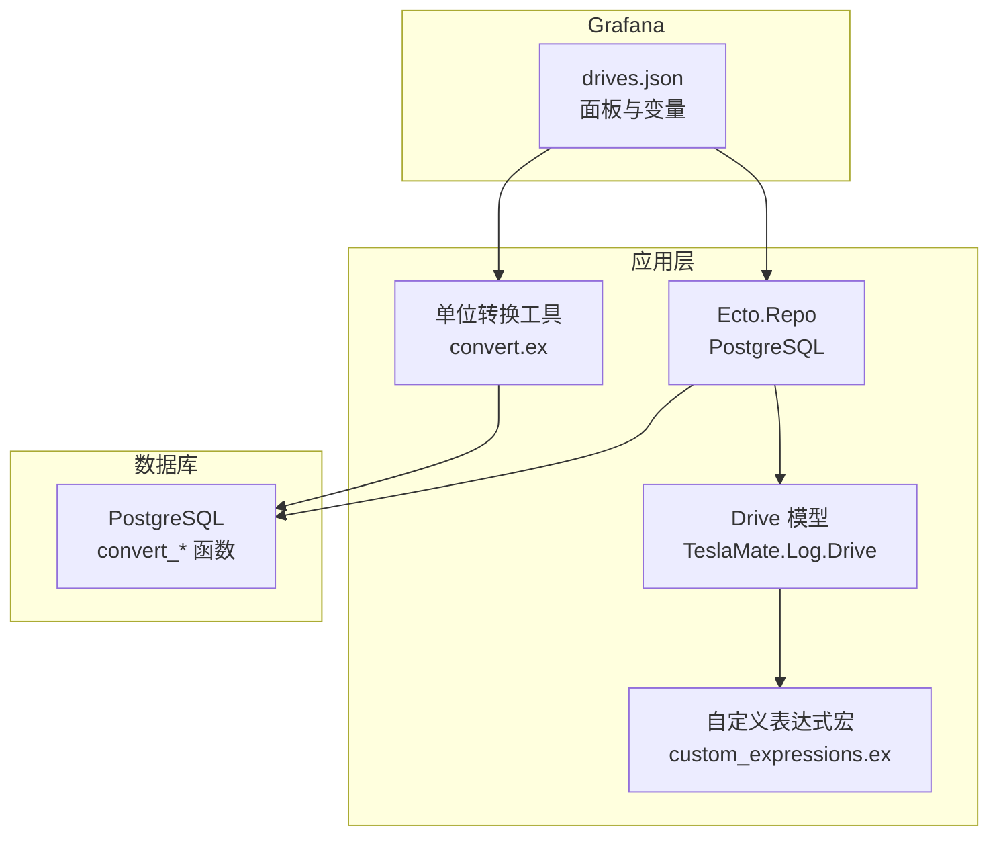
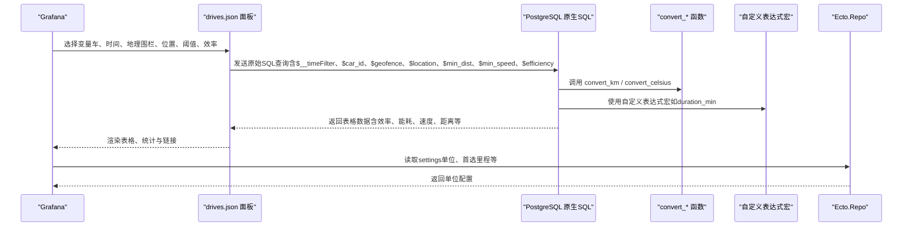
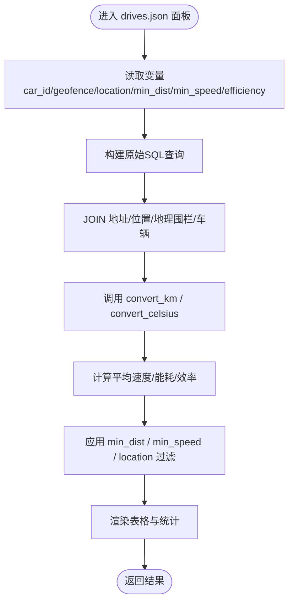
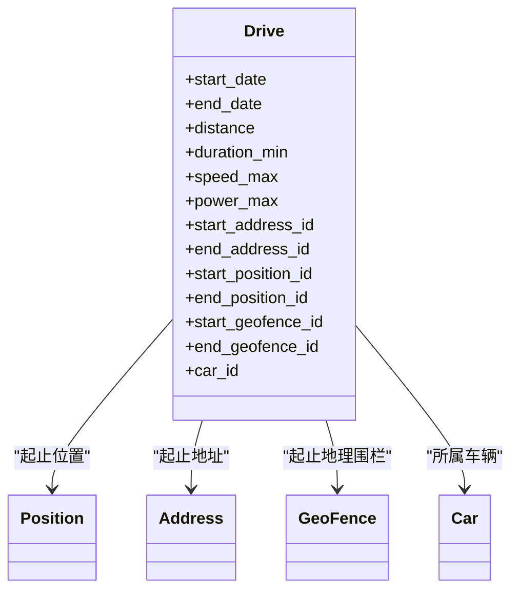

# 行程概览仪表板

<cite>
**本文引用的文件**
- [grafana/dashboards/drives.json](file://grafana/dashboards/drives.json)
- [lib/teslamate/log/drive.ex](file://lib/teslamate/log/drive.ex)
- [lib/teslamate/repo.ex](file://lib/teslamate/repo.ex)
- [lib/teslamate/custom_expressions.ex](file://lib/teslamate/custom_expressions.ex)
- [lib/teslamate/convert.ex](file://lib/teslamate/convert.ex)
- [priv/repo/migrations/20190729142656_add_conversion_functions.exs](file://priv/repo/migrations/20190729142656_add_conversion_functions.exs)
- [priv/repo/migrations/20200528175158_optimize_conversion_helpers.exs](file://priv/repo/migrations/20200528175158_optimize_conversion_helpers.exs)
- [lib/teslamate_web/controllers/drive_controller.ex](file://lib/teslamate_web/controllers/drive_controller.ex)
</cite>

## 目录
1. [简介](#简介)
2. [项目结构](#项目结构)
3. [核心组件](#核心组件)
4. [架构总览](#架构总览)
5. [详细组件分析](#详细组件分析)
6. [依赖关系分析](#依赖关系分析)
7. [性能考量](#性能考量)
8. [故障排查指南](#故障排查指南)
9. [结论](#结论)
10. [附录](#附录)

## 简介
本文件面向TeslaMate用户与运维人员，系统化解读“行程概览”仪表板（drives.json）的设计与使用，重点覆盖：
- 表格字段含义：行程ID、开始/结束时间、起止地址/地理围栏、行驶距离、平均速度、能耗效率、能耗消耗等
- 基于Grafana变量的筛选：按车辆、日期范围、地理围栏、起终点位置文本、最小距离/速度阈值、效率计算方式
- Ecto查询到Grafana SQL查询的映射关系
- 自定义列显示、排序规则与导出能力
- 基于行程距离或能耗异常的告警建议

## 项目结构
- Grafana仪表盘位于 grafana/dashboards/drives.json
- 行程数据模型在Elixir侧由 TeslaMate.Log.Drive 定义
- 数据库适配器为PostgreSQL，Ecto.Repo配置位于 lib/teslamate/repo.ex
- 转换单位函数在数据库迁移中创建（convert_km、convert_celsius），并在应用层提供Convert模块
- 自定义表达式宏（如duration_min、within_geofence?）用于复杂查询与空间判断
- 导出GPX接口由 DriveController 提供

图表来源
- [grafana/dashboards/drives.json](file://grafana/dashboards/drives.json#L1280-L1315)
- [lib/teslamate/log/drive.ex](file://lib/teslamate/log/drive.ex#L1-L79)
- [lib/teslamate/repo.ex](file://lib/teslamate/repo.ex#L1-L6)
- [lib/teslamate/custom_expressions.ex](file://lib/teslamate/custom_expressions.ex#L1-L93)
- [lib/teslamate/convert.ex](file://lib/teslamate/convert.ex#L1-L34)
- [priv/repo/migrations/20190729142656_add_conversion_functions.exs](file://priv/repo/migrations/20190729142656_add_conversion_functions.exs#L1-L38)
- [priv/repo/migrations/20200528175158_optimize_conversion_helpers.exs](file://priv/repo/migrations/20200528175158_optimize_conversion_helpers.exs#L1-L45)

章节来源
- [grafana/dashboards/drives.json](file://grafana/dashboards/drives.json#L1280-L1315)
- [lib/teslamate/log/drive.ex](file://lib/teslamate/log/drive.ex#L1-L79)
- [lib/teslamate/repo.ex](file://lib/teslamate/repo.ex#L1-L6)

## 核心组件
- 行程表驱动的Grafana面板：包含汇总统计、行程列表、不完整行程检查等
- 变量体系：car_id、geofence、location、temp_unit、length_unit、preferred_range、base_url、min_dist、min_speed、efficiency
- 查询逻辑：通过PostgreSQL原生SQL实现，结合convert_*函数与自定义表达式宏进行单位换算与效率计算
- 导出能力：支持导出不完整行程列表；GPX导出由后端控制器提供

章节来源
- [grafana/dashboards/drives.json](file://grafana/dashboards/drives.json#L1280-L1315)
- [grafana/dashboards/drives.json](file://grafana/dashboards/drives.json#L1448-L1637)
- [lib/teslamate_web/controllers/drive_controller.ex](file://lib/teslamate_web/controllers/drive_controller.ex#L1-L31)

## 架构总览
下图展示了从Grafana到数据库的数据流，以及关键的过滤与计算步骤。

图表来源
- [grafana/dashboards/drives.json](file://grafana/dashboards/drives.json#L1280-L1315)
- [priv/repo/migrations/20190729142656_add_conversion_functions.exs](file://priv/repo/migrations/20190729142656_add_conversion_functions.exs#L1-L38)
- [lib/teslamate/custom_expressions.ex](file://lib/teslamate/custom_expressions.ex#L1-L93)
- [lib/teslamate/repo.ex](file://lib/teslamate/repo.ex#L1-L6)

## 详细组件分析

### 表格字段与含义
- 基础信息
  - 行程ID：用于跳转到详情页与导出GPX
  - 开始/结束时间：本地时间显示，含毫秒级时间戳字段
  - 起止地址/地理围栏：优先使用地理围栏名称，否则拼接地址要素
  - 车辆ID：用于筛选
- 行驶指标
  - 时长：分钟
  - 距离：可按公里/英里显示
  - 平均速度/最大速度：可按公里/小时或英里/小时显示
  - 最大功率：千瓦
  - 上坡/下坡：米
- 能耗与效率
  - 能耗消耗（净）：单位kWh
  - 能耗效率（净）：Wh/km 或 Wh/mi
  - 效率：按“按距离”或“坡度修正”两种方式计算
- 环境与电量
  - 外部温度：摄氏/华氏
  - 起止电池可用电量百分比
  - 是否存在电量降低（可能由电池可用容量与标称容量差异导致）

章节来源
- [grafana/dashboards/drives.json](file://grafana/dashboards/drives.json#L546-L1260)
- [grafana/dashboards/drives.json](file://grafana/dashboards/drives.json#L1280-L1315)

### Grafana变量与筛选
- 车辆筛选：car_id（单选或多选）
- 地理围栏筛选：geofence（多选，支持“全部”）
- 位置文本筛选：location（模糊匹配起止地址）
- 时间范围：由Grafana内置时间选择器生成（$__timeFilter）
- 最小距离/速度：min_dist、min_speed（数值阈值）
- 效率计算方式：efficiency（slope-adjusted 或 by distance）
- 单位配置：length_unit、temp_unit、preferred_range、base_url（来自settings）

章节来源
- [grafana/dashboards/drives.json](file://grafana/dashboards/drives.json#L1448-L1637)

### Ecto查询到Grafana SQL的映射
- Ecto模型：TeslaMate.Log.Drive 定义了行程相关的字段与关联（起止位置、地址、地理围栏、车辆）
- 应用层查询：在控制器中通过Ecto查询加载行程及其位置序列（用于GPX导出）
- Grafana侧SQL：直接使用PostgreSQL原生SQL，通过JOIN连接地址、位置、地理围栏与车辆，并利用convert_*函数与自定义表达式宏完成单位换算与效率计算

图表来源
- [grafana/dashboards/drives.json](file://grafana/dashboards/drives.json#L1280-L1315)
- [lib/teslamate/log/drive.ex](file://lib/teslamate/log/drive.ex#L1-L79)
- [lib/teslamate/custom_expressions.ex](file://lib/teslamate/custom_expressions.ex#L1-L93)
- [lib/teslamate/convert.ex](file://lib/teslamate/convert.ex#L1-L34)

章节来源
- [lib/teslamate_web/controllers/drive_controller.ex](file://lib/teslamate_web/controllers/drive_controller.ex#L1-L31)
- [lib/teslamate/log/drive.ex](file://lib/teslamate/log/drive.ex#L1-L79)

### 自定义列显示、排序规则与导出
- 列显示与格式
  - 列名重命名与单位切换：通过字段配置将 distance、consumption_kWh、speed_avg 等按 length_unit/temp_unit 显示
  - 链接跳转：点击“Date”列可跳转至“行程详情”；点击起/终点列可跳转至地理围栏编辑页面
  - 隐藏字段：时间戳、路径字段、内部ID等被隐藏
- 排序规则
  - 默认按开始时间降序排序
  - 支持在面板选项中调整排序字段
- 导出能力
  - 不完整行程列表：支持分页与导出
  - GPX导出：通过后端控制器接口下载对应行程的GPX轨迹文件

章节来源
- [grafana/dashboards/drives.json](file://grafana/dashboards/drives.json#L546-L1260)
- [grafana/dashboards/drives.json](file://grafana/dashboards/drives.json#L1316-L1439)
- [lib/teslamate_web/controllers/drive_controller.ex](file://lib/teslamate_web/controllers/drive_controller.ex#L1-L31)

### 警报规则建议（基于行程距离或能耗异常）
以下为可配置的告警思路，具体阈值需根据实际业务与设备特性设定：
- 距离异常
  - 触发条件：某次行程距离小于阈值（例如 min_dist），且平均速度低于阈值（例如 min_speed）
  - 建议：结合 location 文本筛选，定位特定区域的异常
- 能耗异常
  - 触发条件：单位距离能耗（Wh/km 或 Wh/mi）超过阈值
  - 建议：结合 efficiency 选择“slope-adjusted”，以排除坡度影响后的能耗异常
- 速度异常
  - 触发条件：最大速度超过阈值或平均速度异常偏低
- 环境温度影响
  - 触发条件：外部温度极端（过高/过低）时能耗显著升高
- 电量变化异常
  - 触发条件：起止电池可用容量与标称容量差异较大，提示电量降低状态

章节来源
- [grafana/dashboards/drives.json](file://grafana/dashboards/drives.json#L1280-L1315)
- [grafana/dashboards/drives.json](file://grafana/dashboards/drives.json#L1599-L1637)

## 依赖关系分析
- 行程模型依赖位置、地址、地理围栏与车辆实体
- Grafana查询依赖数据库函数 convert_km 与 convert_celsius
- 自定义表达式宏提供时间差、空值处理与空间判断能力
- 控制器依赖Ecto查询加载行程与位置序列，用于GPX输出

图表来源
- [lib/teslamate/log/drive.ex](file://lib/teslamate/log/drive.ex#L1-L79)

章节来源
- [lib/teslamate/log/drive.ex](file://lib/teslamate/log/drive.ex#L1-L79)

## 性能考量
- 仅在必要时查询位置表，避免高密度流式数据带来的性能压力
- 在启用流式API时，可通过添加理想里程非空与车辆ID过滤减少扫描范围
- 建议开启 pg_stat_statements 以识别慢查询并优化索引

章节来源
- [website/docs/development.mdx](file://website/docs/development.mdx#L166-L202)

## 故障排查指南
- 不完整行程
  - 仪表板提供“不完整行程”列表，可按车辆筛选并查看未结束的行程
  - 若出现大量未结束行程，参考官方“手动修复数据”指南
- 单位显示异常
  - 确认 settings 中单位配置（长度、温度、首选里程）
  - Grafana变量 temp_unit、length_unit、preferred_range 会直接影响显示
- 效率计算偏差
  - 在效率计算方式为“坡度修正”时，考虑上坡/下坡与车辆重量、再生制动效率的影响
- 导出问题
  - GPX导出需确保控制器接口可用，且行程存在位置序列

章节来源
- [grafana/dashboards/drives.json](file://grafana/dashboards/drives.json#L1316-L1439)
- [lib/teslamate_web/controllers/drive_controller.ex](file://lib/teslamate_web/controllers/drive_controller.ex#L1-L31)

## 结论
“行程概览”仪表板通过Grafana变量与PostgreSQL原生SQL实现了灵活的筛选与高效的数据呈现。结合convert_*函数与自定义表达式宏，能够准确计算能耗效率与单位换算。建议在生产环境中关注查询性能与索引设计，并根据业务需求配置合理的告警阈值，以及时发现能耗与距离异常。

## 附录

### 字段对照与计算说明
- 距离与速度
  - 距离：按 length_unit（km/mi）显示
  - 平均速度：按 length_unit（km/h或mph）显示
- 能耗与效率
  - 能耗消耗（net）：kWh
  - 能耗效率（net）：Wh/km 或 Wh/mi
  - 效率计算：
    - “按距离”：基于行驶距离与电量差计算
    - “坡度修正”：考虑上坡/下坡势能变化，结合车辆重量与再生效率
- 温度
  - 外部温度：按 temp_unit（°C/°F）显示
- 其他
  - 起止电池可用电量百分比
  - 是否存在电量降低（由可用容量与标称容量差异决定）

章节来源
- [grafana/dashboards/drives.json](file://grafana/dashboards/drives.json#L546-L1260)
- [grafana/dashboards/drives.json](file://grafana/dashboards/drives.json#L1280-L1315)
- [priv/repo/migrations/20190729142656_add_conversion_functions.exs](file://priv/repo/migrations/20190729142656_add_conversion_functions.exs#L1-L38)
- [priv/repo/migrations/20200528175158_optimize_conversion_helpers.exs](file://priv/repo/migrations/20200528175158_optimize_conversion_helpers.exs#L1-L45)
- [lib/teslamate/custom_expressions.ex](file://lib/teslamate/custom_expressions.ex#L1-L93)