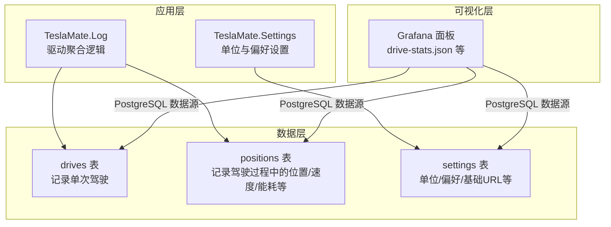
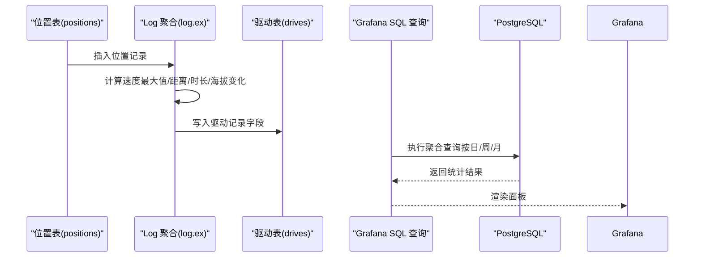
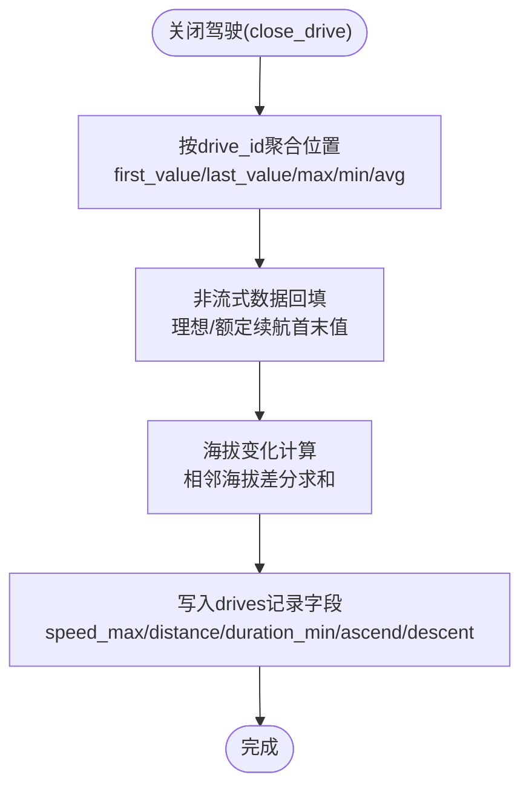
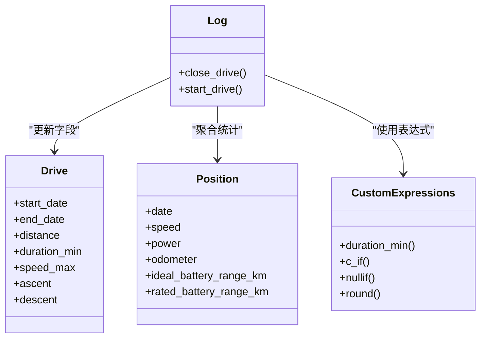

# 驾驶统计仪表板

<cite>
**本文引用的文件**
- [drive.ex](file://lib/teslamate/log/drive.ex)
- [position.ex](file://lib/teslamate/log/position.ex)
- [car.ex](file://lib/teslamate/log/car.ex)
- [log.ex](file://lib/teslamate/log.ex)
- [custom_expressions.ex](file://lib/teslamate/custom_expressions.ex)
- [drive-stats.json](file://grafana/dashboards/drive-stats.json)
- [drive-details.json](file://grafana/dashboards/internal/drive-details.json)
- [statistics.json](file://grafana/dashboards/statistics.json)
- [trip.json](file://grafana/dashboards/trip.json)
- [20190810105216_unit_of_length_and_temperature.exs](file://priv/repo/migrations/20190810105216_unit_of_length_and_temperature.exs)
- [20190821155748_drop_consumption_columns.exs](file://priv/repo/migrations/20190821155748_drop_consumption_columns.exs)
- [20200320140020_drop_power_avg.exs](file://priv/repo/migrations/20200320140020_drop_power_avg.exs)
- [manually_fixing_data.mdx](file://website/docs/maintenance/manually_fixing_data.mdx)
</cite>

## 目录
1. [简介](#简介)
2. [项目结构](#项目结构)
3. [核心组件](#核心组件)
4. [架构总览](#架构总览)
5. [详细组件分析](#详细组件分析)
6. [依赖关系分析](#依赖关系分析)
7. [性能考量](#性能考量)
8. [故障排查指南](#故障排查指南)
9. [结论](#结论)
10. [附录](#附录)

## 简介
本文件面向TeslaMate驾驶统计仪表板（drive-stats.json）的后端实现与Grafana对接，系统性梳理以下内容：
- 驾驶统计数据项：总行驶里程、平均能耗、最高速度、驾驶时长分布等的计算方法与来源
- 后端统计逻辑：基于TeslaMate.Log.Drive与位置表的聚合计算，以及Ecto自定义表达式与窗口函数的使用
- 数据库视图与索引：通过SQL生成时间序列基线、按日/周/月分组统计，以及迁移脚本对字段演进的影响
- Grafana对接：如何将后端聚合结果映射到Grafana面板，包括时间窗口切换、单位换算、模板变量等
- 异常驾驶行为阈值告警：如何在Grafana中设置动态阈值与可视化提示

## 项目结构
TeslaMate采用Elixir+Phoenix+Ecto+PostgreSQL架构，驾驶统计数据主要来源于drives表与positions表的聚合。Grafana通过PostgreSQL数据源直接查询这些表，并结合settings中的单位偏好进行渲染。

图表来源
- [log.ex](file://lib/teslamate/log.ex#L236-L375)
- [drive-stats.json](file://grafana/dashboards/drive-stats.json#L97-L227)
- [20190810105216_unit_of_length_and_temperature.exs](file://priv/repo/migrations/20190810105216_unit_of_length_and_temperature.exs#L1-L52)

章节来源
- [log.ex](file://lib/teslamate/log.ex#L236-L375)
- [drive-stats.json](file://grafana/dashboards/drive-stats.json#L97-L227)
- [20190810105216_unit_of_length_and_temperature.exs](file://priv/repo/migrations/20190810105216_unit_of_length_and_temperature.exs#L1-L52)

## 核心组件
- TeslaMate.Log.Drive：驱动记录实体，包含起止时间、里程、海拔变化、最高速度、功率极值、理想/额定续航等字段
- TeslaMate.Log.Position：位置记录实体，包含经纬度、海拔、速度、功率、里程、电池范围等，用于驱动聚合
- TeslaMate.Log：驱动聚合入口，负责启动/关闭驾驶、计算统计量（速度最大值、距离、时长、海拔变化等）
- TeslaMate.CustomExpressions：Ecto自定义表达式宏，如duration_min、nullif、round、c_if等，用于复杂SQL表达
- Grafana仪表盘：drive-stats.json等，通过PostgreSQL数据源执行SQL查询，渲染各类统计面板

章节来源
- [drive.ex](file://lib/teslamate/log/drive.ex#L1-L79)
- [position.ex](file://lib/teslamate/log/position.ex#L1-L39)
- [log.ex](file://lib/teslamate/log.ex#L236-L375)
- [custom_expressions.ex](file://lib/teslamate/custom_expressions.ex#L1-L37)
- [drive-stats.json](file://grafana/dashboards/drive-stats.json#L97-L227)

## 架构总览
下图展示了从位置数据到驾驶统计的后端聚合路径，以及Grafana如何读取这些统计。

图表来源
- [log.ex](file://lib/teslamate/log.ex#L236-L375)
- [drive-stats.json](file://grafana/dashboards/drive-stats.json#L97-L227)

## 详细组件分析

### 统计指标与计算方法
- 总行驶里程（日/周/月）
  - Grafana面板使用date_trunc与generate_series生成完整时间序列，按天聚合drives表的distance字段，并通过convert_km进行单位换算
  - 参考路径：[drive-stats.json](file://grafana/dashboards/drive-stats.json#L212-L231)
- 平均能耗（日/周/月）
  - 基于drives表的起止理想/额定续航差值乘以cars.efficiency，再按距离归一化得到“每公里能耗”
  - 参考路径：[drive-stats.json](file://grafana/dashboards/drive-stats.json#L297-L319)、[statistics.json](file://grafana/dashboards/statistics.json#L705-L723)
- 最高速度
  - 使用max(speed_max)获取单次驾驶最高速度；Grafana面板支持按时间窗口筛选
  - 参考路径：[drive-stats.json](file://grafana/dashboards/drive-stats.json#L812-L833)
- 驾驶时长分布（速度直方图）
  - 基于positions表的速度分段统计，使用lead窗口计算相邻点之间的时间间隔，聚合占比与累计时间
  - 参考路径：[drive-stats.json](file://grafana/dashboards/drive-stats.json#L1067-L1088)、[drive-details.json](file://grafana/dashboards/internal/drive-details.json#L1714-L1744)
- 日均驾驶次数/日均里程/日均能耗
  - 通过time_series查询与convert_km、date_trunc实现按日聚合，并在Grafana中以stat面板展示
  - 参考路径：[drive-stats.json](file://grafana/dashboards/drive-stats.json#L97-L180)、[drive-stats.json](file://grafana/dashboards/drive-stats.json#L569-L627)

章节来源
- [drive-stats.json](file://grafana/dashboards/drive-stats.json#L97-L231)
- [drive-stats.json](file://grafana/dashboards/drive-stats.json#L569-L627)
- [drive-stats.json](file://grafana/dashboards/drive-stats.json#L812-L833)
- [drive-stats.json](file://grafana/dashboards/drive-stats.json#L1067-L1088)
- [drive-details.json](file://grafana/dashboards/internal/drive-details.json#L1714-L1744)
- [statistics.json](file://grafana/dashboards/statistics.json#L705-L723)

### 后端聚合逻辑与Ecto表达式
- 驱动关闭时的聚合
  - 使用窗口函数over(:w)对同一drive内的位置记录进行first_value/last_value/max/min/avg等聚合，计算速度最大值、距离、时长、海拔变化等
  - 对非流式数据（无ideal_battery_range_km）的驱动，单独子查询回填理想/额定续航首末值
  - 参考路径：[log.ex](file://lib/teslamate/log.ex#L236-L375)
- 自定义表达式
  - 提供duration_min、nullif、round、c_if等宏，便于在Ecto查询中构造复杂SQL片段
  - 参考路径：[custom_expressions.ex](file://lib/teslamate/custom_expressions.ex#L1-L37)
- 位置数据结构
  - 包含速度、功率、里程、电池范围、温度等，是速度直方图与能耗计算的基础
  - 参考路径：[position.ex](file://lib/teslamate/log/position.ex#L1-L39)

图表来源
- [log.ex](file://lib/teslamate/log.ex#L236-L375)

章节来源
- [log.ex](file://lib/teslamate/log.ex#L236-L375)
- [custom_expressions.ex](file://lib/teslamate/custom_expressions.ex#L1-L37)
- [position.ex](file://lib/teslamate/log/position.ex#L1-L39)

### Grafana面板与数据源对接
- 数据源类型
  - 使用grafana-postgresql-datasource，直接执行SQL查询drives/positions/settings表
  - 参考路径：[drive-stats.json](file://grafana/dashboards/drive-stats.json#L41-L125)
- 模板变量
  - car_id、length_unit、speed_unit、preferred_range、base_url等，用于动态选择车辆、单位与偏好
  - 参考路径：[drive-stats.json](file://grafana/dashboards/drive-stats.json#L1458-L1592)
- 时间窗口与分组
  - 使用$__timeFilter、date_trunc('$period', ...)与generate_series生成完整时间序列，支持日/周/月粒度
  - 参考路径：[drive-stats.json](file://grafana/dashboards/drive-stats.json#L97-L180)、[statistics.json](file://grafana/dashboards/statistics.json#L705-L723)
- 单位换算
  - 使用convert_km函数将km转换为用户设置的长度单位（km或mi），并在面板中设置单位显示
  - 参考路径：[drive-stats.json](file://grafana/dashboards/drive-stats.json#L212-L231)、[drive-details.json](file://grafana/dashboards/internal/drive-details.json#L2040-L2076)

章节来源
- [drive-stats.json](file://grafana/dashboards/drive-stats.json#L41-L125)
- [drive-stats.json](file://grafana/dashboards/drive-stats.json#L1458-L1592)
- [statistics.json](file://grafana/dashboards/statistics.json#L705-L723)
- [drive-details.json](file://grafana/dashboards/internal/drive-details.json#L2040-L2076)

### 统计时间窗口与维度自定义
- 时间窗口
  - 通过$__timeFrom()、$__timeTo()与$__timeFilter(start_date)限定查询时间范围
  - 参考路径：[drive-stats.json](file://grafana/dashboards/drive-stats.json#L97-L180)
- 分组维度
  - 使用date_trunc('day'|'week'|'month', ...)按日/周/月分组
  - 参考路径：[statistics.json](file://grafana/dashboards/statistics.json#L705-L723)
- 维度扩展
  - 可在SQL中增加新的分组字段（如目的地、地理围栏、温度区间等），并在Grafana中添加对应模板变量
  - 参考路径：[drive-stats.json](file://grafana/dashboards/drive-stats.json#L1434-L1456)

章节来源
- [drive-stats.json](file://grafana/dashboards/drive-stats.json#L97-L180)
- [statistics.json](file://grafana/dashboards/statistics.json#L705-L723)
- [drive-stats.json](file://grafana/dashboards/drive-stats.json#L1434-L1456)

### 异常驾驶行为动态阈值告警
- 速度异常
  - 在Grafana中为“最高速度”面板设置阈值，当超过设定值时触发告警
  - 参考路径：[drive-stats.json](file://grafana/dashboards/drive-stats.json#L812-L833)
- 能耗异常
  - 在“平均能耗”面板设置阈值，结合convert_km与单位换算，按km或mi显示
  - 参考路径：[drive-stats.json](file://grafana/dashboards/drive-stats.json#L297-L319)
- 速度直方图异常
  - 通过速度分布直方图识别长时间处于高/低速区间的行为模式，设置阈值与颜色分级
  - 参考路径：[drive-stats.json](file://grafana/dashboards/drive-stats.json#L1067-L1088)

章节来源
- [drive-stats.json](file://grafana/dashboards/drive-stats.json#L812-L833)
- [drive-stats.json](file://grafana/dashboards/drive-stats.json#L297-L319)
- [drive-stats.json](file://grafana/dashboards/drive-stats.json#L1067-L1088)

## 依赖关系分析
- Log.Drive与Log.Position
  - drives表依赖positions表的聚合结果（速度、里程、续航等）
  - 参考路径：[drive.ex](file://lib/teslamate/log/drive.ex#L1-L79)、[position.ex](file://lib/teslamate/log/position.ex#L1-L39)
- Log与CustomExpressions
  - Ecto查询中广泛使用自定义表达式宏，简化复杂SQL
  - 参考路径：[log.ex](file://lib/teslamate/log.ex#L236-L375)、[custom_expressions.ex](file://lib/teslamate/custom_expressions.ex#L1-L37)
- Grafana与数据库
  - 面板直接查询drives/positions/settings，依赖模板变量与单位换算函数
  - 参考路径：[drive-stats.json](file://grafana/dashboards/drive-stats.json#L97-L231)

图表来源
- [drive.ex](file://lib/teslamate/log/drive.ex#L1-L79)
- [position.ex](file://lib/teslamate/log/position.ex#L1-L39)
- [log.ex](file://lib/teslamate/log.ex#L236-L375)
- [custom_expressions.ex](file://lib/teslamate/custom_expressions.ex#L1-L37)

章节来源
- [drive.ex](file://lib/teslamate/log/drive.ex#L1-L79)
- [position.ex](file://lib/teslamate/log/position.ex#L1-L39)
- [log.ex](file://lib/teslamate/log.ex#L236-L375)
- [custom_expressions.ex](file://lib/teslamate/custom_expressions.ex#L1-L37)

## 性能考量
- 窗口函数与子查询
  - close_drive中使用over(:w)与多个子查询合并，避免多次扫描；建议确保drive_id与date有合适索引
  - 参考路径：[log.ex](file://lib/teslamate/log.ex#L236-L375)
- SQL生成时间序列
  - 使用generate_series与LEFT JOIN保证缺失日期补零，避免空洞导致的渲染问题
  - 参考路径：[drive-stats.json](file://grafana/dashboards/drive-stats.json#L97-L180)
- 字段演进与索引
  - 迁移脚本删除了冗余字段（如power_avg、consumption_kWh等），减少存储与计算开销
  - 参考路径：[20200320140020_drop_power_avg.exs](file://priv/repo/migrations/20200320140020_drop_power_avg.exs#L1-L9)、[20190821155748_drop_consumption_columns.exs](file://priv/repo/migrations/20190821155748_drop_consumption_columns.exs#L1-L10)
- 单位与偏好
  - settings表提供单位偏好，避免在查询中重复判断，提升渲染效率
  - 参考路径：[20190810105216_unit_of_length_and_temperature.exs](file://priv/repo/migrations/20190810105216_unit_of_length_and_temperature.exs#L1-L52)

章节来源
- [log.ex](file://lib/teslamate/log.ex#L236-L375)
- [drive-stats.json](file://grafana/dashboards/drive-stats.json#L97-L180)
- [20200320140020_drop_power_avg.exs](file://priv/repo/migrations/20200320140020_drop_power_avg.exs#L1-L9)
- [20190821155748_drop_consumption_columns.exs](file://priv/repo/migrations/20190821155748_drop_consumption_columns.exs#L1-L10)
- [20190810105216_unit_of_length_and_temperature.exs](file://priv/repo/migrations/20190810105216_unit_of_length_and_temperature.exs#L1-L52)

## 故障排查指南
- 驱动未正确关闭导致统计为0
  - 可通过RPC调用close_drive手动修复，或检查Streaming API是否启用
  - 参考路径：[manually_fixing_data.mdx](file://website/docs/maintenance/manually_fixing_data.mdx#L41-L103)
- 数据丢失或里程不一致
  - 使用“数据丢失”面板对比(max(end_km)-min(start_km))与sum(distance)，定位未记录里程
  - 参考路径：[drive-stats.json](file://grafana/dashboards/drive-stats.json#L426-L446)
- 单位显示异常
  - 检查settings表的unit_of_length与unit_of_temperature，确认Grafana模板变量是否正确传入
  - 参考路径：[20190810105216_unit_of_length_and_temperature.exs](file://priv/repo/migrations/20190810105216_unit_of_length_and_temperature.exs#L1-L52)
- 速度直方图为空
  - 确认positions表中存在速度与理想续航数据，且时间过滤条件生效
  - 参考路径：[drive-stats.json](file://grafana/dashboards/drive-stats.json#L1067-L1088)

章节来源
- [manually_fixing_data.mdx](file://website/docs/maintenance/manually_fixing_data.mdx#L41-L103)
- [drive-stats.json](file://grafana/dashboards/drive-stats.json#L426-L446)
- [20190810105216_unit_of_length_and_temperature.exs](file://priv/repo/migrations/20190810105216_unit_of_length_and_temperature.exs#L1-L52)
- [drive-stats.json](file://grafana/dashboards/drive-stats.json#L1067-L1088)

## 结论
- drive-stats.json通过PostgreSQL直接查询drives/positions/settings，结合date_trunc/generate_series与convert_km等函数，实现了灵活的时间窗口与单位切换
- 后端聚合由TeslaMate.Log.Drive与Log.Position共同完成，Ecto自定义表达式提升了SQL表达能力
- Grafana提供了丰富的阈值与可视化能力，可针对异常驾驶行为建立动态告警
- 建议持续关注字段演进与索引维护，确保统计查询性能稳定

## 附录
- 实际代码示例路径（不展示具体代码内容）：
  - 驱动聚合入口：[log.ex](file://lib/teslamate/log.ex#L236-L375)
  - Ecto自定义表达式：[custom_expressions.ex](file://lib/teslamate/custom_expressions.ex#L1-L37)
  - Grafana SQL查询（日/周/月聚合）：[drive-stats.json](file://grafana/dashboards/drive-stats.json#L97-L231)、[statistics.json](file://grafana/dashboards/statistics.json#L705-L723)
  - 速度直方图查询：[drive-stats.json](file://grafana/dashboards/drive-stats.json#L1067-L1088)、[drive-details.json](file://grafana/dashboards/internal/drive-details.json#L1714-L1744)
  - 能耗计算与单位换算：[drive-stats.json](file://grafana/dashboards/drive-stats.json#L297-L319)、[drive-details.json](file://grafana/dashboards/internal/drive-details.json#L2040-L2076)
  - 字段演进迁移脚本：[20200320140020_drop_power_avg.exs](file://priv/repo/migrations/20200320140020_drop_power_avg.exs#L1-L9)、[20190821155748_drop_consumption_columns.exs](file://priv/repo/migrations/20190821155748_drop_consumption_columns.exs#L1-L10)
  - 单位与偏好设置：[20190810105216_unit_of_length_and_temperature.exs](file://priv/repo/migrations/20190810105216_unit_of_length_and_temperature.exs#L1-L52)