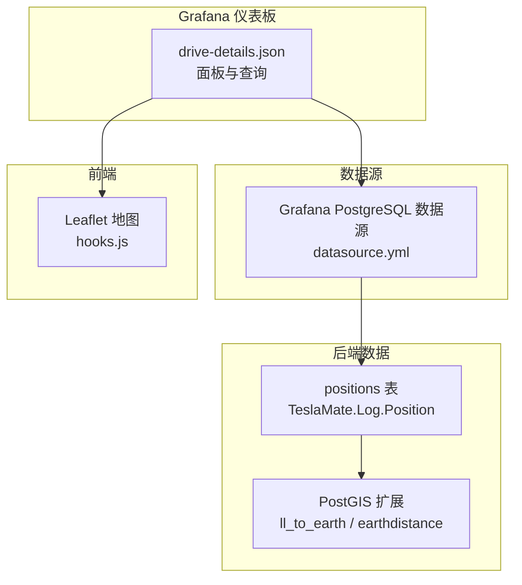
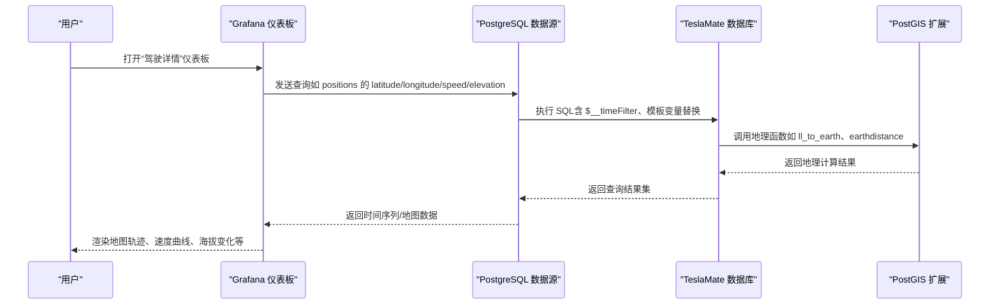
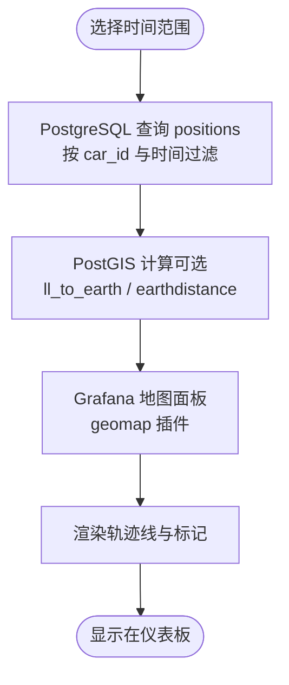
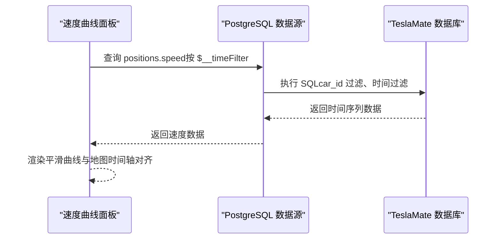
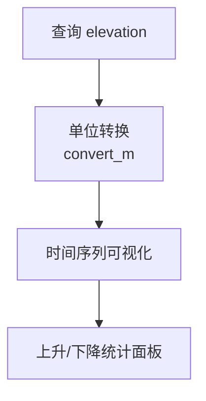
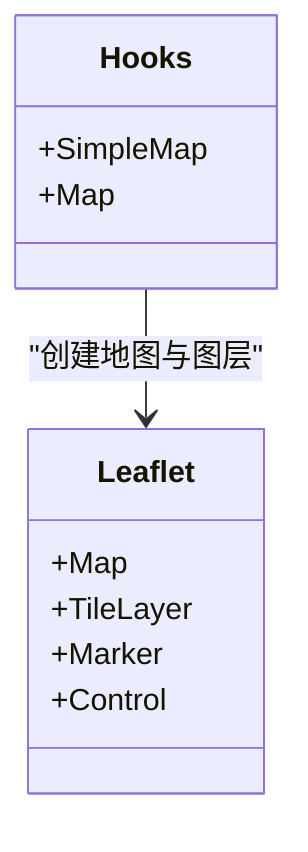
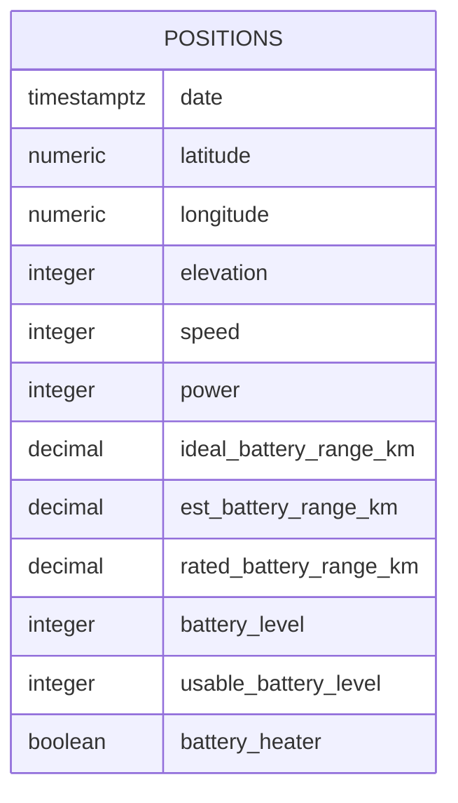
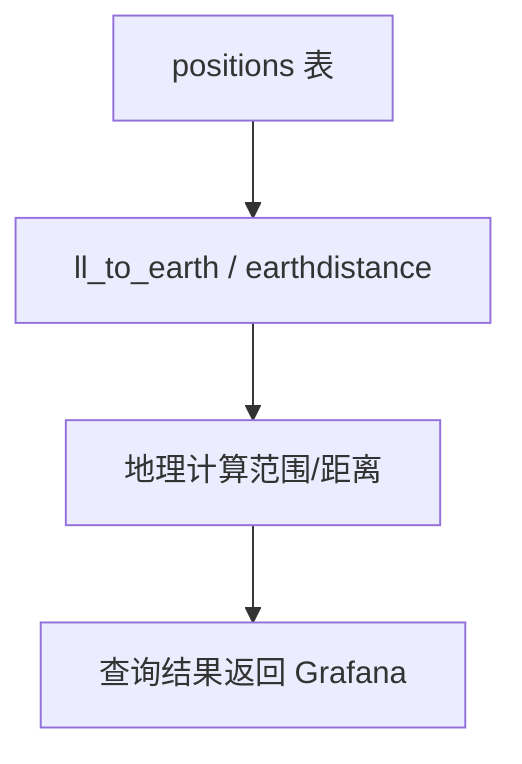
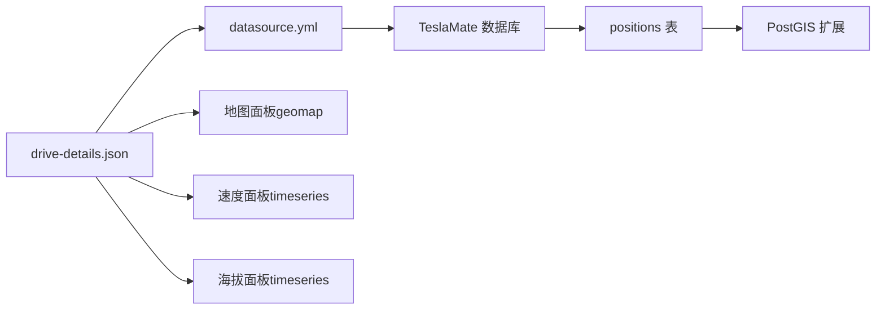

# 驾驶详情仪表板

<cite>
**本文引用的文件**
- [drive-details.json](file://grafana/dashboards/internal/drive-details.json)
- [position.ex](file://lib/teslamate/log/position.ex)
- [custom_expressions.ex](file://lib/teslamate/custom_expressions.ex)
- [20191008191431_fix_ll_to_earth.exs](file://priv/repo/migrations/20191008191431_fix_ll_to_earth.exs)
- [20240929084639_recreate_geo_extensions.exs](file://priv/repo/migrations/20240929084639_recreate_geo_extensions.exs)
- [20250407155134_upgrade_earthdistance.exs](file://priv/repo/migrations/20250407155134_upgrade_earthdistance.exs)
- [datasource.yml](file://grafana/datasource.yml)
- [hooks.js](file://assets/js/hooks.js)
- [app.js](file://assets/js/app.js)
- [main.js](file://assets/js/main.js)
- [drive_controller_test.exs](file://test/teslamate_web/controllers/drive_controller_test.exs)
</cite>

## 目录
1. [简介](#简介)
2. [项目结构](#项目结构)
3. [核心组件](#核心组件)
4. [架构总览](#架构总览)
5. [详细组件分析](#详细组件分析)
6. [依赖关系分析](#依赖关系分析)
7. [性能考量](#性能考量)
8. [故障排查指南](#故障排查指南)
9. [结论](#结论)
10. [附录](#附录)

## 简介
本文件面向需要在 Grafana 中展示 TeslaMate 驾驶轨迹与相关指标的用户与开发者，系统性说明以下内容：
- drive-details.json 中轨迹数据的展示方式：地图组件如何渲染 GPS 轨迹点、速度曲线图如何与位置数据同步、海拔变化图的数据来源。
- 前端 JavaScript 如何解析 PostGIS 地理数据并转换为可视化格式（包括 OpenStreetMap 图层）。
- TeslaMate.Log.Position 模块中的地理编码数据如何被 Grafana 地图面板消费。
- 自定义轨迹颜色映射规则、调整采样频率以优化渲染性能的方法。
- 实际代码示例路径，帮助快速定位实现细节。

## 项目结构
围绕驾驶详情仪表板的关键文件与职责如下：
- Grafana 仪表板 JSON：驱动所有可视化查询与面板配置，包含时间序列、地图、统计等面板。
- Elixir 数据模型：TeslaMate.Log.Position 定义了位置表字段与关联关系。
- PostGIS 扩展与函数：ll_to_earth、earthdistance 等用于地理计算与距离查询。
- Grafana 数据源：PostgreSQL 数据源配置，连接 TeslaMate 数据库。
- 前端 JS：Leaflet 地图集成与交互，支持 OpenStreetMap 图层。

图表来源
- [drive-details.json](file://grafana/dashboards/internal/drive-details.json#L536-L644)
- [position.ex](file://lib/teslamate/log/position.ex#L1-L39)
- [20191008191431_fix_ll_to_earth.exs](file://priv/repo/migrations/20191008191431_fix_ll_to_earth.exs#L1-L18)
- [20240929084639_recreate_geo_extensions.exs](file://priv/repo/migrations/20240929084639_recreate_geo_extensions.exs#L1-L9)
- [20250407155134_upgrade_earthdistance.exs](file://priv/repo/migrations/20250407155134_upgrade_earthdistance.exs#L1-L7)
- [datasource.yml](file://grafana/datasource.yml#L1-L20)
- [hooks.js](file://assets/js/hooks.js#L141-L160)

章节来源
- [drive-details.json](file://grafana/dashboards/internal/drive-details.json#L536-L644)
- [position.ex](file://lib/teslamate/log/position.ex#L1-L39)
- [datasource.yml](file://grafana/datasource.yml#L1-L20)

## 核心组件
- 地图面板（geomap）
  - 使用 PostgreSQL 数据源查询 positions 表的 latitude、longitude，按时间排序生成轨迹。
  - 默认使用 OpenStreetMap 标准图层（osm-standard），可配置为其他图层。
- 速度曲线面板（timeseries）
  - 从 positions 表读取 speed 字段，按时间序列展示，单位随模板变量 length_unit 动态切换。
- 海拔变化面板（timeseries）
  - 从 positions 表读取 elevation 字段，按时间序列展示，单位随模板变量 alternative_length_unit 动态切换。
- 其他辅助面板
  - 温度、轮胎压力、能耗等，均通过 PostgreSQL 查询 positions 表或 drives 表完成。

章节来源
- [drive-details.json](file://grafana/dashboards/internal/drive-details.json#L499-L644)
- [drive-details.json](file://grafana/dashboards/internal/drive-details.json#L758-L806)
- [drive-details.json](file://grafana/dashboards/internal/drive-details.json#L1043-L1076)

## 架构总览
Grafana 仪表板通过 PostgreSQL 数据源直接访问 TeslaMate 的数据库，查询 positions 表中的地理与状态数据，再由各面板进行可视化渲染。PostGIS 扩展提供地理计算能力，确保距离与范围查询的准确性。

图表来源
- [drive-details.json](file://grafana/dashboards/internal/drive-details.json#L499-L644)
- [drive-details.json](file://grafana/dashboards/internal/drive-details.json#L758-L806)
- [datasource.yml](file://grafana/datasource.yml#L1-L20)
- [20191008191431_fix_ll_to_earth.exs](file://priv/repo/migrations/20191008191431_fix_ll_to_earth.exs#L1-L18)

## 详细组件分析

### 地图组件：轨迹渲染与 OpenStreetMap 集成
- 数据来源
  - 通过 PostgreSQL 查询 positions 表的 latitude、longitude，按 car_id 与时间过滤，返回时间序列数据。
- 图层配置
  - 默认 basemap 为 osm-standard；可通过面板设置添加其他图层（例如混合图层）。
- 交互与视图
  - 支持缩放、比例尺、图层控制等；视图初始聚焦到轨迹范围（fit）。
- 前端渲染
  - Grafana geomap 插件负责将查询结果转换为轨迹线与标记；无需额外前端脚本参与。

图表来源
- [drive-details.json](file://grafana/dashboards/internal/drive-details.json#L612-L644)
- [20191008191431_fix_ll_to_earth.exs](file://priv/repo/migrations/20191008191431_fix_ll_to_earth.exs#L1-L18)

章节来源
- [drive-details.json](file://grafana/dashboards/internal/drive-details.json#L536-L644)

### 速度曲线图：与位置数据同步
- 数据来源
  - 从 positions 表读取 speed 字段，按时间序列展示；单位随 length_unit 模板变量动态切换（km/h 或 mph）。
- 同步机制
  - 速度面板与地图面板共享时间范围与 car_id 过滤条件，确保时间轴对齐。
- 可视化特性
  - 平滑插值、连续线条、隐藏点等样式配置，便于观察趋势。

图表来源
- [drive-details.json](file://grafana/dashboards/internal/drive-details.json#L466-L498)

章节来源
- [drive-details.json](file://grafana/dashboards/internal/drive-details.json#L466-L498)

### 海拔变化图：数据来源与单位
- 数据来源
  - 从 positions 表读取 elevation 字段，按时间序列展示。
- 单位处理
  - 通过模板变量 alternative_length_unit 控制单位（米或英尺），并使用 convert_m 函数进行转换。
- 统计补充
  - 仪表板还提供上升/下降累计高程的统计面板，基于 elevation 差分计算。

图表来源
- [drive-details.json](file://grafana/dashboards/internal/drive-details.json#L773-L806)
- [drive-details.json](file://grafana/dashboards/internal/drive-details.json#L1933-L1954)

章节来源
- [drive-details.json](file://grafana/dashboards/internal/drive-details.json#L758-L806)
- [drive-details.json](file://grafana/dashboards/internal/drive-details.json#L1933-L1954)

### 前端 JavaScript：解析 PostGIS 地理数据与 OpenStreetMap 集成
- Leaflet 集成
  - 在 hooks.js 中创建地图实例，加载 OpenStreetMap 图层；支持可选的混合图层（Hybrid）。
  - 提供 SimpleMap 与 Map 等钩子，用于在页面中嵌入地图并与车辆实时状态联动。
- 地理数据转换
  - Grafana 侧已将 latitude/longitude 转换为地图可用的坐标；前端主要负责图层与交互。
- 与仪表板的关系
  - drive-details.json 中的地图面板使用 Grafana 内置的 geomap 插件，不依赖上述前端钩子；但项目中仍保留了 Leaflet 地图集成示例，便于理解地理数据在前端的呈现方式。

图表来源
- [hooks.js](file://assets/js/hooks.js#L141-L160)
- [hooks.js](file://assets/js/hooks.js#L162-L209)

章节来源
- [hooks.js](file://assets/js/hooks.js#L141-L160)
- [hooks.js](file://assets/js/hooks.js#L162-L209)
- [app.js](file://assets/js/app.js#L1-L30)
- [main.js](file://assets/js/main.js#L1-L35)

### TeslaMate.Log.Position 模块：地理编码数据的消费
- 数据模型
  - positions 表包含 date、latitude、longitude、elevation、speed、power 等字段，以及电池与温度相关字段。
  - 通过 Ecto Schema 映射，确保字段类型与数据库一致。
- Grafana 消费方式
  - 仪表板直接查询 positions 表，无需额外地理编码处理；PostGIS 函数仅在需要地理计算时使用（如范围查询）。

图表来源
- [position.ex](file://lib/teslamate/log/position.ex#L1-L39)

章节来源
- [position.ex](file://lib/teslamate/log/position.ex#L1-L39)

### PostGIS 地理函数与扩展
- 扩展与函数
  - ll_to_earth：将经纬度转换为地球空间类型，用于后续地理计算。
  - earthdistance：计算两点间球面距离。
  - migrations 中包含重建与升级逻辑，确保扩展版本兼容。
- 在仪表板中的应用
  - 仪表板查询主要使用 positions 表的原始地理字段；地理函数主要用于范围与距离判断场景（如 geofence 查询）。

图表来源
- [20191008191431_fix_ll_to_earth.exs](file://priv/repo/migrations/20191008191431_fix_ll_to_earth.exs#L1-L18)
- [20240929084639_recreate_geo_extensions.exs](file://priv/repo/migrations/20240929084639_recreate_geo_extensions.exs#L1-L9)
- [20250407155134_upgrade_earthdistance.exs](file://priv/repo/migrations/20250407155134_upgrade_earthdistance.exs#L1-L7)

章节来源
- [custom_expressions.ex](file://lib/teslamate/custom_expressions.ex#L37-L92)
- [20191008191431_fix_ll_to_earth.exs](file://priv/repo/migrations/20191008191431_fix_ll_to_earth.exs#L1-L18)
- [20240929084639_recreate_geo_extensions.exs](file://priv/repo/migrations/20240929084639_recreate_geo_extensions.exs#L1-L9)
- [20250407155134_upgrade_earthdistance.exs](file://priv/repo/migrations/20250407155134_upgrade_earthdistance.exs#L1-L7)

### 自定义轨迹颜色映射规则
- Grafana 地图面板
  - 可通过面板设置中的“layers”配置项调整轨迹线的颜色、透明度、线宽等。
  - 示例：route 层的 style.color 固定为深蓝色，线宽为 2，透明度为 1。
- 速度着色
  - 速度曲线面板可使用“阈值”模式对速度区间进行颜色映射，便于直观识别不同速度区间的占比与分布。

章节来源
- [drive-details.json](file://grafana/dashboards/internal/drive-details.json#L558-L610)
- [drive-details.json](file://grafana/dashboards/internal/drive-details.json#L1610-L1710)

### 调整采样频率以优化渲染性能
- 时间过滤
  - 使用 $__timeFilter(date) 对时间范围进行过滤，减少查询数据量。
- 采样策略
  - 在 SQL 查询中对时间列使用分组或聚合（如按分钟或固定间隔聚合），可显著降低点数，提升渲染性能。
- 限制最大数据点
  - 地图面板可设置 maxDataPoints，避免超大数据量导致渲染卡顿。

章节来源
- [drive-details.json](file://grafana/dashboards/internal/drive-details.json#L612-L644)
- [drive-details.json](file://grafana/dashboards/internal/drive-details.json#L466-L498)

### 实际代码示例路径
- 地图查询（geomap）
  - [地图面板 targets.rawSql](file://grafana/dashboards/internal/drive-details.json#L612-L644)
- 速度曲线查询（timeseries）
  - [速度面板 targets.rawSql](file://grafana/dashboards/internal/drive-details.json#L466-L498)
- 海拔曲线查询（timeseries）
  - [海拔面板 targets.rawSql](file://grafana/dashboards/internal/drive-details.json#L773-L806)
- PostGIS 函数与扩展
  - [ll_to_earth 函数定义](file://priv/repo/migrations/20191008191431_fix_ll_to_earth.exs#L1-L18)
  - [重建扩展](file://priv/repo/migrations/20240929084639_recreate_geo_extensions.exs#L1-L9)
  - [升级 earthdistance](file://priv/repo/migrations/20250407155134_upgrade_earthdistance.exs#L1-L7)
- 前端地图集成
  - [创建 OSM 图层](file://assets/js/hooks.js#L141-L160)
- GPX 导出（参考）
  - [GPX 导出控制器测试](file://test/teslamate_web/controllers/drive_controller_test.exs#L84-L131)

## 依赖关系分析
- Grafana 仪表板依赖 PostgreSQL 数据源，后者连接 TeslaMate 数据库。
- 地图与速度面板共享时间范围与 car_id 过滤条件，保证数据一致性。
- PostGIS 扩展为地理计算提供基础能力，但仪表板查询主要使用原始地理字段。

图表来源
- [drive-details.json](file://grafana/dashboards/internal/drive-details.json#L499-L644)
- [datasource.yml](file://grafana/datasource.yml#L1-L20)
- [position.ex](file://lib/teslamate/log/position.ex#L1-L39)

章节来源
- [drive-details.json](file://grafana/dashboards/internal/drive-details.json#L499-L644)
- [datasource.yml](file://grafana/datasource.yml#L1-L20)

## 性能考量
- 使用 $__timeFilter 过滤时间范围，避免全量扫描。
- 对高频数据进行聚合（如按分钟聚合），减少点数。
- 合理设置 maxDataPoints，避免超大数据量导致渲染卡顿。
- 仅在必要时启用地理函数（如范围查询），避免不必要的计算。

## 故障排查指南
- 地图无法加载或显示空白
  - 检查 Grafana PostgreSQL 数据源连接参数与数据库可达性。
  - 确认 PostGIS 扩展已正确安装与升级。
- 速度/海拔曲线异常
  - 检查模板变量（length_unit、alternative_length_unit、preferred_range）是否正确设置。
  - 确认 positions 表中对应字段存在有效数据。
- 前端地图与仪表板地图差异
  - 仪表板使用 geomap 插件，不依赖 hooks.js；如需在页面内嵌地图，请检查 hooks.js 的 SimpleMap/Map 配置。

章节来源
- [datasource.yml](file://grafana/datasource.yml#L1-L20)
- [20240929084639_recreate_geo_extensions.exs](file://priv/repo/migrations/20240929084639_recreate_geo_extensions.exs#L1-L9)
- [20250407155134_upgrade_earthdistance.exs](file://priv/repo/migrations/20250407155134_upgrade_earthdistance.exs#L1-L7)

## 结论
drive-details.json 将位置、速度与海拔等驾驶数据以统一的时间轴进行可视化展示，地图面板通过 PostgreSQL 直接消费 positions 表的地理字段，结合 PostGIS 扩展实现准确的地理计算。前端 JavaScript 提供了 Leaflet 地图集成示例，便于理解地理数据在浏览器端的呈现方式。通过合理的时间过滤、采样与面板配置，可在保证信息完整性的前提下获得良好的渲染性能。

## 附录
- 模板变量说明
  - car_id、length_unit、alternative_length_unit、preferred_range、base_url、pressure_unit、speed_unit 等，均由仪表板模板定义，用于动态替换查询中的单位与过滤条件。
- 相关文件路径
  - [drive-details.json 模板变量定义](file://grafana/dashboards/internal/drive-details.json#L2400-L2558)

章节来源
- [drive-details.json](file://grafana/dashboards/internal/drive-details.json#L2400-L2558)