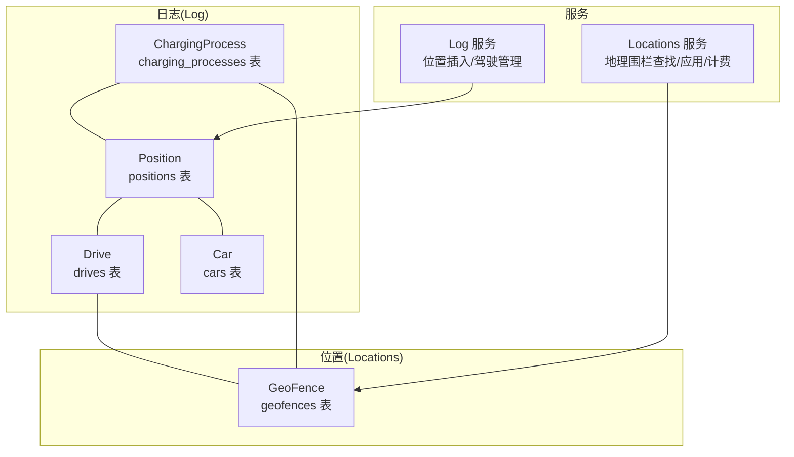
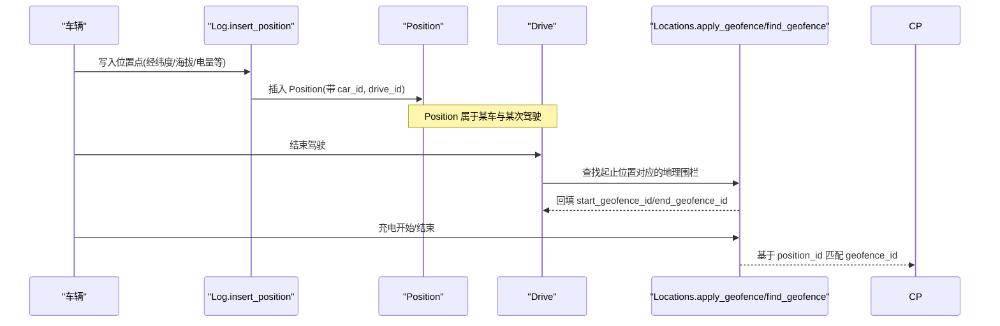
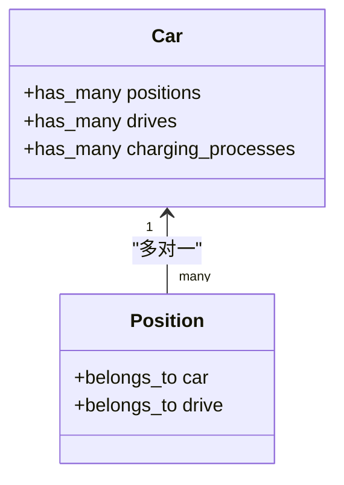
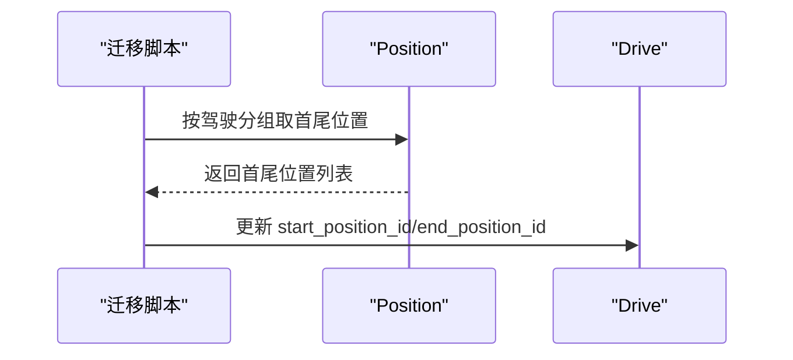
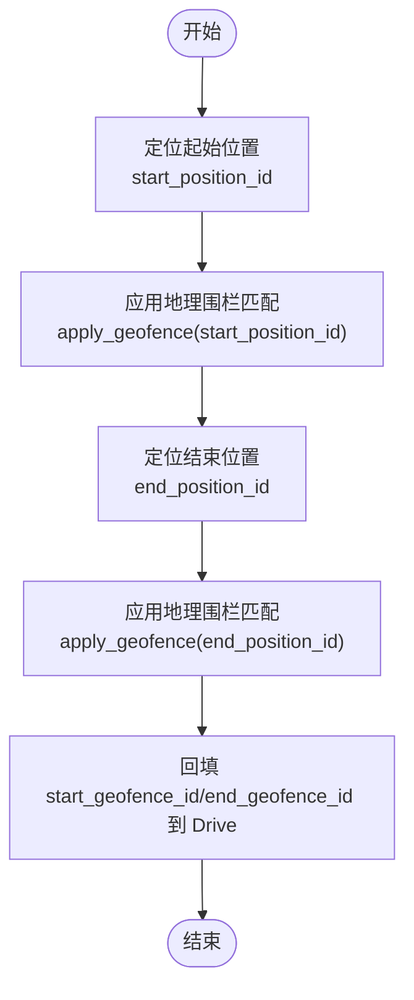
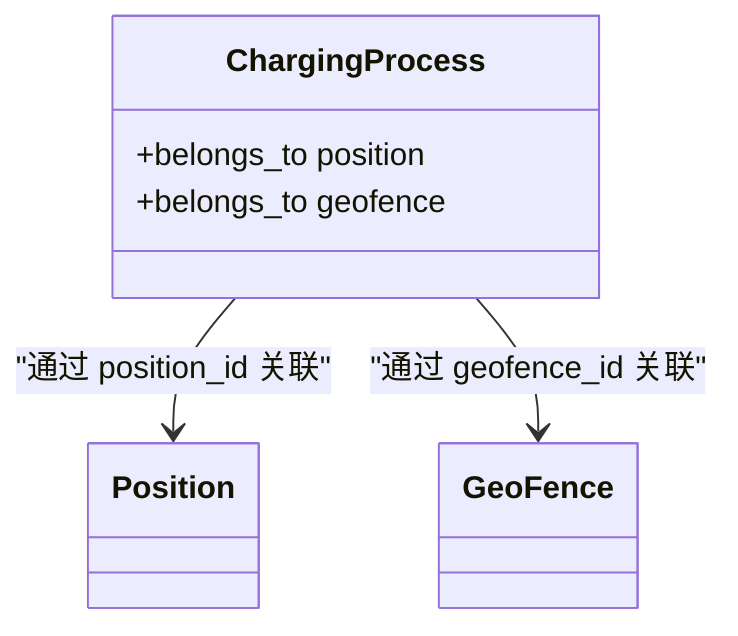
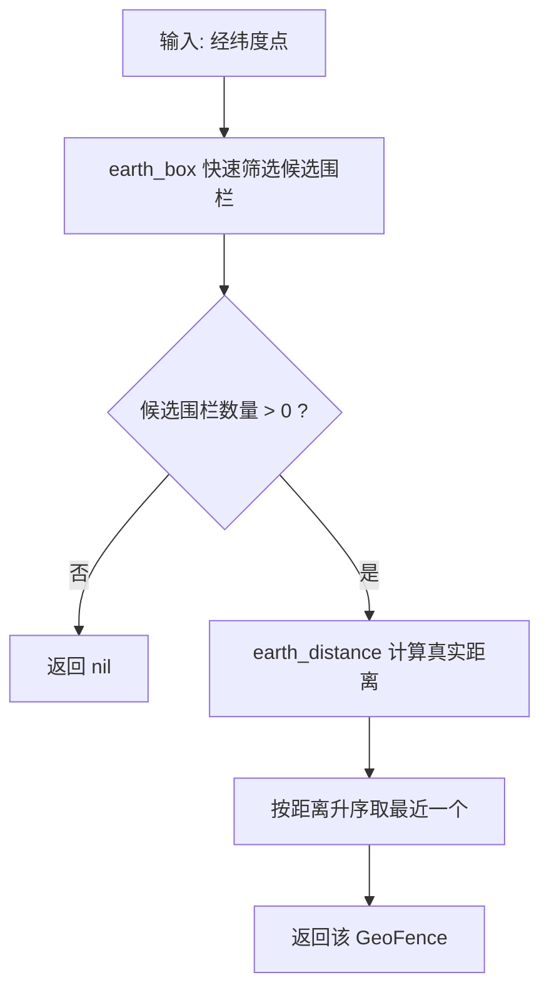
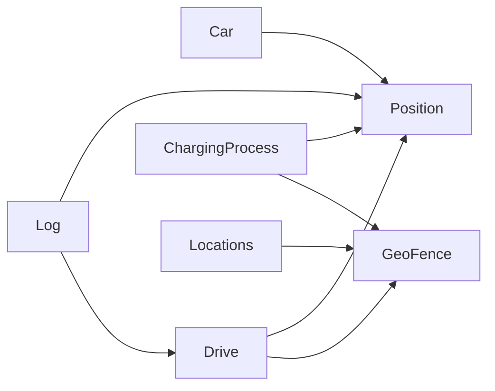

# 位置数据关联关系

<cite>
**本文引用的文件**
- [lib/teslamate/log/position.ex](file://lib/teslamate/log/position.ex)
- [lib/teslamate/log/drive.ex](file://lib/teslamate/log/drive.ex)
- [lib/teslamate/log/car.ex](file://lib/teslamate/log/car.ex)
- [lib/teslamate/log/charging_process.ex](file://lib/teslamate/log/charging_process.ex)
- [lib/teslamate/locations/geo_fence.ex](file://lib/teslamate/locations/geo_fence.ex)
- [lib/teslamate/locations.ex](file://lib/teslamate/locations.ex)
- [lib/teslamate/log.ex](file://lib/teslamate/log.ex)
- [priv/repo/migrations/20191003132415_add_position_ids_and_apply_geofences.exs](file://priv/repo/migrations/20191003132415_add_position_ids_and_apply_geofences.exs)
- [priv/repo/migrations/20190816165713_extend_car_table.exs](file://priv/repo/migrations/20190816165713_extend_car_table.exs)
- [priv/repo/migrations/20190812191616_rename_trips_to_drives.exs](file://priv/repo/migrations/20190812191616_rename_trips_to_drives.exs)
- [priv/repo/migrations/20190810105216_unit_of_length_and_temperature.exs](file://priv/repo/migrations/20190810105216_unit_of_length_and_temperature.exs)
- [priv/repo/migrations/20230417225712_composite_index_to_position.exs](file://priv/repo/migrations/20230417225712_composite_index_to_position.exs)
- [priv/repo/migrations/20240915193446_composite_index_with_predicate_to_position.exs](file://priv/repo/migrations/20240915193446_composite_index_with_predicate_to_position.exs)
- [test/teslamate/locations/geofences_test.exs](file://test/teslamate/locations/geofences_test.exs)
- [test/teslamate/vehicles/vehicle/driving_test.exs](file://test/teslamate/vehicles/vehicle/driving_test.exs)
</cite>

## 目录
1. [引言](#引言)
2. [项目结构](#项目结构)
3. [核心组件](#核心组件)
4. [架构总览](#架构总览)
5. [详细组件分析](#详细组件分析)
6. [依赖关系分析](#依赖关系分析)
7. [性能考量](#性能考量)
8. [故障排查指南](#故障排查指南)
9. [结论](#结论)
10. [附录：Ecto 查询示例](#附录ecto-查询示例)

## 引言
本文件聚焦于位置数据(Position)在系统中的关键作用，系统通过 Position 实体与 Car、Drive、ChargingProcess 等核心实体建立多对一关联，并通过 GeoFence 实现地理围栏判定，从而为驾驶记录、充电过程等业务场景提供完整的位置上下文。本文将详细说明：
- Position 与 Car 的多对一关系（每个位置属于一辆车）
- Position 与 Drive 的多对一关系（每个位置属于一次驾驶）
- 驾驶记录(Drive)如何通过 start_position_id 和 end_position_id 关联起止位置
- 充电过程如何关联地理位置（ChargingProcess 的 position_id）
- 地理围栏(GeoFence)如何基于位置坐标进行匹配
- 如何基于位置数据获取完整的驾驶上下文信息（Ecto 查询示例）

## 项目结构
围绕位置数据的关键模块与迁移文件如下：
- 实体定义：Position、Drive、Car、ChargingProcess、GeoFence
- 位置服务：Locations（地理围栏查找、应用、计费计算）
- 日志服务：Log（位置插入、驾驶开始/结束、最新位置查询）
- 迁移：历史演进中引入位置 ID、地理围栏字段、索引优化

图表来源
- [lib/teslamate/log/position.ex](file://lib/teslamate/log/position.ex#L1-L79)
- [lib/teslamate/log/drive.ex](file://lib/teslamate/log/drive.ex#L1-L79)
- [lib/teslamate/log/car.ex](file://lib/teslamate/log/car.ex#L1-L55)
- [lib/teslamate/log/charging_process.ex](file://lib/teslamate/log/charging_process.ex#L1-L61)
- [lib/teslamate/locations/geo_fence.ex](file://lib/teslamate/locations/geo_fence.ex#L1-L37)
- [lib/teslamate/log.ex](file://lib/teslamate/log.ex#L144-L244)
- [lib/teslamate/locations.ex](file://lib/teslamate/locations.ex#L128-L256)

章节来源
- [lib/teslamate/log/position.ex](file://lib/teslamate/log/position.ex#L1-L79)
- [lib/teslamate/log/drive.ex](file://lib/teslamate/log/drive.ex#L1-L79)
- [lib/teslamate/log/car.ex](file://lib/teslamate/log/car.ex#L1-L55)
- [lib/teslamate/log/charging_process.ex](file://lib/teslamate/log/charging_process.ex#L1-L61)
- [lib/teslamate/locations/geo_fence.ex](file://lib/teslamate/locations/geo_fence.ex#L1-L37)
- [lib/teslamate/log.ex](file://lib/teslamate/log.ex#L144-L244)
- [lib/teslamate/locations.ex](file://lib/teslamate/locations.ex#L128-L256)

## 核心组件
- Position：记录车辆在某一时刻的经纬度、海拔、电量、里程等状态，属于某辆车与某次驾驶。
- Drive：一次驾驶行程，包含起止时间、距离、海拔变化等，关联起止位置与起止地理围栏。
- Car：车辆基本信息，与位置、驾驶、充电过程存在一对多关系。
- ChargingProcess：一次充电过程，关联位置、地址与地理围栏。
- GeoFence：地理围栏，以圆心经纬度与半径定义，用于判定位置是否落入某个区域。

章节来源
- [lib/teslamate/log/position.ex](file://lib/teslamate/log/position.ex#L1-L79)
- [lib/teslamate/log/drive.ex](file://lib/teslamate/log/drive.ex#L1-L79)
- [lib/teslamate/log/car.ex](file://lib/teslamate/log/car.ex#L1-L55)
- [lib/teslamate/log/charging_process.ex](file://lib/teslamate/log/charging_process.ex#L1-L61)
- [lib/teslamate/locations/geo_fence.ex](file://lib/teslamate/locations/geo_fence.ex#L1-L37)

## 架构总览
位置数据在系统中的流转与关联如下：
- 车辆运行时持续产生位置点，写入 Position 表，并自动归属到当前驾驶(Drive)。
- 驾驶开始时创建 Drive 记录；结束时根据 Position 序列确定起止位置并回填到 Drive。
- 地理围栏(GeoFence)通过 PostGIS 函数按圆心与半径匹配最近围栏，更新 Drive 与 ChargingProcess 的 geofence_id。
- 位置服务提供最新位置查询、批量处理缺失海拔等能力。

图表来源
- [lib/teslamate/log.ex](file://lib/teslamate/log.ex#L144-L244)
- [lib/teslamate/locations.ex](file://lib/teslamate/locations.ex#L128-L256)
- [lib/teslamate/log/position.ex](file://lib/teslamate/log/position.ex#L1-L79)
- [lib/teslamate/log/drive.ex](file://lib/teslamate/log/drive.ex#L1-L79)
- [lib/teslamate/log/charging_process.ex](file://lib/teslamate/log/charging_process.ex#L1-L61)

## 详细组件分析

### Position 与 Car 的多对一关系
- Position.belongs_to(:car, Car)：每个位置点都归属于某辆车。
- Car.has_many :positions, Position：一辆车可有多个位置点。
- 在插入位置时，Log.insert_position 会同时设置 car_id 与 drive_id（若处于驾驶中）。

图表来源
- [lib/teslamate/log/car.ex](file://lib/teslamate/log/car.ex#L1-L55)
- [lib/teslamate/log/position.ex](file://lib/teslamate/log/position.ex#L1-L79)
- [lib/teslamate/log.ex](file://lib/teslamate/log.ex#L144-L156)

章节来源
- [lib/teslamate/log/car.ex](file://lib/teslamate/log/car.ex#L1-L55)
- [lib/teslamate/log/position.ex](file://lib/teslamate/log/position.ex#L1-L79)
- [lib/teslamate/log.ex](file://lib/teslamate/log.ex#L144-L156)

### Position 与 Drive 的多对一关系
- Position.belongs_to(:drive, Drive)：每个位置点属于某次驾驶。
- Drive.has_many :positions, Position：一次驾驶由多个位置点组成。
- 迁移脚本会扫描历史驾驶，提取首尾位置并回填到 Drive 的 start_position_id/end_position_id 字段，便于后续地理围栏匹配与统计。

图表来源
- [priv/repo/migrations/20191003132415_add_position_ids_and_apply_geofences.exs](file://priv/repo/migrations/20191003132415_add_position_ids_and_apply_geofences.exs#L88-L118)

章节来源
- [lib/teslamate/log/position.ex](file://lib/teslamate/log/position.ex#L1-L79)
- [lib/teslamate/log/drive.ex](file://lib/teslamate/log/drive.ex#L1-L79)
- [priv/repo/migrations/20191003132415_add_position_ids_and_apply_geofences.exs](file://priv/repo/migrations/20191003132415_add_position_ids_and_apply_geofences.exs#L88-L118)

### 驾驶记录(Drive)的起止位置关联
- Drive.belongs_to :start_position, Position 与 belongs_to :end_position, Position：通过 start_position_id/end_position_id 关联起止位置。
- Locations.apply_geofence 使用 PostGIS 函数在驱动层按圆心与半径匹配最近围栏，更新 Drive 的 start_geofence_id/end_geofence_id。
- 测试覆盖了创建/更新地理围栏后对 Drive 的影响，确保起止位置能正确关联到最近的地理围栏。

图表来源
- [lib/teslamate/log/drive.ex](file://lib/teslamate/log/drive.ex#L27-L34)
- [lib/teslamate/locations.ex](file://lib/teslamate/locations.ex#L128-L171)
- [priv/repo/migrations/20191003132415_add_position_ids_and_apply_geofences.exs](file://priv/repo/migrations/20191003132415_add_position_ids_and_apply_geofences.exs#L125-L179)
- [test/teslamate/locations/geofences_test.exs](file://test/teslamate/locations/geofences_test.exs#L90-L126)

章节来源
- [lib/teslamate/log/drive.ex](file://lib/teslamate/log/drive.ex#L27-L34)
- [lib/teslamate/locations.ex](file://lib/teslamate/locations.ex#L128-L171)
- [priv/repo/migrations/20191003132415_add_position_ids_and_apply_geofences.exs](file://priv/repo/migrations/20191003132415_add_position_ids_and_apply_geofences.exs#L125-L179)
- [test/teslamate/locations/geofences_test.exs](file://test/teslamate/locations/geofences_test.exs#L90-L126)

### 充电过程与地理位置的关联
- ChargingProcess.belongs_to(:position, Position)：充电过程关联一个位置点。
- ChargingProcess.belongs_to(:geofence, GeoFence)：充电过程关联地理围栏，用于计费策略。
- Locations.apply_geofence 同样会基于 ChargingProcess.position_id 匹配 geofence_id。
- Locations.calculate_charge_costs 依据 geofence 的计费类型与参数计算成本。

图表来源
- [lib/teslamate/log/charging_process.ex](file://lib/teslamate/log/charging_process.ex#L1-L61)
- [lib/teslamate/locations.ex](file://lib/teslamate/locations.ex#L128-L256)

章节来源
- [lib/teslamate/log/charging_process.ex](file://lib/teslamate/log/charging_process.ex#L1-L61)
- [lib/teslamate/locations.ex](file://lib/teslamate/locations.ex#L128-L256)

### 地理围栏判定与位置坐标匹配
- GeoFence 定义了名称、经纬度、半径与计费参数。
- Locations.find_geofence(point) 基于给定点返回最近的地理围栏。
- Locations.apply_geofence 使用 PostGIS 函数 earth_box 与 earth_distance 进行快速包围盒过滤与精确距离排序，再回填 geofence_id。
- 测试验证了重叠围栏、半径调整、删除围栏对 Drive/ChargingProcess 的影响。

图表来源
- [lib/teslamate/locations/geo_fence.ex](file://lib/teslamate/locations/geo_fence.ex#L1-L37)
- [lib/teslamate/locations.ex](file://lib/teslamate/locations.ex#L128-L171)
- [test/teslamate/locations/geofences_test.exs](file://test/teslamate/locations/geofences_test.exs#L128-L142)

章节来源
- [lib/teslamate/locations/geo_fence.ex](file://lib/teslamate/locations/geo_fence.ex#L1-L37)
- [lib/teslamate/locations.ex](file://lib/teslamate/locations.ex#L128-L171)
- [test/teslamate/locations/geofences_test.exs](file://test/teslamate/locations/geofences_test.exs#L128-L142)

### 位置数据在驾驶上下文中的作用
- 通过 Position 可获取车辆实时位置、速度、电量、里程等状态。
- 通过 Drive 的 start_position_id/end_position_id 可还原起止地点与地理围栏。
- 通过 ChargingProcess 的 position_id/geofence_id 可定位充电地点与计费规则。
- 位置服务提供最新位置查询、批量处理缺失海拔等能力，支撑前端展示与报表统计。

章节来源
- [lib/teslamate/log.ex](file://lib/teslamate/log.ex#L144-L244)
- [lib/teslamate/log/position.ex](file://lib/teslamate/log/position.ex#L1-L79)
- [lib/teslamate/log/drive.ex](file://lib/teslamate/log/drive.ex#L1-L79)
- [lib/teslamate/log/charging_process.ex](file://lib/teslamate/log/charging_process.ex#L1-L61)

## 依赖关系分析
- Position 依赖 Car 与 Drive（多对一）
- Drive 依赖 Position（起止）、GeoFence（起止）、Address（起止）、Car
- ChargingProcess 依赖 Position、GeoFence、Address、Car
- Locations 依赖 GeoFence 并通过 PostGIS 函数更新 Drive/ChargingProcess 的 geofence_id
- Log 依赖 Position、Drive、Car，负责位置插入与驾驶生命周期管理

图表来源
- [lib/teslamate/log/car.ex](file://lib/teslamate/log/car.ex#L1-L55)
- [lib/teslamate/log/position.ex](file://lib/teslamate/log/position.ex#L1-L79)
- [lib/teslamate/log/drive.ex](file://lib/teslamate/log/drive.ex#L1-L79)
- [lib/teslamate/log/charging_process.ex](file://lib/teslamate/log/charging_process.ex#L1-L61)
- [lib/teslamate/locations/geo_fence.ex](file://lib/teslamate/locations/geo_fence.ex#L1-L37)
- [lib/teslamate/locations.ex](file://lib/teslamate/locations.ex#L128-L256)
- [lib/teslamate/log.ex](file://lib/teslamate/log.ex#L144-L244)

章节来源
- [lib/teslamate/log/car.ex](file://lib/teslamate/log/car.ex#L1-L55)
- [lib/teslamate/log/position.ex](file://lib/teslamate/log/position.ex#L1-L79)
- [lib/teslamate/log/drive.ex](file://lib/teslamate/log/drive.ex#L1-L79)
- [lib/teslamate/log/charging_process.ex](file://lib/teslamate/log/charging_process.ex#L1-L61)
- [lib/teslamate/locations/geo_fence.ex](file://lib/teslamate/locations/geo_fence.ex#L1-L37)
- [lib/teslamate/locations.ex](file://lib/teslamate/locations.ex#L128-L256)
- [lib/teslamate/log.ex](file://lib/teslamate/log.ex#L144-L244)

## 性能考量
- 索引优化
  - 复合索引：positions(drive_id, date)，加速按驾驶分组与时间排序
  - 条件索引：positions(car_id, date, ideal_battery_range_km IS NOT NULL) WHERE 条件，提升范围查询与过滤效率
- PostGIS 函数
  - 使用 earth_box 快速包围盒过滤，减少 earth_distance 计算次数
  - 使用 ORDER BY earth_distance 排序，LIMIT 1 获取最近围栏
- 批量处理
  - 迁移脚本分批扫描历史驾驶与位置，避免一次性大事务
  - 位置缺失海拔的批量处理采用分页与逆序合并，降低内存占用

章节来源
- [priv/repo/migrations/20230417225712_composite_index_to_position.exs](file://priv/repo/migrations/20230417225712_composite_index_to_position.exs#L1-L8)
- [priv/repo/migrations/20240915193446_composite_index_with_predicate_to_position.exs](file://priv/repo/migrations/20240915193446_composite_index_with_predicate_to_position.exs#L1-L9)
- [lib/teslamate/locations.ex](file://lib/teslamate/locations.ex#L128-L171)
- [lib/teslamate/log.ex](file://lib/teslamate/log.ex#L173-L227)

## 故障排查指南
- 地理围栏未匹配
  - 检查 GeoFence 半径与位置点是否在范围内
  - 使用 Locations.find_geofence(point) 验证最近围栏
  - 若围栏重叠或半径变更，确认 Locations.apply_geofence 是否已重新执行
- 起止位置缺失
  - 确认迁移脚本是否已执行，Drive 的 start_position_id/end_position_id 是否回填
  - 检查 Position 是否存在对应 drive_id 的记录
- 充电计费异常
  - 检查 ChargingProcess 的 geofence_id 是否正确
  - 核对 GeoFence 的计费类型与单价、会话费配置
- 最新位置查询异常
  - 确认索引是否存在，必要时重建复合索引
  - 检查时间精度与时区设置

章节来源
- [lib/teslamate/locations.ex](file://lib/teslamate/locations.ex#L128-L256)
- [priv/repo/migrations/20191003132415_add_position_ids_and_apply_geofences.exs](file://priv/repo/migrations/20191003132415_add_position_ids_and_apply_geofences.exs#L88-L179)
- [test/teslamate/locations/geofences_test.exs](file://test/teslamate/locations/geofences_test.exs#L284-L399)

## 结论
- Position 作为位置数据的核心载体，与 Car、Drive、ChargingProcess 形成清晰的多对一关联，支撑驾驶与充电的完整上下文。
- 通过 Drive 的起止位置与 GeoFence 的地理围栏匹配，系统实现了对驾驶路径与充电地点的精准定位与计费。
- 迁移脚本与索引优化保障了历史数据的补全与查询性能。
- 建议在新增地理围栏或调整半径时，及时触发 Locations.apply_geofence，确保 Drive 与 ChargingProcess 的 geofence_id 保持一致。

## 附录：Ecto 查询示例
以下示例展示如何基于位置数据获取完整的驾驶上下文信息（仅提供路径与思路，不直接粘贴代码）：
- 获取某车最新位置及其所属驾驶与起止围栏
  - 路径参考：[lib/teslamate/log.ex](file://lib/teslamate/log.ex#L158-L171)、[lib/teslamate/log/position.ex](file://lib/teslamate/log/position.ex#L1-L79)、[lib/teslamate/log/drive.ex](file://lib/teslamate/log/drive.ex#L27-L34)
- 获取某次驾驶的起止位置与围栏详情
  - 路径参考：[lib/teslamate/log/drive.ex](file://lib/teslamate/log/drive.ex#L27-L34)、[lib/teslamate/locations.ex](file://lib/teslamate/locations.ex#L128-L171)
- 获取某地理围栏内的所有充电过程并关联位置与计费
  - 路径参考：[lib/teslamate/log/charging_process.ex](file://lib/teslamate/log/charging_process.ex#L1-L61)、[lib/teslamate/locations.ex](file://lib/teslamate/locations.ex#L220-L256)
- 批量处理缺失海拔的位置点并限定时间范围
  - 路径参考：[lib/teslamate/log.ex](file://lib/teslamate/log.ex#L173-L227)

章节来源
- [lib/teslamate/log.ex](file://lib/teslamate/log.ex#L158-L227)
- [lib/teslamate/log/position.ex](file://lib/teslamate/log/position.ex#L1-L79)
- [lib/teslamate/log/drive.ex](file://lib/teslamate/log/drive.ex#L27-L34)
- [lib/teslamate/log/charging_process.ex](file://lib/teslamate/log/charging_process.ex#L1-L61)
- [lib/teslamate/locations.ex](file://lib/teslamate/locations.ex#L128-L256)