# 位置数据模型

<cite>
**本文引用的文件**
- [priv/repo/migrations/20190330170000_create_positions.exs](file://priv/repo/migrations/20190330170000_create_positions.exs)
- [lib/teslamate/log/position.ex](file://lib/teslamate/log/position.ex)
- [lib/teslamate/locations.ex](file://lib/teslamate/locations.ex)
- [lib/teslamate/locations/geo_fence.ex](file://lib/teslamate/locations/geo_fence.ex)
- [lib/teslamate/locations/address.ex](file://lib/teslamate/locations/address.ex)
- [lib/teslamate/custom_expressions.ex](file://lib/teslamate/custom_expressions.ex)
- [priv/repo/migrations/20190925152807_create_geo_extensions.exs](file://priv/repo/migrations/20190925152807_create_geo_extensions.exs)
- [priv/repo/migrations/20191008191431_fix_ll_to_earth.exs](file://priv/repo/migrations/20191008191431_fix_ll_to_earth.exs)
- [priv/repo/migrations/20250407155134_upgrade_earthdistance.exs](file://priv/repo/migrations/20250407155134_upgrade_earthdistance.exs)
- [priv/repo/migrations/20230417225712_composite_index_to_position.exs](file://priv/repo/migrations/20230417225712_composite_index_to_position.exs)
- [priv/repo/migrations/20240915193446_composite_index_with_predicate_to_position.exs](file://priv/repo/migrations/20240915193446_composite_index_with_predicate_to_position.exs)
- [priv/repo/migrations/20190828104902_add_elevation.exs](file://priv/repo/migrations/20190828104902_add_elevation.exs)
- [lib/teslamate/terrain.ex](file://lib/teslamate/terrain.ex)
- [lib/teslamate/log.ex](file://lib/teslamate/log.ex)
- [test/teslamate/locations/geofences_test.exs](file://test/teslamate/locations/geofences_test.exs)
</cite>

## 目录
1. [简介](#简介)
2. [项目结构](#项目结构)
3. [核心组件](#核心组件)
4. [架构总览](#架构总览)
5. [详细组件分析](#详细组件分析)
6. [依赖关系分析](#依赖关系分析)
7. [性能考量](#性能考量)
8. [故障排查指南](#故障排查指南)
9. [结论](#结论)

## 简介
本文件系统性梳理 TeslaMate 中“位置数据模型”的设计与实现，重点覆盖：
- Position 表的字段定义与地理坐标存储格式、精度要求
- PostGIS 地理空间扩展的集成方式与空间索引优化策略
- 复合索引在提升时间范围与地理位置复合查询性能中的作用
- 位置数据与驾驶记录、充电过程的关联机制
- 基于位置数据的地理围栏判断与计费计算流程

## 项目结构
围绕位置数据模型的关键文件分布如下：
- 数据库迁移：定义位置表结构、地理扩展启用、索引创建与更新
- Ecto Schema：定义位置实体、地理围栏、地址实体及其校验规则
- 自定义表达式：封装地球距离与围栏判断的 PostgreSQL 函数调用
- 地形服务：异步补全海拔高程数据
- 业务上下文：位置与围栏的关联、计费计算、地址反查

图表来源
- [priv/repo/migrations/20190330170000_create_positions.exs](file://priv/repo/migrations/20190330170000_create_positions.exs#L1-L28)
- [priv/repo/migrations/20190925152807_create_geo_extensions.exs](file://priv/repo/migrations/20190925152807_create_geo_extensions.exs#L1-L17)
- [priv/repo/migrations/20191008191431_fix_ll_to_earth.exs](file://priv/repo/migrations/20191008191431_fix_ll_to_earth.exs#L1-L18)
- [priv/repo/migrations/20250407155134_upgrade_earthdistance.exs](file://priv/repo/migrations/20250407155134_upgrade_earthdistance.exs#L1-L7)
- [priv/repo/migrations/20190828104902_add_elevation.exs](file://priv/repo/migrations/20190828104902_add_elevation.exs#L1-L8)
- [priv/repo/migrations/20230417225712_composite_index_to_position.exs](file://priv/repo/migrations/20230417225712_composite_index_to_position.exs#L1-L9)
- [priv/repo/migrations/20240915193446_composite_index_with_predicate_to_position.exs](file://priv/repo/migrations/20240915193446_composite_index_with_predicate_to_position.exs#L1-L10)
- [lib/teslamate/log/position.ex](file://lib/teslamate/log/position.ex#L1-L79)
- [lib/teslamate/locations/geo_fence.ex](file://lib/teslamate/locations/geo_fence.ex#L1-L37)
- [lib/teslamate/locations/address.ex](file://lib/teslamate/locations/address.ex#L1-L58)
- [lib/teslamate/custom_expressions.ex](file://lib/teslamate/custom_expressions.ex#L1-L93)
- [lib/teslamate/locations.ex](file://lib/teslamate/locations.ex#L1-L257)
- [lib/teslamate/terrain.ex](file://lib/teslamate/terrain.ex#L1-L200)
- [lib/teslamate/log.ex](file://lib/teslamate/log.ex#L158-L244)

章节来源
- [priv/repo/migrations/20190330170000_create_positions.exs](file://priv/repo/migrations/20190330170000_create_positions.exs#L1-L28)
- [lib/teslamate/log/position.ex](file://lib/teslamate/log/position.ex#L1-L79)
- [lib/teslamate/locations.ex](file://lib/teslamate/locations.ex#L1-L257)

## 核心组件
- 位置表(Position)：存储车辆在某一时刻的经纬度、海拔、速度、电量、里程等状态信息，并通过外键关联到车辆与行程。
- 地理围栏(GeoFence)：以圆心经纬度与半径定义的地理区域，用于驱动与充电过程的自动归属。
- 地址(Address)：基于 OSM 的逆地理编码结果，包含显示名、行政区划等元数据。
- 自定义表达式(CustomExpressions)：封装地球距离与围栏判断的 PostgreSQL 片段，供查询使用。
- 地形服务(Terrain)：异步从 SRTM 获取海拔数据并回填到位置表。

章节来源
- [lib/teslamate/log/position.ex](file://lib/teslamate/log/position.ex#L1-L79)
- [lib/teslamate/locations/geo_fence.ex](file://lib/teslamate/locations/geo_fence.ex#L1-L37)
- [lib/teslamate/locations/address.ex](file://lib/teslamate/locations/address.ex#L1-L58)
- [lib/teslamate/custom_expressions.ex](file://lib/teslamate/custom_expressions.ex#L1-L93)
- [lib/teslamate/terrain.ex](file://lib/teslamate/terrain.ex#L1-L200)

## 架构总览
位置数据模型围绕 PostgreSQL 的地理扩展展开，通过自定义表达式实现高效的地理围栏判断与距离计算；同时通过复合索引优化常见查询路径（如按驱动+时间排序、按车+时间+有值条件过滤）。

图表来源
- [lib/teslamate/locations.ex](file://lib/teslamate/locations.ex#L128-L171)
- [lib/teslamate/custom_expressions.ex](file://lib/teslamate/custom_expressions.ex#L37-L92)
- [lib/teslamate/log/position.ex](file://lib/teslamate/log/position.ex#L1-L79)

## 详细组件分析

### 位置表(Position)设计与地理坐标字段
- 字段概览
  - 时间戳：UTC 时间，支持微秒级精度，便于高频率采样与精确排序
  - 经纬度：浮点数，用于直接存储 WGS84 坐标
  - 海拔：整数单位米，历史字段名由 altitude 改为 elevation
  - 车辆状态：速度、功率、里程、电池等级、内外温度、空调/除霜状态等
  - 外键：关联车辆与行程
- 存储格式与精度
  - 经纬度采用浮点类型，满足日常导航精度需求；若需更高精度可考虑 decimal 类型或几何类型
  - 海拔以整数米存储，适合统计与可视化展示
- 变更与演进
  - 迁移将 altitude 重命名为 elevation，统一命名语义

章节来源
- [priv/repo/migrations/20190330170000_create_positions.exs](file://priv/repo/migrations/20190330170000_create_positions.exs#L1-L28)
- [lib/teslamate/log/position.ex](file://lib/teslamate/log/position.ex#L1-L79)
- [priv/repo/migrations/20190828104902_add_elevation.exs](file://priv/repo/migrations/20190828104902_add_elevation.exs#L1-L8)

### PostGIS 集成与空间索引优化
- 地理扩展启用
  - 启用 cube 与 earthdistance 扩展，提供 ll_to_earth、earth_box、earth_distance 等函数
  - 设置函数搜索路径，确保函数解析正确
- 空间索引
  - 在 geofences 上创建基于 earth_box 的 GiST 索引，加速围栏候选集筛选
  - 在 positions 上创建复合索引以优化常见查询模式
    - 驱动+时间：按行程分组的时间序列查询
    - 车+时间+有值谓词：仅对存在特定字段的数据建立索引，减少索引体积并提升选择性
- 函数修复与升级
  - 修复 ll_to_earth 函数签名与并行安全属性
  - 升级 earthdistance 扩展以获得最新功能与性能改进

图表来源
- [priv/repo/migrations/20190925152807_create_geo_extensions.exs](file://priv/repo/migrations/20190925152807_create_geo_extensions.exs#L1-L17)
- [priv/repo/migrations/20230417225712_composite_index_to_position.exs](file://priv/repo/migrations/20230417225712_composite_index_to_position.exs#L1-L9)
- [priv/repo/migrations/20240915193446_composite_index_with_predicate_to_position.exs](file://priv/repo/migrations/20240915193446_composite_index_with_predicate_to_position.exs#L1-L10)
- [priv/repo/migrations/20191008191431_fix_ll_to_earth.exs](file://priv/repo/migrations/20191008191431_fix_ll_to_earth.exs#L1-L18)
- [priv/repo/migrations/20250407155134_upgrade_earthdistance.exs](file://priv/repo/migrations/20250407155134_upgrade_earthdistance.exs#L1-L7)

章节来源
- [priv/repo/migrations/20190925152807_create_geo_extensions.exs](file://priv/repo/migrations/20190925152807_create_geo_extensions.exs#L1-L17)
- [priv/repo/migrations/20230417225712_composite_index_to_position.exs](file://priv/repo/migrations/20230417225712_composite_index_to_position.exs#L1-L9)
- [priv/repo/migrations/20240915193446_composite_index_with_predicate_to_position.exs](file://priv/repo/migrations/20240915193446_composite_index_with_predicate_to_position.exs#L1-L10)
- [priv/repo/migrations/20191008191431_fix_ll_to_earth.exs](file://priv/repo/migrations/20191008191431_fix_ll_to_earth.exs#L1-L18)
- [priv/repo/migrations/20250407155134_upgrade_earthdistance.exs](file://priv/repo/migrations/20250407155134_upgrade_earthdistance.exs#L1-L7)

### 地理围栏判断与计费
- 围栏判断
  - 使用自定义表达式 within_geofence?，结合 earth_box 与 earth_distance 实现快速包围盒筛选与精确距离判断
  - 支持左右两种方向参数，适配不同关联写法
- 计费计算
  - 基于围栏的计费类型（每千瓦时/每分钟），结合充电过程的耗电与时长计算费用
  - 提供批量更新逻辑，避免重复计算

图表来源
- [lib/teslamate/locations.ex](file://lib/teslamate/locations.ex#L128-L171)
- [lib/teslamate/custom_expressions.ex](file://lib/teslamate/custom_expressions.ex#L37-L92)

章节来源
- [lib/teslamate/locations.ex](file://lib/teslamate/locations.ex#L128-L171)
- [lib/teslamate/custom_expressions.ex](file://lib/teslamate/custom_expressions.ex#L37-L92)
- [test/teslamate/locations/geofences_test.exs](file://test/teslamate/locations/geofences_test.exs#L128-L200)

### 位置数据与驾驶记录、充电过程的关联
- 关联机制
  - 驾驶记录：通过行程起止位置外键，将起终点与位置表关联
  - 充电过程：通过位置外键，将充电会话与具体位置关联
- 自动归属
  - 创建/更新围栏时，自动扫描并更新相关行程与充电过程的围栏归属
  - 支持重叠围栏的处理与更新后的重新匹配

```mermaid
erDiagram
POSITIONS {
int id PK
utc_datetime date
float latitude
float longitude
int elevation
int car_id FK
int drive_id FK
}
DRIVES {
int id PK
int start_position_id FK
int end_position_id FK
int start_geofence_id FK
int end_geofence_id FK
}
CHARGING_PROCESSES {
int id PK
int position_id FK
int geofence_id FK
}
POSITIONS ||--o{ DRIVES : "起终点"
POSITIONS ||--o{ CHARGING_PROCESSES : "充电位置"
```

图表来源
- [lib/teslamate/log/position.ex](file://lib/teslamate/log/position.ex#L1-L79)
- [lib/teslamate/locations.ex](file://lib/teslamate/locations.ex#L128-L171)

章节来源
- [lib/teslamate/locations.ex](file://lib/teslamate/locations.ex#L128-L171)
- [test/teslamate/locations/geofences_test.exs](file://test/teslamate/locations/geofences_test.exs#L90-L127)

### 复合索引在查询性能中的作用
- 驱动+时间复合索引
  - 优化按行程分组的时间序列查询，避免全表扫描
- 车+时间+有值谓词复合索引
  - 仅对存在特定字段的数据建立索引，提升选择性与查询效率
- 空间索引
  - 对围栏创建基于 earth_box 的空间索引，显著降低围栏候选集数量

章节来源
- [priv/repo/migrations/20230417225712_composite_index_to_position.exs](file://priv/repo/migrations/20230417225712_composite_index_to_position.exs#L1-L9)
- [priv/repo/migrations/20240915193446_composite_index_with_predicate_to_position.exs](file://priv/repo/migrations/20240915193446_composite_index_with_predicate_to_position.exs#L1-L10)
- [priv/repo/migrations/20190925152807_create_geo_extensions.exs](file://priv/repo/migrations/20190925152807_create_geo_extensions.exs#L1-L17)

### 海拔高程数据的补全与使用
- 异步补全
  - Terrain 服务周期性扫描缺失海拔的位置，调用 SRTM 获取高程并回填
  - 使用有限并发与超时控制，避免阻塞主流程
- 查询路径
  - 通过日志模块提供的查询接口，定位需要补全的记录批次

图表来源
- [lib/teslamate/terrain.ex](file://lib/teslamate/terrain.ex#L1-L200)
- [lib/teslamate/log.ex](file://lib/teslamate/log.ex#L158-L244)

章节来源
- [lib/teslamate/terrain.ex](file://lib/teslamate/terrain.ex#L1-L200)
- [lib/teslamate/log.ex](file://lib/teslamate/log.ex#L158-L244)

## 依赖关系分析
- 模块耦合
  - 位置与围栏上下文依赖自定义表达式与数据库函数
  - 地形服务依赖日志模块与外部 SRTM 服务
- 外部依赖
  - PostgreSQL 地理扩展：earthdistance、cube
  - 地理函数：ll_to_earth、earth_box、earth_distance
- 可能的循环依赖
  - 通过上下文与表达式解耦，避免直接循环引用

图表来源
- [lib/teslamate/locations.ex](file://lib/teslamate/locations.ex#L1-L257)
- [lib/teslamate/custom_expressions.ex](file://lib/teslamate/custom_expressions.ex#L1-L93)
- [lib/teslamate/terrain.ex](file://lib/teslamate/terrain.ex#L1-L200)
- [lib/teslamate/log.ex](file://lib/teslamate/log.ex#L158-L244)

## 性能考量
- 空间查询
  - 使用 earth_box 快速包围盒筛选，再用 earth_distance 精确排序，平衡性能与准确性
- 索引策略
  - 针对高频查询创建复合索引，减少回表与排序成本
  - 带谓词的索引可显著提升选择性，降低索引维护成本
- 异步处理
  - 海拔补全采用异步与限流，避免对在线查询造成影响
- 函数稳定性
  - 修复与升级地理函数，确保查询执行计划稳定

[本节为通用指导，不直接分析具体文件]

## 故障排查指南
- 围栏未命中
  - 检查围栏半径与位置精度是否合理
  - 确认自定义表达式 within_geofence? 的方向参数与关联写法一致
- 计费为空
  - 确认围栏计费配置与充电过程是否已归属到正确围栏
  - 检查批量计费更新是否成功执行
- 海拔缺失
  - 查看地形服务日志与 SRTM 缓存路径
  - 确认日志模块返回的待补全位置列表是否为空或过期

章节来源
- [lib/teslamate/locations.ex](file://lib/teslamate/locations.ex#L222-L256)
- [lib/teslamate/terrain.ex](file://lib/teslamate/terrain.ex#L1-L200)
- [lib/teslamate/log.ex](file://lib/teslamate/log.ex#L158-L244)

## 结论
本位置数据模型以 PostgreSQL 地理扩展为核心，结合自定义表达式与复合索引，在保证查询性能的同时提供了灵活的地理围栏判断与计费能力。通过异步补全海拔数据，进一步完善了位置信息的完整性。建议在生产环境中持续监控索引使用情况与查询计划，根据实际数据分布调整索引策略与围栏半径，以获得最佳性能与准确性。