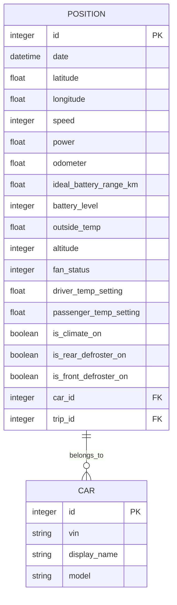
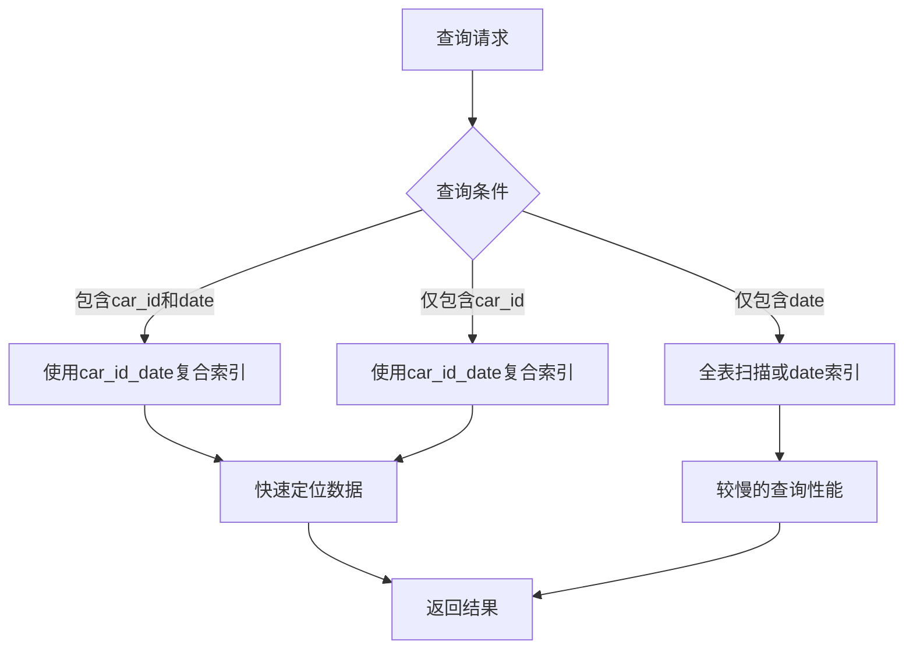
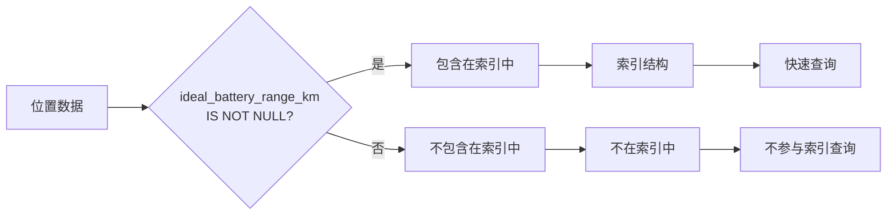

# 位置数据索引优化

<cite>
**本文档引用文件**   
- [20190330170000_create_positions.exs](file://priv/repo/migrations/20190330170000_create_positions.exs)
- [20190416125429_add_indexes_on_dates.exs](file://priv/repo/migrations/20190416125429_add_indexes_on_dates.exs)
- [20190925161034_create_index_on_address_positions.exs](file://priv/repo/migrations/20190925161034_create_index_on_address_positions.exs)
- [20200502140646_drop_unused_indexes.exs](file://priv/repo/migrations/20200502140646_drop_unused_indexes.exs)
- [20230417225712_composite_index_to_position.exs](file://priv/repo/migrations/20230417225712_composite_index_to_position.exs)
- [20240915193446_composite_index_with_predicate_to_position.exs](file://priv/repo/migrations/20240915193446_composite_index_with_predicate_to_position.exs)
- [20191008191431_fix_ll_to_earth.exs](file://priv/repo/migrations/20191008191431_fix_ll_to_earth.exs)
- [position.ex](file://lib/teslamate/log/position.ex)
- [log.ex](file://lib/teslamate/log.ex)
- [development.mdx](file://website/docs/development.mdx)
</cite>

## 目录
1. [引言](#引言)
2. [GIST索引在地理位置查询中的优势](#gist索引在地理位置查询中的优势)
3. [复合索引设计原则](#复合索引设计原则)
4. [带条件的复合索引实现原理](#带条件的复合索引实现原理)
5. [索引使用建议和性能测试方法](#索引使用建议和性能测试方法)
6. [结论](#结论)

## 引言
本文档详细分析了位置数据索引优化策略，重点探讨了不同索引策略对查询性能的影响。文档解释了GIST索引在地理位置查询中的优势，以及为何替代了原有的函数索引。同时，详细说明了复合索引的设计原则，包括(car_id, date)组合索引在时间序列查询中的作用。重点阐述了带条件的复合索引(ideal_battery_range_km IS NOT NULL)的实现原理和性能优势，分析其在过滤有效电池数据场景下的查询效率提升。最后提供了索引使用建议和性能测试方法。

**Section sources**
- [20190330170000_create_positions.exs](file://priv/repo/migrations/20190330170000_create_positions.exs)
- [position.ex](file://lib/teslamate/log/position.ex)

## GIST索引在地理位置查询中的优势
GIST（Generalized Search Tree）索引在地理位置查询中具有显著优势。系统最初使用`ll_to_earth`函数创建了基于地理位置的索引，用于加速地理围栏查找。然而，随着系统演进，这些基于GIST的索引被移除。这表明系统可能从基于PostGIS的地理空间查询转向了更高效的查询策略。

GIST索引的优势在于它能够高效处理多维数据，特别适合地理位置数据的范围查询和邻近查询。通过将经纬度坐标转换为地球坐标系中的三维点，GIST索引可以快速定位特定地理区域内的所有位置数据。这种索引结构在处理大量位置数据时表现出色，能够显著减少查询的I/O操作。

然而，GIST索引的维护成本较高，且在某些查询场景下可能不如其他索引策略高效。系统最终选择移除这些索引，可能是由于查询模式的变化或发现了更优的索引策略。

**Diagram sources **
- [20190330170000_create_positions.exs](file://priv/repo/migrations/20190330170000_create_positions.exs)
- [position.ex](file://lib/teslamate/log/position.ex)

**Section sources**
- [20190925161034_create_index_on_address_positions.exs](file://priv/repo/migrations/20190925161034_create_index_on_address_positions.exs)
- [20200502140646_drop_unused_indexes.exs](file://priv/repo/migrations/20200502140646_drop_unused_indexes.exs)
- [20191008191431_fix_ll_to_earth.exs](file://priv/repo/migrations/20191008191431_fix_ll_to_earth.exs)

## 复合索引设计原则
复合索引的设计遵循特定原则，以最大化查询性能。系统中实现了多个复合索引，其中最典型的是(car_id, date)组合索引。这种索引设计基于数据访问模式的分析，即大多数查询都是按车辆和时间范围进行的。

复合索引的列顺序至关重要。在(car_id, date)索引中，car_id作为第一列，因为它是查询中最常使用的过滤条件。date作为第二列，支持时间范围查询。这种顺序使得索引能够高效支持以下查询模式：
- 按特定车辆查询所有位置数据
- 按车辆和时间范围查询位置数据
- 按车辆和特定时间点查询位置数据

此外，系统还实现了(drive_id, date)复合索引，用于优化驾驶行程相关的查询。值得注意的是，系统在添加复合索引后移除了单一的drive_id索引，这表明复合索引完全覆盖了单一索引的功能，同时提供了更好的查询性能。

**Diagram sources **
- [20230417225712_composite_index_to_position.exs](file://priv/repo/migrations/20230417225712_composite_index_to_position.exs)

**Section sources**
- [20230417225712_composite_index_to_position.exs](file://priv/repo/migrations/20230417225712_composite_index_to_position.exs)
- [20190416125429_add_indexes_on_dates.exs](file://priv/repo/migrations/20190416125429_add_indexes_on_dates.exs)

## 带条件的复合索引实现原理
带条件的复合索引是一种高级索引技术，它只包含满足特定条件的数据行。系统中实现了一个典型的带条件复合索引：`[:car_id, :date, "(ideal_battery_range_km IS NOT NULL)"]`，其中包含`where: "ideal_battery_range_km IS NOT NULL"`条件。

这种索引的实现原理是创建一个部分索引（Partial Index），只包含ideal_battery_range_km字段不为空的位置记录。其优势在于：
1. **减小索引大小**：只索引有效数据，显著减小索引体积
2. **提高查询速度**：对于需要过滤有效电池数据的查询，可以直接使用此索引
3. **优化写入性能**：只有满足条件的插入操作才需要更新索引

该索引特别适用于过滤有效电池数据的场景。在系统中，理想电池续航里程（ideal_battery_range_km）是评估车辆状态的重要指标。通过此索引，系统可以快速检索具有有效电池数据的位置记录，而无需扫描整个位置表。

此外，文档建议在查询中使用`ideal_battery_range_km IS NOT NULL and car_id = $car_id`作为WHERE条件，这与带条件的复合索引完美匹配，能够实现最优的查询性能。

**Diagram sources **
- [20240915193446_composite_index_with_predicate_to_position.exs](file://priv/repo/migrations/20240915193446_composite_index_with_predicate_to_position.exs)

**Section sources**
- [20240915193446_composite_index_with_predicate_to_position.exs](file://priv/repo/migrations/20240915193446_composite_index_with_predicate_to_position.exs)
- [development.mdx](file://website/docs/development.mdx)

## 索引使用建议和性能测试方法
为了确保索引的有效使用和查询性能优化，系统提供了以下建议和方法：

1. **索引使用建议**：
   - 仅在真正需要时查询位置表，避免不必要的全表扫描
   - 对于15秒间隔数据足够的情况，考虑通过添加`ideal_battery_range_km IS NOT NULL and car_id = $car_id`作为WHERE条件来排除流式数据
   - 优先使用复合索引而非单一列索引，以提高查询效率
   - 定期审查和优化索引策略，移除未使用或低效的索引

2. **性能测试方法**：
   - 使用`EXPLAIN ANALYZE`诊断索引使用情况和查询性能
   - 启用pg_stat_statements扩展来收集查询统计信息
   - 通过分析`mean_exec_time`识别潜在的慢查询
   - 定期监控查询性能指标，及时发现性能瓶颈

通过这些方法，可以确保系统在处理大量位置数据时保持高性能，同时为开发人员提供诊断和优化查询性能的工具。

**Section sources**
- [development.mdx](file://website/docs/development.mdx)
- [log.ex](file://lib/teslamate/log.ex)

## 结论
位置数据索引优化是系统性能的关键因素。通过分析不同索引策略，我们发现GIST索引虽然在地理位置查询中有其优势，但随着系统演进可能被更高效的策略替代。复合索引设计，特别是(car_id, date)组合，为时间序列查询提供了高效支持。带条件的复合索引进一步优化了特定场景下的查询性能，通过只索引有效数据来减小索引大小并提高查询速度。遵循推荐的索引使用建议和性能测试方法，可以确保系统在处理大量位置数据时保持最佳性能。