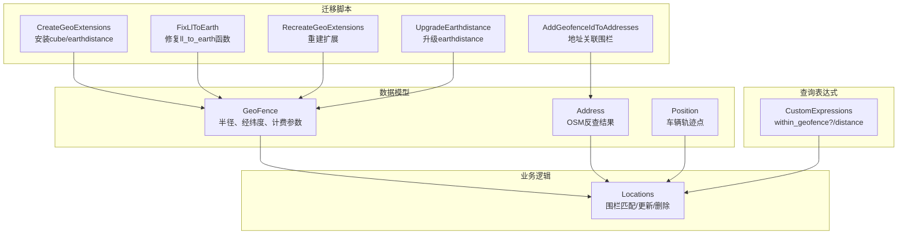
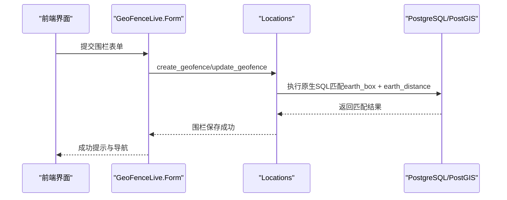
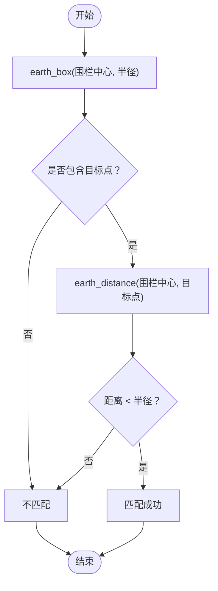
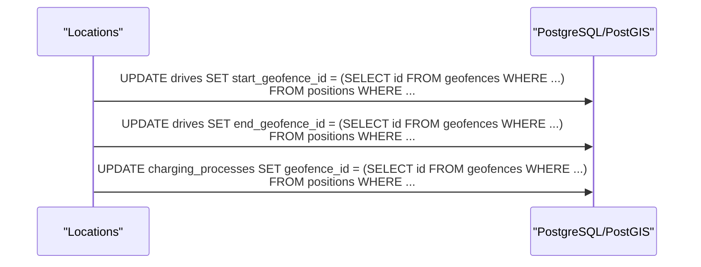
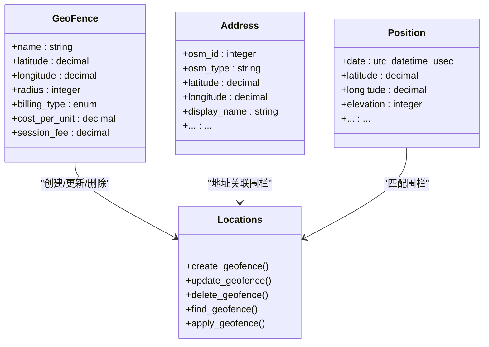

# 地理空间数据处理

<cite>
**本文引用的文件列表**
- [locations.ex](file://lib/teslamate/locations.ex)
- [custom_expressions.ex](file://lib/teslamate/custom_expressions.ex)
- [geo_fence.ex](file://lib/teslamate/locations/geo_fence.ex)
- [address.ex](file://lib/teslamate/locations/address.ex)
- [position.ex](file://lib/teslamate/log/position.ex)
- [create_geo_extensions.exs](file://priv/repo/migrations/20190925152807_create_geo_extensions.exs)
- [fix_ll_to_earth.exs](file://priv/repo/migrations/20191008191431_fix_ll_to_earth.exs)
- [recreate_geo_extensions.exs](file://priv/repo/migrations/20240929084639_recreate_geo_extensions.exs)
- [upgrade_earthdistance.exs](file://priv/repo/migrations/20250407155134_upgrade_earthdistance.exs)
- [add_geofence_id_to_addresses.exs](file://priv/repo/migrations/20190925182253_add_geofence_id_to_addresses.exs)
- [geofences_test.exs](file://test/teslamate/locations/geofences_test.exs)
- [form.ex](file://lib/teslamate_web/live/geofence_live/form.ex)
</cite>

## 目录
1. [简介](#简介)
2. [项目结构](#项目结构)
3. [核心组件](#核心组件)
4. [架构总览](#架构总览)
5. [详细组件分析](#详细组件分析)
6. [依赖关系分析](#依赖关系分析)
7. [性能考量](#性能考量)
8. [故障排查指南](#故障排查指南)
9. [结论](#结论)
10. [附录](#附录)

## 简介
本文件聚焦于项目中PostGIS相关扩展的集成与管理，系统性阐述以下主题：
- cube与earthdistance扩展的安装与配置流程
- ll_to_earth函数在地理位置转换中的作用
- 使用地球坐标系计算两点间距离（earth_distance）
- earth_box函数在地理围栏（GeoFence）判定中的应用
- 结合代码路径说明空间查询的SQL实现方式，包括车辆位置与地理围栏的匹配算法
- 不同PostgreSQL版本间的兼容性问题及迁移策略

## 项目结构
围绕地理空间能力，项目的关键文件分布如下：
- 数据模型：GeoFence、Address、Position
- 查询表达式：自定义Ecto宏封装earth_box、earth_distance、ll_to_earth等
- 业务逻辑：Locations上下文负责围栏创建、更新、删除与匹配
- 迁移脚本：负责PostGIS扩展的安装、函数修复与升级
- 测试用例：覆盖围栏重叠、更新、删除等场景

图表来源
- [geo_fence.ex](file://lib/teslamate/locations/geo_fence.ex#L1-L37)
- [address.ex](file://lib/teslamate/locations/address.ex#L1-L58)
- [position.ex](file://lib/teslamate/log/position.ex#L1-L79)
- [custom_expressions.ex](file://lib/teslamate/custom_expressions.ex#L37-L92)
- [locations.ex](file://lib/teslamate/locations.ex#L128-L159)
- [create_geo_extensions.exs](file://priv/repo/migrations/20190925152807_create_geo_extensions.exs#L1-L16)
- [fix_ll_to_earth.exs](file://priv/repo/migrations/20191008191431_fix_ll_to_earth.exs#L1-L18)
- [recreate_geo_extensions.exs](file://priv/repo/migrations/20240929084639_recreate_geo_extensions.exs#L1-L9)
- [upgrade_earthdistance.exs](file://priv/repo/migrations/20250407155134_upgrade_earthdistance.exs#L1-L7)
- [add_geofence_id_to_addresses.exs](file://priv/repo/migrations/20190925182253_add_geofence_id_to_addresses.exs#L69-L112)

章节来源
- [geo_fence.ex](file://lib/teslamate/locations/geo_fence.ex#L1-L37)
- [address.ex](file://lib/teslamate/locations/address.ex#L1-L58)
- [position.ex](file://lib/teslamate/log/position.ex#L1-L79)
- [custom_expressions.ex](file://lib/teslamate/custom_expressions.ex#L37-L92)
- [locations.ex](file://lib/teslamate/locations.ex#L128-L159)
- [create_geo_extensions.exs](file://priv/repo/migrations/20190925152807_create_geo_extensions.exs#L1-L16)
- [fix_ll_to_earth.exs](file://priv/repo/migrations/20191008191431_fix_ll_to_earth.exs#L1-L18)
- [recreate_geo_extensions.exs](file://priv/repo/migrations/20240929084639_recreate_geo_extensions.exs#L1-L9)
- [upgrade_earthdistance.exs](file://priv/repo/migrations/20250407155134_upgrade_earthdistance.exs#L1-L7)
- [add_geofence_id_to_addresses.exs](file://priv/repo/migrations/20190925182253_add_geofence_id_to_addresses.exs#L69-L112)

## 核心组件
- GeoFence：存储围栏名称、中心经纬度、半径，以及计费参数（按kWh或按分钟计费）
- Address：存储OSM反查得到的地址信息，并与围栏建立关联
- Position：记录车辆轨迹点（时间戳、经纬度、海拔、电量等）
- CustomExpressions：封装earth_box、earth_distance、ll_to_earth等PostGIS函数调用，提供within_geofence?与distance宏
- Locations：提供围栏创建、更新、删除与批量匹配逻辑；内部通过原生SQL调用PostGIS函数完成匹配

章节来源
- [geo_fence.ex](file://lib/teslamate/locations/geo_fence.ex#L1-L37)
- [address.ex](file://lib/teslamate/locations/address.ex#L1-L58)
- [position.ex](file://lib/teslamate/log/position.ex#L1-L79)
- [custom_expressions.ex](file://lib/teslamate/custom_expressions.ex#L37-L92)
- [locations.ex](file://lib/teslamate/locations.ex#L128-L159)

## 架构总览
地理空间查询的核心流程：
- 用户在前端创建/编辑围栏（GeoFence），后端通过Locations上下文进行校验与持久化
- 创建/更新围栏时，系统会执行批量匹配，将历史轨迹点与围栏进行空间匹配
- 匹配算法基于PostGIS函数：先用earth_box进行粗略包围盒筛选，再用earth_distance进行精确距离判断
- CustomExpressions提供宏以简化Ecto查询中的空间表达式

图表来源
- [form.ex](file://lib/teslamate_web/live/geofence_live/form.ex#L152-L168)
- [locations.ex](file://lib/teslamate/locations.ex#L128-L159)
- [custom_expressions.ex](file://lib/teslamate/custom_expressions.ex#L37-L92)

## 详细组件分析

### PostGIS扩展安装与配置
- 安装与初始化：迁移脚本在首次部署时安装cube与earthdistance扩展，并设置ll_to_earth与earth_box函数的搜索路径，同时为geofences表创建基于earth_box的索引
- 函数修复：针对特定版本的ll_to_earth函数进行替换，确保其具备可并行安全属性
- 扩展重建：当需要重新加载扩展时，提供重建脚本以清理并重新创建
- 扩展升级：在PostgreSQL版本升级后，通过ALTER EXTENSION UPDATE保持earthdistance功能可用

章节来源
- [create_geo_extensions.exs](file://priv/repo/migrations/20190925152807_create_geo_extensions.exs#L1-L16)
- [fix_ll_to_earth.exs](file://priv/repo/migrations/20191008191431_fix_ll_to_earth.exs#L1-L18)
- [recreate_geo_extensions.exs](file://priv/repo/migrations/20240929084639_recreate_geo_extensions.exs#L1-L9)
- [upgrade_earthdistance.exs](file://priv/repo/migrations/20250407155134_upgrade_earthdistance.exs#L1-L7)

### ll_to_earth函数的作用
- 将经纬度（度）转换为earth类型的空间坐标，以便后续使用earth_box与earth_distance进行空间运算
- 在迁移脚本中显式设置函数搜索路径，保证查询时能正确解析该函数
- 自定义宏within_geofence?与distance均以内嵌SQL形式调用ll_to_earth，确保类型转换与精度控制

章节来源
- [create_geo_extensions.exs](file://priv/repo/migrations/20190925152807_create_geo_extensions.exs#L11-L13)
- [custom_expressions.ex](file://lib/teslamate/custom_expressions.ex#L37-L92)

### 地球坐标系下的距离计算与围栏判定
- earth_box：用于快速包围盒筛选，减少后续距离计算的候选集
- earth_distance：计算两个earth坐标之间的球面距离，作为精确判定依据
- within_geofence?宏：组合earth_box与earth_distance，先粗筛后精判，返回布尔结果
- distance宏：直接返回两点间距离，便于排序或条件过滤

图表来源
- [custom_expressions.ex](file://lib/teslamate/custom_expressions.ex#L37-L92)
- [locations.ex](file://lib/teslamate/locations.ex#L128-L159)

### 车辆位置与地理围栏的匹配算法
- 批量匹配：在创建/更新围栏时，系统对Drive与ChargingProcess的起止位置、充电位置分别进行匹配
- 匹配策略：先用earth_box粗筛，再用earth_distance精确比较，取最近且满足半径条件的围栏
- 排除自身：在更新时通过except_id排除当前围栏，避免误删或误匹配
- 原生SQL：使用UPDATE ... FROM ... WHERE模式，将匹配结果写入对应字段

图表来源
- [locations.ex](file://lib/teslamate/locations.ex#L128-L159)

### 地址与围栏的关联
- 迁移脚本将addresses表与geofences表建立关联，通过earth_box快速定位地址所属围栏
- 关联逻辑遍历所有围栏，对addresses表进行流式扫描并更新geofence_id

章节来源
- [add_geofence_id_to_addresses.exs](file://priv/repo/migrations/20190925182253_add_geofence_id_to_addresses.exs#L69-L112)

### 计费与围栏联动
- 当围栏的计费参数发生变化时，前端可触发批量计算未计费的充电过程的成本
- 后端通过原生SQL根据围栏计费规则（按kWh或按分钟）计算成本并回填

章节来源
- [form.ex](file://lib/teslamate_web/live/geofence_live/form.ex#L70-L81)
- [locations.ex](file://lib/teslamate/locations.ex#L222-L255)

## 依赖关系分析
- Locations依赖CustomExpressions提供的空间宏，用于构建查询条件
- 迁移脚本依赖PostgreSQL扩展与函数，确保运行环境具备earth_box、earth_distance、ll_to_earth
- 数据模型之间存在外键约束，如Address与GeoFence的关联、Position与Drive的关系

图表来源
- [geo_fence.ex](file://lib/teslamate/locations/geo_fence.ex#L1-L37)
- [address.ex](file://lib/teslamate/locations/address.ex#L1-L58)
- [position.ex](file://lib/teslamate/log/position.ex#L1-L79)
- [locations.ex](file://lib/teslamate/locations.ex#L128-L159)

## 性能考量
- 粗筛优先：earth_box用于快速包围盒筛选，显著降低后续earth_distance计算次数
- 索引优化：geofences表基于earth_box的复合索引，加速围栏查找
- 并行安全：ll_to_earth函数被标记为并行安全，有利于多并发查询
- 批处理更新：批量匹配采用UPDATE ... FROM ...模式，减少往返开销
- 流式处理：地址关联迁移中使用流式扫描，避免一次性加载大量数据

章节来源
- [create_geo_extensions.exs](file://priv/repo/migrations/20190925152807_create_geo_extensions.exs#L11-L14)
- [fix_ll_to_earth.exs](file://priv/repo/migrations/20191008191431_fix_ll_to_earth.exs#L1-L18)
- [locations.ex](file://lib/teslamate/locations.ex#L128-L159)
- [add_geofence_id_to_addresses.exs](file://priv/repo/migrations/20190925182253_add_geofence_id_to_addresses.exs#L69-L112)

## 故障排查指南
- 扩展缺失：若出现“函数不存在”错误，检查PostgreSQL是否已安装cube与earthdistance扩展
- 函数签名不匹配：若ll_to_earth报错，确认其已被迁移脚本修复并具备并行安全属性
- 匹配异常：检查围栏半径与经纬度输入范围，确保earth_box与earth_distance的参数类型一致
- 性能问题：确认geofences表的earth_box索引是否存在；必要时重建扩展或重新创建索引
- 数据不一致：地址与围栏关联可能因逆地理编码差异导致不一致，可通过迁移脚本回滚/重建解决

章节来源
- [create_geo_extensions.exs](file://priv/repo/migrations/20190925152807_create_geo_extensions.exs#L1-L16)
- [fix_ll_to_earth.exs](file://priv/repo/migrations/20191008191431_fix_ll_to_earth.exs#L1-L18)
- [recreate_geo_extensions.exs](file://priv/repo/migrations/20240929084639_recreate_geo_extensions.exs#L1-L9)
- [add_geofence_id_to_addresses.exs](file://priv/repo/migrations/20190925182253_add_geofence_id_to_addresses.exs#L69-L112)

## 结论
本项目通过PostGIS扩展实现了高效的地理围栏判定与匹配，借助earth_box与earth_distance的组合，既保证了性能又维持了精度。迁移脚本覆盖了从安装、修复到升级的完整生命周期，确保在不同PostgreSQL版本下稳定运行。通过CustomExpressions与Locations上下文，空间查询以简洁、可维护的方式融入到Ecto与业务流程中。

## 附录

### 安装与配置步骤（概要）
- 安装扩展：在首次部署时执行安装cube与earthdistance的迁移
- 设置搜索路径：确保ll_to_earth与earth_box函数位于public模式
- 创建索引：为geofences表创建基于earth_box的复合索引
- 修复函数：在必要时替换ll_to_earth函数，确保并行安全
- 升级扩展：在PostgreSQL版本升级后执行ALTER EXTENSION UPDATE

章节来源
- [create_geo_extensions.exs](file://priv/repo/migrations/20190925152807_create_geo_extensions.exs#L1-L16)
- [fix_ll_to_earth.exs](file://priv/repo/migrations/20191008191431_fix_ll_to_earth.exs#L1-L18)
- [upgrade_earthdistance.exs](file://priv/repo/migrations/20250407155134_upgrade_earthdistance.exs#L1-L7)

### 兼容性与迁移策略
- 版本差异：不同PostgreSQL版本的earthdistance行为可能存在差异，建议在升级前备份并执行升级迁移
- 函数修复：针对ll_to_earth的函数签名与并行安全属性进行修复，避免并发查询异常
- 扩展重建：当遇到不可恢复的扩展状态时，可执行重建迁移以恢复功能
- 回归验证：迁移后运行测试用例，确保围栏匹配、计费计算等功能正常

章节来源
- [geofences_test.exs](file://test/teslamate/locations/geofences_test.exs#L1-L542)
- [recreate_geo_extensions.exs](file://priv/repo/migrations/20240929084639_recreate_geo_extensions.exs#L1-L9)
- [upgrade_earthdistance.exs](file://priv/repo/migrations/20250407155134_upgrade_earthdistance.exs#L1-L7)