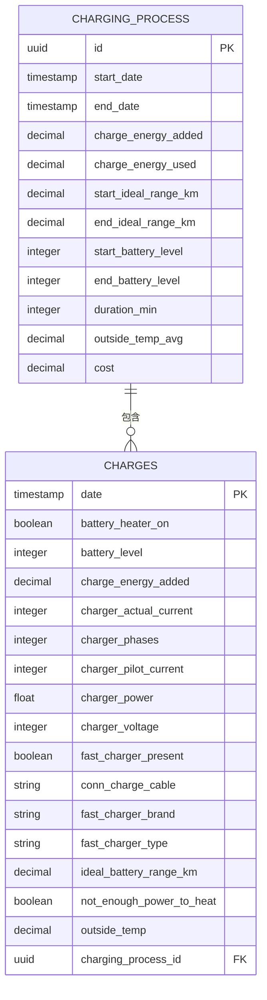
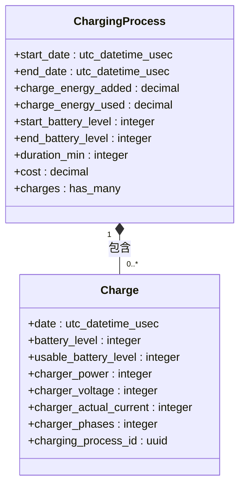
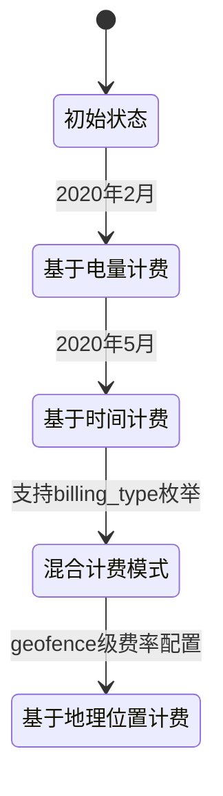
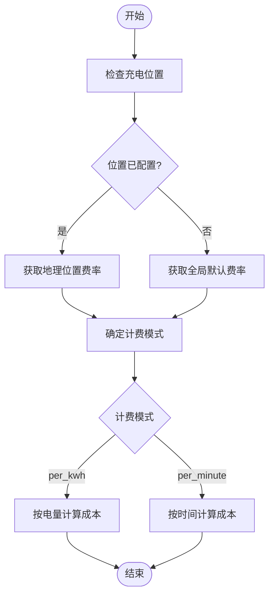

# 充电事件模型

<cite>
**本文档中引用的文件**  
- [20190330200000_create_charges.exs](file://priv/repo/migrations/20190330200000_create_charges.exs)
- [charge.ex](file://lib/teslamate/log/charge.ex)
- [charging_process.ex](file://lib/teslamate/log/charging_process.ex)
- [20200528163852_cost_by_minute.exs](file://priv/repo/migrations/20200528163852_cost_by_minute.exs)
- [20200203180529_location_based_charge_cost.exs](file://priv/repo/migrations/20200203180529_location_based_charge_cost.exs)
- [car_settings.ex](file://lib/teslamate/settings/car_settings.ex)
- [charges.json](file://grafana/dashboards/charges.json)
- [charge-level.json](file://grafana/dashboards/charge-level.json)
</cite>

## 目录
1. [引言](#引言)
2. [充电事件数据模型](#充电事件数据模型)
3. [核心字段说明](#核心字段说明)
4. [充电过程从属关系](#充电过程从属关系)
5. [充电成本计算机制](#充电成本计算机制)
6. [充电设备识别](#充电设备识别)
7. [Grafana查询示例](#grafana查询示例)

## 引言
充电事件（Charge）是TeslaMate系统中用于记录车辆在充电过程中高频采样数据的核心数据模型。每个充电事件代表一次充电过程中的一个时间点采样，包含电池状态、充电功率、电压电流等关键信息。这些数据点共同构成了完整的充电过程分析基础，支持充电曲线生成、效率分析和成本计算等功能。

**Section sources**
- [charge.ex](file://lib/teslamate/log/charge.ex#L1-L68)

## 充电事件数据模型
充电事件模型通过数据库表 `charges` 实现，记录了充电过程中的高频采样数据。该模型与充电过程（charging_process）形成一对多关系，每个充电过程包含多个充电事件。



**Diagram sources**
- [20190330200000_create_charges.exs](file://priv/repo/migrations/20190330200000_create_charges.exs#L1-L27)
- [charge.ex](file://lib/teslamate/log/charge.ex#L7-L30)
- [charging_process.ex](file://lib/teslamate/log/charging_process.ex#L8-L29)

## 核心字段说明
充电事件模型中的核心字段记录了充电过程中的关键参数，这些字段以高频采样方式记录，通常每分钟或更短时间间隔记录一次。

### 电池与充电参数
| 字段名称 | 数据类型 | 记录频率 | 数据来源 |
|---------|--------|---------|---------|
| **date** | utc_datetime_usec | 高频（约每分钟） | 车辆实时数据流 |
| **battery_level** | integer | 高频（约每分钟） | 车辆电池系统 |
| **usable_battery_level** | integer | 高频（约每分钟） | 车辆电池系统 |
| **charger_power** | integer | 高频（约每分钟） | 充电设备 |
| **charger_voltage** | integer | 高频（约每分钟） | 充电设备 |
| **charger_actual_current** | integer | 高频（约每分钟） | 充电设备 |
| **charger_phases** | integer | 高频（约每分钟） | 充电设备 |

**Section sources**
- [charge.ex](file://lib/teslamate/log/charge.ex#L8-L27)

## 充电过程从属关系
充电事件与充电过程之间存在明确的从属关系。充电过程（charging_process）作为聚合根，代表一次完整的充电会话，而充电事件（charge）则是该会话中的各个时间点采样。



**Diagram sources**
- [charging_process.ex](file://lib/teslamate/log/charging_process.ex#L8-L29)
- [charge.ex](file://lib/teslamate/log/charge.ex#L7-L30)

## 充电成本计算机制
TeslaMate系统实现了灵活的充电成本计算机制，支持多种计费模式和基于地理位置的费率配置。

### 计费模式演进
系统通过数据库迁移实现了计费模式的演进：
- **基于电量计费**：按每千瓦时（kWh）计费
- **基于时间计费**：按每分钟计费
- **混合模式**：支持在同一系统中配置不同模式



### 成本计算实现
成本计算基于以下配置实现：
1. **全局电价设置**：通过系统设置配置默认电价
2. **地理位置费率**：通过地理围栏（geofence）配置特定位置的充电费率
3. **计费模式选择**：支持`per_kwh`和`per_minute`两种模式



**Diagram sources**
- [20200528163852_cost_by_minute.exs](file://priv/repo/migrations/20200528163852_cost_by_minute.exs#L1-L24)
- [20200203180529_location_based_charge_cost.exs](file://priv/repo/migrations/20200203180529_location_based_charge_cost.exs#L1-L14)
- [car_settings.ex](file://lib/teslamate/settings/car_settings.ex#L1-L36)

## 充电设备识别
系统通过多个字段识别和记录充电设备的类型和特性，这些信息对于分析充电行为和性能至关重要。

### 设备识别字段
| 字段名称 | 用途说明 |
|---------|---------|
| **conn_charge_cable** | 记录连接的充电线缆类型，区分家用充电器、移动连接器等 |
| **fast_charger_brand** | 记录快速充电设备的品牌，如Tesla、ChargePoint等 |
| **fast_charger_type** | 记录快速充电设备的类型，如Supercharger、CCS等 |

这些字段帮助系统区分不同类型的充电场景：
- **家用充电**：通常使用`conn_charge_cable`字段识别
- **超级充电站**：通过`fast_charger_brand`和`fast_charger_type`识别
- **第三方充电站**：结合多个字段进行识别

**Section sources**
- [charge.ex](file://lib/teslamate/log/charge.ex#L20-L23)

## Grafana查询示例
以下是基于充电事件数据生成充电曲线和分析充电效率的Grafana查询语句示例。

### 充电曲线查询
```sql
SELECT
    date_bin('2 minutes'::interval, timezone('UTC', date), to_timestamp(${__from:date:seconds})) as time,
    avg(battery_level) AS "Battery Level",
    avg(usable_battery_level) AS "Usable Battery Level"
from charges
    WHERE $__timeFilter(date) AND charging_process_id = $charging_process_id
    group by time
    ORDER BY time ASC
```

### 充电效率分析查询
```sql
SELECT 
    c.date as time,
    c.charger_power as "Charging Power",
    c.battery_level as "Battery Level",
    c.charger_voltage as "Voltage",
    c.charger_actual_current as "Actual Current",
    c.charger_phases as "Phases"
FROM charges c
WHERE c.charging_process_id = $charging_process_id
ORDER BY c.date
```

这些查询语句可用于创建充电过程的详细分析仪表板，展示充电功率变化、电池水平增长和充电效率等关键指标。

**Section sources**
- [charge-level.json](file://grafana/dashboards/charge-level.json#L151-L159)
- [charges.json](file://grafana/dashboards/charges.json#L458-L800)