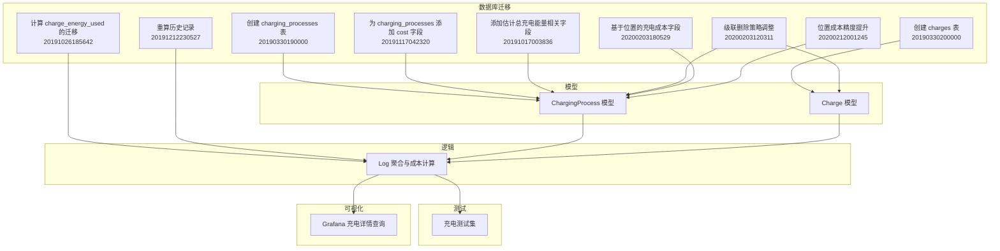
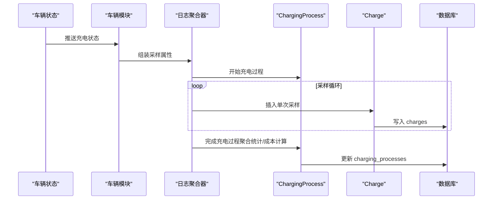
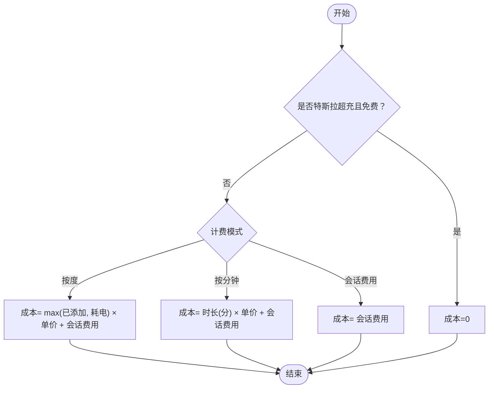
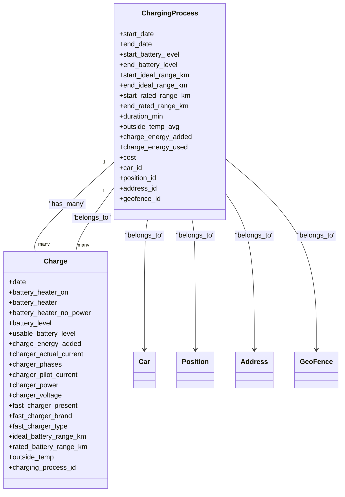

# 充电数据模型

<cite>
**本文引用的文件**
- [charging_processes.exs](file://priv/repo/migrations/20190330190000_create_charging_processes.exs)
- [charges.exs](file://priv/repo/migrations/20190330200000_create_charges.exs)
- [log_charging_test.exs](file://test/teslamate/log/log_charging_test.exs)
- [log.ex](file://lib/teslamate/log.ex)
- [charging_process.ex](file://lib/teslamate/log/charging_process.ex)
- [charge.ex](file://lib/teslamate/log/charge.ex)
- [vehicle.ex](file://lib/teslamate/vehicles/vehicle.ex)
- [repair.ex](file://lib/teslamate/repair.ex)
- [cascade_delete.exs](file://priv/repo/migrations/20200203120311_cascade_delete.exs)
- [location_based_charge_cost.exs](file://priv/repo/migrations/20200203180529_location_based_charge_cost.exs)
- [location_based_charge_cost_increase_scale.exs](file://priv/repo/migrations/20200212001245_location_based_charge_cost_increase_scale.exs)
- [add_cost_field_to_charging_processes.exs](file://priv/repo/migrations/20191117042320_add_cost_field_to_charges.exs)
- [add_est_total_charge_energy.exs](file://priv/repo/migrations/20191017003836_add_est_total_charge_energy.exs)
- [calculate_charge_energy_used.exs](file://priv/repo/migrations/20191026185642_calculate_charge_energy_used.exs)
- [recalc_energy_used.exs](file://priv/repo/migrations/20191212230527_recalc_energy_used.exs)
- [charge_details.json](file://grafana/dashboards/internal/charge-details.json)
- [charge_cost_live_test.exs](file://test/teslamate_web/live/charge_cost_live_test.exs)
- [charge_live_cost.html.heex](file://lib/teslamate_web/live/charge_live/cost.html.heex)
</cite>

## 目录
1. [简介](#简介)
2. [项目结构](#项目结构)
3. [核心组件](#核心组件)
4. [架构总览](#架构总览)
5. [详细组件分析](#详细组件分析)
6. [依赖分析](#依赖分析)
7. [性能考虑](#性能考虑)
8. [故障排查指南](#故障排查指南)
9. [结论](#结论)
10. [附录](#附录)

## 简介
本文件系统性梳理充电数据模型，聚焦 ChargingProcess（充电过程）与 Charge（单次充电采样）两张表的结构、关系与业务规则，覆盖以下主题：
- 关键字段：开始/结束时间、起始/结束电量、起始/结束理想/标定续航、耗时、平均外部温度等
- 成本计算机制：按度（kWh）计费、按分钟计费、会话费用叠加、免费超级充电豁免、基于位置的费率
- 数据完整性校验与异常处理：缺失/负值处理、相数/电压修正、数据间隙与坏连接处理
- 修复不完整充电记录的策略与自动化修复器
- 常用查询模式与性能优化建议（窗口函数、索引、聚合）

## 项目结构
充电相关的核心代码与迁移文件分布如下：
- 数据库迁移：定义 ChargingProcess 与 Charge 表结构及历史演进
- 模型层：Ecto Schema 定义字段与约束
- 逻辑层：日志聚合与成本计算入口
- 测试：覆盖成本计算、相数/电压修正、数据间隙与坏连接场景
- 可视化：Grafana 仪表盘中对充电过程的统计查询

图表来源
- [charging_processes.exs](file://priv/repo/migrations/20190330190000_create_charging_processes.exs#L1-L23)
- [charges.exs](file://priv/repo/migrations/20190330200000_create_charges.exs#L1-L27)
- [add_cost_field_to_charging_processes.exs](file://priv/repo/migrations/20191117042320_add_cost_field_to_charges.exs#L1-L9)
- [add_est_total_charge_energy.exs](file://priv/repo/migrations/20191017003836_add_est_total_charge_energy.exs#L1-L11)
- [calculate_charge_energy_used.exs](file://priv/repo/migrations/20191026185642_calculate_charge_energy_used.exs#L67-L101)
- [recalc_energy_used.exs](file://priv/repo/migrations/20191212230527_recalc_energy_used.exs#L116-L197)
- [cascade_delete.exs](file://priv/repo/migrations/20200203120311_cascade_delete.exs#L1-L95)
- [location_based_charge_cost.exs](file://priv/repo/migrations/20200203180529_location_based_charge_cost.exs#L1-L13)
- [location_based_charge_cost_increase_scale.exs](file://priv/repo/migrations/20200212001245_location_based_charge_cost_increase_scale.exs#L1-L15)
- [charging_process.ex](file://lib/teslamate/log/charging_process.ex#L1-L61)
- [charge.ex](file://lib/teslamate/log/charge.ex#L1-L68)
- [log.ex](file://lib/teslamate/log.ex#L457-L633)
- [charge_details.json](file://grafana/dashboards/internal/charge-details.json#L546-L1903)

章节来源
- [charging_processes.exs](file://priv/repo/migrations/20190330190000_create_charging_processes.exs#L1-L23)
- [charges.exs](file://priv/repo/migrations/20190330200000_create_charges.exs#L1-L27)

## 核心组件
- ChargingProcess（充电过程）
  - 关键字段：开始时间、结束时间、起始/结束理想续航、起始/结束标定续航、起始/结束电池百分比、耗时（分钟）、平均外部温度、累计充电量（已添加）、估算耗电量、成本、外键：车辆、位置、地址、地理围栏
  - 约束：必须有车辆与开始时间；充电量非负
- Charge（单次充电采样）
  - 关键字段：采样时间、电池加热状态、可用电池百分比、本次累计充电量、实际电流、相数、整流电流、功率、电压、快充类型/品牌/在位、理想/标定续航、外部温度等
  - 约束：采样时间、所属充电过程、本次累计充电量、功率、理想续航必填；相数需大于0

章节来源
- [charging_process.ex](file://lib/teslamate/log/charging_process.ex#L1-L61)
- [charge.ex](file://lib/teslamate/log/charge.ex#L1-L68)

## 架构总览
充电数据从车辆状态采集到入库，再由日志聚合器完成过程统计与成本计算，并通过可视化工具展示。

图表来源
- [vehicle.ex](file://lib/teslamate/vehicles/vehicle.ex#L1370-L1392)
- [log.ex](file://lib/teslamate/log.ex#L457-L589)
- [charging_process.ex](file://lib/teslamate/log/charging_process.ex#L1-L61)
- [charge.ex](file://lib/teslamate/log/charge.ex#L1-L68)

## 详细组件分析

### 表结构与字段语义
- ChargingProcess
  - 时间维度：start_date（开始）、end_date（结束）
  - 电量维度：start_battery_level、end_battery_level
  - 续航维度：start_ideal_range_km、end_ideal_range_km、start_rated_range_km、end_rated_range_km
  - 能量维度：charge_energy_added（累计已添加）、charge_energy_used（估算耗电）
  - 过程指标：duration_min（分钟）、outside_temp_avg（平均外部温度）
  - 成本：cost（总成本）
  - 外键：car_id、position_id、address_id、geofence_id
- Charge
  - 采样时间：date
  - 电气参数：charger_actual_current、charger_phases、charger_pilot_current、charger_power、charger_voltage
  - 车辆状态：battery_heater_on/battery_heater/battery_heater_no_power、usable_battery_level、battery_level
  - 续航：ideal_battery_range_km、rated_battery_range_km
  - 设备：fast_charger_present、fast_charger_brand、fast_charger_type、conn_charge_cable
  - 环境：outside_temp

章节来源
- [charging_processes.exs](file://priv/repo/migrations/20190330190000_create_charging_processes.exs#L1-L23)
- [charges.exs](file://priv/repo/migrations/20190330200000_create_charges.exs#L1-L27)
- [charging_process.ex](file://lib/teslamate/log/charging_process.ex#L1-L61)
- [charge.ex](file://lib/teslamate/log/charge.ex#L1-L68)

### 充电过程开始/结束与采样记录
- 开始：调用日志接口启动充电过程，写入 ChargingProcess 的 start_date 与位置信息
- 采样：周期性将车辆状态转换为 Charge 记录，按时间顺序插入
- 结束：完成充电过程时，聚合 Charge 表中的首尾采样，计算 start/end_ideal/rated_range、start/end_battery_level、duration_min、charge_energy_added、charge_energy_used，并根据位置与计费策略计算 cost

章节来源
- [log.ex](file://lib/teslamate/log.ex#L457-L589)
- [log_charging_test.exs](file://test/teslamate/log/log_charging_test.exs#L764-L805)

### 成本计算机制
支持三种计费模式，优先级与组合如下：
- 免费超级充电：若使用特斯拉超充且车辆设置为免费，则成本为0
- 按度（kWh）计费：取“已添加”或“耗电”两者最大值乘以位置费率，可叠加会话费用
- 按分钟计费：耗时（分钟）乘以位置费率，可叠加会话费用
- 会话费用：固定金额叠加
- 负值/零值：允许负的单位费率与零成本场景

图表来源
- [log.ex](file://lib/teslamate/log.ex#L582-L633)
- [location_based_charge_cost.exs](file://priv/repo/migrations/20200203180529_location_based_charge_cost.exs#L1-L13)
- [location_based_charge_cost_increase_scale.exs](file://priv/repo/migrations/20200212001245_location_based_charge_cost_increase_scale.exs#L1-L15)
- [charge_cost_live_test.exs](file://test/teslamate_web/live/charge_cost_live_test.exs#L185-L264)

章节来源
- [log.ex](file://lib/teslamate/log.ex#L582-L633)
- [location_based_charge_cost.exs](file://priv/repo/migrations/20200203180529_location_based_charge_cost.exs#L1-L13)
- [location_based_charge_cost_increase_scale.exs](file://priv/repo/migrations/20200212001245_location_based_charge_cost_increase_scale.exs#L1-L15)
- [charge_cost_live_test.exs](file://test/teslamate_web/live/charge_cost_live_test.exs#L185-L264)

### 与车辆状态、位置数据的关联
- 位置关联：ChargingProcess 通过 position_id 与位置表关联；当地址缺失时，可通过 Repair 自动回填 address_id
- 地理围栏：ChargingProcess 通过 geofence_id 与围栏关联，用于决定计费模式与单价
- 车辆：ChargingProcess 通过 car_id 与车辆关联，免费超级充电豁免依赖车辆设置

章节来源
- [charging_process.ex](file://lib/teslamate/log/charging_process.ex#L1-L61)
- [repair.ex](file://lib/teslamate/repair.ex#L1-L153)

### 数据完整性校验与异常处理
- 字段校验：Charge 的 date、charging_process_id、charge_energy_added、charger_power、ideal_battery_range_km 必填；charger_phases > 0
- 负值处理：charge_energy_added 为负或空时，聚合阶段会置空，避免错误累计
- 相数/电压修正：通过窗口函数统计相数与电压，自动修正 1/3 相与 127/220V 的差异
- 数据间隙与坏连接：容忍采样间隔波动与部分缺失，仍能正确计算耗电与耗时
- 历史修复：迁移脚本与 Repair 服务可回填地址、重算耗电与结束时间

章节来源
- [charge.ex](file://lib/teslamate/log/charge.ex#L1-L68)
- [log.ex](file://lib/teslamate/log.ex#L536-L589)
- [log_charging_test.exs](file://test/teslamate/log/log_charging_test.exs#L837-L897)
- [calculate_charge_energy_used.exs](file://priv/repo/migrations/20191026185642_calculate_charge_energy_used.exs#L67-L101)
- [recalc_energy_used.exs](file://priv/repo/migrations/20191212230527_recalc_energy_used.exs#L116-L197)

### 修复不完整充电记录
- 自动修复器：定期扫描未填充 address_id 的 ChargingProcess，基于 position 调用地理编码回填地址
- 迁移修复：历史数据迁移中批量重算 charge_energy_used 并补全 end_date

章节来源
- [repair.ex](file://lib/teslamate/repair.ex#L1-L153)
- [recalc_energy_used.exs](file://priv/repo/migrations/20191212230527_recalc_energy_used.exs#L116-L197)

### 常用查询模式与性能优化
- 计算耗电（charge_energy_used）：使用窗口函数 lag 计算相邻采样间的时间差，结合功率/相数/电压推导瞬时耗电并求和
- 计算相数：通过 avg(charger_power / (charger_actual_current × charger_voltage)) 估算相数，结合 count 判定稳定性
- Grafana 查询：使用窗口函数与跨表聚合，计算单次充电的开始/结束时间差作为时长
- 性能建议：
  - 对 charging_processes 的 car_id、start_date 建立复合索引（参考迁移中索引相关变更）
  - 对 charges 的 charging_process_id、date 建立复合索引，加速窗口函数与聚合
  - 使用物化视图或预聚合表缓存高频统计（如每日/每车汇总）
  - 合理分页与限制扫描范围，避免全表扫描

章节来源
- [log.ex](file://lib/teslamate/log.ex#L517-L589)
- [charge_details.json](file://grafana/dashboards/internal/charge-details.json#L546-L1903)

## 依赖分析
- 外键与级联删除：ChargingProcess 与 Car、Position、Address、GeoFence 的外键约束；Charges 与 ChargingProcess 的外键约束；迁移中统一调整为合适的 on_delete 策略
- 模型依赖：ChargingProcess.has_many Charge；Charge.belongs_to ChargingProcess
- 位置与计费：ChargingProcess 与 GeoFence 关联，决定计费模式与单价

图表来源
- [charging_process.ex](file://lib/teslamate/log/charging_process.ex#L1-L61)
- [charge.ex](file://lib/teslamate/log/charge.ex#L1-L68)
- [cascade_delete.exs](file://priv/repo/migrations/20200203120311_cascade_delete.exs#L1-L95)

章节来源
- [charging_process.ex](file://lib/teslamate/log/charging_process.ex#L1-L61)
- [charge.ex](file://lib/teslamate/log/charge.ex#L1-L68)
- [cascade_delete.exs](file://priv/repo/migrations/20200203120311_cascade_delete.exs#L1-L95)

## 性能考虑
- 窗口函数与聚合：在大表上使用窗口函数（lag、first_value、last_value、avg）时，确保对 charging_process_id 与 date 建立合适索引
- 分区与物化：对高频统计（如按天/按车）建立物化视图或预聚合表，减少实时计算开销
- 批量修复：Repair 服务限制每次扫描数量，避免一次性扫描全部历史记录造成压力
- 可视化查询：Grafana 中的 SQL 查询应尽量利用索引与子查询，避免全表扫描

## 故障排查指南
- 充电过程未结束：检查是否存在 end_date 为空的历史记录，必要时触发重算或手动补全
- 成本异常为负/零：确认计费模式、单价是否为负、是否启用免费超级充电
- 相数/电压异常导致耗电偏差：查看相数修正日志与电压修正提示，确认采样质量
- 地址缺失：使用 Repair 服务回填 address_id，或手动在界面编辑位置

章节来源
- [repair.ex](file://lib/teslamate/repair.ex#L1-L153)
- [log.ex](file://lib/teslamate/log.ex#L536-L589)
- [charge_cost_live_test.exs](file://test/teslamate_web/live/charge_cost_live_test.exs#L185-L264)

## 结论
该充电数据模型以 ChargingProcess 为核心，围绕 Charge 采样进行聚合统计与成本计算，具备完善的字段语义、约束与异常处理机制。通过相数/电压修正、历史重算与 Repair 自动化修复，保证了数据质量与一致性。配合合理的索引与物化视图，可在大规模数据下保持良好的查询性能。

## 附录
- 关键字段对照与含义
  - ChargingProcess：start_date、end_date、start/end_battery_level、start/end_ideal/rated_range_km、duration_min、outside_temp_avg、charge_energy_added、charge_energy_used、cost、car_id、position_id、address_id、geofence_id
  - Charge：date、battery_heater_on/battery_heater/battery_heater_no_power、battery_level、usable_battery_level、charge_energy_added、charger_actual_current、charger_phases、charger_pilot_current、charger_power、charger_voltage、fast_charger_present/brand/type、ideal/rated_battery_range_km、outside_temp
- 常见问题定位
  - 成本为0：检查是否为免费超级充电
  - 成本为负：检查单价是否为负
  - 耗电为nil：检查相数/电压修正与采样完整性