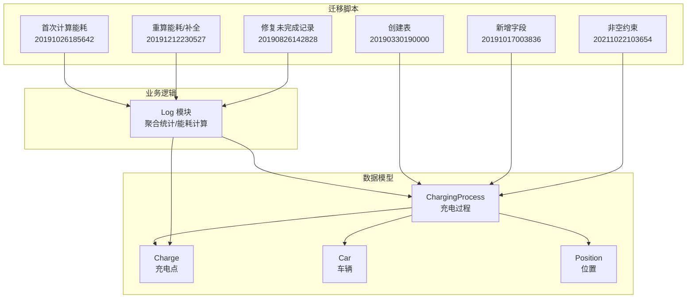
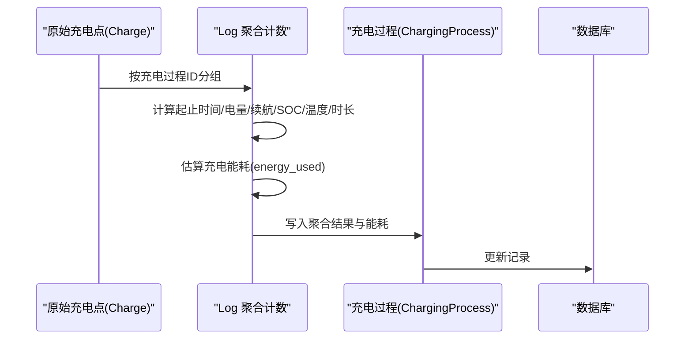
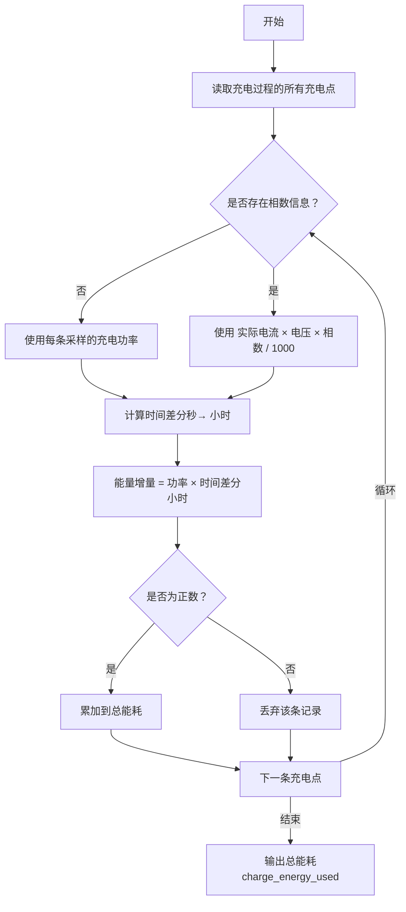
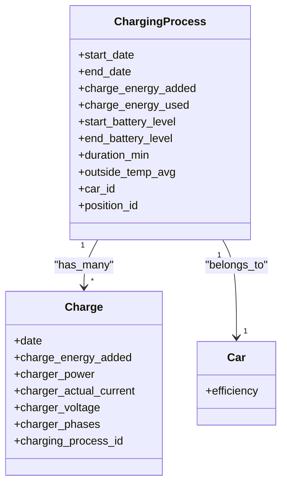

# 充电过程模型

<cite>
**本文引用的文件**
- [charging_processes.exs](file://priv/repo/migrations/20190330190000_create_charging_processes.exs)
- [charging_process.ex](file://lib/teslamate/log/charging_process.ex)
- [log.ex](file://lib/teslamate/log.ex)
- [charge.ex](file://lib/teslamate/log/charge.ex)
- [car.ex](file://lib/teslamate/log/car.ex)
- [add_est_total_charge_energy.exs](file://priv/repo/migrations/20191017003836_add_est_total_charge_energy.exs)
- [calculate_charge_energy_used.exs](file://priv/repo/migrations/20191026185642_calculate_charge_energy_used.exs)
- [recalc_energy_used.exs](file://priv/repo/migrations/20191212230527_recalc_energy_used.exs)
- [fix_incomplete_charging_processes_v3.exs](file://priv/repo/migrations/20190826142828_fix_incomplete_charging_processes_v3.exs)
- [add_not_null_constraint_to_start_date.exs](file://priv/repo/migrations/20211022103654_add_not_null_constraint_to_start_date.exs)
- [log_charging_test.exs](file://test/teslamate/log/log_charging_test.exs)
- [charge-details.json](file://grafana/dashboards/internal/charge-details.json)
</cite>

## 目录
1. [简介](#简介)
2. [项目结构](#项目结构)
3. [核心组件](#核心组件)
4. [架构总览](#架构总览)
5. [详细组件分析](#详细组件分析)
6. [依赖关系分析](#依赖关系分析)
7. [性能考量](#性能考量)
8. [故障排查指南](#故障排查指南)
9. [结论](#结论)
10. [附录：常用SQL查询示例](#附录常用sql查询示例)

## 简介
本文件系统性梳理“充电过程（ChargingProcess）”作为充电会话顶层聚合根的数据模型与处理流程，重点解释以下内容：
- 字段语义与计算方式：start_date、end_date、start_soc、end_soc、charge_energy_added、charge_energy_used
- 充电能耗（charge_energy_used）与充电电量（charge_energy_added）的区别及计算逻辑
- 基于充电功率与时间间隔的估算方法
- 与车辆（car_id）和位置（position_id）的外键关联
- 完整性校验机制与数据库迁移修复策略
- 分析充电效率与能耗的常用SQL查询思路

## 项目结构
围绕充电过程模型的关键代码与迁移文件分布如下：
- 数据模型定义：Ecto Schema 与 Changeset
- 计算逻辑：聚合统计与能耗估算
- 迁移脚本：字段演进、能耗计算、完整性修复
- 测试用例：覆盖能耗估算、相位修正、电压修正、效率因子更新
- 可视化：Grafana 查询示例展示时长计算思路

图表来源
- [charging_process.ex](file://lib/teslamate/log/charging_process.ex#L1-L61)
- [charge.ex](file://lib/teslamate/log/charge.ex#L29-L67)
- [log.ex](file://lib/teslamate/log.ex#L457-L589)
- [add_est_total_charge_energy.exs](file://priv/repo/migrations/20191017003836_add_est_total_charge_energy.exs#L1-L11)
- [calculate_charge_energy_used.exs](file://priv/repo/migrations/20191026185642_calculate_charge_energy_used.exs#L67-L101)
- [recalc_energy_used.exs](file://priv/repo/migrations/20191212230527_recalc_energy_used.exs#L116-L197)
- [fix_incomplete_charging_processes_v3.exs](file://priv/repo/migrations/20190826142828_fix_incomplete_charging_processes_v3.exs#L1-L37)
- [add_not_null_constraint_to_start_date.exs](file://priv/repo/migrations/20211022103654_add_not_null_constraint_to_start_date.exs#L1-L15)

章节来源
- [charging_process.ex](file://lib/teslamate/log/charging_process.ex#L1-L61)
- [charging_processes.exs](file://priv/repo/migrations/20190330190000_create_charging_processes.exs#L1-L23)

## 核心组件
- 充电过程（ChargingProcess）
  - 聚合根：承载一次完整充电会话的元数据与派生指标
  - 关键字段：开始/结束时间、起止SOC、起止理想/标定续航、起止电池等级、平均外部温度、持续分钟数、费用、能耗估算等
  - 外键关联：属于某辆车（car_id），位于某个位置（position_id），可关联地址与地理围栏
  - 关联实体：包含多个充电点（Charge），用于统计与能耗估算
- 充电点（Charge）
  - 记录每条采样时刻的充电状态，包含功率、电流、电压、相数、电量增量等
  - 与充电过程（ChargingProcess）多对一关联
- 车辆（Car）
  - 维护效率因子（efficiency），由完成的充电过程重新计算得出
- 日志模块（Log）
  - 聚合统计：按窗口函数计算起止时间、起止续航、起止SOC、平均温度、电量增量、时长等
  - 能耗估算：基于功率/电流电压与时间差分积分估算充电能耗（charge_energy_used）

章节来源
- [charging_process.ex](file://lib/teslamate/log/charging_process.ex#L1-L61)
- [charge.ex](file://lib/teslamate/log/charge.ex#L29-L67)
- [car.ex](file://lib/teslamate/log/car.ex#L1-L55)
- [log.ex](file://lib/teslamate/log.ex#L457-L589)

## 架构总览
充电过程从原始充电点（Charge）中提取统计与能耗估算，最终写回到充电过程（ChargingProcess）。迁移脚本负责字段演进与历史数据修复。

图表来源
- [log.ex](file://lib/teslamate/log.ex#L457-L589)
- [charge.ex](file://lib/teslamate/log/charge.ex#L29-L67)
- [charging_process.ex](file://lib/teslamate/log/charging_process.ex#L1-L61)

## 详细组件分析

### 字段语义与计算方式
- start_date
  - 含义：本次充电过程的开始时间（UTC 微秒精度）
  - 约束：迁移脚本将其设为非空
- end_date
  - 含义：本次充电过程的结束时间（UTC 微秒精度）
  - 完整性：未完成记录在迁移脚本中通过扫描最后一条充电点时间进行补全
- start_soc / end_soc
  - 含义：起止电池百分比（SOC）
  - 注意：模型中存在 start_soc/end_soc 字段，但实际聚合统计使用的是起止电池等级（start_battery_level/end_battery_level）
- charge_energy_added
  - 含义：本次充电过程中累计“电池电量增量”
  - 计算：通过窗口函数取首尾两条充电点的电量累计值之差；若尾值为0则回退到最大值
- charge_energy_used
  - 含义：本次充电过程中“实际消耗的电能”（估算）
  - 计算：基于功率/电流电压与相邻采样时间差分积分求和，过滤负值与异常值

章节来源
- [charging_process.ex](file://lib/teslamate/log/charging_process.ex#L1-L61)
- [charging_processes.exs](file://priv/repo/migrations/20190330190000_create_charging_processes.exs#L1-L23)
- [add_not_null_constraint_to_start_date.exs](file://priv/repo/migrations/20211022103654_add_not_null_constraint_to_start_date.exs#L1-L15)
- [log.ex](file://lib/teslamate/log.ex#L457-L509)
- [log_charging_test.exs](file://test/teslamate/log/log_charging_test.exs#L267-L285)

### 充电能耗（charge_energy_used）与充电电量（charge_energy_added）的区别与计算
- 区别
  - charge_energy_added：反映电池侧“电量增量”，通常来自车载计数器或API返回
  - charge_energy_used：反映“实际输入到充电系统的电能”，通过功率与时间差分估算
- 计算逻辑
  - 若无相数信息：直接以每条采样的“充电功率”乘以时间差分（小时）累加
  - 若有相数信息：以“实际电流 × 电压 × 相数 / 1000”乘以时间差分（小时）累加
  - 时间差分：使用窗口函数 lag 获取相邻采样时间差（秒），转换为小时
  - 过滤：仅累加非负值，避免异常波动导致误差
  - 相位/电压修正：当相数与功率/电流/电压关系不一致时，进行相位修正或电压修正，提升估算精度
- 重要说明
  - 电量增量（charge_energy_added）可能因数据源或传输问题出现负值或零值，系统会在聚合阶段进行保护性处理
  - 能耗估算（charge_energy_used）是基于实时采样与物理公式推导，更贴近真实用电成本

图表来源
- [log.ex](file://lib/teslamate/log.ex#L517-L589)
- [calculate_charge_energy_used.exs](file://priv/repo/migrations/20191026185642_calculate_charge_energy_used.exs#L67-L101)
- [recalc_energy_used.exs](file://priv/repo/migrations/20191212230527_recalc_energy_used.exs#L155-L197)

章节来源
- [log.ex](file://lib/teslamate/log.ex#L517-L589)
- [log_charging_test.exs](file://test/teslamate/log/log_charging_test.exs#L807-L860)

### 外键关联关系
- 充电过程（ChargingProcess）
  - belongs_to :car, Car
  - belongs_to :position, Position
  - belongs_to :address, Address
  - belongs_to :geofence, GeoFence
  - has_many :charges, Charge
- 充电点（Charge）
  - belongs_to :charging_process, ChargingProcess
- 车辆（Car）
  - has_many :charging_processes, ChargingProcess

章节来源
- [charging_process.ex](file://lib/teslamate/log/charging_process.ex#L1-L61)
- [charge.ex](file://lib/teslamate/log/charge.ex#L29-L67)
- [car.ex](file://lib/teslamate/log/car.ex#L1-L55)

### 完整性校验机制与迁移修复
- 非空约束
  - start_date 在迁移脚本中被强制设为非空，确保聚合统计与后续流程的稳定性
- 未完成记录修复
  - 迁移脚本提供修复模板：扫描所有未结束的充电过程，依据最后一条充电点时间补全 end_date
  - 该脚本当前为注释状态，便于按需启用
- 历史能耗重算
  - 迁移脚本在不同版本中逐步引入能耗字段并进行首次/重算
  - 通过聚合统计与能耗估算逻辑，批量更新历史记录

章节来源
- [add_not_null_constraint_to_start_date.exs](file://priv/repo/migrations/20211022103654_add_not_null_constraint_to_start_date.exs#L1-L15)
- [fix_incomplete_charging_processes_v3.exs](file://priv/repo/migrations/20190826142828_fix_incomplete_charging_processes_v3.exs#L1-L37)
- [add_est_total_charge_energy.exs](file://priv/repo/migrations/20191017003836_add_est_total_charge_energy.exs#L1-L11)
- [calculate_charge_energy_used.exs](file://priv/repo/migrations/20191026185642_calculate_charge_energy_used.exs#L67-L101)
- [recalc_energy_used.exs](file://priv/repo/migrations/20191212230527_recalc_energy_used.exs#L116-L197)

### 效率因子与能耗分析
- 效率因子（efficiency）
  - 来源于完成的充电过程，系统根据多条记录估算得出
  - 测试覆盖了多种场景下的效率估计，包括不足两笔记录时的处理
- 能耗分析
  - 通过测试验证了能耗估算的正确性，并覆盖相位修正与电压修正场景
  - Grafana 中的查询展示了如何基于充电过程的起止时间计算时长

章节来源
- [log_charging_test.exs](file://test/teslamate/log/log_charging_test.exs#L607-L725)
- [charge-details.json](file://grafana/dashboards/internal/charge-details.json#L565-L568)

## 依赖关系分析
- 充电过程依赖充电点（Charge）进行统计与能耗估算
- 日志模块（Log）承担聚合与能耗计算职责
- 迁移脚本贯穿字段演进、能耗计算与完整性修复
- 车辆（Car）的效率因子由充电过程完成后的再计算更新

图表来源
- [charging_process.ex](file://lib/teslamate/log/charging_process.ex#L1-L61)
- [charge.ex](file://lib/teslamate/log/charge.ex#L29-L67)
- [car.ex](file://lib/teslamate/log/car.ex#L1-L55)

章节来源
- [charging_process.ex](file://lib/teslamate/log/charging_process.ex#L1-L61)
- [charge.ex](file://lib/teslamate/log/charge.ex#L29-L67)
- [car.ex](file://lib/teslamate/log/car.ex#L1-L55)

## 性能考量
- 窗口函数与时间序列
  - 使用窗口函数（first_value/last_value/avg/lag）进行时间序列聚合，建议在充电点表上建立合适的索引以优化排序与窗口扫描
- 能耗估算复杂度
  - 对每个充电过程遍历其充电点，时间复杂度近似 O(n)，其中 n 为该过程的采样点数
  - 相位/电压修正涉及少量统计计算，整体仍为线性
- 批量重算
  - 历史重算应分批执行，避免长时间锁表与高负载

[本节为通用指导，无需列出具体文件来源]

## 故障排查指南
- 充电过程未结束
  - 现象：end_date 为空
  - 处理：参考迁移脚本中的修复模板，扫描最后一条充电点时间并补全
- 能耗估算为 NULL 或异常
  - 现象：charge_energy_used 为 NULL 或明显偏大/偏小
  - 排查：检查相数/电压/电流是否缺失或异常；确认时间差分是否为正值；核对过滤条件（仅累加非负值）
- 电量增量为负或为 0
  - 现象：charge_energy_added 为负或 0
  - 处理：聚合阶段已做保护性处理，回退到最大值或置空，必要时人工核查数据源
- 效率因子未更新
  - 现象：Car.efficiency 保持为 NULL
  - 排查：确认已完成至少两条有效充电过程；检查日志模块的效率重算逻辑是否正常执行

章节来源
- [fix_incomplete_charging_processes_v3.exs](file://priv/repo/migrations/20190826142828_fix_incomplete_charging_processes_v3.exs#L1-L37)
- [log.ex](file://lib/teslamate/log.ex#L457-L509)
- [log_charging_test.exs](file://test/teslamate/log/log_charging_test.exs#L267-L285)

## 结论
充电过程（ChargingProcess）作为充电会话的顶层聚合根，通过充电点（Charge）提供的实时功率/电流/电压与时间序列，结合窗口函数与相位/电压修正策略，实现了对“电量增量”与“实际能耗”的双维度度量。迁移脚本保障了字段演进与历史数据的完整性，测试用例覆盖了关键边界场景。配合日志模块的聚合与重算逻辑，系统能够稳定地产出可用于效率分析与能耗评估的高质量数据。

[本节为总结性内容，无需列出具体文件来源]

## 附录：常用SQL查询示例
以下示例基于仓库中的Grafana查询与聚合逻辑整理，帮助理解如何从数据库层面分析充电过程的时长、能耗与效率。

- 计算单次充电时长（秒）
  - 思路：起始时间为第一条充电点时间，结束时间为最后一条充电点时间，二者差即为时长
  - 示例路径：[charge-details.json](file://grafana/dashboards/internal/charge-details.json#L565-L568)
- 计算单次充电时长（分钟）
  - 思路：将起止时间差转换为分钟数
  - 示例路径：[log.ex](file://lib/teslamate/log.ex#L477-L479)
- 计算充电能耗（kWh）
  - 思路：对每条采样点的能量增量（功率×时间差分）求和，过滤负值
  - 示例路径：[log.ex](file://lib/teslamate/log.ex#L517-L589)
- 计算充电效率因子（估算）
  - 思路：基于多条充电过程的起止续航与电量增量估算效率，测试覆盖了不同样本规模
  - 示例路径：[log_charging_test.exs](file://test/teslamate/log/log_charging_test.exs#L607-L725)

章节来源
- [charge-details.json](file://grafana/dashboards/internal/charge-details.json#L565-L568)
- [log.ex](file://lib/teslamate/log.ex#L477-L479)
- [log.ex](file://lib/teslamate/log.ex#L517-L589)
- [log_charging_test.exs](file://test/teslamate/log/log_charging_test.exs#L607-L725)