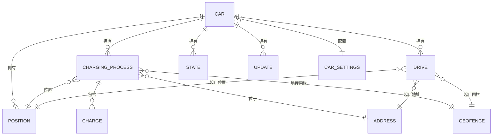
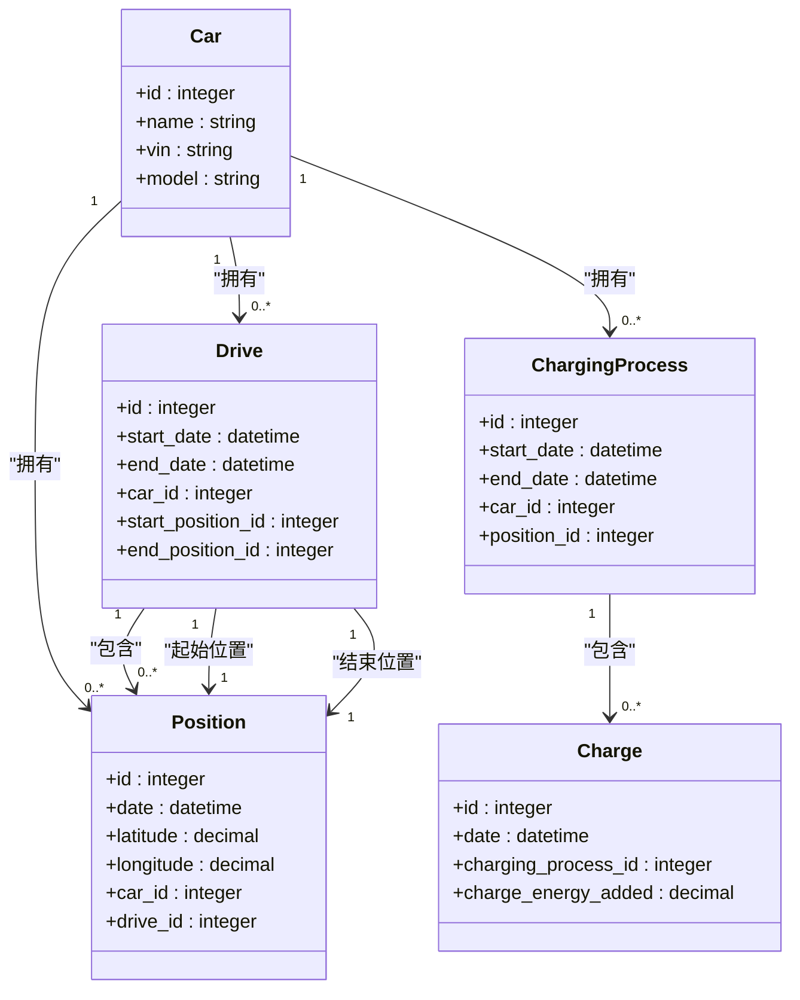
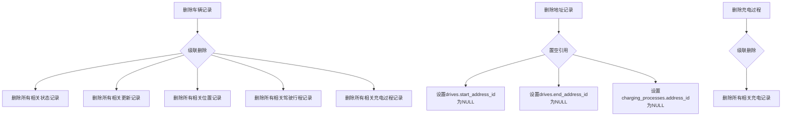

# 外键约束与引用完整性

<cite>
**本文档中引用的文件**  
- [cascade_delete.exs](file://priv/repo/migrations/20200203120311_cascade_delete.exs)
- [create_car.exs](file://priv/repo/migrations/20190330150000_create_car.exs)
- [create_positions.exs](file://priv/repo/migrations/20190330170000_create_positions.exs)
- [create_charging_processes.exs](file://priv/repo/migrations/20190330190000_create_charging_processes.exs)
- [create_charges.exs](file://priv/repo/migrations/20190330200000_create_charges.exs)
- [add_fkey_indexes.exs](file://priv/repo/migrations/20190717184003_add_fkey_indexes.exs)
- [add_geofence_id_to_addresses.exs](file://priv/repo/migrations/20190925182253_add_geofence_id_to_addresses.exs)
- [car.ex](file://lib/teslamate/log/car.ex)
- [drive.ex](file://lib/teslamate/log/drive.ex)
- [charge.ex](file://lib/teslamate/log/charge.ex)
- [position.ex](file://lib/teslamate/log/position.ex)
- [charging_process.ex](file://lib/teslamate/log/charging_process.ex)
- [car_settings.ex](file://lib/teslamate/settings/car_settings.ex)
</cite>

## 目录
1. [引言](#引言)
2. [外键约束设计原则](#外键约束设计原则)
3. [核心外键关系分析](#核心外键关系分析)
4. [级联删除策略](#级联删除策略)
5. [数据完整性保障机制](#数据完整性保障机制)
6. [数据修复与迁移注意事项](#数据修复与迁移注意事项)
7. [结论](#结论)

## 引言
TeslaMate系统通过精心设计的外键约束确保车辆数据的完整性和一致性。本系统采用关系型数据库模式来跟踪车辆状态、充电过程、驾驶行程和位置信息，通过外键引用建立实体间的关联关系。本文详细说明数据库中外键约束的设计原则、实现方式及其在保障数据一致性方面的作用。

**Section sources**
- [car.ex](file://lib/teslamate/log/car.ex#L1-L54)
- [drive.ex](file://lib/teslamate/log/drive.ex#L1-L79)

## 外键约束设计原则
TeslaMate数据库遵循严格的外键约束设计原则，确保所有相关数据表之间的引用完整性。系统采用Ecto框架进行数据库迁移和模式定义，通过`references`函数建立外键关系，并在多个迁移文件中逐步完善约束机制。

核心设计原则包括：
- 所有与车辆相关的实体（如位置、充电过程、驾驶行程）都必须关联到有效的车辆记录
- 采用适当的级联操作策略，确保删除父记录时子记录得到正确处理
- 为外键字段创建索引以提高查询性能
- 在应用层和数据库层双重验证外键约束

**Diagram sources**
- [create_car.exs](file://priv/repo/migrations/20190330150000_create_car.exs#L1-L18)
- [create_positions.exs](file://priv/repo/migrations/20190330170000_create_positions.exs#L1-L28)
- [create_charging_processes.exs](file://priv/repo/migrations/20190330190000_create_charging_processes.exs#L1-L23)

**Section sources**
- [cascade_delete.exs](file://priv/repo/migrations/20200203120311_cascade_delete.exs#L1-L94)
- [add_fkey_indexes.exs](file://priv/repo/migrations/20190717184003_add_fkey_indexes.exs#L1-L23)

## 核心外键关系分析
系统中存在多个关键的外键关系，这些关系构成了数据模型的基础结构。

### Car.id作为多个表的外键
车辆表（cars）的主键被多个相关表引用，形成以车辆为中心的数据结构：
- 位置表（positions）通过`car_id`外键关联到车辆
- 充电过程表（charging_processes）通过`car_id`外键关联到车辆
- 驾驶行程表（drives）通过`car_id`外键关联到车辆
- 状态表（states）通过`car_id`外键关联到车辆
- 更新表（updates）通过`car_id`外键关联到车辆

这种设计确保了所有车辆活动数据都能追溯到具体的车辆实例。

### Position.id在Drive中的引用
驾驶行程表（drives）通过两个外键字段引用位置表：
- `start_position_id`：指向行程开始时的位置记录
- `end_position_id`：指向行程结束时的位置记录

这两个外键允许系统精确记录每次驾驶的起止位置信息，并通过`nilify_all`级联策略处理位置记录删除的情况。

### ChargingProcess.id与Charge的关联
充电过程表（charging_processes）与其相关的充电记录（charges）之间存在一对多关系：
- 充电记录表通过`charging_process_id`外键关联到充电过程
- 每个充电过程可以包含多个充电记录（如充电过程中的周期性数据点）
- 采用`delete_all`级联删除策略，确保删除充电过程时相关充电记录也被清除

**Diagram sources**
- [drive.ex](file://lib/teslamate/log/drive.ex#L1-L79)
- [position.ex](file://lib/teslamate/log/position.ex#L1-L79)
- [charge.ex](file://lib/teslamate/log/charge.ex#L1-L68)

**Section sources**
- [create_charges.exs](file://priv/repo/migrations/20190330200000_create_charges.exs#L1-L27)
- [create_positions.exs](file://priv/repo/migrations/20190330170000_create_positions.exs#L1-L28)

## 级联删除策略
系统采用不同的级联删除策略来处理不同类型的外键关系，确保数据一致性和完整性。

### CASCADE DELETE应用场景
级联删除（`delete_all`）策略应用于强关联关系：
- 当删除车辆记录时，所有相关的状态、更新、位置、驾驶行程和充电过程记录都将被自动删除
- 当删除充电过程时，所有相关的充电记录将被自动删除
- 这种策略适用于"整体-部分"关系，其中子实体不能独立于父实体存在

### NILIFY ALL应用场景
置空级联（`nilify_all`）策略应用于弱关联关系：
- 当删除地址或地理围栏记录时，相关引用字段被设置为NULL而不是删除整个记录
- 当删除位置记录时，驾驶行程中的起止位置引用被设置为NULL
- 这种策略保留了历史记录的完整性，同时允许引用实体的独立管理

**Diagram sources**
- [cascade_delete.exs](file://priv/repo/migrations/20200203120311_cascade_delete.exs#L1-L94)
- [add_geofence_id_to_addresses.exs](file://priv/repo/migrations/20190925182253_add_geofence_id_to_addresses.exs#L1-L151)

**Section sources**
- [cascade_delete.exs](file://priv/repo/migrations/20200203120311_cascade_delete.exs#L1-L94)

## 数据完整性保障机制
系统通过多层次的机制保障数据完整性。

### 外键约束实现机制
外键约束通过数据库迁移文件中的`references`函数实现：
- 在创建表时定义外键关系
- 通过`alter table`修改现有外键的级联行为
- 使用`drop(constraint)`先删除现有约束，再创建新的约束

例如，在`cascade_delete.exs`迁移文件中，系统修改了多个表的外键约束，统一了级联删除行为。

### 索引优化
为提高外键查询性能，系统为所有外键字段创建了数据库索引：
- 在`add_fkey_indexes.exs`迁移文件中为多个外键字段创建索引
- 索引覆盖了主要的查询路径，如按车辆ID查询位置、充电过程等
- 这些索引显著提高了关联查询的性能

### 应用层验证
除了数据库层的约束，系统还在应用层进行了验证：
- 在Ecto Changeset中使用`foreign_key_constraint`进行外键验证
- 在`changeset`函数中验证外键字段的必要性
- 提供清晰的错误信息帮助调试外键约束违规

**Section sources**
- [add_fkey_indexes.exs](file://priv/repo/migrations/20190717184003_add_fkey_indexes.exs#L1-L23)
- [car.ex](file://lib/teslamate/log/car.ex#L1-L54)
- [drive.ex](file://lib/teslamate/log/drive.ex#L1-L79)

## 数据修复与迁移注意事项
在进行数据修复和迁移时，需要特别注意外键约束的影响。

### 迁移过程中的约束处理
数据库迁移文件展示了处理外键约束的最佳实践：
- 使用`flush()`确保DDL操作完成后再执行后续操作
- 先删除现有约束，再创建新的约束
- 在修改外键约束时考虑数据完整性

例如，`cascade_delete.exs`文件中展示了如何安全地修改外键的级联行为。

### 数据修复策略
当需要修复数据时，应遵循以下原则：
- 先禁用相关约束，修复数据后再重新启用
- 按正确的顺序删除或更新记录，避免违反外键约束
- 使用事务确保修复操作的原子性

### 迁移文件分析
以`add_geofence_id_to_addresses.exs`迁移为例，该文件展示了复杂的数据结构变更：
- 添加新的外键字段`geofence_id`到地址表
- 移除旧的反向引用
- 在事务中批量更新数据以建立新的关联
- 提供完整的`down`函数以支持迁移回滚

这种设计确保了数据迁移的安全性和可逆性。

**Section sources**
- [cascade_delete.exs](file://priv/repo/migrations/20200203120311_cascade_delete.exs#L1-L94)
- [add_geofence_id_to_addresses.exs](file://priv/repo/migrations/20190925182253_add_geofence_id_to_addresses.exs#L1-L151)

## 结论
TeslaMate系统通过精心设计的外键约束体系，有效保障了车辆数据的完整性和一致性。系统采用`delete_all`和`nilify_all`两种级联策略，分别处理强关联和弱关联关系。通过数据库索引优化查询性能，并在应用层提供额外的验证机制。迁移文件展示了安全修改外键约束的最佳实践，为数据修复和结构变更提供了可靠的保障。这种多层次的数据完整性保护机制确保了系统能够准确、可靠地跟踪和分析车辆的各种活动数据。