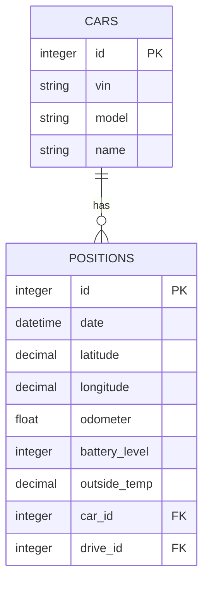
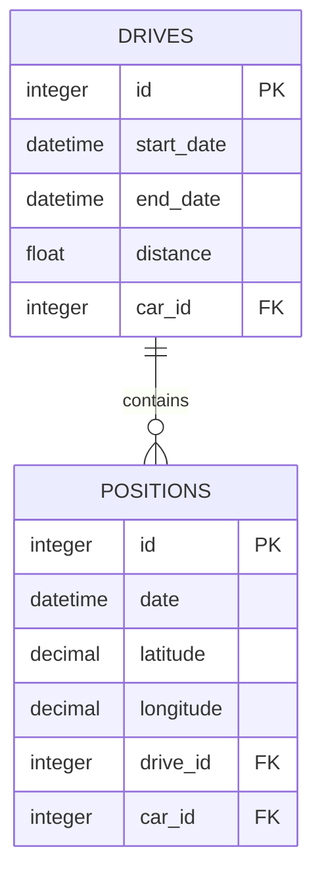
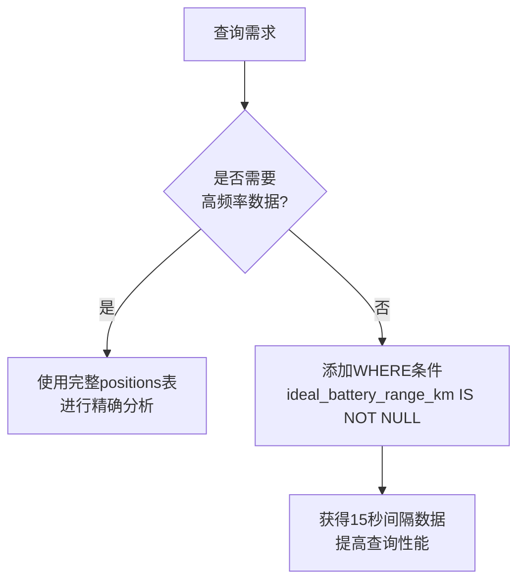

# 位置信息表（Positions）结构

<cite>
**本文档中引用的文件**  
- [20190330170000_create_positions.exs](file://priv/repo/migrations/20190330170000_create_positions.exs)
- [position.ex](file://lib/teslamate/log/position.ex)
- [car.ex](file://lib/teslamate/log/car.ex)
- [drive.ex](file://lib/teslamate/log/drive.ex)
- [log.ex](file://lib/teslamate/log.ex)
- [20190828104902_add_elevation.exs](file://priv/repo/migrations/20190828104902_add_elevation.exs)
- [20200410112005_database_efficiency_improvements.exs](file://priv/repo/migrations/20200410112005_database_efficiency_improvements.exs)
- [20230417225712_composite_index_to_position.exs](file://priv/repo/migrations/20230417225712_composite_index_to_position.exs)
- [20240915193446_composite_index_with_predicate_to_position.exs](file://priv/repo/migrations/20240915193446_composite_index_with_predicate_to_position.exs)
- [development.mdx](file://website/docs/development.mdx)
</cite>

## 目录
1. [引言](#引言)
2. [核心时空数据模型](#核心时空数据模型)
3. [表结构与字段详解](#表结构与字段详解)
4. [与Cars表的关联关系](#与cars表的关联关系)
5. [与Drives表的可选关联](#与drives表的可选关联)
6. [附加环境数据采集](#附加环境数据采集)
7. [数据索引与性能优化](#数据索引与性能优化)
8. [数据使用场景分析](#数据使用场景分析)
9. [结论](#结论)

## 引言
位置信息表（Positions）是TeslaMate系统中用于存储车辆高频率采集数据的核心表。该表记录了车辆在不同时间点的精确地理位置和相关状态信息，为驾驶行为分析、充电过程监控和车辆状态追踪提供了基础数据支持。通过该表的时空数据模型，系统能够实现对车辆位置、速度、电池状态、环境温度等关键指标的连续监控和分析。

## 核心时空数据模型
位置信息表采用时空数据模型设计，将时间维度（date）和空间维度（latitude、longitude）作为核心要素。这种设计使得系统能够精确记录车辆在任意时间点的地理位置，并基于这些数据进行轨迹重建、行驶距离计算和位置历史查询。该表作为高频率数据采集的核心，通常在启用流式API的情况下，每15秒左右记录一次车辆状态，从而形成密集的时间序列数据集。

**节来源**  
- [20190330170000_create_positions.exs](file://priv/repo/migrations/20190330170000_create_positions.exs#L4-L25)
- [position.ex](file://lib/teslamate/log/position.ex#L7-L39)

## 表结构与字段详解
位置信息表包含多个关键字段，共同构成了完整的车辆状态记录：

- **date**: UTC时间戳，记录数据采集的精确时间点，是时间序列分析的基础
- **latitude** 和 **longitude**: 浮点数，表示车辆的地理坐标，精度达到小数点后6位
- **odometer**: 浮点数，记录车辆的累计行驶里程（公里）
- **battery_level**: 整数，表示电池剩余电量百分比（0-100）
- **outside_temp**: 小数，记录车外环境温度（摄氏度）
- **elevation**: 小整数，表示海拔高度（米），由早期的altitude字段重命名而来
- **fan_status**: 整数，表示空调风扇状态
- **climate设置**: 包括driver_temp_setting、passenger_temp_setting、is_climate_on等字段，记录空调系统设置

这些字段共同提供了车辆在特定时间点的完整状态快照，支持对驾驶行为、能耗模式和环境适应性的深入分析。

**节来源**  
- [20190330170000_create_positions.exs](file://priv/repo/migrations/20190330170000_create_positions.exs#L6-L24)
- [position.ex](file://lib/teslamate/log/position.ex#L8-L38)
- [20200410112005_database_efficiency_improvements.exs](file://priv/repo/migrations/20200410112005_database_efficiency_improvements.exs#L65-L79)

## 与Cars表的关联关系
位置信息表通过car_id外键与Cars表建立直接关联，形成一对多的关系。每个车辆（Car）可以有多个位置记录（Position），这种设计确保了数据的归属清晰，便于按车辆进行数据查询和分析。Cars表存储了车辆的基本信息，如VIN码、车型、外观颜色等，与Positions表结合使用，可以实现车辆级别的综合分析。

**图来源**  
- [position.ex](file://lib/teslamate/log/position.ex#L37)
- [car.ex](file://lib/teslamate/log/car.ex#L26)

**节来源**  
- [position.ex](file://lib/teslamate/log/position.ex#L37)
- [car.ex](file://lib/teslamate/log/car.ex#L26)

## 与Drives表的可选关联
位置信息表通过drive_id外键与Drives表建立可选关联（trip_id的升级版本）。当车辆处于行驶状态时，位置记录会关联到相应的驾驶行程（Drive）；当车辆静止时，位置记录的drive_id为NULL。这种设计使得系统能够区分行驶中的位置数据和停车时的位置数据，为驾驶行为分析提供了重要依据。

**图来源**  
- [position.ex](file://lib/teslamate/log/position.ex#L38)
- [drive.ex](file://lib/teslamate/log/drive.ex#L38)

**节来源**  
- [20190812191616_rename_trips_to_drives.exs](file://priv/repo/migrations/20190812191616_rename_trips_to_drives.exs#L4-L6)
- [position.ex](file://lib/teslamate/log/position.ex#L38)
- [drive.ex](file://lib/teslamate/log/drive.ex#L38)

## 附加环境数据采集
位置信息表还采集了altitude（现为elevation）、fan_status、climate设置等附加环境数据，这些数据具有重要的使用场景：

- **elevation（海拔）**: 用于计算行驶路线的坡度变化，分析地形对能耗的影响
- **fan_status（风扇状态）**: 反映空调系统的运行强度，辅助分析能耗模式
- **climate设置**: 包括驾驶员/乘客温度设定、空调开关状态等，用于评估舒适性设置对电池续航的影响

这些环境数据与位置和电池数据结合，可以进行更精细的能耗分析，例如研究空调使用与电池消耗的关系，或评估不同气候条件下车辆的续航表现。

**节来源**  
- [20190330170000_create_positions.exs](file://priv/repo/migrations/20190330170000_create_positions.exs#L15-L21)
- [position.ex](file://lib/teslamate/log/position.ex#L11-L31)
- [20190828104902_add_elevation.exs](file://priv/repo/migrations/20190828104902_add_elevation.exs#L5)

## 数据索引与性能优化
为支持高效查询，位置信息表建立了多个复合索引：

- **(drive_id, date)索引**: 优化按驾驶行程查询位置数据的性能
- **(car_id, date, ideal_battery_range_km IS NOT NULL)索引**: 优化排除流式数据的查询性能
- 历史上的地理空间索引已被移除，表明查询模式已从地理空间搜索转向时间序列分析

这些索引设计反映了系统的使用模式：主要按车辆和时间进行查询，而非按地理位置搜索。文档特别指出，当15秒间隔的数据足够时，建议通过添加`ideal_battery_range_km IS NOT NULL`条件来排除流式数据，以提高查询性能。

**图来源**  
- [20230417225712_composite_index_to_position.exs](file://priv/repo/migrations/20230417225712_composite_index_to_position.exs#L5)
- [20240915193446_composite_index_with_predicate_to_position.exs](file://priv/repo/migrations/20240915193446_composite_index_with_predicate_to_position.exs#L5)
- [development.mdx](file://website/docs/development.mdx#L173)

**节来源**  
- [20230417225712_composite_index_to_position.exs](file://priv/repo/migrations/20230417225712_composite_index_to_position.exs#L5)
- [20240915193446_composite_index_with_predicate_to_position.exs](file://priv/repo/migrations/20240915193446_composite_index_with_predicate_to_position.exs#L5)
- [development.mdx](file://website/docs/development.mdx#L170-L174)

## 数据使用场景分析
位置信息表的数据支持多种分析场景：

1. **驾驶行为分析**: 通过连续的位置记录重建行驶轨迹，计算行驶距离和速度变化
2. **充电过程监控**: 分析停车期间电池电量变化，识别充电开始和结束时间
3. **能耗模式研究**: 结合速度、功率、电池电量和环境温度数据，建立能耗模型
4. **车辆状态追踪**: 监控车辆的长期使用模式，如日常行驶路线和停车位置

这些分析为车主提供了深入的车辆使用洞察，帮助优化驾驶习惯、提高能源效率，并更好地理解车辆的日常使用模式。

**节来源**  
- [log.ex](file://lib/teslamate/log.ex#L246-L374)
- [drive.ex](file://lib/teslamate/log/drive.ex#L42-L77)
- [position.ex](file://lib/teslamate/log/position.ex#L42-L77)

## 结论
位置信息表（Positions）作为TeslaMate系统的核心数据表，通过精细的时空数据模型，全面记录了车辆的地理位置和状态信息。该表与Cars表的直接关联确保了数据的车辆归属，与Drives表的可选关联实现了行驶状态的区分。丰富的环境数据采集为深入分析提供了可能，而精心设计的索引则保证了大规模数据查询的性能。这一数据模型为电动汽车的使用分析提供了坚实的基础，支持从简单的位置追踪到复杂的能耗模式研究等多种应用场景。