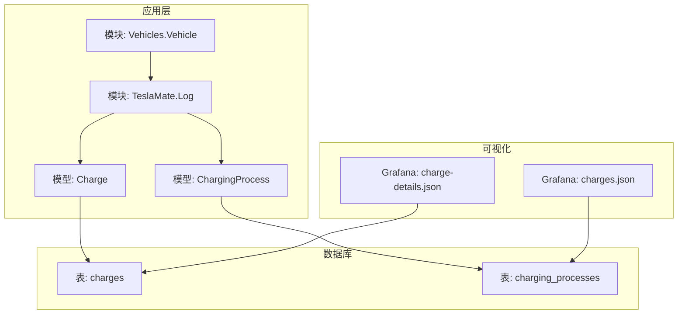
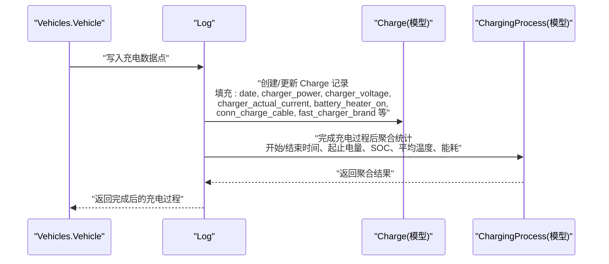
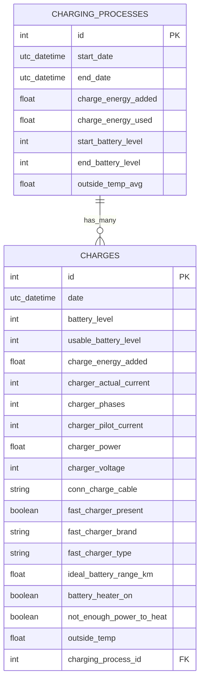
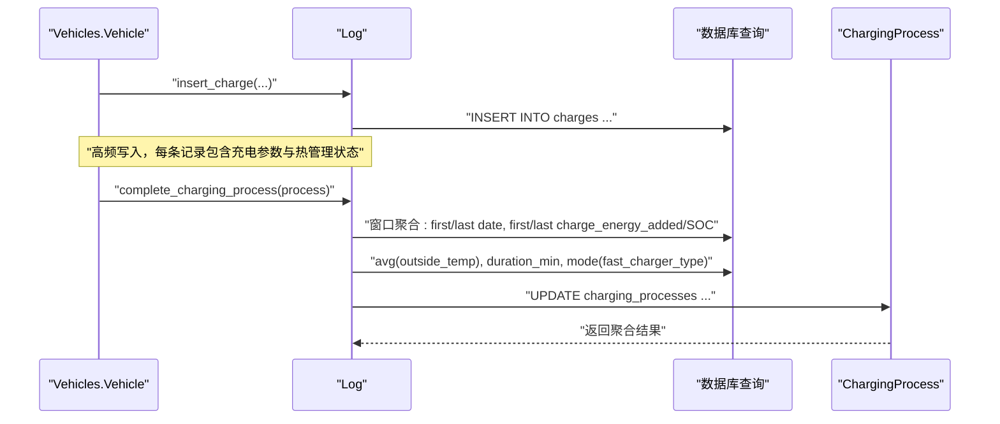
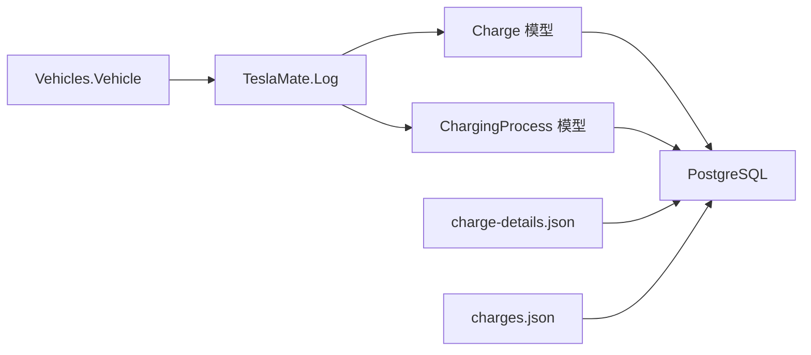

# 充电数据点表（Charges）结构

<cite>
**本文引用的文件**
- [priv/repo/migrations/20190330200000_create_charges.exs](file://priv/repo/migrations/20190330200000_create_charges.exs)
- [lib/teslamate/log/charge.ex](file://lib/teslamate/log/charge.ex)
- [lib/teslamate/log/charging_process.ex](file://lib/teslamate/log/charging_process.ex)
- [lib/teslamate/log.ex](file://lib/teslamate/log.ex)
- [lib/teslamate/vehicles/vehicle.ex](file://lib/teslamate/vehicles/vehicle.ex)
- [grafana/dashboards/internal/charge-details.json](file://grafana/dashboards/internal/charge-details.json)
- [grafana/dashboards/charges.json](file://grafana/dashboards/charges.json)
- [priv/repo/migrations/20190415115227_add_battery_heater_fields.exs](file://priv/repo/migrations/20190415115227_add_battery_heater_fields.exs)
- [test/teslamate/log/log_charging_test.exs](file://test/teslamate/log/log_charging_test.exs)
</cite>

## 目录
1. [简介](#简介)
2. [项目结构](#项目结构)
3. [核心组件](#核心组件)
4. [架构总览](#架构总览)
5. [详细组件分析](#详细组件分析)
6. [依赖关系分析](#依赖关系分析)
7. [性能考量](#性能考量)
8. [故障排查指南](#故障排查指南)
9. [结论](#结论)
10. [附录](#附录)

## 简介
本文件聚焦于“充电数据点表（Charges）”的结构与使用，系统性解析以下关键内容：
- 高频充电参数：charger_power、charger_voltage、charger_actual_current 等
- 热管理状态：battery_heater_on、not_enough_power_to_heat 等
- 时间序列组织：通过 charging_process_id 与 ChargingProcesses 表关联，形成完整的充电过程时间序列
- 设备识别与统计：conn_charge_cable、fast_charger_brand 等字段在设备识别与统计中的作用

通过对迁移脚本、模型定义、业务流程与可视化仪表盘的交叉验证，帮助读者从数据结构到上层应用全面理解 Charges 表的设计意图与使用场景。

## 项目结构
Charges 表位于数据库中，其模型与约束由 Elixir 的 Ecto 模式定义，并通过日志上下文进行插入与聚合；同时，Grafana 仪表盘将这些字段用于可视化展示。

图表来源
- [priv/repo/migrations/20190330200000_create_charges.exs](file://priv/repo/migrations/20190330200000_create_charges.exs#L1-L26)
- [lib/teslamate/log/charge.ex](file://lib/teslamate/log/charge.ex#L1-L68)
- [lib/teslamate/log/charging_process.ex](file://lib/teslamate/log/charging_process.ex#L1-L61)
- [lib/teslamate/log.ex](file://lib/teslamate/log.ex#L439-L509)
- [lib/teslamate/vehicles/vehicle.ex](file://lib/teslamate/vehicles/vehicle.ex#L1370-L1392)
- [grafana/dashboards/internal/charge-details.json](file://grafana/dashboards/internal/charge-details.json#L353-L386)
- [grafana/dashboards/charges.json](file://grafana/dashboards/charges.json#L1-L120)

章节来源
- [priv/repo/migrations/20190330200000_create_charges.exs](file://priv/repo/migrations/20190330200000_create_charges.exs#L1-L26)
- [lib/teslamate/log/charge.ex](file://lib/teslamate/log/charge.ex#L1-L68)
- [lib/teslamate/log/charging_process.ex](file://lib/teslamate/log/charging_process.ex#L1-L61)
- [lib/teslamate/log.ex](file://lib/teslamate/log.ex#L439-L509)
- [lib/teslamate/vehicles/vehicle.ex](file://lib/teslamate/vehicles/vehicle.ex#L1370-L1392)
- [grafana/dashboards/internal/charge-details.json](file://grafana/dashboards/internal/charge-details.json#L353-L386)
- [grafana/dashboards/charges.json](file://grafana/dashboards/charges.json#L1-L120)

## 核心组件
- 数据库表结构（Charges）
  - 关键字段：date、charger_power、charger_voltage、charger_actual_current、charger_phases、charger_pilot_current、charge_energy_added、ideal_battery_range_km、battery_heater_on、not_enough_power_to_heat、conn_charge_cable、fast_charger_brand、fast_charger_type、fast_charger_present、outside_temp、battery_level、usable_battery_level 等
  - 外键：charging_process_id 引用 charging_processes.id
- Ecto 模型（Charge）
  - 定义字段类型、默认值与校验规则（如必填项、数值范围）
  - 建立 belongs_to 关系到 ChargingProcess
- 上下文（Log）
  - 提供 insert_charge、complete_charging_process 等方法，完成单点插入与过程聚合
  - 聚合逻辑包含开始/结束时间、起止电量、起止SOC、平均外部温度、能耗统计等
- 可视化（Grafana）
  - charge-details.json 将充电电压、功率、电流、电池加热状态、范围等作为时序图展示
  - charges.json 展示充电汇总面板，支持按位置、费用、耗时等维度筛选

章节来源
- [priv/repo/migrations/20190330200000_create_charges.exs](file://priv/repo/migrations/20190330200000_create_charges.exs#L1-L26)
- [lib/teslamate/log/charge.ex](file://lib/teslamate/log/charge.ex#L1-L68)
- [lib/teslamate/log.ex](file://lib/teslamate/log.ex#L439-L509)
- [grafana/dashboards/internal/charge-details.json](file://grafana/dashboards/internal/charge-details.json#L144-L183)
- [grafana/dashboards/charges.json](file://grafana/dashboards/charges.json#L1-L120)

## 架构总览
Charges 与 ChargingProcesses 的关系是“一对多”，每个充电过程由多个高频率采样的充电数据点组成。系统通过 Vehicles.Vehicle 将来自车辆的状态数据转换为 Charges 记录，再由 Log 上下文完成过程聚合与成本计算。

图表来源
- [lib/teslamate/vehicles/vehicle.ex](file://lib/teslamate/vehicles/vehicle.ex#L1370-L1392)
- [lib/teslamate/log.ex](file://lib/teslamate/log.ex#L439-L509)
- [lib/teslamate/log/charge.ex](file://lib/teslamate/log/charge.ex#L1-L68)
- [lib/teslamate/log/charging_process.ex](file://lib/teslamate/log/charging_process.ex#L1-L61)

## 详细组件分析

### 数据表结构与字段语义
- 充电参数
  - charger_power：充电功率（单位通常为 kW），用于评估充电效率与设备能力
  - charger_voltage：充电电压（单位 V），结合电流可推导实际功率
  - charger_actual_current：实际充电电流（单位 A），反映实时充电强度
  - charger_phases / charger_pilot_current：相数与导引电流，辅助判断充电模式与设备特性
- 能量与范围
  - charge_energy_added：累计新增电能（单位通常为 kWh），用于统计充电总量
  - ideal_battery_range_km / rated_battery_range_km：理想/标定续航里程（单位 km），用于衡量充电效果
- 热管理状态
  - battery_heater_on：电池加热器是否开启
  - not_enough_power_to_heat：当功率不足以启动加热时的状态标记
- 设备识别与连接
  - conn_charge_cable：连接的充电线缆标识，便于区分不同线缆的兼容性与损耗
  - fast_charger_brand / fast_charger_type / fast_charger_present：快充品牌、类型与是否存在快充连接，用于设备识别与统计
- 环境与状态
  - outside_temp：外部环境温度，影响充电效率与能耗
  - battery_level / usable_battery_level：电池百分比与可用电池百分比，用于过程前后对比

章节来源
- [priv/repo/migrations/20190330200000_create_charges.exs](file://priv/repo/migrations/20190330200000_create_charges.exs#L1-L26)
- [lib/teslamate/log/charge.ex](file://lib/teslamate/log/charge.ex#L1-L68)
- [lib/teslamate/log.ex](file://lib/teslamate/log.ex#L439-L509)
- [grafana/dashboards/internal/charge-details.json](file://grafana/dashboards/internal/charge-details.json#L144-L183)

### 与 ChargingProcesses 的关联与时间序列
- 关联方式
  - Charges 表通过 charging_process_id 外键与 ChargingProcesses 表建立一对多关系
  - ChargingProcess 模型定义了 has_many :charges，表示一个充电过程包含多条充电数据点
- 时间序列组织
  - 每个充电过程由多条高频数据点组成，按 date 字段升序排列
  - 过程聚合时使用 first_value/last_value/date 窗口函数确定起止时间与状态
- 聚合指标
  - 开始/结束时间、起止电量、起止SOC、平均外部温度、总能耗（charge_energy_added/used）、持续时间等

图表来源
- [priv/repo/migrations/20190330190000_create_charging_processes.exs](file://priv/repo/migrations/20190330190000_create_charging_processes.exs#L1-L23)
- [priv/repo/migrations/20190330200000_create_charges.exs](file://priv/repo/migrations/20190330200000_create_charges.exs#L1-L26)
- [lib/teslamate/log/charging_process.ex](file://lib/teslamate/log/charging_process.ex#L1-L61)
- [lib/teslamate/log/charge.ex](file://lib/teslamate/log/charge.ex#L1-L68)

章节来源
- [lib/teslamate/log/charging_process.ex](file://lib/teslamate/log/charging_process.ex#L1-L61)
- [lib/teslamate/log/charge.ex](file://lib/teslamate/log/charge.ex#L1-L68)
- [lib/teslamate/log.ex](file://lib/teslamate/log.ex#L439-L509)

### 设备识别与统计：conn_charge_cable、fast_charger_brand
- conn_charge_cable
  - 用于标识当前连接的充电线缆，便于区分不同线缆的兼容性与损耗特征
  - 在可视化中可用于分组对比不同线缆的充电表现
- fast_charger_brand / fast_charger_type / fast_charger_present
  - 用于识别快充品牌与类型，例如特斯拉超级充电、第三方快充桩等
  - 支持后续按品牌/类型进行统计与成本分析
- 实际使用路径
  - Vehicles.Vehicle 将车辆状态映射为 Charges 字段
  - Log.insert_charge 将单点写入数据库
  - Grafana charge-details.json 使用这些字段绘制时序图

章节来源
- [lib/teslamate/vehicles/vehicle.ex](file://lib/teslamate/vehicles/vehicle.ex#L1370-L1392)
- [lib/teslamate/log.ex](file://lib/teslamate/log.ex#L439-L509)
- [grafana/dashboards/internal/charge-details.json](file://grafana/dashboards/internal/charge-details.json#L353-L386)

### 热管理状态：battery_heater_on、not_enough_power_to_heat
- battery_heater_on
  - 标识电池加热器是否处于开启状态，常用于低温充电场景
- not_enough_power_to_heat
  - 当充电功率不足以启动或维持加热时的状态标记
- 数据来源与展示
  - Vehicles.Vehicle 将车辆状态映射到 Charges
  - Grafana charge-details.json 中将 battery_heater_on/battery_heater 映射为叠加显示，便于观察热管理对充电过程的影响

章节来源
- [lib/teslamate/vehicles/vehicle.ex](file://lib/teslamate/vehicles/vehicle.ex#L1370-L1392)
- [grafana/dashboards/internal/charge-details.json](file://grafana/dashboards/internal/charge-details.json#L164-L183)
- [priv/repo/migrations/20190415115227_add_battery_heater_fields.exs](file://priv/repo/migrations/20190415115227_add_battery_heater_fields.exs#L1-L16)

### 插入与聚合流程（代码级）
- 单点插入
  - Vehicles.Vehicle 将车辆状态转换为 Charges 字典并调用 Log.insert_charge
- 过程完成与聚合
  - Log.complete_charging_process 对该过程内的所有 Charges 执行窗口聚合，计算开始/结束时间、起止电量、SOC、平均温度、总能耗、持续时间等
  - 同时根据快充类型与地理围栏信息计算成本

图表来源
- [lib/teslamate/vehicles/vehicle.ex](file://lib/teslamate/vehicles/vehicle.ex#L1370-L1392)
- [lib/teslamate/log.ex](file://lib/teslamate/log.ex#L439-L509)

章节来源
- [lib/teslamate/vehicles/vehicle.ex](file://lib/teslamate/vehicles/vehicle.ex#L1370-L1392)
- [lib/teslamate/log.ex](file://lib/teslamate/log.ex#L439-L509)

### 字段校验与约束（变更集）
- 必填字段
  - date、charging_process_id、charge_energy_added、charger_power、ideal_battery_range_km
- 数值约束
  - charger_phases 必须大于 0
- 外键约束
  - charging_process_id 引用 charging_processes

章节来源
- [lib/teslamate/log/charge.ex](file://lib/teslamate/log/charge.ex#L33-L67)

### 可视化与统计
- charge-details.json
  - 时序面板展示：battery_level、charger_power、charger_voltage、charger_actual_current、charger_pilot_current、battery_heater_on、range_km 等
  - 支持按车与过程过滤，便于对比不同充电条件下的表现
- charges.json
  - 汇总面板展示：总新增电能、总使用电能、总时长、平均温度、成本等
  - 支持按位置、类型、成本、耗时等维度浏览与筛选

章节来源
- [grafana/dashboards/internal/charge-details.json](file://grafana/dashboards/internal/charge-details.json#L353-L386)
- [grafana/dashboards/charges.json](file://grafana/dashboards/charges.json#L1-L120)

## 依赖关系分析
- 模块耦合
  - Vehicles.Vehicle 依赖 TeslaMate.Log 将车辆状态写入 Charges
  - TeslaMate.Log 依赖 Ecto 模型（Charge、ChargingProcess）进行数据持久化与聚合
  - Grafana 仪表盘依赖数据库查询结果进行可视化
- 外部依赖
  - PostgreSQL（通过 Ecto 查询实现窗口聚合与统计）
  - Grafana（PostgreSQL 数据源）

图表来源
- [lib/teslamate/vehicles/vehicle.ex](file://lib/teslamate/vehicles/vehicle.ex#L1370-L1392)
- [lib/teslamate/log.ex](file://lib/teslamate/log.ex#L439-L509)
- [lib/teslamate/log/charge.ex](file://lib/teslamate/log/charge.ex#L1-L68)
- [lib/teslamate/log/charging_process.ex](file://lib/teslamate/log/charging_process.ex#L1-L61)
- [grafana/dashboards/internal/charge-details.json](file://grafana/dashboards/internal/charge-details.json#L353-L386)
- [grafana/dashboards/charges.json](file://grafana/dashboards/charges.json#L1-L120)

章节来源
- [lib/teslamate/vehicles/vehicle.ex](file://lib/teslamate/vehicles/vehicle.ex#L1370-L1392)
- [lib/teslamate/log.ex](file://lib/teslamate/log.ex#L439-L509)
- [lib/teslamate/log/charge.ex](file://lib/teslamate/log/charge.ex#L1-L68)
- [lib/teslamate/log/charging_process.ex](file://lib/teslamate/log/charging_process.ex#L1-L61)
- [grafana/dashboards/internal/charge-details.json](file://grafana/dashboards/internal/charge-details.json#L353-L386)
- [grafana/dashboards/charges.json](file://grafana/dashboards/charges.json#L1-L120)

## 性能考量
- 写入频率
  - Charges 为高频写入表，建议确保数据库索引与分区策略合理（例如按 charging_process_id 分区或索引 date）
- 聚合成本
  - complete_charging_process 使用窗口函数进行聚合，涉及大量行扫描；建议在 charging_process_id 上建立高效索引
- 可视化负载
  - Grafana 时序查询可能涉及大范围时间窗口，建议限制默认时间范围或增加缓存策略

[本节提供通用指导，不直接分析具体文件]

## 故障排查指南
- 常见错误与修复
  - 缺失必填字段：date、charging_process_id、charge_energy_added、charger_power、ideal_battery_range_km
  - charger_phases 不合法（必须大于 0）
  - 外键约束失败（charging_process_id 不存在）
- 测试覆盖
  - 单点插入与聚合测试覆盖了典型场景与边界情况（如电压修正、坏连接、负能量等）
- 排查步骤
  - 检查 Vehicles.Vehicle 到 Charges 的字段映射是否完整
  - 确认 Log.insert_charge 的调用链路与参数传递
  - 查看 Grafana 查询 SQL 是否正确过滤 charging_process_id 与 car_id

章节来源
- [lib/teslamate/log/charge.ex](file://lib/teslamate/log/charge.ex#L33-L67)
- [test/teslamate/log/log_charging_test.exs](file://test/teslamate/log/log_charging_test.exs#L128-L162)
- [test/teslamate/log/log_charging_test.exs](file://test/teslamate/log/log_charging_test.exs#L837-L853)

## 结论
Charges 表通过高频充电参数与热管理状态，为充电过程提供了精细的时间序列观测基础；借助 charging_process_id 与 ChargingProcesses 的关联，系统实现了从单点到过程的完整聚合与成本计算。conn_charge_cable、fast_charger_brand 等字段则为设备识别与统计分析提供了关键支撑。配合 Grafana 仪表盘，用户可以直观地对比不同充电条件下的表现，优化充电策略与成本控制。

[本节为总结性内容，不直接分析具体文件]

## 附录
- 关键字段一览（按用途分类）
  - 充电参数：charger_power、charger_voltage、charger_actual_current、charger_phases、charger_pilot_current
  - 能量与范围：charge_energy_added、ideal_battery_range_km、rated_battery_range_km
  - 热管理：battery_heater_on、not_enough_power_to_heat
  - 设备识别：conn_charge_cable、fast_charger_brand、fast_charger_type、fast_charger_present
  - 环境与状态：outside_temp、battery_level、usable_battery_level
- 相关迁移与模型
  - 创建 Charges 表、添加电池加热字段、插入 Charge 记录、完成充电过程聚合

章节来源
- [priv/repo/migrations/20190330200000_create_charges.exs](file://priv/repo/migrations/20190330200000_create_charges.exs#L1-L26)
- [priv/repo/migrations/20190415115227_add_battery_heater_fields.exs](file://priv/repo/migrations/20190415115227_add_battery_heater_fields.exs#L1-L16)
- [lib/teslamate/log/charge.ex](file://lib/teslamate/log/charge.ex#L1-L68)
- [lib/teslamate/log.ex](file://lib/teslamate/log.ex#L439-L509)