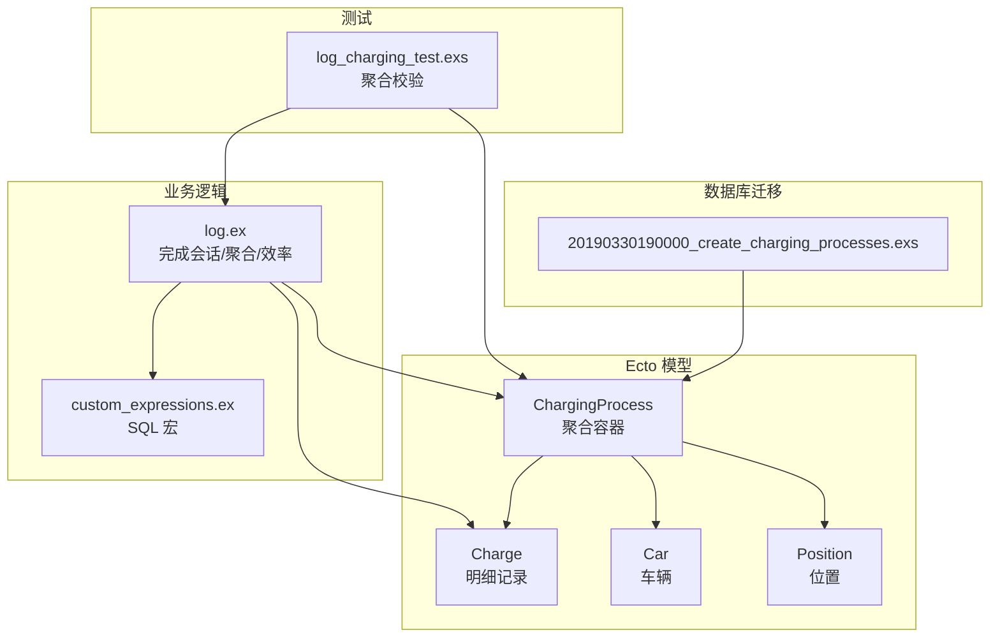
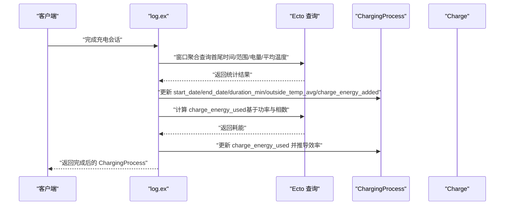
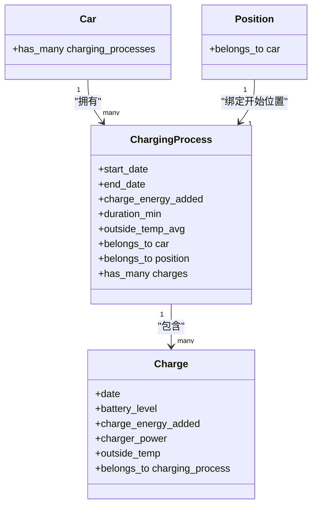
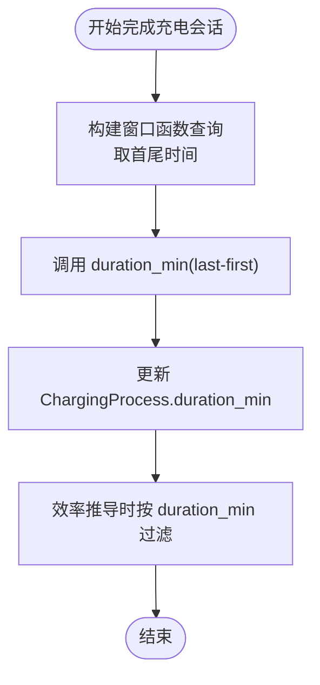
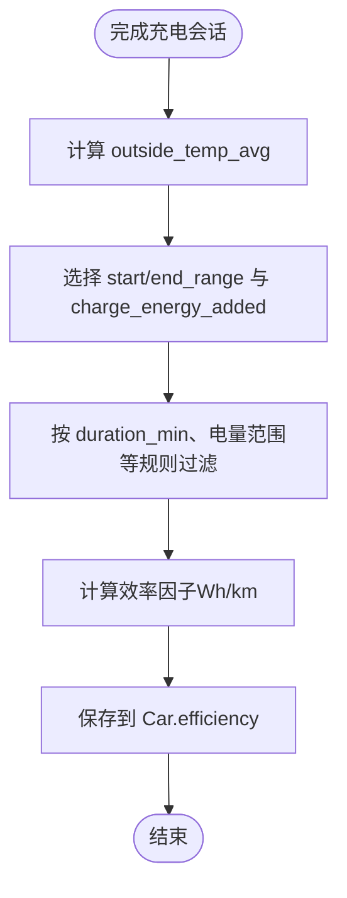
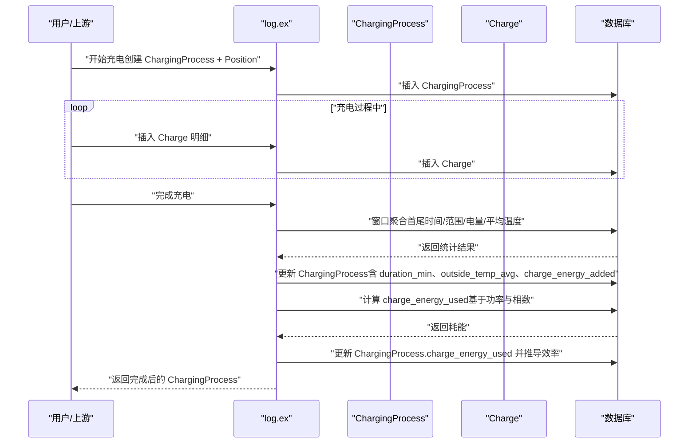
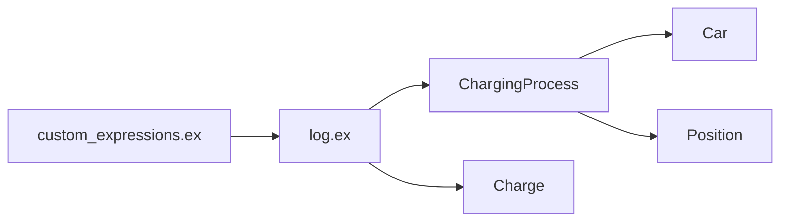

# 充电过程表（ChargingProcesses）结构

<cite>
**本文引用的文件**
- [priv/repo/migrations/20190330190000_create_charging_processes.exs](file://priv/repo/migrations/20190330190000_create_charging_processes.exs)
- [lib/teslamate/log/charging_process.ex](file://lib/teslamate/log/charging_process.ex)
- [lib/teslamate/log/car.ex](file://lib/teslamate/log/car.ex)
- [lib/teslamate/log/position.ex](file://lib/teslamate/log/position.ex)
- [lib/teslamate/log/charge.ex](file://lib/teslamate/log/charge.ex)
- [lib/teslamate/log.ex](file://lib/teslamate/log.ex)
- [lib/teslamate/custom_expressions.ex](file://lib/teslamate/custom_expressions.ex)
- [test/teslamate/log/log_charging_test.exs](file://test/teslamate/log/log_charging_test.exs)
</cite>

## 目录
1. [简介](#简介)
2. [项目结构](#项目结构)
3. [核心组件](#核心组件)
4. [架构总览](#架构总览)
5. [详细组件分析](#详细组件分析)
6. [依赖分析](#依赖分析)
7. [性能考量](#性能考量)
8. [故障排查指南](#故障排查指南)
9. [结论](#结论)

## 简介
本文件系统性阐述 ChargingProcesses 表的结构与职责，重点覆盖以下核心指标：
- start_date：充电会话起始时间
- end_date：充电会话结束时间
- charge_energy_added：本次会话累计新增电量（kWh）
- start_soc、end_soc：会话起止电量百分比（由历史字段演进而来）
- duration_min：充电时长（分钟）
- outside_temp_avg：充电期间平均外部温度（用于效率分析）

同时说明 ChargingProcesses 如何作为“充电会话”的聚合容器，与 Charges 形成一对多关系；并解释其与 Cars 的关联以及与 Positions 的绑定（充电开始位置）。最后分析 duration_min 和 outside_temp_avg 在充电效率分析中的作用与实现方式。

## 项目结构
围绕 ChargingProcesses 的相关代码主要分布在以下模块与迁移文件中：
- 数据库迁移：创建 ChargingProcesses 表及其外键约束
- Ecto Schema：ChargingProcess、Charge、Car、Position 的模型定义与关联
- 业务逻辑：日志聚合与统计（完成充电会话、计算耗能、推导效率）
- 自定义表达式：提供 duration_min 等 SQL 片段宏
- 测试：验证聚合结果与指标正确性

图表来源
- [priv/repo/migrations/20190330190000_create_charging_processes.exs](file://priv/repo/migrations/20190330190000_create_charging_processes.exs#L1-L22)
- [lib/teslamate/log/charging_process.ex](file://lib/teslamate/log/charging_process.ex#L1-L60)
- [lib/teslamate/log/charge.ex](file://lib/teslamate/log/charge.ex#L1-L68)
- [lib/teslamate/log/car.ex](file://lib/teslamate/log/car.ex#L1-L55)
- [lib/teslamate/log/position.ex](file://lib/teslamate/log/position.ex#L1-L79)
- [lib/teslamate/log.ex](file://lib/teslamate/log.ex#L445-L510)
- [lib/teslamate/custom_expressions.ex](file://lib/teslamate/custom_expressions.ex#L14-L23)
- [test/teslamate/log/log_charging_test.exs](file://test/teslamate/log/log_charging_test.exs#L164-L247)

章节来源
- [priv/repo/migrations/20190330190000_create_charging_processes.exs](file://priv/repo/migrations/20190330190000_create_charging_processes.exs#L1-L22)
- [lib/teslamate/log/charging_process.ex](file://lib/teslamate/log/charging_process.ex#L1-L60)
- [lib/teslamate/log/charge.ex](file://lib/teslamate/log/charge.ex#L1-L68)
- [lib/teslamate/log/car.ex](file://lib/teslamate/log/car.ex#L1-L55)
- [lib/teslamate/log/position.ex](file://lib/teslamate/log/position.ex#L1-L79)
- [lib/teslamate/log.ex](file://lib/teslamate/log.ex#L445-L510)
- [lib/teslamate/custom_expressions.ex](file://lib/teslamate/custom_expressions.ex#L14-L23)
- [test/teslamate/log/log_charging_test.exs](file://test/teslamate/log/log_charging_test.exs#L164-L247)

## 核心组件
- ChargingProcess（充电过程）
  - 聚合容器：承载一次完整充电会话的汇总指标
  - 关键字段：start_date、end_date、charge_energy_added、start_battery_level、end_battery_level、duration_min、outside_temp_avg 等
  - 关联：belongs_to 车辆（Car），belongs_to 位置（Position），has_many 明细（Charge）
- Charge（充电明细）
  - 记录每条采样点的充电状态，如电池电量、功率、相数、外部温度等
  - 与 ChargingProcess 为一对多关系
- Car（车辆）
  - has_many :charging_processes，用于按车维度聚合
- Position（位置）
  - 记录车辆在某时刻的位置信息
  - ChargingProcess 绑定充电开始位置（position_id）

章节来源
- [lib/teslamate/log/charging_process.ex](file://lib/teslamate/log/charging_process.ex#L1-L60)
- [lib/teslamate/log/charge.ex](file://lib/teslamate/log/charge.ex#L1-L68)
- [lib/teslamate/log/car.ex](file://lib/teslamate/log/car.ex#L1-L55)
- [lib/teslamate/log/position.ex](file://lib/teslamate/log/position.ex#L1-L79)

## 架构总览
ChargingProcesses 作为“会话级”聚合层，通过 Ecto 查询窗口函数从 Charge 明细中提取首尾时间、范围、电量与平均温度，并结合自定义 SQL 宏计算时长与耗能，最终回写到 ChargingProcess 中，供后续效率推导与报表使用。

图表来源
- [lib/teslamate/log.ex](file://lib/teslamate/log.ex#L445-L510)
- [lib/teslamate/custom_expressions.ex](file://lib/teslamate/custom_expressions.ex#L14-L23)
- [lib/teslamate/log/charging_process.ex](file://lib/teslamate/log/charging_process.ex#L1-L60)
- [lib/teslamate/log/charge.ex](file://lib/teslamate/log/charge.ex#L1-L68)

## 详细组件分析

### ChargingProcesses 表结构与字段语义
- 字段清单与类型
  - start_date：UTC 时间戳（会话开始）
  - end_date：UTC 时间戳（会话结束）
  - charge_energy_added：新增电量（kWh，decimal）
  - start_battery_level、end_battery_level：起止电池等级（整数）
  - duration_min：充电时长（分钟，整数）
  - outside_temp_avg：充电期间平均外部温度（decimal）
  - car_id：外键，指向 cars
  - position_id：外键，指向 positions（绑定充电开始位置）
  - address_id：可选外键，指向 addresses（地址信息）
- 外键与索引
  - charging_processes.car_id → cars.id
  - charging_processes.position_id → positions.id
  - charging_processes.address_id → addresses.id
  - 对 charging_processes.car_id、position_id、address_id 建有索引
- 历史约束
  - 迁移中对 start_date 的非空约束在后续版本中完善

章节来源
- [priv/repo/migrations/20190330190000_create_charging_processes.exs](file://priv/repo/migrations/20190330190000_create_charging_processes.exs#L1-L22)
- [priv/repo/migrations/20190717184003_add_fkey_indexes.exs](file://priv/repo/migrations/20190717184003_add_fkey_indexes.exs#L1-L22)
- [lib/teslamate/log/charging_process.ex](file://lib/teslamate/log/charging_process.ex#L1-L60)

### ChargingProcesses 与 Charges 的一对多关系
- ChargingProcess.has_many :charges
- Charge.belongs_to :charging_process
- 业务流程
  - 开始充电：创建 ChargingProcess 并附带初始 Position
  - 过程中：逐条插入 Charge 明细
  - 结束充电：调用完成逻辑，从 Charge 明细聚合出 ChargingProcess 的汇总指标

图表来源
- [lib/teslamate/log/car.ex](file://lib/teslamate/log/car.ex#L1-L55)
- [lib/teslamate/log/position.ex](file://lib/teslamate/log/position.ex#L1-L79)
- [lib/teslamate/log/charging_process.ex](file://lib/teslamate/log/charging_process.ex#L1-L60)
- [lib/teslamate/log/charge.ex](file://lib/teslamate/log/charge.ex#L1-L68)

章节来源
- [lib/teslamate/log/charging_process.ex](file://lib/teslamate/log/charging_process.ex#L1-L60)
- [lib/teslamate/log/charge.ex](file://lib/teslamate/log/charge.ex#L1-L68)
- [lib/teslamate/log/car.ex](file://lib/teslamate/log/car.ex#L1-L55)
- [lib/teslamate/log/position.ex](file://lib/teslamate/log/position.ex#L1-L79)

### ChargingProcesses 与 Cars 的关联
- ChargingProcess.belongs_to :car
- Car.has_many :charging_processes
- 作用
  - 以车为单位进行聚合与效率推导
  - 效率因子 derived 时按车过滤并分组

章节来源
- [lib/teslamate/log/charging_process.ex](file://lib/teslamate/log/charging_process.ex#L1-L60)
- [lib/teslamate/log/car.ex](file://lib/teslamate/log/car.ex#L1-L55)

### ChargingProcesses 与 Positions 的绑定（充电开始位置）
- ChargingProcess.belongs_to :position
- 迁移中将 position_id 设为非空，确保每次充电会话都有明确的开始位置
- 位置信息用于地理与成本计算（如计费）

章节来源
- [priv/repo/migrations/20190330190000_create_charging_processes.exs](file://priv/repo/migrations/20190330190000_create_charging_processes.exs#L1-L22)
- [lib/teslamate/log/charging_process.ex](file://lib/teslamate/log/charging_process.ex#L1-L60)
- [lib/teslamate/log/position.ex](file://lib/teslamate/log/position.ex#L1-L79)

### duration_min 的计算与使用
- 计算方式
  - 使用自定义 SQL 宏 duration_min(a, b)，将两个时间差转换为分钟数
  - 在完成充电会话时，通过窗口函数取第一条与最后一条 Charge 的时间差
- 使用场景
  - 作为效率推导的筛选条件（仅对时长大于阈值的会话参与效率计算）
  - 用于计费（按分钟计费的地理围栏）

图表来源
- [lib/teslamate/log.ex](file://lib/teslamate/log.ex#L457-L490)
- [lib/teslamate/custom_expressions.ex](file://lib/teslamate/custom_expressions.ex#L14-L23)
- [lib/teslamate/log.ex](file://lib/teslamate/log.ex#L632-L675)

章节来源
- [lib/teslamate/log.ex](file://lib/teslamate/log.ex#L457-L490)
- [lib/teslamate/custom_expressions.ex](file://lib/teslamate/custom_expressions.ex#L14-L23)
- [lib/teslamate/log.ex](file://lib/teslamate/log.ex#L632-L675)

### outside_temp_avg 在充电效率分析中的作用
- 计算方式
  - 在完成充电会话时，通过窗口函数对 Charge 的 outside_temp 求平均
- 使用场景
  - 作为效率推导的输入之一，结合 charge_energy_added 与里程范围差（start/end_ideal/rated_range_km）计算效率因子
  - 仅对满足时长与电量范围等条件的会话参与效率计算

图表来源
- [lib/teslamate/log.ex](file://lib/teslamate/log.ex#L457-L490)
- [lib/teslamate/log.ex](file://lib/teslamate/log.ex#L632-L675)
- [lib/teslamate/log/charging_process.ex](file://lib/teslamate/log/charging_process.ex#L1-L60)

章节来源
- [lib/teslamate/log.ex](file://lib/teslamate/log.ex#L457-L490)
- [lib/teslamate/log.ex](file://lib/teslamate/log.ex#L632-L675)
- [lib/teslamate/log/charging_process.ex](file://lib/teslamate/log/charging_process.ex#L1-L60)

### 充电会话聚合流程（序列图）
展示从插入 Charge 到完成 ChargingProcess 的关键步骤与数据流。

图表来源
- [lib/teslamate/log.ex](file://lib/teslamate/log.ex#L445-L510)
- [lib/teslamate/log.ex](file://lib/teslamate/log.ex#L511-L541)
- [lib/teslamate/log.ex](file://lib/teslamate/log.ex#L632-L675)
- [lib/teslamate/log/charging_process.ex](file://lib/teslamate/log/charging_process.ex#L1-L60)
- [lib/teslamate/log/charge.ex](file://lib/teslamate/log/charge.ex#L1-L68)

章节来源
- [lib/teslamate/log.ex](file://lib/teslamate/log.ex#L445-L510)
- [lib/teslamate/log.ex](file://lib/teslamate/log.ex#L511-L541)
- [lib/teslamate/log.ex](file://lib/teslamate/log.ex#L632-L675)
- [lib/teslamate/log/charging_process.ex](file://lib/teslamate/log/charging_process.ex#L1-L60)
- [lib/teslamate/log/charge.ex](file://lib/teslamate/log/charge.ex#L1-L68)

## 依赖分析
- 内部依赖
  - ChargingProcess 依赖 Car、Position、Charge
  - log.ex 依赖 ChargingProcess、Charge、Car、CustomExpressions
  - CustomExpressions 提供 duration_min 等 SQL 片段
- 外部依赖
  - PostgreSQL 窗口函数与自定义宏
  - 地理扩展（如地球距离/围栏判断）在其他模块中使用，但 ChargingProcesses 本身不直接依赖

图表来源
- [lib/teslamate/custom_expressions.ex](file://lib/teslamate/custom_expressions.ex#L14-L23)
- [lib/teslamate/log.ex](file://lib/teslamate/log.ex#L445-L510)
- [lib/teslamate/log/charging_process.ex](file://lib/teslamate/log/charging_process.ex#L1-L60)
- [lib/teslamate/log/charge.ex](file://lib/teslamate/log/charge.ex#L1-L68)
- [lib/teslamate/log/car.ex](file://lib/teslamate/log/car.ex#L1-L55)
- [lib/teslamate/log/position.ex](file://lib/teslamate/log/position.ex#L1-L79)

章节来源
- [lib/teslamate/custom_expressions.ex](file://lib/teslamate/custom_expressions.ex#L14-L23)
- [lib/teslamate/log.ex](file://lib/teslamate/log.ex#L445-L510)
- [lib/teslamate/log/charging_process.ex](file://lib/teslamate/log/charging_process.ex#L1-L60)
- [lib/teslamate/log/charge.ex](file://lib/teslamate/log/charge.ex#L1-L68)
- [lib/teslamate/log/car.ex](file://lib/teslamate/log/car.ex#L1-L55)
- [lib/teslamate/log/position.ex](file://lib/teslamate/log/position.ex#L1-L79)

## 性能考量
- 索引优化
  - 对 charging_processes.car_id、position_id、address_id 建有索引，提升聚合与关联查询性能
- 窗口函数与分组
  - 使用窗口函数一次性提取首尾值与平均值，避免多次扫描
- 能耗计算
  - 基于功率与相数积分计算耗能，避免逐条明细循环累加
- 效率推导
  - 仅对满足时长与电量范围的会话参与效率计算，减少无效样本

章节来源
- [priv/repo/migrations/20190717184003_add_fkey_indexes.exs](file://priv/repo/migrations/20190717184003_add_fkey_indexes.exs#L1-L22)
- [lib/teslamate/log.ex](file://lib/teslamate/log.ex#L457-L490)
- [lib/teslamate/log.ex](file://lib/teslamate/log.ex#L517-L541)
- [lib/teslamate/log.ex](file://lib/teslamate/log.ex#L632-L675)

## 故障排查指南
- 充电会话未结束或指标为空
  - 检查是否调用了完成充电会话流程，确认 Charge 是否已插入
  - 验证 ChargingProcess 的 start_date 是否存在且非空
- duration_min 为 0 或异常
  - 确认 Charge 的时间序列是否连续，是否存在首尾时间缺失
  - 检查窗口函数过滤条件（如 charger_power > 0）是否导致无有效样本
- outside_temp_avg 异常
  - 确认 Charge 中是否存在 outside_temp 数据
  - 检查是否有异常值或空值被纳入平均
- 效率因子未更新
  - 确认会话时长是否超过阈值（如 >10 分钟）
  - 确认起止范围字段（start/end_ideal/rated_range_km）是否有效
  - 检查 preferred_range 设置与范围字段匹配情况

章节来源
- [test/teslamate/log/log_charging_test.exs](file://test/teslamate/log/log_charging_test.exs#L164-L247)
- [lib/teslamate/log.ex](file://lib/teslamate/log.ex#L445-L510)
- [lib/teslamate/log.ex](file://lib/teslamate/log.ex#L632-L675)

## 结论
ChargingProcesses 作为充电会话的聚合容器，通过 Charge 明细的窗口聚合与自定义 SQL 宏，高效地生成会话级指标（如 duration_min、outside_temp_avg、charge_energy_added），并与 Cars、Positions、Charges 形成清晰的一对多与多对一关系。这些指标不仅支撑了费用计算与可视化，更为效率因子的推导提供了可靠的数据基础。通过合理的索引与窗口函数策略，系统在大数据量下仍能保持良好的性能与准确性。