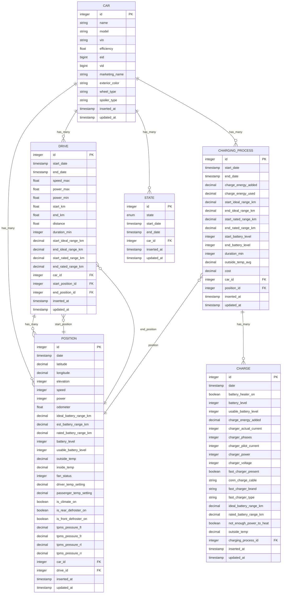

# 实体关系图与表结构

<cite>
**本文档中引用的文件**  
- [car.ex](file://lib/teslamate/log/car.ex)
- [drive.ex](file://lib/teslamate/log/drive.ex)
- [charge.ex](file://lib/teslamate/log/charge.ex)
- [charging_process.ex](file://lib/teslamate/log/charging_process.ex)
- [position.ex](file://lib/teslamate/log/position.ex)
- [state.ex](file://lib/teslamate/log/state.ex)
- [20190330150000_create_car.exs](file://priv/repo/migrations/20190330150000_create_car.exs)
- [20190330160000_create_trips.exs](file://priv/repo/migrations/20190330160000_create_trips.exs)
- [20190330170000_create_positions.exs](file://priv/repo/migrations/20190330170000_create_positions.exs)
- [20190330180000_create_states.exs](file://priv/repo/migrations/20190330180000_create_states.exs)
- [20190330190000_create_charging_processes.exs](file://priv/repo/migrations/20190330190000_create_charging_processes.exs)
- [20190330200000_create_charges.exs](file://priv/repo/migrations/20190330200000_create_charges.exs)
- [20190812191616_rename_trips_to_drives.exs](file://priv/repo/migrations/20190812191616_rename_trips_to_drives.exs)
- [20191003130650_add_start_and_end_position_to_drives.exs](file://priv/repo/migrations/20191003130650_add_start_and_end_position_to_drives.exs)
</cite>

## 目录
1. [简介](#简介)
2. [实体关系图](#实体关系图)
3. [核心表结构](#核心表结构)
4. [表间关系说明](#表间关系说明)
5. [数据示例](#数据示例)

## 简介
本文件详细描述了TeslaMate系统中与车辆使用相关的数据库实体关系模型。通过分析Ecto模型定义和迁移文件，展示了Car（车辆）、Drive（行驶）、ChargingProcess（充电过程）、Charge（充电记录）、Position（位置）和State（状态）等核心实体之间的关系。文档包括完整的ER图、各表的字段定义、主外键约束以及实际数据示例，帮助理解系统的数据结构设计。

## 实体关系图



**图示来源**
- [car.ex](file://lib/teslamate/log/car.ex#L8-L30)
- [drive.ex](file://lib/teslamate/log/drive.ex#L8-L38)
- [position.ex](file://lib/teslamate/log/position.ex#L7-L38)
- [charging_process.ex](file://lib/teslamate/log/charging_process.ex#L8-L28)
- [charge.ex](file://lib/teslamate/log/charge.ex#L7-L29)
- [state.ex](file://lib/teslamate/log/state.ex#L7-L13)

## 核心表结构

### 车辆表 (cars)
存储车辆基本信息。

**字段定义：**
- `id`: 主键，自增整数
- `name`: 车辆名称，字符串
- `model`: 车型，字符串
- `vin`: 车辆识别码，字符串，唯一约束
- `efficiency`: 效率，浮点数
- `eid`: 车辆外部ID，整数，唯一约束
- `vid`: 车辆内部ID，整数，唯一约束
- `marketing_name`: 市场名称，字符串
- `exterior_color`: 外观颜色，字符串
- `wheel_type`: 轮毂类型，字符串
- `spoiler_type`: 尾翼类型，字符串
- `inserted_at`, `updated_at`: 时间戳

**主键：** `id`  
**唯一约束：** `vin`, `eid`, `vid`  
**外键：** 无

**节来源**
- [car.ex](file://lib/teslamate/log/car.ex#L8-L30)
- [20190330150000_create_car.exs](file://priv/repo/migrations/20190330150000_create_car.exs#L5-L15)

### 行驶记录表 (drives)
记录每次驾驶行程的汇总信息。

**字段定义：**
- `id`: 主键，自增整数
- `start_date`: 开始时间，UTC时间戳
- `end_date`: 结束时间，UTC时间戳
- `speed_max`: 最高速度，整数
- `power_max`: 最大功率，整数
- `power_min`: 最小功率，整数
- `start_km`: 开始里程，浮点数
- `end_km`: 结束里程，浮点数
- `distance`: 行驶距离，浮点数
- `duration_min`: 持续时间（分钟），整数
- `start_ideal_range_km`: 开始时理想续航，小数
- `end_ideal_range_km`: 结束时理想续航，小数
- `start_rated_range_km`: 开始时额定续航，小数
- `end_rated_range_km`: 结束时额定续航，小数
- `car_id`: 车辆ID，外键引用`cars.id`
- `start_position_id`: 起点位置ID，外键引用`positions.id`
- `end_position_id`: 终点位置ID，外键引用`positions.id`

**主键：** `id`  
**外键：** `car_id` → `cars.id`, `start_position_id` → `positions.id`, `end_position_id` → `positions.id`

**节来源**
- [drive.ex](file://lib/teslamate/log/drive.ex#L8-L38)
- [20190330160000_create_trips.exs](file://priv/repo/migrations/20190330160000_create_trips.exs#L5-L25)
- [20190812191616_rename_trips_to_drives.exs](file://priv/repo/migrations/20190812191616_rename_trips_to_drives.exs#L5-L6)
- [20191003130650_add_start_and_end_position_to_drives.exs](file://priv/repo/migrations/20191003130650_add_start_and_end_position_to_drives.exs#L6-L7)

### 位置记录表 (positions)
存储车辆在特定时间点的详细位置和状态信息。

**字段定义：**
- `id`: 主键，自增整数
- `date`: 时间戳，UTC时间
- `latitude`: 纬度，小数
- `longitude`: 经度，小数
- `elevation`: 海拔，整数
- `speed`: 速度，整数
- `power`: 功率，整数
- `odometer`: 里程表读数，浮点数
- `ideal_battery_range_km`: 理想电池续航，小数
- `est_battery_range_km`: 预估电池续航，小数
- `rated_battery_range_km`: 额定电池续航，小数
- `battery_level`: 电池电量百分比，整数
- `usable_battery_level`: 可用电池电量，整数
- `outside_temp`: 外部温度，小数
- `inside_temp`: 内部温度，小数
- `fan_status`: 风扇状态，整数
- `driver_temp_setting`: 驾驶员温度设定，小数
- `passenger_temp_setting`: 乘客温度设定，小数
- `is_climate_on`: 空调是否开启，布尔值
- `is_rear_defroster_on`: 后除霜器是否开启，布尔值
- `is_front_defroster_on`: 前除霜器是否开启，布尔值
- `tpms_pressure_fl`: 左前胎压，小数
- `tpms_pressure_fr`: 右前胎压，小数
- `tpms_pressure_rl`: 左后胎压，小数
- `tpms_pressure_rr`: 右后胎压，小数
- `car_id`: 车辆ID，外键引用`cars.id`
- `drive_id`: 所属行程ID，外键引用`drives.id`

**主键：** `id`  
**外键：** `car_id` → `cars.id`, `drive_id` → `drives.id`

**节来源**
- [position.ex](file://lib/teslamate/log/position.ex#L7-L38)
- [20190330170000_create_positions.exs](file://priv/repo/migrations/20190330170000_create_positions.exs#L5-L24)

### 充电过程表 (charging_processes)
记录一次完整的充电过程的汇总信息。

**字段定义：**
- `id`: 主键，自增整数
- `start_date`: 开始时间，UTC时间戳
- `end_date`: 结束时间，UTC时间戳
- `charge_energy_added`: 添加的电能，小数
- `charge_energy_used`: 消耗的电能，小数
- `start_ideal_range_km`: 开始时理想续航，小数
- `end_ideal_range_km`: 结束时理想续航，小数
- `start_rated_range_km`: 开始时额定续航，小数
- `end_rated_range_km`: 结束时额定续航，小数
- `start_battery_level`: 开始时电池电量，整数
- `end_battery_level`: 结束时电池电量，整数
- `duration_min`: 持续时间（分钟），整数
- `outside_temp_avg`: 平均外部温度，小数
- `cost`: 成本，小数
- `car_id`: 车辆ID，外键引用`cars.id`
- `position_id`: 位置ID，外键引用`positions.id`

**主键：** `id`  
**外键：** `car_id` → `cars.id`, `position_id` → `positions.id`

**节来源**
- [charging_process.ex](file://lib/teslamate/log/charging_process.ex#L8-L27)
- [20190330190000_create_charging_processes.exs](file://priv/repo/migrations/20190330190000_create_charging_processes.exs#L5-L19)

### 充电记录表 (charges)
记录充电过程中的详细采样数据。

**字段定义：**
- `id`: 主键，自增整数
- `date`: 时间戳，UTC时间
- `battery_heater_on`: 电池加热器是否开启，布尔值
- `battery_level`: 电池电量百分比，整数
- `usable_battery_level`: 可用电池电量，整数
- `charge_energy_added`: 添加的电能，小数
- `charger_actual_current`: 实际充电电流，整数
- `charger_phases`: 充电相数，整数
- `charger_pilot_current`: 充电导引电流，整数
- `charger_power`: 充电功率，整数
- `charger_voltage`: 充电电压，整数
- `fast_charger_present`: 是否为超级充电，布尔值
- `conn_charge_cable`: 连接的充电线缆，字符串
- `fast_charger_brand`: 超级充电品牌，字符串
- `fast_charger_type`: 超级充电类型，字符串
- `ideal_battery_range_km`: 理想电池续航，小数
- `rated_battery_range_km`: 额定电池续航，小数
- `not_enough_power_to_heat`: 电力不足无法加热，布尔值
- `outside_temp`: 外部温度，小数
- `charging_process_id`: 所属充电过程ID，外键引用`charging_processes.id`

**主键：** `id`  
**外键：** `charging_process_id` → `charging_processes.id`

**节来源**
- [charge.ex](file://lib/teslamate/log/charge.ex#L7-L29)
- [20190330200000_create_charges.exs](file://priv/repo/migrations/20190330200000_create_charges.exs#L5-L23)

### 状态记录表 (states)
记录车辆的在线状态变化。

**字段定义：**
- `id`: 主键，自增整数
- `state`: 状态，枚举类型（'online', 'offline', 'asleep'）
- `start_date`: 状态开始时间，UTC时间戳
- `end_date`: 状态结束时间，UTC时间戳
- `car_id`: 车辆ID，外键引用`cars.id`

**主键：** `id`  
**外键：** `car_id` → `cars.id`  
**检查约束：** `end_date >= start_date`  
**唯一约束：** 每辆车只能有一个`end_date IS NULL`的记录（表示当前状态）

**节来源**
- [state.ex](file://lib/teslamate/log/state.ex#L7-L13)
- [20190330180000_create_states.exs](file://priv/repo/migrations/20190330180000_create_states.exs#L5-L15)
- [20190821143938_add_constraints.exs](file://priv/repo/migrations/20190821143938_add_constraints.exs#L5-L6)

## 表间关系说明

### 车辆与行驶记录 (Car → Drive)
**关系类型：** 一对多  
**描述：** 一辆车可以有多个行驶记录。`drives`表中的`car_id`字段外键引用`cars`表的`id`字段。当车辆开始一次新的驾驶时，会创建一个新的`Drive`记录。

### 行驶记录与位置记录 (Drive → Position)
**关系类型：** 一对多  
**描述：** 一次行驶包含多个位置采样点。`positions`表中的`drive_id`字段外键引用`drives`表的`id`字段。此外，`drives`表还通过`start_position_id`和`end_position_id`分别引用`positions`表，表示行程的起点和终点位置。

### 充电过程与充电记录 (ChargingProcess → Charge)
**关系类型：** 一对多  
**描述：** 一个充电过程包含多个充电采样记录。`charges`表中的`charging_process_id`字段外键引用`charging_processes`表的`id`字段。系统会定期采集充电数据并存储为`Charge`记录。

### 充电过程与位置记录 (ChargingProcess → Position)
**关系类型：** 多对一  
**描述：** 每次充电过程都关联一个位置。`charging_processes`表中的`position_id`字段外键引用`positions`表的`id`字段，表示充电发生的位置。

### 位置记录与起点/终点关联 (Position → Drive)
**关系类型：** 多对一（双向）  
**描述：** `drives`表通过`start_position_id`和`end_position_id`两个字段分别引用`positions`表，建立行程与起点、终点位置的关联。这种设计允许快速查询行程的起止位置信息。

### 车辆与状态记录 (Car → State)
**关系类型：** 一对多  
**描述：** 一辆车有多个状态变更记录。`states`表中的`car_id`字段外键引用`cars`表的`id`字段。系统会记录车辆从在线、离线到休眠等状态的变化。

**节来源**
- [drive.ex](file://lib/teslamate/log/drive.ex#L27-L38)
- [position.ex](file://lib/teslamate/log/position.ex#L37-L38)
- [charging_process.ex](file://lib/teslamate/log/charging_process.ex#L23-L27)
- [charge.ex](file://lib/teslamate/log/charge.ex#L29)
- [state.ex](file://lib/teslamate/log/state.ex#L13)

## 数据示例

### 车辆记录示例
```json
{
  "id": 1,
  "name": "My Tesla",
  "model": "Model 3",
  "vin": "5YJSA1E14GF123456",
  "efficiency": 0.15,
  "eid": 123456789,
  "vid": 987654321,
  "marketing_name": "Model 3 Long Range",
  "exterior_color": "Midnight Silver",
  "wheel_type": "Pinecone",
  "spoiler_type": "None"
}
```

### 行驶记录示例
```json
{
  "id": 101,
  "start_date": "2023-01-15T08:30:00Z",
  "end_date": "2023-01-15T09:45:00Z",
  "speed_max": 120,
  "distance": 45.6,
  "duration_min": 75,
  "start_km": 15000.0,
  "end_km": 15045.6,
  "start_ideal_range_km": 420.5,
  "end_ideal_range_km": 380.2,
  "car_id": 1,
  "start_position_id": 1001,
  "end_position_id": 1150
}
```

### 位置记录示例
```json
{
  "id": 1001,
  "date": "2023-01-15T08:30:00Z",
  "latitude": 37.7749,
  "longitude": -122.4194,
  "speed": 0,
  "power": 0,
  "battery_level": 85,
  "ideal_battery_range_km": 420.5,
  "outside_temp": 15.5,
  "car_id": 1,
  "drive_id": 101
}
```

### 充电过程示例
```json
{
  "id": 201,
  "start_date": "2023-01-15T18:00:00Z",
  "end_date": "2023-01-15T20:30:00Z",
  "charge_energy_added": 45.2,
  "start_battery_level": 30,
  "end_battery_level": 80,
  "duration_min": 150,
  "car_id": 1,
  "position_id": 2001
}
```

### 充电记录示例
```json
{
  "id": 5001,
  "date": "2023-01-15T18:15:00Z",
  "battery_level": 45,
  "charge_energy_added": 12.5,
  "charger_power": 7,
  "charger_voltage": 240,
  "charger_actual_current": 30,
  "charging_process_id": 201
}
```

### 状态记录示例
```json
{
  "id": 301,
  "state": "online",
  "start_date": "2023-01-15T08:25:00Z",
  "end_date": "2023-01-15T09:50:00Z",
  "car_id": 1
}
```

**节来源**
- [car.ex](file://lib/teslamate/log/car.ex)
- [drive.ex](file://lib/teslamate/log/drive.ex)
- [position.ex](file://lib/teslamate/log/position.ex)
- [charging_process.ex](file://lib/teslamate/log/charging_process.ex)
- [charge.ex](file://lib/teslamate/log/charge.ex)
- [state.ex](file://lib/teslamate/log/state.ex)