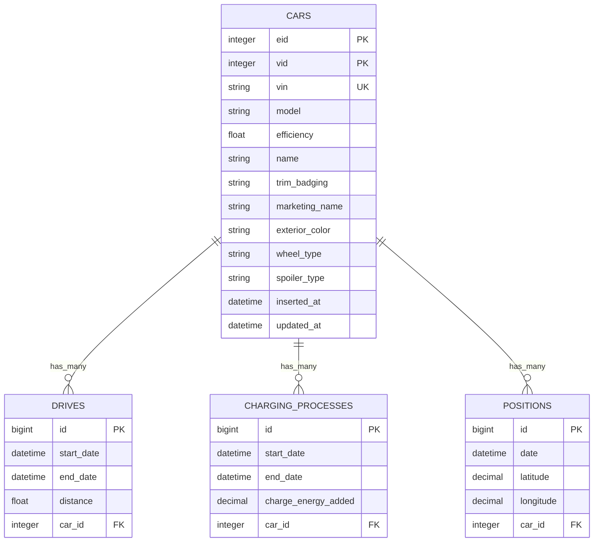
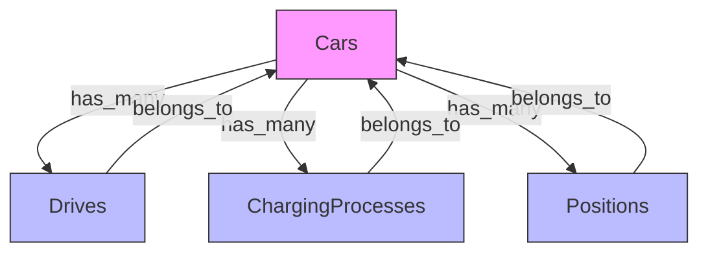

# 车辆表（Cars）结构

<cite>
**本文档中引用的文件**  
- [car.ex](file://lib/teslamate/log/car.ex)
- [create_car.exs](file://priv/repo/migrations/20190330150000_create_car.exs)
- [extend_car_table.exs](file://priv/repo/migrations/20190816165713_extend_car_table.exs)
- [do_not_require_efficiency.exs](file://priv/repo/migrations/20190828150058_do_not_require_efficiency.exs)
- [add_unique_index_on_vins.exs](file://priv/repo/migrations/20190903151524_add_unique_index_on_vins.exs)
- [drive.ex](file://lib/teslamate/log/drive.ex)
- [charging_process.ex](file://lib/teslamate/log/charging_process.ex)
- [position.ex](file://lib/teslamate/log/position.ex)
- [car_controller.ex](file://lib/teslamate_web/controllers/car_controller.ex)
</cite>

## 目录
1. [简介](#简介)
2. [车辆表核心字段](#车辆表核心字段)
3. [主键与唯一索引](#主键与唯一索引)
4. [与其他表的关系](#与其他表的关系)
5. [Ecto模型与迁移文件分析](#ecto模型与迁移文件分析)
6. [实际数据示例](#实际数据示例)
7. [使用场景](#使用场景)

## 简介
车辆表（Cars）是TeslaMate系统中的核心实体，用于存储每辆特斯拉车辆的静态信息和配置。该表作为数据模型的中心，与驾驶记录、充电过程和位置数据等动态表建立一对多关系。本文档详细说明其字段定义、数据类型、业务含义以及在系统中的作用。

**Section sources**
- [car.ex](file://lib/teslamate/log/car.ex#L1-L54)

## 车辆表核心字段
车辆表包含多个关键字段，用于标识和描述车辆的基本属性：

- **eid**: 车辆的外部ID（External ID），数据类型为整数（:integer），用于与特斯拉API通信时唯一标识车辆。
- **vid**: 车辆的内部ID（Vehicle ID），数据类型为整数（:integer），由特斯拉系统分配，用于API调用。
- **model**: 车辆型号（如Model S、Model 3等），数据类型为字符串（:string），表示车辆的基本型号。
- **efficiency**: 能效系数，数据类型为浮点数（:float），表示车辆每公里能耗的效率值，用于能耗计算。
- **vin**: 车辆识别码（Vehicle Identification Number），数据类型为字符串（:string），全球唯一标识一辆车。
- **name**: 用户自定义的车辆名称，便于在多车环境中识别。
- **trim_badging**: 车辆配置标识（原version字段），表示具体配置版本（如Long Range、Performance等）。
- **marketing_name**: 市场营销名称，更人性化的车型展示名称。
- **exterior_color, wheel_type, spoiler_type**: 外观颜色、轮毂类型和尾翼类型，用于记录车辆外观配置。

**Section sources**
- [car.ex](file://lib/teslamate/log/car.ex#L8-L21)
- [create_car.exs](file://priv/repo/migrations/20190330150000_create_car.exs#L6-L9)
- [extend_car_table.exs](file://priv/repo/migrations/20190816165713_extend_car_table.exs#L6-L8)

## 主键与唯一索引
车辆表未显式定义传统主键，而是通过以下唯一约束确保数据完整性：

- **eid唯一索引**: 确保每辆车的外部ID唯一，防止重复导入。
- **vid唯一索引**: 确保车辆ID在系统中唯一。
- **vin唯一索引**: 通过迁移文件`add_unique_index_on_vins.exs`创建，保证车辆识别码的全局唯一性，避免重复注册。

这些唯一约束在Ecto模型中通过`unique_constraint`函数实现，并在数据库层面通过唯一索引强制执行。

**Diagram sources**
- [car.ex](file://lib/teslamate/log/car.ex#L8-L30)
- [drive.ex](file://lib/teslamate/log/drive.ex#L8-L36)
- [charging_process.ex](file://lib/teslamate/log/charging_process.ex#L8-L27)
- [position.ex](file://lib/teslamate/log/position.ex#L7-L38)

**Section sources**
- [create_car.exs](file://priv/repo/migrations/20190330150000_create_car.exs#L14-L15)
- [add_unique_index_on_vins.exs](file://priv/repo/migrations/20190903151524_add_unique_index_on_vins.exs#L5)

## 与其他表的关系
车辆表作为核心实体，与多个动态数据表建立了一对多关系：

- **与Drives表的关系**: 一辆车可以有多个驾驶行程记录。通过`has_many :drives, Drive`定义，在Drives表中通过`car_id`外键关联。
- **与ChargingProcesses表的关系**: 一辆车可以有多个充电过程记录。通过`has_many :charging_processes, ChargingProcess`定义，外键为`car_id`。
- **与Positions表的关系**: 一辆车可以有多个位置记录。通过`has_many :positions, Position`定义，用于存储车辆的历史位置数据。

这些关系在Ecto模型中通过`belongs_to`和`has_many`宏声明，并在数据库迁移中通过外键约束确保引用完整性。

**Diagram sources**
- [car.ex](file://lib/teslamate/log/car.ex#L25-L27)
- [drive.ex](file://lib/teslamate/log/drive.ex#L36)
- [charging_process.ex](file://lib/teslamate/log/charging_process.ex#L23)
- [position.ex](file://lib/teslamate/log/position.ex#L37)

**Section sources**
- [car.ex](file://lib/teslamate/log/car.ex#L25-L27)
- [drive.ex](file://lib/teslamate/log/drive.ex#L36)
- [charging_process.ex](file://lib/teslamate/log/charging_process.ex#L23)
- [position.ex](file://lib/teslamate/log/position.ex#L37)

## Ecto模型与迁移文件分析
车辆表的结构通过Ecto模型和多个迁移文件逐步构建：

- 初始迁移`create_car.exs`创建了基础字段（eid, vid, model, efficiency）。
- `extend_car_table.exs`添加了vin、name和version字段。
- `do_not_require_efficiency.exs`将efficiency和model字段修改为可为空，并将version重命名为trim_badging。
- `add_unique_index_on_vins.exs`为vin字段添加唯一索引，确保车辆识别码的唯一性。

Ecto模型`TeslaMate.Log.Car`定义了字段类型、关系（has_many）和变更集（changeset），其中`validate_required([:eid, :vid, :vin])`确保关键字段不为空。

**Section sources**
- [car.ex](file://lib/teslamate/log/car.ex#L33-L53)
- [create_car.exs](file://priv/repo/migrations/20190330150000_create_car.exs)
- [do_not_require_efficiency.exs](file://priv/repo/migrations/20190828150058_do_not_require_efficiency.exs)
- [extend_car_table.exs](file://priv/repo/migrations/20190816165713_extend_car_table.exs)

## 实际数据示例
一个典型的车辆记录可能如下所示：

- eid: 123456789
- vid: 987654321
- vin: 5YJSA1E14GF123456
- model: "Model 3"
- trim_badging: "Long Range"
- marketing_name: "Model 3 Long Range"
- efficiency: 0.15
- name: "My Tesla"
- exterior_color: "Pearl White"
- wheel_type: "18in Aero"
- spoiler_type: "None"

这些数据在车辆首次注册时从特斯拉API获取并存入数据库。

**Section sources**
- [car.ex](file://lib/teslamate/log/car.ex#L8-L21)

## 使用场景
车辆表在两个主要场景中被使用：

1. **车辆注册**: 当用户添加新车时，系统通过特斯拉API获取车辆信息（eid, vid, vin, model等），创建新的车辆记录，并设置默认名称和能效值。
2. **数据采集**: 在车辆数据同步过程中，系统根据eid或vid查找对应的车辆记录，然后将驾驶、充电和位置数据关联到该车辆。车辆的efficiency值用于计算能耗和续航里程。

控制器`car_controller.ex`处理车辆相关的HTTP请求，如列表展示和详情查看，为前端提供车辆数据。

**Section sources**
- [car.ex](file://lib/teslamate/log/car.ex)
- [car_controller.ex](file://lib/teslamate_web/controllers/car_controller.ex)