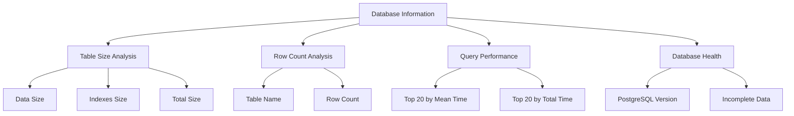

# 性能监控与优化

<cite>
**本文档中引用的文件**  
- [config.exs](file://config/config.exs)
- [runtime.exs](file://config/runtime.exs)
- [repo.ex](file://lib/teslamate/repo.ex)
- [database-info.json](file://grafana/dashboards/database-info.json)
- [database_check.ex](file://lib/teslamate/database_check.ex)
- [manually_fixing_data.mdx](file://website/docs/maintenance/manually_fixing_data.mdx)
- [development.mdx](file://website/docs/development.mdx)
- [AddCompositeIndexToPositions.exs](file://priv/repo/migrations/20230417225712_composite_index_to_position.exs)
- [AddCompositeIndexWithPredicateToPositions.exs](file://priv/repo/migrations/20240915193446_composite_index_with_predicate_to_position.exs)
- [DropUnusedIndexes.exs](file://priv/repo/migrations/20200502140646_drop_unused_indexes.exs)
</cite>

## 目录
1. [引言](#引言)
2. [数据库性能监控策略](#数据库性能监控策略)
3. [关键性能指标监控](#关键性能指标监控)
4. [Grafana仪表板实现](#grafana仪表板实现)
5. [查询优化技巧](#查询优化技巧)
6. [大数据量处理策略](#大数据量处理策略)
7. [VACUUM和ANALYZE操作](#vacuum和analyze操作)
8. [结论](#结论)

## 引言
TeslaMate是一个用于跟踪特斯拉车辆数据的应用程序，它使用PostgreSQL作为其主要数据库。随着数据量的增长，数据库性能监控和优化变得至关重要。本文档将详细介绍如何利用PostgreSQL的统计信息和慢查询日志来识别性能瓶颈，监控关键性能指标，并通过Grafana仪表板实现实时监控。同时，还将提供查询优化、分区策略和维护操作的最佳实践。

**Section sources**
- [config.exs](file://config/config.exs)
- [repo.ex](file://lib/teslamate/repo.ex)

## 数据库性能监控策略

### 利用PostgreSQL统计信息识别性能瓶颈
TeslaMate通过集成PostgreSQL的`pg_stat_statements`扩展来收集SQL语句的执行统计信息。这个扩展提供了关于查询执行时间、调用次数和资源消耗的详细数据，是识别性能瓶颈的关键工具。

在`database-info.json`仪表板中，通过查询`pg_stat_statements`视图来获取最耗时的SQL语句：
```sql
SELECT 
  calls as "Calls",
  mean_exec_time as "Mean Exec Time",
  total_exec_time as "Total Exec Time",
  query as "Query"
FROM pg_stat_statements
ORDER BY mean_exec_time desc
limit 20;
```

这种方法可以帮助识别平均执行时间最长的查询，这些通常是性能优化的首要目标。同时，还可以通过按调用次数排序来识别频繁执行的查询：
```sql
SELECT 
  query, 
  calls, 
  mean_exec_time, 
  total_exec_time 
FROM pg_stat_statements 
ORDER BY calls DESC 
LIMIT 10;
```

### 慢查询日志分析
虽然项目中没有直接配置慢查询日志，但通过`pg_stat_statements`可以实现类似的功能。当`pg_stat_statements`启用时，系统会自动跟踪所有SQL语句的执行情况，包括执行时间。通过监控`mean_exec_time`和`total_exec_time`指标，可以有效地识别出执行时间过长的查询。

在`database-info.json`仪表板中，通过条件查询来控制`pg_stat_statements`相关面板的显示：
```sql
SELECT EXISTS (
SELECT 1
FROM information_schema.tables
WHERE table_name = 'pg_stat_statements'
)::int AS table_existence
```

这种设计确保了只有在`pg_stat_statements`扩展启用时，相关的性能监控面板才会显示，避免了不必要的错误。

**Section sources**
- [database-info.json](file://grafana/dashboards/database-info.json)
- [development.mdx](file://website/docs/development.mdx)

## 关键性能指标监控

### 查询响应时间
查询响应时间是衡量数据库性能的核心指标。在TeslaMate的`database-info.json`仪表板中，通过`pg_stat_statements`扩展监控查询的平均执行时间和总执行时间。

- **平均执行时间**：反映单次查询的性能，用于识别最慢的查询
- **总执行时间**：反映查询的整体资源消耗，用于识别对系统影响最大的查询
- **调用次数**：反映查询的频率，高频查询即使单次执行时间短也可能成为性能瓶颈

这些指标通过Grafana的表格面板直观展示，帮助用户快速识别需要优化的查询。

### 连接数监控
虽然在提供的文件中没有直接的连接数监控配置，但PostgreSQL的连接管理对性能至关重要。TeslaMate通过配置文件中的`pool_size`参数来管理数据库连接池大小：

```elixir
config :teslamate, TeslaMate.Repo,
  pool_size: System.get_env("DATABASE_POOL_SIZE", "10") |> String.to_integer()
```

合理的连接池大小可以避免过多的并发连接导致数据库性能下降，同时确保应用程序有足够的连接来处理请求。

### 缓存命中率
缓存命中率是衡量数据库内存使用效率的重要指标。虽然在提供的文件中没有直接的缓存命中率监控，但PostgreSQL的`pg_statio_user_tables`视图提供了相关统计信息。通过监控缓冲区命中率，可以评估数据库的内存使用效率，决定是否需要调整共享缓冲区大小。

**Section sources**
- [runtime.exs](file://config/runtime.exs)
- [database-info.json](file://grafana/dashboards/database-info.json)

## Grafana仪表板实现

### database-info.json仪表板分析
`database-info.json`文件定义了一个全面的数据库监控仪表板，提供了数据库状态的全方位视图。



**Diagram sources**
- [database-info.json](file://grafana/dashboards/database-info.json)

### 仪表板核心功能
该仪表板包含多个关键组件：

1. **表大小分析**：通过查询`pg_statio_user_tables`视图，显示每个表的数据大小、索引大小和总大小
   ```sql
   SELECT 
      relname AS "Table",
      pg_relation_size(relid) as "Data",
      pg_indexes_size(relid) as "Indexes",
      pg_total_relation_size(relid) As "Total"
   FROM pg_catalog.pg_statio_user_tables
   ORDER BY pg_total_relation_size(relid) DESC;
   ```

2. **行数统计**：显示每个表的记录数，帮助识别数据量大的表
   ```sql
   SELECT table_name AS "Table Name", 
          (xpath('/row/cnt/text()', xml_count))[1]::text::int AS "Row Count"
   FROM (
       SELECT table_name, 
              query_to_xml(format('SELECT count(*) as cnt FROM %I.%I', table_schema, table_name), false, true, '') AS xml_count
       FROM information_schema.tables
       WHERE table_schema NOT IN ('pg_catalog', 'information_schema') and table_type = 'BASE TABLE'
   ) AS t
   ORDER BY 2 DESC;
   ```

3. **性能统计**：通过`pg_stat_statements`扩展监控SQL执行性能，识别最耗时的查询

4. **数据库健康检查**：显示不完整的充电和驾驶记录，帮助用户发现数据问题

**Section sources**
- [database-info.json](file://grafana/dashboards/database-info.json)

## 查询优化技巧

### 索引优化
TeslaMate通过迁移文件中的索引创建和优化来提高查询性能。项目中采用了多种索引优化策略：

1. **复合索引**：在`positions`表上创建复合索引，提高基于多个列的查询性能
   ```elixir
   create index(:positions, [:drive_id, :date])
   ```

2. **带条件的复合索引**：针对特定查询模式创建带WHERE条件的索引，减少索引大小并提高查询效率
   ```elixir
   create index(:positions, [:car_id, :date, "(ideal_battery_range_km IS NOT NULL)"],
                where: "ideal_battery_range_km IS NOT NULL"
              )
   ```

3. **索引清理**：定期清理不再使用的索引，减少维护开销
   ```elixir
   drop_if_exists(index(:positions, ["ll_to_earth(latitude, longitude)"], using: "gist"))
   ```

### 查询重写
在`log.ex`文件中，可以看到使用了复杂的SQL查询来计算驾驶数据的统计信息：

```elixir
non_streamed_drive_data =
  from p in Position,
    select: %{
      start_ideal_range_km: first_value(p.ideal_battery_range_km) |> over(:w),
      end_ideal_range_km: last_value(p.ideal_battery_range_km) |> over(:w),
      start_rated_range_km: first_value(p.rated_battery_range_km) |> over(:w),
      end_rated_range_km: last_value(p.rated_battery_range_km) |> over(:w)
    },
    windows: [
      w: [
        order_by:
          fragment("? RANGE BETWEEN UNBOUNDED PRECEDING AND UNBOUNDED FOLLOWING", p.date)
      ]
    ],
    where:
      p.drive_id == ^id and
        not is_nil(p.ideal_battery_range_km) and
        not is_nil(p.odometer),
    limit: 1
```

这种查询重写利用了窗口函数和CTE（公用表表达式），避免了多次查询数据库，提高了性能。

### 批量操作
虽然在提供的文件中没有直接的批量操作示例，但通过Ecto框架的批量插入和更新功能，可以实现高效的批量数据处理。对于大量数据导入场景，建议使用COPY命令或批量INSERT语句，而不是逐条插入。

**Section sources**
- [AddCompositeIndexToPositions.exs](file://priv/repo/migrations/20230417225712_composite_index_to_position.exs)
- [AddCompositeIndexWithPredicateToPositions.exs](file://priv/repo/migrations/20240915193446_composite_index_with_predicate_to_position.exs)
- [DropUnusedIndexes.exs](file://priv/repo/migrations/20200502140646_drop_unused_indexes.exs)
- [log.ex](file://lib/teslamate/log.ex)

## 大数据量处理策略

### 分区策略
虽然在提供的文件中没有明确的分区配置，但对于TeslaMate这种数据量持续增长的应用，分区是必要的性能优化策略。建议的分区策略包括：

1. **按时间分区**：将`positions`、`drives`和`charging_processes`等大表按月或按年分区，提高查询性能和维护效率
2. **按车辆ID分区**：对于多车辆用户，可以按`car_id`进行分区，隔离不同车辆的数据

### 归档方案
对于历史数据，建议实施归档策略：
1. 将超过一定时间（如2年）的数据移动到归档表或归档数据库
2. 使用只读副本处理历史数据分析查询
3. 定期清理不再需要的临时数据

**Section sources**
- [manually_fixing_data.mdx](file://website/docs/maintenance/manually_fixing_data.mdx)

## VACUUM和ANALYZE操作

### VACUUM操作
当数据库经历大量更新或删除操作时（如从其他来源导入数据或删除借用的车辆），可能会遇到索引膨胀，这会降低性能。在这种情况下，重新索引可能有益：

```sql
REINDEX DATABASE teslamate
```

在`manually_fixing_data.mdx`文档中，提供了重新索引数据库的指导：
1. 连接到运行中的TeslaMate数据库
2. 执行`REINDEX DATABASE teslamate`命令
3. 退出提示

### ANALYZE操作
ANALYZE操作更新表的统计信息，帮助查询规划器做出更好的决策。虽然在提供的文件中没有直接的ANALYZE调用，但PostgreSQL的自动清理进程通常会处理这个问题。对于大型表或频繁更新的表，建议定期手动执行ANALYZE：

```sql
ANALYZE table_name;
```

### 自动维护
PostgreSQL的自动清理（autovacuum）进程会自动执行VACUUM和ANALYZE操作。可以通过调整以下参数来优化自动维护：
- `autovacuum_vacuum_scale_factor`：触发VACUUM的阈值
- `autovacuum_analyze_scale_factor`：触发ANALYZE的阈值
- `autovacuum_naptime`：自动清理进程的休眠时间

**Section sources**
- [manually_fixing_data.mdx](file://website/docs/maintenance/manually_fixing_data.mdx)

## 结论
TeslaMate通过综合的数据库性能监控和优化策略，确保了在处理大量车辆数据时的高效性能。通过利用PostgreSQL的统计信息和`pg_stat_statements`扩展，结合Grafana仪表板，实现了全面的性能监控。索引优化、查询重写和适当的维护操作共同构成了一个完整的性能优化体系。

对于用户而言，建议定期监控`database-info.json`仪表板中的关键指标，及时识别性能瓶颈。当数据量较大时，考虑实施分区和归档策略。在进行大量数据导入或删除操作后，执行VACUUM和REINDEX操作以保持数据库性能。

通过遵循这些最佳实践，可以确保TeslaMate系统在长期运行中保持高性能和稳定性。