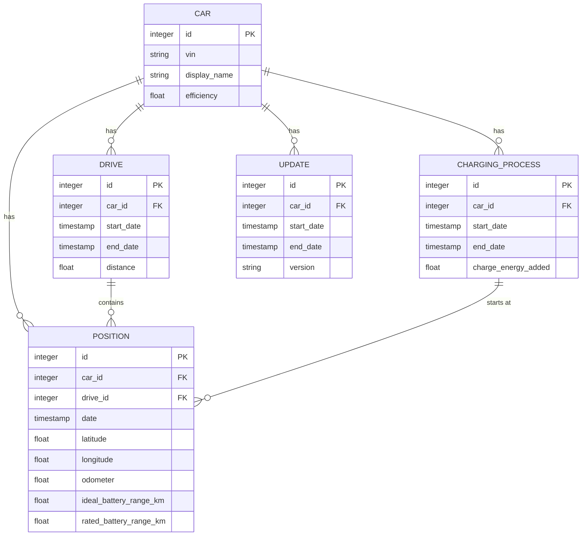

# 性能调优

<cite>
**本文档中引用的文件**  
- [database-info.json](file://grafana/dashboards/database-info.json)
- [log.ex](file://lib/teslamate/log.ex)
- [repo.ex](file://lib/teslamate/repo.ex)
- [runtime.exs](file://config/runtime.exs)
- [maintenance.nix](file://nix/maintenance.nix)
- [AddCompositeIndexToPositions.exs](file://priv/repo/migrations/20230417225712_composite_index_to_position.exs)
- [AddCompositeIndexWithPredicateToPositions.exs](file://priv/repo/migrations/20240915193446_composite_index_with_predicate_to_position.exs)
- [AddIndexesOnDates.exs](file://priv/repo/migrations/20190416125429_add_indexes_on_dates.exs)
- [DropUnusedIndexes.exs](file://priv/repo/migrations/20200502140646_drop_unused_indexes.exs)
</cite>

## 目录
1. [引言](#引言)
2. [VACUUM与ANALYZE操作策略](#vacuum与analyze操作策略)
3. [索引优化策略](#索引优化策略)
4. [高频率数据库操作性能分析](#高频率数据库操作性能分析)
5. [系统级调优建议](#系统级调优建议)
6. [维护与监控](#维护与监控)
7. [结论](#结论)

## 引言

TeslaMate是一个用于跟踪和分析特斯拉车辆数据的开源系统，其核心功能依赖于PostgreSQL数据库来存储车辆状态、驾驶记录、充电过程等大量时间序列数据。随着数据量的增长，数据库性能可能成为系统瓶颈。本指南基于`database-info.json`仪表板提供的监控数据，结合代码库中的业务逻辑，提供全面的性能调优建议。我们将重点讨论自动和手动清理策略、索引优化、高频率操作的性能影响以及系统级配置调整，以确保系统在长期运行中保持高效稳定。

## VACUUM与ANALYZE操作策略

PostgreSQL的VACUUM和ANALYZE是维护数据库健康和性能的关键操作。VACUUM回收因更新和删除而产生的死元组所占用的空间，防止表膨胀；ANALYZE收集表的统计信息，供查询规划器生成高效的执行计划。

在TeslaMate系统中，数据写入非常频繁，尤其是`positions`、`charges`和`updates`表。根据`database-info.json`仪表板的监控，这些表的行数和数据量持续增长。PostgreSQL的自动清理（autovacuum）进程会自动执行VACUUM和ANALYZE，但其默认配置可能不足以应对TeslaMate的高写入负载。

**自动清理时机**：
- **VACUUM**：当一个表的死亡元组数量超过`autovacuum_vacuum_threshold`加上`autovacuum_vacuum_scale_factor`与表大小的乘积时触发。对于TeslaMate，由于`positions`表可能有数百万行，即使`scale_factor`为0.2，也需要积累大量死亡元组才会触发。建议调低`autovacuum_vacuum_scale_factor`以更频繁地清理。
- **ANALYZE**：当一个表的插入、更新或删除的总行数超过`autovacuum_analyze_threshold`加上`autovacuum_analyze_scale_factor`与表大小的乘积时触发。这对于确保查询规划器（如在`log.ex`中用于计算驾驶和充电统计的复杂查询）使用最新统计信息至关重要。

**手动清理时机**：
- **批量数据导入后**：当使用`IMPORT_DIR`功能导入历史数据时，会进行大量的INSERT操作，随后可能进行UPDATE操作来修正数据。这会产生大量死亡元组，建议在导入完成后手动执行`VACUUM ANALYZE table_name`。
- **大规模数据修正后**：如果使用`teslamate-close-drive`或`teslamate-close-charge`脚本修正不完整的驾驶或充电记录，会更新相关记录，产生死亡元组，应进行手动VACUUM。
- **性能显著下降时**：如果通过`database-info.json`仪表板观察到查询延迟增加，且`pg_stat_user_tables`中`n_dead_tup`（死亡元组数）很高，应立即执行手动VACUUM。

**Section sources**
- [database-info.json](file://grafana/dashboards/database-info.json#L619-L647)
- [runtime.exs](file://config/runtime.exs#L118-L121)
- [maintenance.nix](file://nix/maintenance.nix#L13-L34)

## 索引优化策略

索引是提高查询性能的核心，但不当的索引会增加写入开销并占用存储空间。TeslaMate的迁移文件显示了其索引策略的演进。

**识别缺失索引**：
- **查询性能分析**：`database-info.json`仪表板包含“Top 20 Statements”面板，通过`pg_stat_statements`视图监控执行时间最长和调用次数最多的SQL语句。这些是优化的首要目标。例如，`log.ex`中`get_latest_position/1`函数执行`ORDER BY date DESC LIMIT 1`，如果没有`positions(date)`索引，将进行全表扫描。`20190416125429_add_indexes_on_dates.exs`迁移文件证实了这一点，它为`positions`和`charges`表的`date`字段创建了索引。
- **复合查询**：`get_positions_without_elevation/2`函数根据`id`和`date`范围查询`positions`表。`20230417225712_composite_index_to_position.exs`迁移文件创建了`(:drive_id, :date)`复合索引，但`get_positions_without_elevation`查询的是`id > min_id AND date > naive_date_earliest`。虽然`id`是主键，但为`date`字段单独或创建`(date, id)`索引可能更优，因为查询按`date`过滤后按`id`排序。

**识别冗余索引**：
- **重复索引**：当存在`(a, b)`的复合索引时，单独的`(a)`索引通常是冗余的，因为复合索引可以用于仅查询`a`的场景。
- **未使用的索引**：`database-info.json`的“Index Statistics”面板显示了每个索引的扫描次数(`idx_scan`)。扫描次数为0或极低的索引是候选的删除对象。`20200502140646_drop_unused_indexes.exs`迁移文件就是一个例子，它删除了基于`ll_to_earth`函数的GIST索引，表明这些索引不再被使用，可能已被更高效的查询方式取代。

**优化的索引策略**：
- **部分索引**：`20240915193446_composite_index_with_predicate_to_position.exs`迁移文件创建了一个部分索引`(:car_id, :date, "(ideal_battery_range_km IS NOT NULL)")`，仅包含`ideal_battery_range_km`不为空的行。这对于`get_positions_without_elevation`等查询非常高效，因为它直接过滤了需要处理的行，减少了索引大小和扫描时间。
- **索引建议**：对于`drives`和`charging_processes`表，`car_id`是常见的查询条件。虽然外键通常有索引，但应检查`pg_stat_all_indexes`确认`car_id`索引的使用率。如果`list_cars`等查询频繁，确保`cars`表的主键索引有效。

**Diagram sources**
- [log.ex](file://lib/teslamate/log.ex#L11)
- [AddCompositeIndexToPositions.exs](file://priv/repo/migrations/20230417225712_composite_index_to_position.exs#L5)
- [AddCompositeIndexWithPredicateToPositions.exs](file://priv/repo/migrations/20240915193446_composite_index_with_predicate_to_position.exs#L5)

**Section sources**
- [AddIndexesOnDates.exs](file://priv/repo/migrations/20190416125429_add_indexes_on_dates.exs#L5-L6)
- [DropUnusedIndexes.exs](file://priv/repo/migrations/20200502140646_drop_unused_indexes.exs#L5-L6)
- [AddCompositeIndexToPositions.exs](file://priv/repo/migrations/20230417225712_composite_index_to_position.exs#L5-L6)
- [AddCompositeIndexWithPredicateToPositions.exs](file://priv/repo/migrations/20240915193446_composite_index_with_predicate_to_position.exs#L5-L6)
- [database-info.json](file://grafana/dashboards/database-info.json#L875-L883)

## 高频率数据库操作性能分析

TeslaMate的核心业务逻辑涉及大量高频率的数据库操作，主要集中在`log.ex`模块。这些操作的性能直接影响系统的响应速度和资源消耗。

**性能影响分析**：
- **频繁的INSERT操作**：`insert_position/2`和`insert_charge/2`函数在车辆行驶和充电时被频繁调用。每次调用都涉及一次INSERT。虽然Ecto的Repo.insert是高效的，但高频率的写入会给WAL（Write-Ahead Log）和磁盘I/O带来压力。`positions`表没有触发器或复杂的约束，这有助于保持写入性能。
- **复杂的聚合查询**：`close_drive/2`和`complete_charging_process/1`函数在结束驾驶或充电时执行。它们使用复杂的Ecto查询和窗口函数（`over(:w)`）来计算距离、持续时间、平均速度等。这些查询需要扫描整个驾驶或充电过程的所有`positions`或`charges`记录。对于长距离驾驶，这可能涉及数千行数据，导致显著的CPU和I/O开销。
- **事务处理**：`start_state/3`函数使用`Repo.transaction`来确保状态转换的原子性。虽然事务保证了数据一致性，但长时间运行的事务会持有锁，可能阻塞其他操作。

**批量处理和缓存建议**：
- **批量写入**：目前的位置和充电数据是逐条插入的。可以考虑实现一个缓冲机制，将短时间内（如1秒内）收到的多条位置数据收集起来，然后通过`Repo.insert_all/3`一次性批量插入。这可以显著减少数据库连接和事务开销。但需权衡数据持久化的及时性。
- **缓存计算结果**：`close_drive/2`中的聚合计算是CPU密集型的。可以考虑在内存中维护一个驾驶过程的实时摘要（如总距离、最大速度），随着每条`position`的插入而更新。当调用`close_drive`时，直接使用缓存的摘要，避免全表扫描。Phoenix.PubSub可用于在分布式环境中同步缓存。
- **异步处理**：像`recalculate_efficiency/3`这样的计算，可以在后台任务中异步执行，而不是在`complete_charging_process/1`的同步流程中进行。这可以缩短API响应时间，改善用户体验。

**Section sources**
- [log.ex](file://lib/teslamate/log.ex#L146-L156)
- [log.ex](file://lib/teslamate/log.ex#L237-L374)
- [log.ex](file://lib/teslamate/log.ex#L439-L508)
- [log.ex](file://lib/teslamate/log.ex#L58-L77)

## 系统级调优建议

除了数据库内部的优化，系统级的配置对TeslaMate的整体性能至关重要。

**PostgreSQL配置参数调整**：
- **连接池**：`runtime.exs`中配置了`pool_size: 10`。如果应用服务器（Elixir）的并发请求超过10个，请求将排队等待数据库连接。根据负载情况，可适当增加此值，但需注意PostgreSQL的`max_connections`限制和内存消耗。
- **共享缓冲区**：`shared_buffers`是PostgreSQL用于缓存数据的内存区域。建议将其设置为主机内存的25%。更大的缓冲区可以减少磁盘I/O。
- **工作内存**：`work_mem`用于排序和哈希操作。`close_drive/2`中的聚合查询可能使用大量内存。适当增加`work_mem`可以避免将中间结果写入磁盘，但需谨慎，因为每个查询都可能使用这么多内存。
- **维护工作内存**：`maintenance_work_mem`用于VACUUM、CREATE INDEX等操作。增加此值可以显著加快这些维护任务的速度。

**硬件资源分配**：
- **存储**：使用SSD而非HDD是必须的，因为TeslaMate的I/O模式是随机读写。确保有足够的磁盘空间，因为数据库会持续增长。
- **内存**：充足的内存对于PostgreSQL的`shared_buffers`和操作系统的文件系统缓存至关重要。建议至少8GB RAM，16GB或更多更佳。
- **CPU**：虽然PostgreSQL可以很好地利用多核，但单个复杂查询通常是单线程的。因此，高主频的CPU比单纯的核心数量更重要。

**Section sources**
- [runtime.exs](file://config/runtime.exs#L118-L121)
- [repo.ex](file://lib/teslamate/repo.ex#L1-L5)

## 维护与监控

持续的监控和定期维护是保持系统高性能的关键。

**监控**：
- **Grafana仪表板**：`database-info.json`是核心监控工具。应定期检查“Database Total Size”、“Table Sizes”和“Index Statistics”面板，以了解增长趋势和索引效率。
- **查询性能**：利用`pg_stat_statements`扩展，重点关注“Top 20 Statements”中平均执行时间长或调用次数多的查询。

**维护**：
- **REINDEX**：如`manually_fixing_data.mdx`文档所述，REINDEX可以重建索引以消除索引膨胀（index bloat）。这在大量更新或删除后（如数据导入或修正）是必要的。执行`REINDEX DATABASE teslamate`。
- **定期备份**：在进行任何重大维护操作（如REINDEX）前，必须先备份数据库。

**Section sources**
- [database-info.json](file://grafana/dashboards/database-info.json#L966-L985)
- [database-info.json](file://grafana/dashboards/database-info.json#L1473-L1492)
- [manually_fixing_data.mdx](file://website/docs/maintenance/manually_fixing_data.mdx#L208)

## 结论

TeslaMate的性能调优是一个多层面的任务。首先，应充分利用`database-info.json`仪表板进行监控，理解系统的数据增长和查询模式。其次，通过优化VACUUM/ANALYZE策略和索引设计（特别是利用部分索引）来提升数据库内部效率。对于高频率的写入和复杂的聚合操作，考虑引入批量处理和缓存机制。最后，通过调整PostgreSQL配置和分配充足的硬件资源来提供强大的系统基础。定期的维护，如REINDEX，对于应对长期运行中的数据碎片化至关重要。通过综合应用这些策略，可以确保TeslaMate系统在处理海量车辆数据时保持高效、稳定和可扩展。