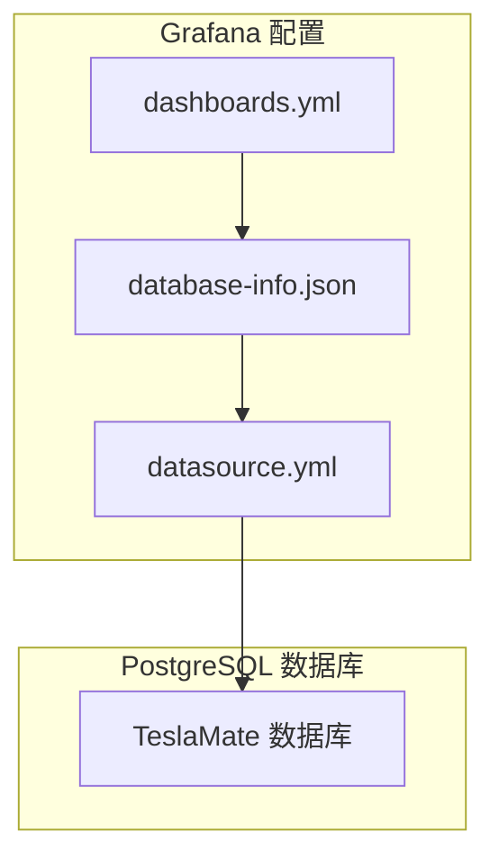
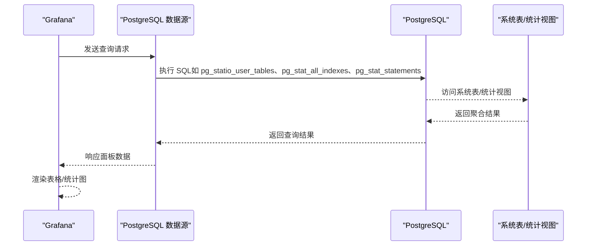
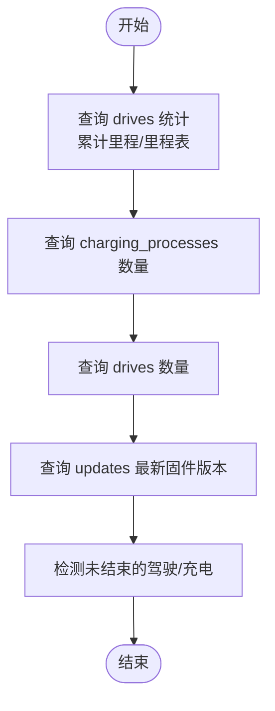
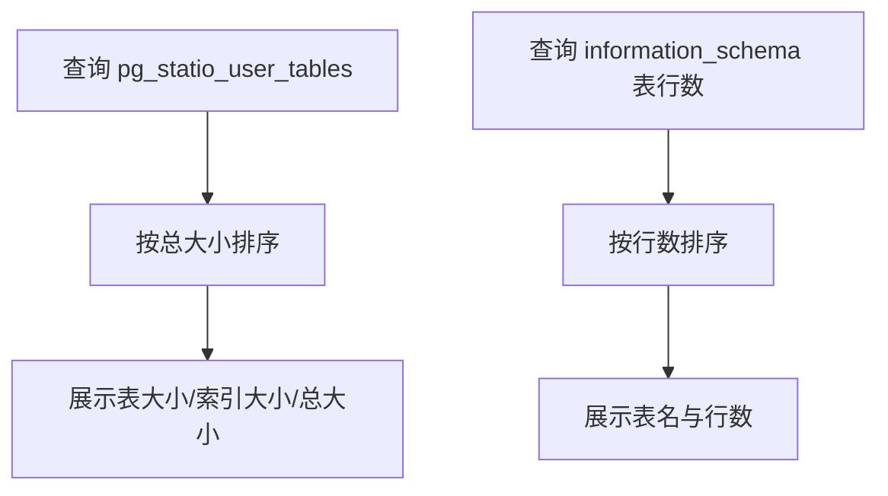
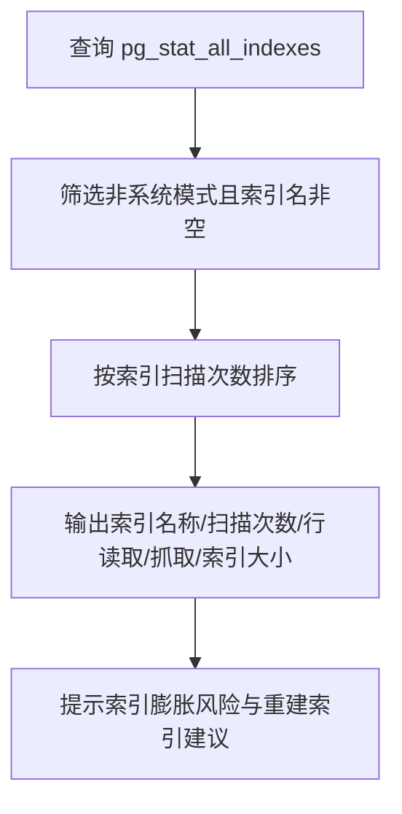
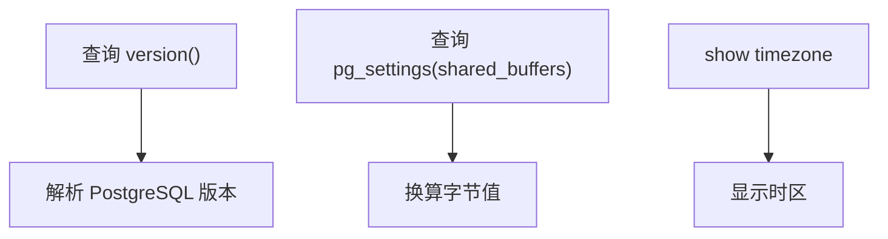
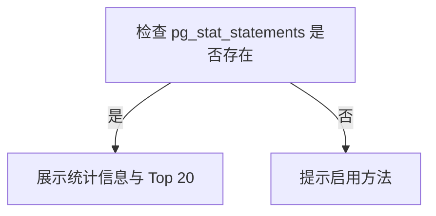
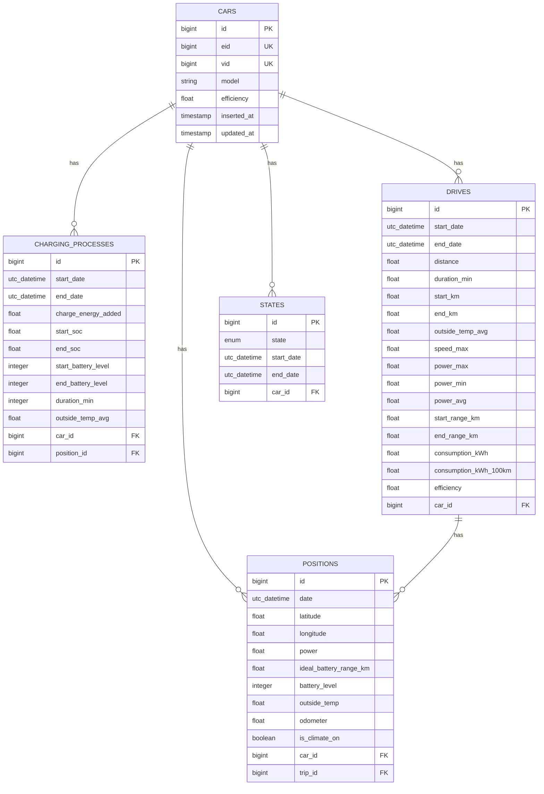
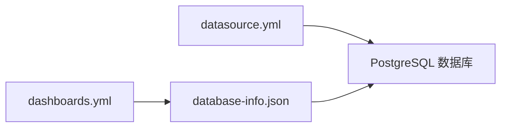

# 数据库监控

<cite>
**本文引用的文件**
- [grafana/dashboards/database-info.json](file://grafana/dashboards/database-info.json)
- [grafana/dashboards.yml](file://grafana/dashboards.yml)
- [grafana/datasource.yml](file://grafana/datasource.yml)
- [priv/repo/migrations/20190330150000_create_car.exs](file://priv/repo/migrations/20190330150000_create_car.exs)
- [priv/repo/migrations/20190330160000_create_trips.exs](file://priv/repo/migrations/20190330160000_create_trips.exs)
- [priv/repo/migrations/20190330170000_create_positions.exs](file://priv/repo/migrations/20190330170000_create_positions.exs)
- [priv/repo/migrations/20190330180000_create_states.exs](file://priv/repo/migrations/20190330180000_create_states.exs)
- [priv/repo/migrations/20190330190000_create_charging_processes.exs](file://priv/repo/migrations/20190330190000_create_charging_processes.exs)
- [website/docs/maintenance/manually_fixing_data.mdx](file://website/docs/maintenance/manually_fixing_data.mdx)
- [website/docs/development.mdx](file://website/docs/development.mdx)
</cite>

## 目录
1. [简介](#简介)
2. [项目结构](#项目结构)
3. [核心组件](#核心组件)
4. [架构总览](#架构总览)
5. [详细组件分析](#详细组件分析)
6. [依赖关系分析](#依赖关系分析)
7. [性能考量](#性能考量)
8. [故障排查指南](#故障排查指南)
9. [结论](#结论)
10. [附录](#附录)

## 简介
本文件面向使用 Grafana 监控 TeslaMate 的 PostgreSQL 数据库的用户，聚焦于“数据库信息”仪表板 database-info.json 所提供的关键性能指标（KPIs）。内容涵盖：
- 如何解读数据库体量与增长趋势（表大小、行数、索引效率）
- 如何通过 Grafana 查询 PostgreSQL 系统表与内置统计视图进行监控
- 结合 TeslaMate 实际数据模型识别大型表与高增长表
- 监控不完整数据（未关闭的驾驶或充电记录）的方法
- 利用监控数据进行容量规划与维护建议

## 项目结构
Grafana 相关配置位于 grafana 目录，其中：
- dashboards/database-info.json：数据库信息仪表板，包含表大小、行数、索引统计、数据库总量、PostgreSQL 版本、共享缓冲区等面板
- dashboards.yml：Grafana 文件夹提供者配置，用于自动加载仪表板
- datasource.yml：Grafana PostgreSQL 数据源配置，连接 TeslaMate 数据库

图表来源
- [grafana/dashboards/database-info.json](file://grafana/dashboards/database-info.json#L1-L120)
- [grafana/dashboards.yml](file://grafana/dashboards.yml#L1-L34)
- [grafana/datasource.yml](file://grafana/datasource.yml#L1-L20)

章节来源
- [grafana/dashboards/database-info.json](file://grafana/dashboards/database-info.json#L1-L120)
- [grafana/dashboards.yml](file://grafana/dashboards.yml#L1-L34)
- [grafana/datasource.yml](file://grafana/datasource.yml#L1-L20)

## 核心组件
database-info.json 提供以下关键 KPIs 与监控能力：
- 行为统计：累计里程、驾驶次数、充电次数、软件版本等
- 不完整数据检测：未结束的驾驶与充电数量
- 数据体量：各表数据大小、索引大小、总大小
- 索引效率：索引扫描、行读取/抓取、索引大小
- 数据库运行参数：PostgreSQL 版本、共享缓冲区、时区
- SQL 统计：启用 pg_stat_statements 后，可查看语句执行次数、平均/总耗时 Top 20

章节来源
- [grafana/dashboards/database-info.json](file://grafana/dashboards/database-info.json#L120-L240)
- [grafana/dashboards/database-info.json](file://grafana/dashboards/database-info.json#L500-L530)
- [grafana/dashboards/database-info.json](file://grafana/dashboards/database-info.json#L532-L755)
- [grafana/dashboards/database-info.json](file://grafana/dashboards/database-info.json#L756-L906)
- [grafana/dashboards/database-info.json](file://grafana/dashboards/database-info.json#L907-L1167)
- [grafana/dashboards/database-info.json](file://grafana/dashboards/database-info.json#L1168-L1640)

## 架构总览
下图展示了 Grafana 仪表板如何通过 PostgreSQL 数据源查询数据库系统表与统计视图，从而生成数据库体量、索引效率与运行参数等可视化指标。

图表来源
- [grafana/dashboards/database-info.json](file://grafana/dashboards/database-info.json#L532-L755)
- [grafana/dashboards/database-info.json](file://grafana/dashboards/database-info.json#L756-L906)
- [grafana/dashboards/database-info.json](file://grafana/dashboards/database-info.json#L1168-L1640)

## 详细组件分析

### 1) 行为统计与不完整数据
- 累计里程与里程表：基于 drives 表计算已记录里程与当前里程
- 驾驶/充电次数：基于 drives 与 charging_processes 表统计
- 软件版本：从 updates 表提取最新固件版本
- 不完整数据：检测 drives 与 charging_processes 中 end_date 为空的记录数量，提示可能需要手动修复

图表来源
- [grafana/dashboards/database-info.json](file://grafana/dashboards/database-info.json#L120-L240)
- [grafana/dashboards/database-info.json](file://grafana/dashboards/database-info.json#L343-L452)

章节来源
- [grafana/dashboards/database-info.json](file://grafana/dashboards/database-info.json#L120-L240)
- [grafana/dashboards/database-info.json](file://grafana/dashboards/database-info.json#L343-L452)

### 2) 表体量与行数
- 表体量：通过 pg_statio_user_tables 获取每张表的数据大小、索引大小、总大小，并按总大小降序排列
- 行数：通过 information_schema 查询各表行数（XML 聚合方式）

图表来源
- [grafana/dashboards/database-info.json](file://grafana/dashboards/database-info.json#L532-L755)

章节来源
- [grafana/dashboards/database-info.json](file://grafana/dashboards/database-info.json#L532-L755)

### 3) 索引效率与索引统计
- 索引扫描、行读取/抓取、索引大小：通过 pg_stat_all_indexes 获取索引使用情况，辅助评估索引效率
- 索引效率提示：当数据库存在大量更新/删除时可能出现索引膨胀，建议参考维护指南进行重建索引

图表来源
- [grafana/dashboards/database-info.json](file://grafana/dashboards/database-info.json#L756-L906)
- [website/docs/maintenance/manually_fixing_data.mdx](file://website/docs/maintenance/manually_fixing_data.mdx#L190-L215)

章节来源
- [grafana/dashboards/database-info.json](file://grafana/dashboards/database-info.json#L756-L906)
- [website/docs/maintenance/manually_fixing_data.mdx](file://website/docs/maintenance/manually_fixing_data.mdx#L190-L215)

### 4) 数据库运行参数与版本
- PostgreSQL 版本：通过 version() 函数解析版本号
- 共享缓冲区：通过 pg_settings 读取 shared_buffers 并换算字节
- 时区：通过 show timezone 获取数据库会话时区

图表来源
- [grafana/dashboards/database-info.json](file://grafana/dashboards/database-info.json#L500-L530)
- [grafana/dashboards/database-info.json](file://grafana/dashboards/database-info.json#L990-L1154)

章节来源
- [grafana/dashboards/database-info.json](file://grafana/dashboards/database-info.json#L500-L530)
- [grafana/dashboards/database-info.json](file://grafana/dashboards/database-info.json#L990-L1154)

### 5) SQL 执行统计（pg_stat_statements）
- 条件渲染：通过模板变量判断 pg_stat_statements 是否存在，仅在启用时展示统计面板
- Top 20：按平均执行时间与总执行时间分别列出最慢的 20 条语句
- 维护提示：提供启用与使用说明链接

图表来源
- [grafana/dashboards/database-info.json](file://grafana/dashboards/database-info.json#L1168-L1640)
- [website/docs/development.mdx](file://website/docs/development.mdx#L200-L212)

章节来源
- [grafana/dashboards/database-info.json](file://grafana/dashboards/database-info.json#L1168-L1640)
- [website/docs/development.mdx](file://website/docs/development.mdx#L200-L212)

### 6) 结合 TeslaMate 数据模型识别大型表与高增长表
- 关系模型要点（迁移文件体现）：
  - cars：车辆主表，含唯一索引
  - trips：历史行程（旧表名，现为 drives）
  - positions：位置点，关联 car 与 trip
  - charging_processes：充电过程，关联 car 与 position
  - states：车辆状态（online/offline/asleep）
- 大型表识别思路：
  - 查看 database-info.json 中“表大小/索引大小/总大小”面板，定位占用最大的表
  - 结合“表行数”面板，识别增长最快的表
  - 对于高频写入的表（如 positions），关注索引扫描与行抓取，评估是否需要优化索引或分区策略

图表来源
- [priv/repo/migrations/20190330150000_create_car.exs](file://priv/repo/migrations/20190330150000_create_car.exs#L1-L18)
- [priv/repo/migrations/20190330160000_create_trips.exs](file://priv/repo/migrations/20190330160000_create_trips.exs#L1-L29)
- [priv/repo/migrations/20190330170000_create_positions.exs](file://priv/repo/migrations/20190330170000_create_positions.exs#L1-L28)
- [priv/repo/migrations/20190330180000_create_states.exs](file://priv/repo/migrations/20190330180000_create_states.exs#L1-L18)
- [priv/repo/migrations/20190330190000_create_charging_processes.exs](file://priv/repo/migrations/20190330190000_create_charging_processes.exs#L1-L23)

章节来源
- [priv/repo/migrations/20190330150000_create_car.exs](file://priv/repo/migrations/20190330150000_create_car.exs#L1-L18)
- [priv/repo/migrations/20190330160000_create_trips.exs](file://priv/repo/migrations/20190330160000_create_trips.exs#L1-L29)
- [priv/repo/migrations/20190330170000_create_positions.exs](file://priv/repo/migrations/20190330170000_create_positions.exs#L1-L28)
- [priv/repo/migrations/20190330180000_create_states.exs](file://priv/repo/migrations/20190330180000_create_states.exs#L1-L18)
- [priv/repo/migrations/20190330190000_create_charging_processes.exs](file://priv/repo/migrations/20190330190000_create_charging_processes.exs#L1-L23)

## 依赖关系分析
- Grafana 仪表板依赖 PostgreSQL 数据源（datasource.yml）连接到 TeslaMate 数据库
- dashboards.yml 定义了文件夹提供者，使 Grafana 自动加载 dashboard JSON
- database-info.json 依赖 PostgreSQL 系统表与统计视图（pg_statio_user_tables、pg_stat_all_indexes、pg_stat_statements 等）以生成 KPIs

图表来源
- [grafana/dashboards.yml](file://grafana/dashboards.yml#L1-L34)
- [grafana/datasource.yml](file://grafana/datasource.yml#L1-L20)
- [grafana/dashboards/database-info.json](file://grafana/dashboards/database-info.json#L1-L120)

章节来源
- [grafana/dashboards.yml](file://grafana/dashboards.yml#L1-L34)
- [grafana/datasource.yml](file://grafana/datasource.yml#L1-L20)
- [grafana/dashboards/database-info.json](file://grafana/dashboards/database-info.json#L1-L120)

## 性能考量
- 索引效率：通过索引扫描与行抓取指标评估索引使用情况；在大量更新/删除后可能出现索引膨胀，必要时重建索引
- 共享缓冲区：合理设置 shared_buffers，通常建议占系统内存约 25%，避免过高浪费
- 时间戳与时区：Grafana 查询中涉及时间字段时需注意时区设置，确保 DATE_TRUNC 等函数按正确时区截断
- SQL 统计：启用 pg_stat_statements 可帮助识别最慢与最频繁执行的查询，指导优化

章节来源
- [grafana/dashboards/database-info.json](file://grafana/dashboards/database-info.json#L756-L906)
- [grafana/dashboards/database-info.json](file://grafana/dashboards/database-info.json#L990-L1154)
- [website/docs/development.mdx](file://website/docs/development.mdx#L150-L212)

## 故障排查指南
- 不完整数据（未关闭的驾驶/充电）：
  - 使用 database-info.json 中的“不完整数据”面板快速发现未结束的记录数量
  - 若数量异常增多，参考维护指南进行清理或修复
- 索引膨胀与性能下降：
  - 使用“索引”面板观察索引扫描与行抓取
  - 在大量更新/删除场景后，按维护指南执行重建索引
- pg_stat_statements 未启用：
  - 检查模板变量 pg_stat_statements_enabled
  - 按开发文档说明启用并验证统计面板

章节来源
- [grafana/dashboards/database-info.json](file://grafana/dashboards/database-info.json#L343-L452)
- [website/docs/maintenance/manually_fixing_data.mdx](file://website/docs/maintenance/manually_fixing_data.mdx#L158-L215)
- [website/docs/development.mdx](file://website/docs/development.mdx#L200-L212)

## 结论
通过 database-info.json 仪表板，可以系统性地监控 TeslaMate 的数据库体量、索引效率与运行参数，并结合实际数据模型识别大型表与高增长表。配合不完整数据检测与 pg_stat_statements 统计，能够有效支撑容量规划与性能优化工作。

## 附录
- Grafana 数据源与仪表板提供者配置路径：
  - [datasource.yml](file://grafana/datasource.yml#L1-L20)
  - [dashboards.yml](file://grafana/dashboards.yml#L1-L34)
- 相关迁移文件（数据模型）：
  - [create_car.exs](file://priv/repo/migrations/20190330150000_create_car.exs#L1-L18)
  - [create_trips.exs](file://priv/repo/migrations/20190330160000_create_trips.exs#L1-L29)
  - [create_positions.exs](file://priv/repo/migrations/20190330170000_create_positions.exs#L1-L28)
  - [create_states.exs](file://priv/repo/migrations/20190330180000_create_states.exs#L1-L18)
  - [create_charging_processes.exs](file://priv/repo/migrations/20190330190000_create_charging_processes.exs#L1-L23)