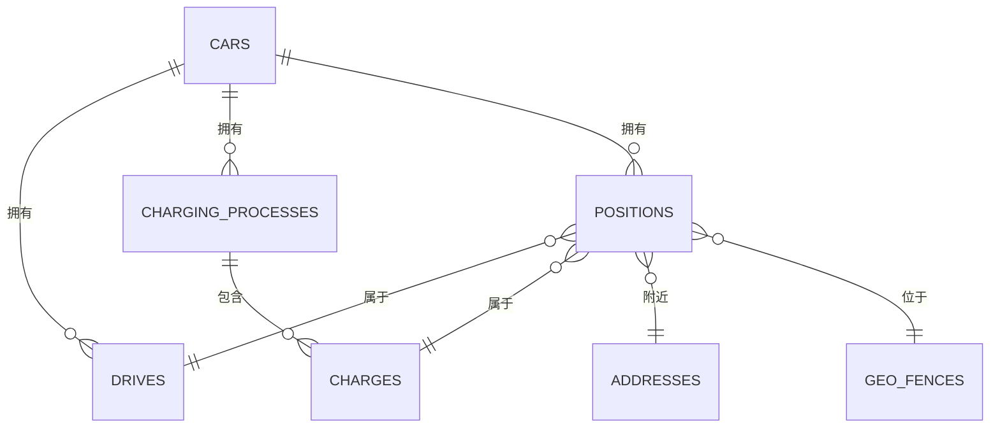
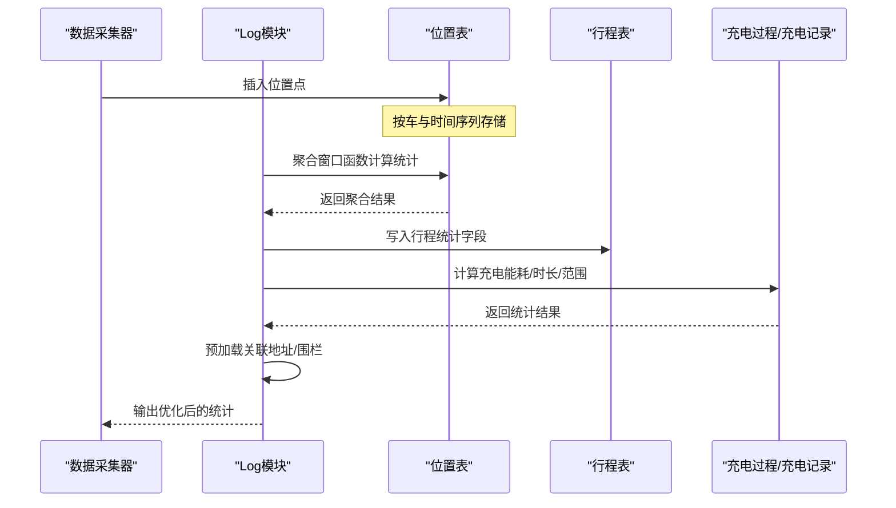
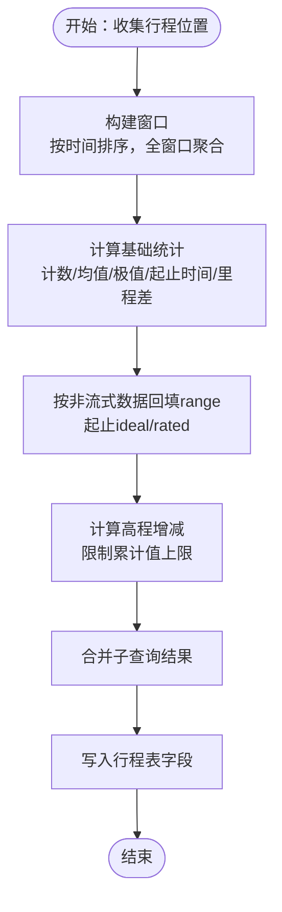
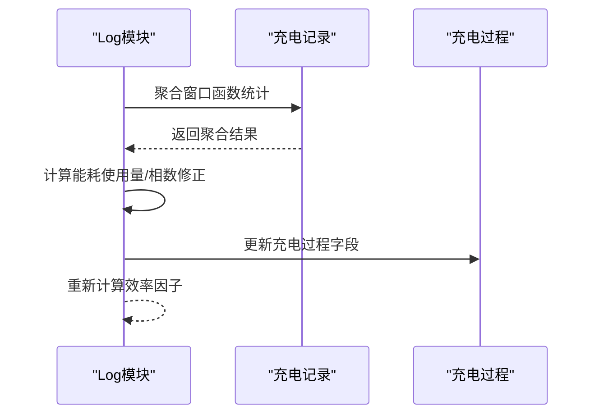
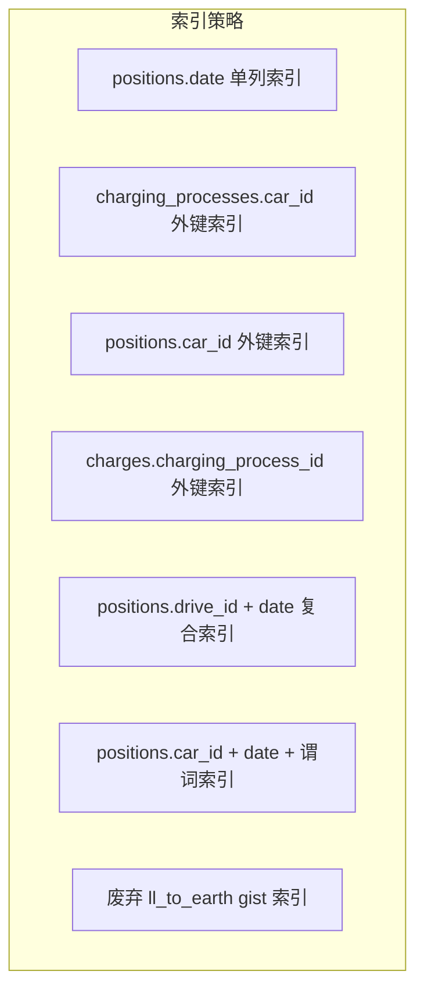

# 查询优化

<cite>
**本文引用的文件列表**
- [20200410112005_database_efficiency_improvements.exs](file://priv/repo/migrations/20200410112005_database_efficiency_improvements.exs)
- [log.ex](file://lib/teslamate/log.ex)
- [custom_expressions.ex](file://lib/teslamate/custom_expressions.ex)
- [20190416125429_add_indexes_on_dates.exs](file://priv/repo/migrations/20190416125429_add_indexes_on_dates.exs)
- [20190717184003_add_fkey_indexes.exs](file://priv/repo/migrations/20190717184003_add_fkey_indexes.exs)
- [20230417225712_composite_index_to_position.exs](file://priv/repo/migrations/20230417225712_composite_index_to_position.exs)
- [20240915193446_composite_index_with_predicate_to_position.exs](file://priv/repo/migrations/20240915193446_composite_index_with_predicate_to_position.exs)
- [20200502140646_drop_unused_indexes.exs](file://priv/repo/migrations/20200502140646_drop_unused_indexes.exs)
- [20191026185642_calculate_charge_energy_used.exs](file://priv/repo/migrations/20191026185642_calculate_charge_energy_used.exs)
- [drive.ex](file://lib/teslamate/log/drive.ex)
- [charge.ex](file://lib/teslamate/log/charge.ex)
- [development.mdx](file://website/docs/development.mdx)
- [database-info.json](file://grafana/dashboards/database-info.json)
</cite>

## 目录
1. [简介](#简介)
2. [项目结构与数据模型概览](#项目结构与数据模型概览)
3. [核心优化措施：字段类型与精度调整](#核心优化措施字段类型与精度调整)
4. [架构总览与查询路径](#架构总览与查询路径)
5. [详细组件与查询优化分析](#详细组件与查询优化分析)
6. [依赖关系与索引策略分析](#依赖关系与索引策略分析)
7. [性能考量与最佳实践](#性能考量与最佳实践)
8. [故障排查与监控建议](#故障排查与监控建议)
9. [结论](#结论)

## 简介
本文件聚焦于TeslaMate在数据库效率方面的优化策略，围绕以下目标展开：
- 解析20200410112005_database_efficiency_improvements.exs迁移中对字段类型与数值精度的调整，并说明其对存储与查询性能的影响。
- 基于log.ex中的Ecto查询实现，总结窗口函数、聚合与关联查询的高效写法。
- 提供针对复杂聚合与关联查询的重写思路与示例路径，帮助读者在类似场景下进行优化。

## 项目结构与数据模型概览
TeslaMate围绕“车辆、行程、充电过程、位置点、地址与围栏”等实体构建日志与统计体系。核心表包括positions、drives、charging_processes、charges、addresses、geofences、cars等。查询优化主要体现在：
- 字段类型从integer逐步改为更合适的smallint或decimal，以降低存储并提升计算效率。
- 数值精度通过precision/scale控制，避免冗余小数位导致的存储膨胀与计算误差。
- 针对高频查询列建立复合索引，减少全表扫描与排序成本。

图表来源
- [drive.ex](file://lib/teslamate/log/drive.ex#L1-L79)
- [charge.ex](file://lib/teslamate/log/charge.ex#L1-L68)

章节来源
- [drive.ex](file://lib/teslamate/log/drive.ex#L1-L79)
- [charge.ex](file://lib/teslamate/log/charge.ex#L1-L68)

## 核心优化措施：字段类型与精度调整
本次迁移将多处整型字段由integer调整为smallint，或将浮点/数值字段设置为numeric并限定精度与标度，从而：
- 减少磁盘占用与内存缓存压力；
- 在算术运算中避免不必要的精度扩展；
- 降低I/O与网络传输开销。

具体优化要点（按表分组）：
- 车辆与位置相关
  - cars.id：integer → smallint
  - positions.car_id：integer → smallint
  - positions.speed、positions.power、positions.battery_level、positions.usable_battery_level：integer → smallint
  - positions.elevation：integer → smallint
  - positions.outside_temp、positions.inside_temp、positions.driver_temp_setting、positions.passenger_temp_setting：numeric(4,1)（原为更高精度）
- 行程相关
  - drives.car_id：integer → smallint
  - drives.speed_max、drives.power_max、drives.power_min：smallint
  - drives.duration_min：integer → smallint
  - drives.start_ideal_range_km、drives.end_ideal_range_km、drives.start_rated_range_km、drives.end_rated_range_km：numeric(6,2)
  - drives.outside_temp_avg、drives.inside_temp_avg：numeric(4,1)
- 充电过程与充电记录
  - charging_processes.car_id：integer → smallint
  - charging_processes.position_id、charging_processes.address_id、charging_processes.geofence_id：integer保持不变（外键）
  - charging_processes.start_battery_level、end_battery_level：smallint
  - charging_processes.duration_min：smallint
  - charging_processes.charge_energy_added、charge_energy_used、start/end_range_km：numeric(8,2)/(6,2)
  - charging_processes.outside_temp_avg：numeric(4,1)
  - charges.battery_level、usable_battery_level：smallint
  - charges.charger_*：smallint（电流、功率、电压等）
  - charges.charge_energy_added：numeric(8,2)
  - charges.outside_temp：numeric(4,1)
- 地址与围栏
  - addresses.latitude/longitude：numeric(8,6)/(9,6)
  - geofences.latitude/longitude/radius：numeric(8,6)/(9,6)/smallint
- 其他
  - states.car_id：smallint
  - updates.car_id：smallint

这些调整在迁移文件中有明确体现，覆盖了高频统计字段与外键字段，兼顾了精度与性能。

章节来源
- [20200410112005_database_efficiency_improvements.exs](file://priv/repo/migrations/20200410112005_database_efficiency_improvements.exs#L1-L112)

## 架构总览与查询路径
TeslaMate的日志处理流程通常为：采集位置点 → 归档为行程/充电过程 → 计算统计指标（平均温度、最大功率、里程差、时长等）→ 写回主表。查询优化贯穿以下路径：
- 位置点聚合：基于窗口函数与子查询，避免多次往返与应用侧聚合。
- 关联查询：通过预加载与join策略，减少N+1问题。
- 索引策略：日期、外键、组合条件索引，支撑高频过滤与排序。

图表来源
- [log.ex](file://lib/teslamate/log.ex#L246-L375)
- [log.ex](file://lib/teslamate/log.ex#L445-L509)

章节来源
- [log.ex](file://lib/teslamate/log.ex#L246-L375)
- [log.ex](file://lib/teslamate/log.ex#L445-L509)

## 详细组件与查询优化分析

### 组件A：行程统计与窗口函数优化
- 窗口函数与子查询组合：通过over(:w)与子查询，一次性完成计数、极值、均值、距离差与时长等聚合，避免多次扫描。
- 时间区间窗口：使用RANGE BETWEEN UNBOUNDED PRECEDING AND UNBOUNDED FOLLOWING，确保全窗口聚合。
- 条件聚合：仅在存在有效范围数据时才回填起止range，否则保留默认值。
- 高程累计：通过lag与窗口累加，限制累计值上限，避免溢出。

图表来源
- [log.ex](file://lib/teslamate/log.ex#L246-L375)

章节来源
- [log.ex](file://lib/teslamate/log.ex#L246-L375)

### 组件B：充电过程统计与聚合
- 使用窗口函数聚合充电记录，计算起止时间、电池等级、range、温度、能耗差等。
- 通过mode() within group确定快充类型，避免多次扫描。
- 能耗使用率计算：根据相数/电压/电流推导瞬时功率，再积分求和，过滤负值。
- 成本计算：依据围栏计费方式（按kWh或按分钟）与会话费用叠加。

图表来源
- [log.ex](file://lib/teslamate/log.ex#L445-L509)
- [log.ex](file://lib/teslamate/log.ex#L517-L541)

章节来源
- [log.ex](file://lib/teslamate/log.ex#L445-L509)
- [log.ex](file://lib/teslamate/log.ex#L517-L541)

### 组件C：自定义表达式与数值处理
- 自定义宏：c_if、duration_min、nullif、round等，封装常用SQL片段，提升可读性与复用性。
- 数值精度控制：通过round宏与numeric字段配合，避免浮点误差累积。
- 地理围栏判断：使用ll_to_earth与地球盒/距离函数，支持高效的空间判断。

章节来源
- [custom_expressions.ex](file://lib/teslamate/custom_expressions.ex#L1-L93)

### 组件D：数据模型与字段类型映射
- 行程表字段：平均温度、最大/最小功率、起止里程、距离、时长、海拔累计等，均采用integer/smallint或decimal(6,2)。
- 充电表字段：电池等级、相数、电流/电压/功率、能耗、range、温度等，采用smallint或decimal(8,2)/(6,2)。
- 位置表字段：经纬度采用numeric(8,6)/(9,6)，速度/功率/电量等采用smallint，便于窗口聚合。

章节来源
- [drive.ex](file://lib/teslamate/log/drive.ex#L1-L79)
- [charge.ex](file://lib/teslamate/log/charge.ex#L1-L68)

## 依赖关系与索引策略分析
- 日期索引：positions、charges按date建立单列索引，加速按时间过滤与排序。
- 外键索引：为charging_processes.car_id、position.car_id、charge.charging_process_id等建立索引，减少join代价。
- 复合索引：
  - positions上建立(drive_id, date)复合索引，替代旧索引，提升行程内位置点扫描效率。
  - 带谓词的复合索引：在positions上创建(car_id, date, ideal_battery_range_km IS NOT NULL)并限定where，仅索引有range数据的行，进一步缩小索引体积与扫描范围。
- 废弃索引：移除基于ll_to_earth的gist索引，避免维护成本与写放大。

图表来源
- [20190416125429_add_indexes_on_dates.exs](file://priv/repo/migrations/20190416125429_add_indexes_on_dates.exs#L1-L9)
- [20190717184003_add_fkey_indexes.exs](file://priv/repo/migrations/20190717184003_add_fkey_indexes.exs#L1-L23)
- [20230417225712_composite_index_to_position.exs](file://priv/repo/migrations/20230417225712_composite_index_to_position.exs#L1-L9)
- [20240915193446_composite_index_with_predicate_to_position.exs](file://priv/repo/migrations/20240915193446_composite_index_with_predicate_to_position.exs#L1-L10)
- [20200502140646_drop_unused_indexes.exs](file://priv/repo/migrations/20200502140646_drop_unused_indexes.exs#L1-L8)

章节来源
- [20190416125429_add_indexes_on_dates.exs](file://priv/repo/migrations/20190416125429_add_indexes_on_dates.exs#L1-L9)
- [20190717184003_add_fkey_indexes.exs](file://priv/repo/migrations/20190717184003_add_fkey_indexes.exs#L1-L23)
- [20230417225712_composite_index_to_position.exs](file://priv/repo/migrations/20230417225712_composite_index_to_position.exs#L1-L9)
- [20240915193446_composite_index_with_predicate_to_position.exs](file://priv/repo/migrations/20240915193446_composite_index_with_predicate_to_position.exs#L1-L10)
- [20200502140646_drop_unused_indexes.exs](file://priv/repo/migrations/20200502140646_drop_unused_indexes.exs#L1-L8)

## 性能考量与最佳实践
- 字段类型选择
  - 小整型优先：当业务范围不超过smallint上限（约6.5万），优先使用smallint以节省存储与IO。
  - 数值精度控制：对温度、里程、能耗等使用numeric(p,s)，避免过高的scale造成存储膨胀与比较开销。
- 窗口函数与子查询
  - 将多轮聚合合并为一次窗口扫描，减少往返次数；必要时使用子查询拆分逻辑，提升可读性与执行计划稳定性。
  - 对全窗口聚合使用RANGE UNBOUNDED PRECEDING/FOLLOWING，确保统计一致性。
- 索引设计
  - 针对高频过滤列（如date、car_id、charging_process_id）建立单列或复合索引。
  - 使用谓词索引仅索引有值的行，显著降低索引大小与维护成本。
- 关联与预加载
  - 对需要展示的统计结果，尽量在一次查询中通过join或preload完成，避免N+1查询。
- 数值处理与宏
  - 使用自定义宏封装常用表达式，统一精度与格式，减少重复SQL与错误。
- 数据迁移与历史数据校正
  - 通过迁移脚本批量计算能耗使用量等派生字段，保证历史数据一致性。

章节来源
- [20200410112005_database_efficiency_improvements.exs](file://priv/repo/migrations/20200410112005_database_efficiency_improvements.exs#L1-L112)
- [20191026185642_calculate_charge_energy_used.exs](file://priv/repo/migrations/20191026185642_calculate_charge_energy_used.exs#L1-L65)
- [custom_expressions.ex](file://lib/teslamate/custom_expressions.ex#L1-L93)

## 故障排查与监控建议
- 使用pg_stat_statements识别慢查询与高频查询，定位热点SQL并针对性优化。
- 结合Grafana数据库仪表盘观察索引大小、查询耗时与元组抓取量，评估索引有效性与维护成本。
- 当数据库写入/删除频繁时，可考虑定期REINDEX以维持索引健康状态。

章节来源
- [development.mdx](file://website/docs/development.mdx#L200-L211)
- [database-info.json](file://grafana/dashboards/database-info.json#L1518-L1578)

## 结论
通过对字段类型与精度的精细化调整、窗口函数与子查询的合理组合、以及面向高频访问的索引策略，TeslaMate在保证统计准确性的同时，显著降低了存储与查询成本。建议在新功能开发中延续该策略：优先选择合适的数据类型与精度，善用窗口函数与子查询，结合索引谓词与复合索引，持续监控与迭代查询性能。