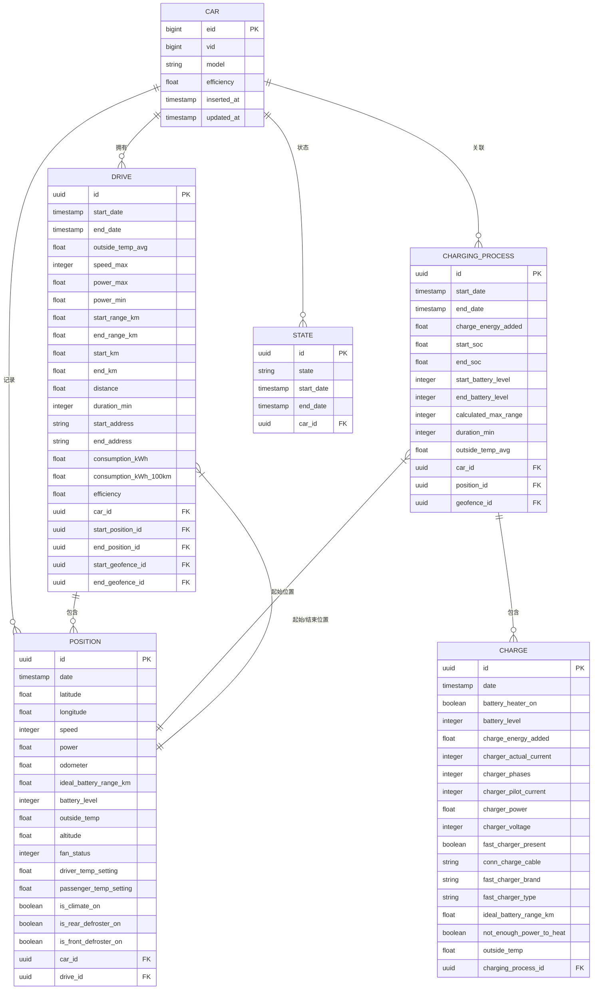

# 数据库模式与关系

<cite>
**本文档中引用的文件**  
- [20190330150000_create_car.exs](file://priv/repo/migrations/20190330150000_create_car.exs)
- [20190330160000_create_trips.exs](file://priv/repo/migrations/20190330160000_create_trips.exs)
- [20190330170000_create_positions.exs](file://priv/repo/migrations/20190330170000_create_positions.exs)
- [20190330180000_create_states.exs](file://priv/repo/migrations/20190330180000_create_states.exs)
- [20190330190000_create_charging_processes.exs](file://priv/repo/migrations/20190330190000_create_charging_processes.exs)
- [20190330200000_create_charges.exs](file://priv/repo/migrations/20190330200000_create_charges.exs)
- [20190717184003_add_fkey_indexes.exs](file://priv/repo/migrations/20190717184003_add_fkey_indexes.exs)
- [20190416125429_add_indexes_on_dates.exs](file://priv/repo/migrations/20190416125429_add_indexes_on_dates.exs)
- [20190821143938_add_constraints.exs](file://priv/repo/migrations/20190821143938_add_constraints.exs)
- [20230417225712_composite_index_to_position.exs](file://priv/repo/migrations/20230417225712_composite_index_to_position.exs)
- [20240915193446_composite_index_with_predicate_to_position.exs](file://priv/repo/migrations/20240915193446_composite_index_with_predicate_to_position.exs)
- [20191003130650_add_start_and_end_position_to_drives.exs](file://priv/repo/migrations/20191003130650_add_start_and_end_position_to_drives.exs)
- [20190812191616_rename_trips_to_drives.exs](file://priv/repo/migrations/20190812191616_rename_trips_to_drives.exs)
- [20250924215353_create_private_schema.exs](file://priv/repo/migrations/20250924215353_create_private_schema.exs)
</cite>

## 目录
1. [引言](#引言)
2. [数据库实体关系图](#数据库实体关系图)
3. [核心表结构说明](#核心表结构说明)
4. [外键约束与引用完整性](#外键约束与引用完整性)
5. [索引策略](#索引策略)
6. [数据库迁移管理](#数据库迁移管理)
7. [数据归档与性能监控](#数据归档与性能监控)

## 引言
本文件详细描述TeslaMate系统的数据库模式设计，涵盖Car、Drive、ChargingProcess、Charge、Position和State等主要实体之间的关系。文档解释了外键约束的设计原则、索引策略、数据库迁移流程以及性能优化方法。

## 数据库实体关系图

**图示来源**  
- [20190330150000_create_car.exs](file://priv/repo/migrations/20190330150000_create_car.exs#L5-L15)
- [20190330160000_create_trips.exs](file://priv/repo/migrations/20190330160000_create_trips.exs#L5-L25)
- [20190330170000_create_positions.exs](file://priv/repo/migrations/20190330170000_create_positions.exs#L5-L24)
- [20190330180000_create_states.exs](file://priv/repo/migrations/20190330180000_create_states.exs#L8-L14)
- [20190330190000_create_charging_processes.exs](file://priv/repo/migrations/20190330190000_create_charging_processes.exs#L5-L19)
- [20190330200000_create_charges.exs](file://priv/repo/migrations/20190330200000_create_charges.exs#L5-L23)

## 核心表结构说明

### Car（车辆）
存储车辆基本信息，包括车辆标识（eid、vid）、型号和能效参数。每辆车可关联多个行程、充电过程和状态记录。

### Drive（行程）
记录车辆的行驶活动，包含起止时间、距离、能耗等信息。通过car_id与Car表关联，并通过start_position_id和end_position_id关联起止位置。

### Position（位置）
记录车辆在特定时间点的地理位置和状态信息。每个位置记录属于一辆车，并可属于一个行程或充电过程。

### ChargingProcess（充电过程）
表示一次完整的充电会话，包含起止时间、电量变化等信息。与Car和Position表建立外键关联。

### Charge（充电记录）
记录充电过程中的详细数据点，如电压、电流、温度等。通过charging_process_id与充电过程关联。

### State（状态）
记录车辆的在线状态（在线、离线、休眠），用于追踪车辆的连接状态变化。

**节来源**  
- [20190330150000_create_car.exs](file://priv/repo/migrations/20190330150000_create_car.exs)
- [20190330160000_create_trips.exs](file://priv/repo/migrations/20190330160000_create_trips.exs)
- [20190330170000_create_positions.exs](file://priv/repo/migrations/20190330170000_create_positions.exs)
- [20190330180000_create_states.exs](file://priv/repo/migrations/20190330180000_create_states.exs)
- [20190330190000_create_charging_processes.exs](file://priv/repo/migrations/20190330190000_create_charging_processes.exs)
- [20190330200000_create_charges.exs](file://priv/repo/migrations/20190330200000_create_charges.exs)

## 外键约束与引用完整性

系统通过外键约束确保数据一致性。所有相关表均通过car_id与Car表建立关联，形成以车辆为核心的星型结构。

- **级联删除**：通过20200203120311_cascade_delete.exs迁移实现，当车辆被删除时，其关联的所有行程、位置、状态等记录也会被自动删除。
- **唯一性约束**：在states表中，通过部分唯一索引`unique_index(:states, [:car_id, "(end_date IS NULL)"], where: "end_date IS NULL")`确保每辆车最多只有一个未结束的状态记录。
- **检查约束**：在states和updates表中添加`end_date >= start_date`约束，确保时间逻辑正确。

外键约束的设计原则是：
1. 所有实体必须归属于一个Car实例
2. 时间序列数据（Position、Charge）必须关联到具体事件（Drive、ChargingProcess）
3. 通过部分索引和检查约束维护业务逻辑完整性

**节来源**  
- [20190717184003_add_fkey_indexes.exs](file://priv/repo/migrations/20190717184003_add_fkey_indexes.exs)
- [20190821143938_add_constraints.exs](file://priv/repo/migrations/20190821143938_add_constraints.exs)
- [20200203120311_cascade_delete.exs](file://priv/repo/migrations/20200203120311_cascade_delete.exs)

## 索引策略

### 单列索引
- 在所有外键列上创建索引，如`charges.charging_process_id`、`positions.car_id`等，加速连接查询。
- 在时间戳列上创建索引，如`positions.date`、`charges.date`，优化时间范围查询。

### 复合索引
- `positions(drive_id, date)`：优化按行程查询位置序列的性能。
- `positions(car_id, date)`：支持按车辆和时间范围的高效查询。

### 部分索引
- `positions(car_id, date) WHERE ideal_battery_range_km IS NOT NULL`：针对包含有效续航数据的记录创建索引，减少索引大小并提高特定查询性能。

索引策略的设计原则是优先支持最常见的查询模式：
1. 按时间范围查询车辆数据
2. 按车辆查询所有相关记录
3. 按行程或充电过程查询详细数据点

**节来源**  
- [20190717184003_add_fkey_indexes.exs](file://priv/repo/migrations/20190717184003_add_fkey_indexes.exs#L5-L20)
- [20190416125429_add_indexes_on_dates.exs](file://priv/repo/migrations/20190416125429_add_indexes_on_dates.exs)
- [20230417225712_composite_index_to_position.exs](file://priv/repo/migrations/20230417225712_composite_index_to_position.exs)
- [20240915193446_composite_index_with_predicate_to_position.exs](file://priv/repo/migrations/20240915193446_composite_index_with_predicate_to_position.exs)

## 数据库迁移管理

系统使用Ecto迁移框架管理数据库模式变更。迁移文件按时间戳命名，确保有序执行。

### 迁移流程
1. **创建迁移**：使用`mix ecto.gen.migration`生成新迁移文件
2. **定义变更**：在`change/0`函数中定义模式变更
3. **执行迁移**：使用`mix ecto.migrate`应用变更
4. **回滚支持**：重要变更需提供`up/0`和`down/0`函数以支持回滚

### 安全变更实践
- **重命名操作**：如20190812191616_rename_trips_to_drives.exs所示，重命名表和列时同时更新索引和外键约束名称。
- **数据迁移**：复杂变更（如20191003132415_add_position_ids_and_apply_geofences.exs）在迁移中包含数据转换逻辑。
- **私有模式**：通过20250924215353_create_private_schema.exs将敏感表（tokens）移至private模式，增强安全性。

**节来源**  
- [20190812191616_rename_trips_to_drives.exs](file://priv/repo/migrations/20190812191616_rename_trips_to_drives.exs)
- [20191003132415_add_position_ids_and_apply_geofences.exs](file://priv/repo/migrations/20191003132415_add_position_ids_and_apply_geofences.exs)
- [20250924215353_create_private_schema.exs](file://priv/repo/migrations/20250924215353_create_private_schema.exs)

## 数据归档与性能监控

### 数据归档策略
虽然当前迁移文件中未明确实现归档策略，但可通过以下方式实现：
- 创建归档表定期转移历史数据
- 使用分区表按时间分割数据
- 对旧数据应用数据脱敏

### 性能监控方法
1. **查询计划分析**：使用`EXPLAIN`分析慢查询，结合现有索引优化查询。
2. **慢查询优化**：通过复合索引和部分索引减少I/O操作。
3. **地理查询优化**：使用`ll_to_earth`函数和空间索引支持地理位置查询。
4. **统计信息更新**：定期更新表统计信息以帮助查询优化器做出更好决策。

系统通过精细化的索引策略和约束设计，确保在大量时间序列数据下的查询性能和数据完整性。

**节来源**  
- [20191003130650_add_start_and_end_position_to_drives.exs](file://priv/repo/migrations/20191003130650_add_start_and_end_position_to_drives.exs#L21)
- 所有索引相关迁移文件