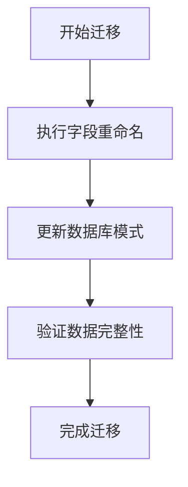
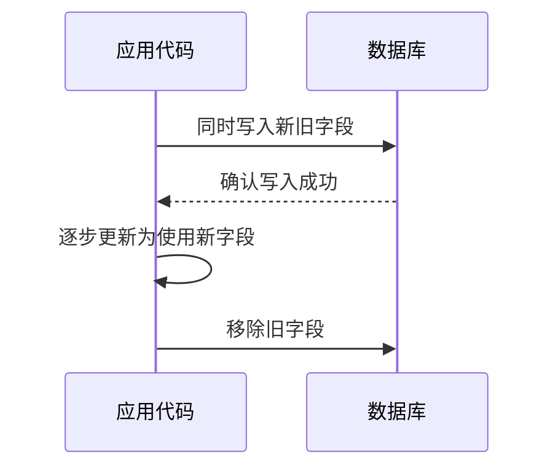
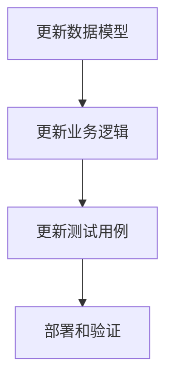
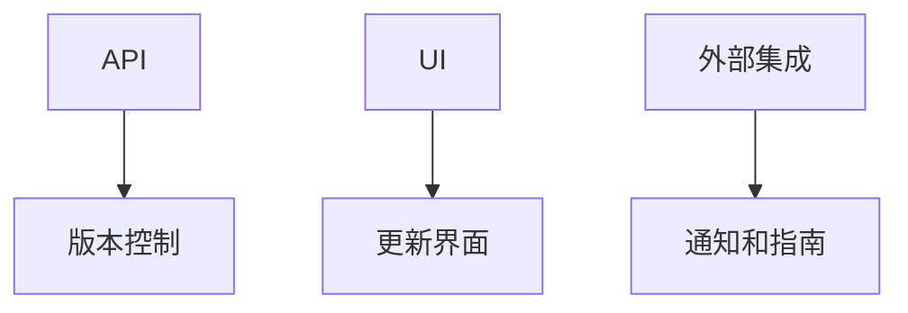

# 字段重命名模式

<cite>
**本文档中引用的文件**   
- [rename_soc_fields.exs](file://priv/repo/migrations/20190525125700_rename_soc_fields.exs)
- [charging_process.ex](file://lib/teslamate/log/charging_process.ex)
- [drive.ex](file://lib/teslamate/log/drive.ex)
- [log_charging_test.exs](file://test/teslamate/log/log_charging_test.exs)
- [add_geofence_id_to_addresses.exs](file://priv/repo/migrations/20190925182253_add_geofence_id_to_addresses.exs)
- [release.ex](file://lib/teslamate/release.ex)
</cite>

## 目录
1. [引言](#引言)
2. [字段重命名实现模式](#字段重命名实现模式)
3. [向后兼容性维护策略](#向后兼容性维护策略)
4. [迁移脚本编写示例](#迁移脚本编写示例)
5. [应用代码渐进式更新](#应用代码渐进式更新)
6. [对API、UI和外部集成的影响](#对apiui和外部集成的影响)
7. [结论](#结论)

## 引言
TeslaMate是一个用于跟踪和分析特斯拉车辆数据的开源应用程序。在软件演进过程中，数据库字段的重命名是常见的需求，例如将表示电池电量的`soc`字段重命名为更具描述性的`range_km`字段。本文档详细分析TeslaMate中字段重命名的实现模式，以`soc`字段重命名为例，说明如何通过Ecto迁移保持数据完整性，并解释在重命名过程中如何维护向后兼容性。

## 字段重命名实现模式
在TeslaMate中，字段重命名主要通过Ecto迁移来实现。Ecto是Elixir语言中的一个强大的数据库包装和语言集成查询（LINQ）工具。通过定义迁移模块，可以安全地修改数据库模式，同时保持数据的完整性。

以`soc`字段重命名为例，TeslaMate在2019年5月25日执行了一次迁移，将`charging_processes`表中的`start_soc`和`end_soc`字段重命名为`start_range_km`和`end_range_km`。这一操作通过`rename`函数完成，该函数是Ecto.Migration模块提供的一个原子操作，确保了重命名过程的原子性和一致性。



**Diagram sources**
- [rename_soc_fields.exs](file://priv/repo/migrations/20190525125700_rename_soc_fields.exs)

**Section sources**
- [rename_soc_fields.exs](file://priv/repo/migrations/20190525125700_rename_soc_fields.exs)

## 向后兼容性维护策略
在字段重命名过程中，维护向后兼容性至关重要，以确保现有代码和外部集成不受影响。TeslaMate采用了多种策略来实现这一点：

1. **双字段过渡期**：在重命名字段之前，先添加新字段并同步写入数据，确保新旧字段同时存在一段时间。这允许逐步更新应用代码，而不会立即破坏现有功能。
2. **数据同步写入**：在双字段过渡期内，应用代码同时向新旧字段写入数据，确保数据的一致性。一旦所有代码都更新为使用新字段，旧字段可以安全地被移除。
3. **旧字段弃用策略**：通过文档和代码注释明确标记旧字段为已弃用，并在未来的版本中计划移除。这给开发者足够的时间来更新他们的代码。



**Diagram sources**
- [charging_process.ex](file://lib/teslamate/log/charging_process.ex)
- [log_charging_test.exs](file://test/teslamate/log/log_charging_test.exs)

**Section sources**
- [charging_process.ex](file://lib/teslamate/log/charging_process.ex)
- [log_charging_test.exs](file://test/teslamate/log/log_charging_test.exs)

## 迁移脚本编写示例
以下是一个实际的迁移脚本示例，展示了如何在TeslaMate中重命名字段：

```elixir
defmodule TeslaMate.Repo.Migrations.RenameSocFields do
  use Ecto.Migration

  def change do
    rename(table(:charging_processes), :start_soc, to: :start_range_km)
    rename(table(:charging_processes), :end_soc, to: :end_range_km)
  end
end
```

此脚本定义了一个迁移模块`RenameSocFields`，它使用`Ecto.Migration`宏。`change`函数包含了实际的迁移逻辑，即调用`rename`函数来重命名`charging_processes`表中的字段。

**Section sources**
- [rename_soc_fields.exs](file://priv/repo/migrations/20190525125700_rename_soc_fields.exs)

## 应用代码渐进式更新
在执行数据库迁移后，需要逐步更新应用代码以使用新字段。这一过程通常包括以下几个步骤：

1. **更新数据模型**：修改Ecto模式定义，反映新的字段名称。
2. **更新业务逻辑**：查找并替换所有使用旧字段的代码，改为使用新字段。
3. **更新测试用例**：确保所有测试用例都通过，特别是那些依赖于被重命名字段的测试。
4. **部署和验证**：在生产环境中部署更新后的代码，并验证其正确性。



**Diagram sources**
- [charging_process.ex](file://lib/teslamate/log/charging_process.ex)
- [drive.ex](file://lib/teslamate/log/drive.ex)

**Section sources**
- [charging_process.ex](file://lib/teslamate/log/charging_process.ex)
- [drive.ex](file://lib/teslamate/log/drive.ex)

## 对API、UI和外部集成的影响
字段重命名不仅影响数据库和应用代码，还可能对API、用户界面（UI）和外部集成产生影响。为了最小化这些影响，应采取以下措施：

1. **API版本控制**：如果API暴露了被重命名的字段，应考虑引入新的API版本，以便平稳过渡。
2. **UI更新**：更新用户界面以反映新的字段名称，确保用户体验的一致性。
3. **外部集成通知**：及时通知所有外部集成方关于字段重命名的信息，并提供详细的迁移指南。



**Diagram sources**
- [add_geofence_id_to_addresses.exs](file://priv/repo/migrations/20190925182253_add_geofence_id_to_addresses.exs)

**Section sources**
- [add_geofence_id_to_addresses.exs](file://priv/repo/migrations/20190925182253_add_geofence_id_to_addresses.exs)

## 结论
通过上述分析可以看出，TeslaMate在字段重命名方面采用了系统化的方法，确保了数据完整性和向后兼容性。通过Ecto迁移、双字段过渡期、数据同步写入和旧字段弃用策略，成功实现了字段的平滑过渡。此外，对API、UI和外部集成的影响也得到了妥善处理，确保了整个系统的稳定性和可靠性。