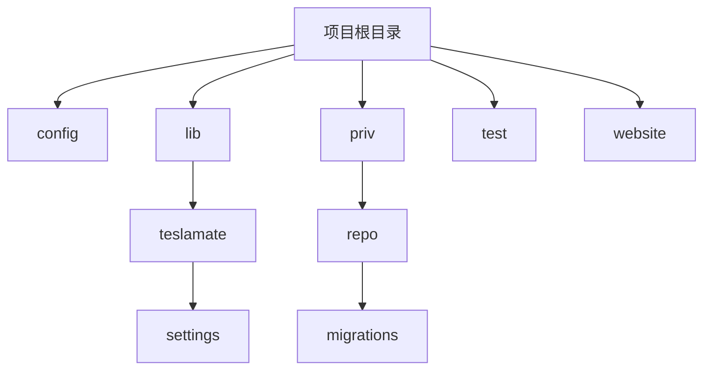
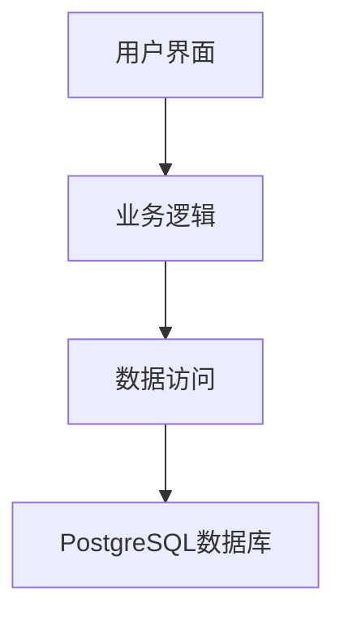
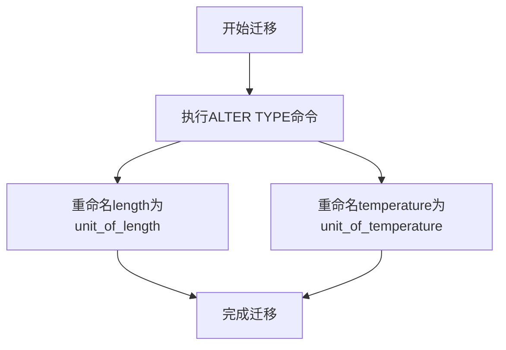
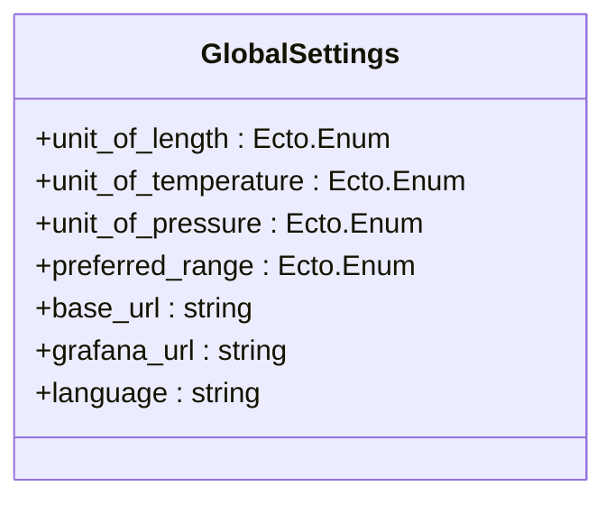
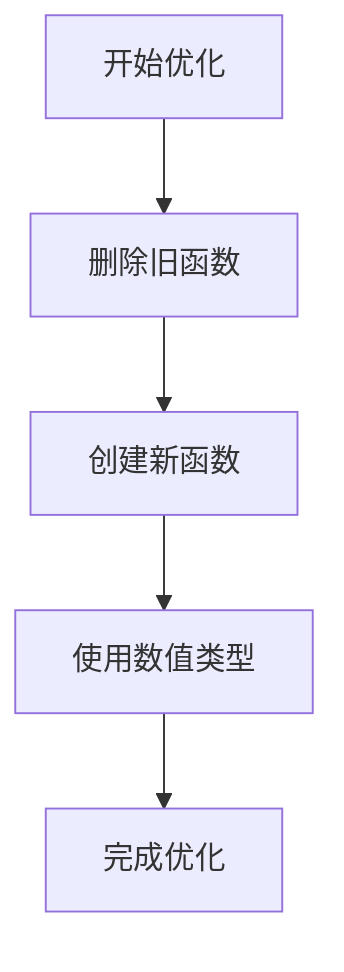
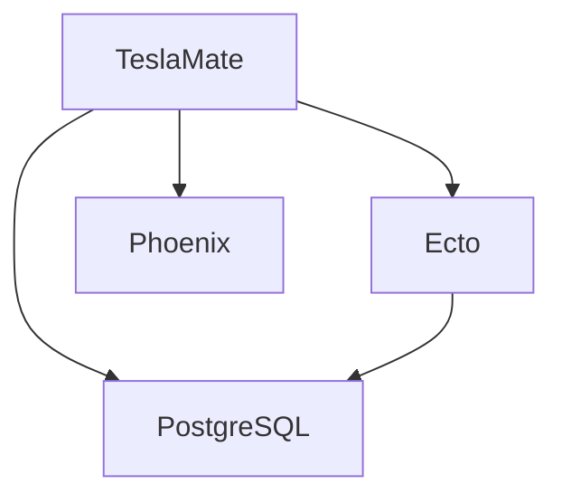

# 枚举与类型调整

<cite>
**本文档引用的文件**
- [20190810105216_unit_of_length_and_temperature.exs](file://priv/repo/migrations/20190810105216_unit_of_length_and_temperature.exs)
- [20200528173223_rename_unit_enums.exs](file://priv/repo/migrations/20200528173223_rename_unit_enums.exs)
- [20200528175158_optimize_conversion_helpers.exs](file://priv/repo/migrations/20200528175158_optimize_conversion_helpers.exs)
- [global_settings.ex](file://lib/teslamate/settings/global_settings.ex)
- [convert.ex](file://lib/teslamate/convert.ex)
- [20220718085412_add_unit_of_pressure_to_global_settings.exs](file://priv/repo/migrations/20220718085412_add_unit_of_pressure_to_global_settings.exs)
- [20200410112005_database_efficiency_improvements.exs](file://priv/repo/migrations/20200410112005_database_efficiency_improvements.exs)
</cite>

## 目录
1. [引言](#引言)
2. [项目结构](#项目结构)
3. [核心组件](#核心组件)
4. [架构概述](#架构概述)
5. [详细组件分析](#详细组件分析)
6. [依赖分析](#依赖分析)
7. [性能考虑](#性能考虑)
8. [故障排除指南](#故障排除指南)
9. [结论](#结论)

## 引言
本文档详细说明TeslaMate中对枚举类型和字段类型的调整策略，以unit enums重命名为例，展示如何在不中断服务的前提下更新数据库类型定义。涵盖ALTER TYPE操作的安全使用、默认值更新、应用层适配逻辑以及对查询性能的影响评估。提供迁移过程中的兼容性处理技巧，确保新旧值正确映射并避免数据丢失。

## 项目结构
TeslaMate项目采用Elixir语言开发，使用PostgreSQL作为数据库，通过Ecto进行数据库操作。项目结构清晰，主要包含配置、库、私有资源、测试和网站文档等目录。其中，`priv/repo/migrations`目录存放数据库迁移脚本，`lib/teslamate/settings`目录存放设置相关模块。

**图源**
- [20190810105216_unit_of_length_and_temperature.exs](file://priv/repo/migrations/20190810105216_unit_of_length_and_temperature.exs)
- [global_settings.ex](file://lib/teslamate/settings/global_settings.ex)

**节源**
- [20190810105216_unit_of_length_and_temperature.exs](file://priv/repo/migrations/20190810105216_unit_of_length_and_temperature.exs)
- [global_settings.ex](file://lib/teslamate/settings/global_settings.ex)

## 核心组件
核心组件包括数据库迁移脚本、设置模块和转换工具。数据库迁移脚本负责数据库结构的变更，设置模块管理用户设置，转换工具提供单位转换功能。

**节源**
- [20200528173223_rename_unit_enums.exs](file://priv/repo/migrations/20200528173223_rename_unit_enums.exs)
- [convert.ex](file://lib/teslamate/convert.ex)

## 架构概述
TeslaMate采用分层架构，包括数据访问层、业务逻辑层和用户界面层。数据访问层通过Ecto与PostgreSQL数据库交互，业务逻辑层处理核心功能，用户界面层提供Web界面。

**图源**
- [repo.ex](file://lib/teslamate/repo.ex)

## 详细组件分析
### 枚举类型调整分析
#### 数据库迁移策略
TeslaMate通过Ecto迁移脚本安全地调整枚举类型。以`20200528173223_rename_unit_enums.exs`为例，该脚本使用`ALTER TYPE`命令重命名枚举类型，确保数据库结构变更的原子性和可逆性。

**图源**
- [20200528173223_rename_unit_enums.exs](file://priv/repo/migrations/20200528173223_rename_unit_enums.exs)

**节源**
- [20200528173223_rename_unit_enums.exs](file://priv/repo/migrations/20200528173223_rename_unit_enums.exs)

#### 应用层适配逻辑
应用层通过`global_settings.ex`模块管理单位设置，确保用户设置与数据库结构一致。该模块定义了`unit_of_length`和`unit_of_temperature`字段，使用Ecto.Enum类型约束值范围。

**图源**
- [global_settings.ex](file://lib/teslamate/settings/global_settings.ex)

**节源**
- [global_settings.ex](file://lib/teslamate/settings/global_settings.ex)

#### 单位转换优化
`20200528175158_optimize_conversion_helpers.exs`迁移脚本优化了单位转换函数，将浮点数参数改为数值类型，提高精度和性能。同时，使用`CREATE OR REPLACE FUNCTION`确保函数定义的原子性。

**图源**
- [20200528175158_optimize_conversion_helpers.exs](file://priv/repo/migrations/20200528175158_optimize_conversion_helpers.exs)

**节源**
- [20200528175158_optimize_conversion_helpers.exs](file://priv/repo/migrations/20200528175158_optimize_conversion_helpers.exs)

## 依赖分析
TeslaMate依赖Ecto进行数据库操作，PostgreSQL作为数据库，Phoenix框架提供Web服务。这些依赖通过mix.exs文件管理，确保版本兼容性。

**图源**
- [mix.exs](file://mix.exs)

**节源**
- [mix.exs](file://mix.exs)

## 性能考虑
在调整枚举类型时，需考虑查询性能。通过使用数值类型代替浮点数，提高计算精度和性能。同时，合理设计数据库索引，优化查询效率。

**节源**
- [20200410112005_database_efficiency_improvements.exs](file://priv/repo/migrations/20200410112005_database_efficiency_improvements.exs)

## 故障排除指南
在迁移过程中，如遇问题，可检查数据库日志，确认迁移脚本执行情况。同时，验证应用层设置是否正确加载，确保用户界面显示正确。

**节源**
- [database_check.ex](file://lib/teslamate/database_check.ex)

## 结论
TeslaMate通过精心设计的迁移策略，安全地调整枚举类型和字段类型，确保服务不中断。通过应用层适配和性能优化，提供稳定可靠的用户体验。