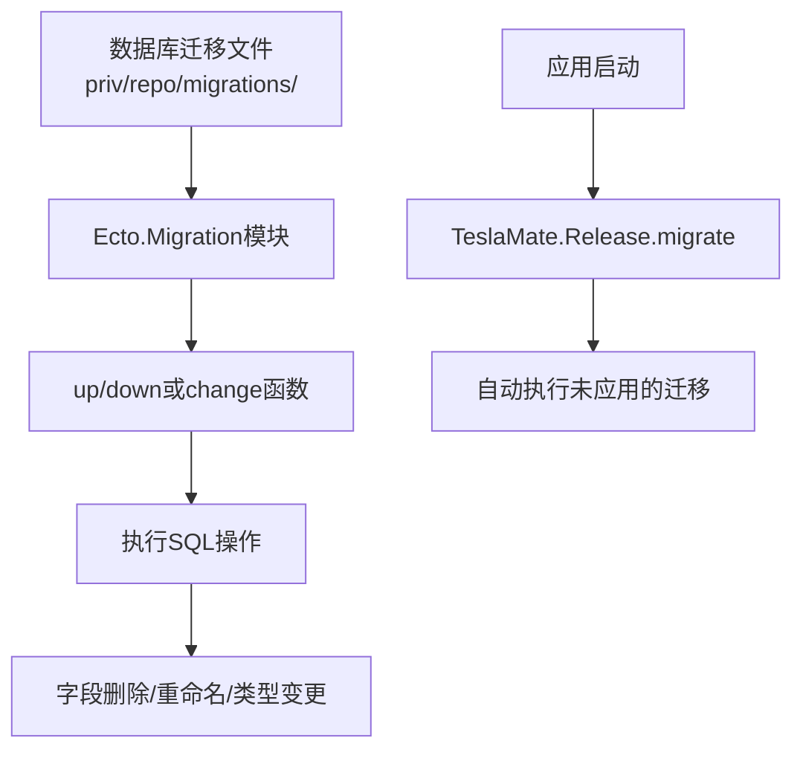
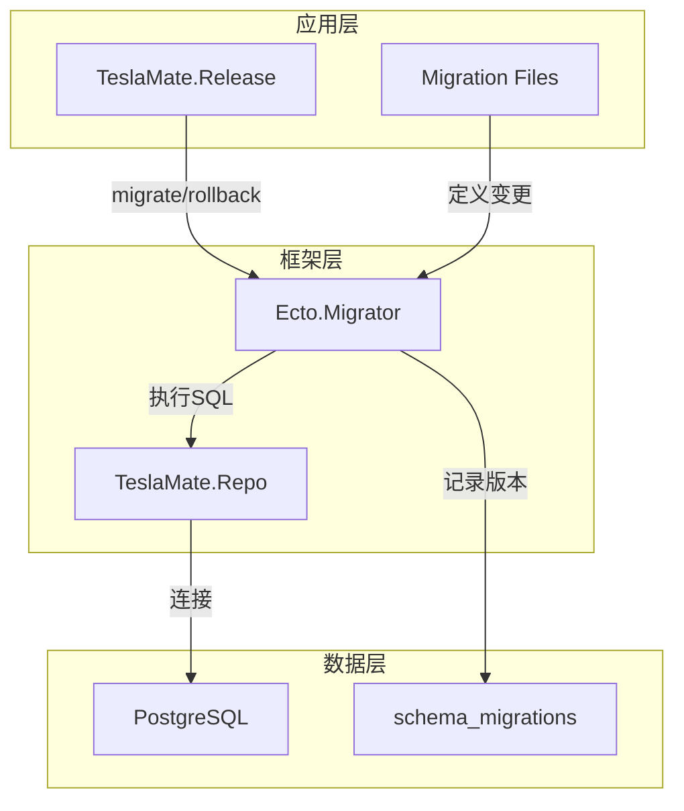
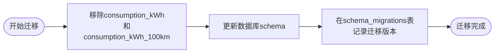
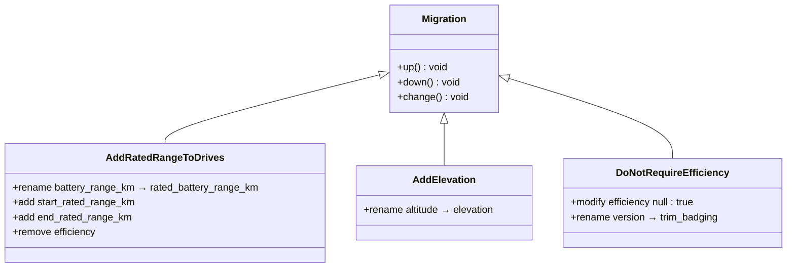
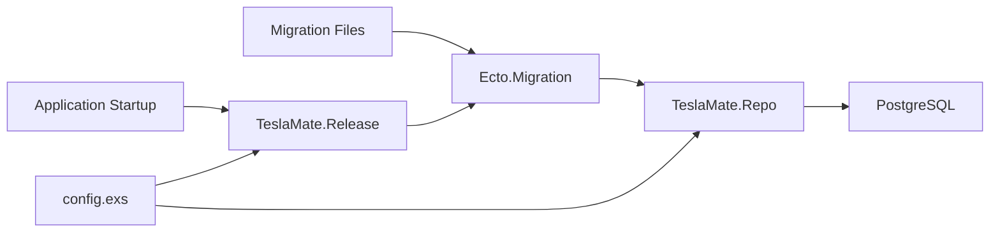

# 破坏性变更管理

<cite>
**本文档引用的文件**  
- [20190821155748_drop_consumption_columns.exs](file://priv/repo/migrations/20190821155748_drop_consumption_columns.exs)
- [repo.ex](file://lib/teslamate/repo.ex)
- [release.ex](file://lib/teslamate/release.ex)
- [config.exs](file://config/config.exs)
- [prod.exs](file://config/prod.exs)
- [20190812191616_rename_trips_to_drives.exs](file://priv/repo/migrations/20190812191616_rename_trips_to_drives.exs)
- [20190913175011_add_rated_range_to_drives.exs](file://priv/repo/migrations/20190913175011_add_rated_range_to_drives.exs)
- [20190828104902_add_elevation.exs](file://priv/repo/migrations/20190828104902_add_elevation.exs)
- [20190828150058_do_not_require_efficiency.exs](file://priv/repo/migrations/20190828150058_do_not_require_efficiency.exs)
- [20190823173437_add_sleep_requirements.exs](file://priv/repo/migrations/20190823173437_add_sleep_requirements.exs)
</cite>

## 目录
1. [引言](#引言)
2. [项目结构与数据库迁移机制](#项目结构与数据库迁移机制)
3. [核心组件分析：数据库迁移与版本控制](#核心组件分析数据库迁移与版本控制)
4. [架构概览：Ecto迁移系统集成](#架构概览ecto迁移系统集成)
5. [详细组件分析](#详细组件分析)
6. [依赖关系分析](#依赖关系分析)
7. [性能考量](#性能考量)
8. [故障排查指南](#故障排查指南)
9. [结论](#结论)

## 引言
本文系统性地总结TeslaMate中处理破坏性数据库变更的最佳实践，以移除`consumption`列为例，说明如何评估变更影响范围，制定数据备份与恢复预案，实施灰度发布流程，并监控关键指标以确保系统稳定性。重点强调在执行DROP操作前的数据验证、日志审计和回滚能力构建，确保生产环境安全。

## 项目结构与数据库迁移机制

**图示来源**  
- [20190821155748_drop_consumption_columns.exs](file://priv/repo/migrations/20190821155748_drop_consumption_columns.exs#L1-L11)
- [release.ex](file://lib/teslamate/release.ex#L7-L11)

**本节来源**  
- [priv/repo/migrations/](file://priv/repo/migrations/)
- [release.ex](file://lib/teslamate/release.ex#L1-L34)

## 核心组件分析：数据库迁移与版本控制

TeslaMate使用Ecto框架进行数据库迁移管理，所有破坏性变更均通过版本化迁移文件实现。以`20190821155748_drop_consumption_columns.exs`为例，该文件展示了如何安全地移除`drives`表中的`consumption_kWh`和`consumption_kWh_100km`字段。

在执行此类破坏性变更前，团队需评估以下影响：
- 是否有下游服务或报表依赖这些字段
- 历史数据是否仍需保留用于统计分析
- 前端界面是否引用了这些字段

通过将变更封装在迁移文件中，可确保变更过程可追溯、可重复且具备回滚能力。

**本节来源**  
- [20190821155748_drop_consumption_columns.exs](file://priv/repo/migrations/20190821155748_drop_consumption_columns.exs#L1-L11)
- [repo.ex](file://lib/teslamate/repo.ex#L1-L6)

## 架构概览：Ecto迁移系统集成

**图示来源**  
- [release.ex](file://lib/teslamate/release.ex#L7-L17)
- [repo.ex](file://lib/teslamate/repo.ex#L1-L6)
- [config.exs](file://config/config.exs#L3-L4)

## 详细组件分析

### 字段删除操作分析
以删除`consumption`列为例，迁移文件采用`remove`指令而非直接执行`DROP COLUMN`，这符合Ecto的最佳实践。

**图示来源**  
- [20190821155748_drop_consumption_columns.exs](file://priv/repo/migrations/20190821155748_drop_consumption_columns.exs#L4-L8)

**本节来源**  
- [20190821155748_drop_consumption_columns.exs](file://priv/repo/migrations/20190821155748_drop_consumption_columns.exs#L1-L11)

### 字段重命名与重构案例
当需要更改字段语义时，如将`battery_range_km`重命名为`rated_battery_range_km`，项目采用先重命名再添加新字段的策略，确保数据连续性。

**图示来源**  
- [20190913175011_add_rated_range_to_drives.exs](file://priv/repo/migrations/20190913175011_add_rated_range_to_drives.exs#L1-L30)
- [20190828104902_add_elevation.exs](file://priv/repo/migrations/20190828104902_add_elevation.exs#L1-L8)
- [20190828150058_do_not_require_efficiency.exs](file://priv/repo/migrations/20190828150058_do_not_require_efficiency.exs#L1-L22)

**本节来源**  
- [20190913175011_add_rated_range_to_drives.exs](file://priv/repo/migrations/20190913175011_add_rated_range_to_drives.exs#L1-L30)
- [20190828104902_add_elevation.exs](file://priv/repo/migrations/20190828104902_add_elevation.exs#L1-L8)
- [20190828150058_do_not_require_efficiency.exs](file://priv/repo/migrations/20190828150058_do_not_require_efficiency.exs#L1-L22)

## 依赖关系分析

**图示来源**  
- [config.exs](file://config/config.exs#L3-L4)
- [repo.ex](file://lib/teslamate/repo.ex#L1-L6)
- [release.ex](file://lib/teslamate/release.ex#L1-L34)

**本节来源**  
- [config.exs](file://config/config.exs#L1-L30)
- [prod.exs](file://config/prod.exs#L1-L15)
- [release.ex](file://lib/teslamate/release.ex#L1-L34)

## 性能考量
在执行破坏性数据库变更时，需特别关注以下性能影响：
- 大表的`DROP COLUMN`操作可能导致长时间表锁
- 迁移过程应避免在高负载时段执行
- 建议在维护窗口期进行重大变更
- 使用`seconds_since_last_migration`函数监控迁移时效性

## 故障排查指南
当数据库迁移出现问题时，可采取以下措施：
- 检查`scheme_migrations`表确认迁移状态
- 使用`TeslaMate.Release.rollback/2`回滚到指定版本
- 查看日志中`[level]`元数据定位问题
- 验证PostgreSQL连接配置正确性

**本节来源**  
- [release.ex](file://lib/teslamate/release.ex#L13-L17)
- [config.exs](file://config/config.exs#L19-L21)

## 结论
TeslaMate通过Ecto迁移系统实现了安全、可追溯的数据库变更管理。对于破坏性变更，项目采用版本化迁移文件、双向回滚支持和自动化执行机制，确保了生产环境的稳定性。最佳实践包括：充分评估变更影响、使用原子化迁移操作、保持回滚能力、在低峰期执行变更，并通过监控确保系统健康。