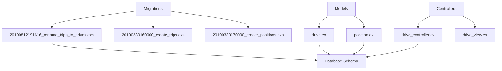
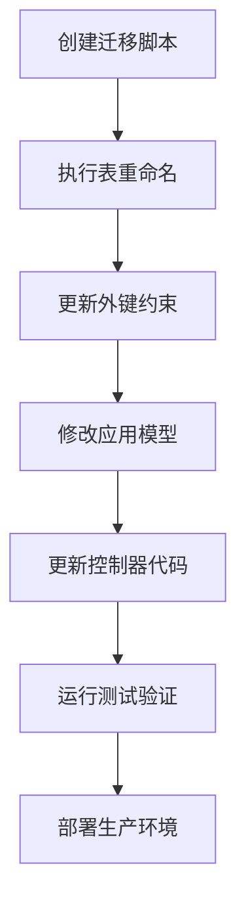
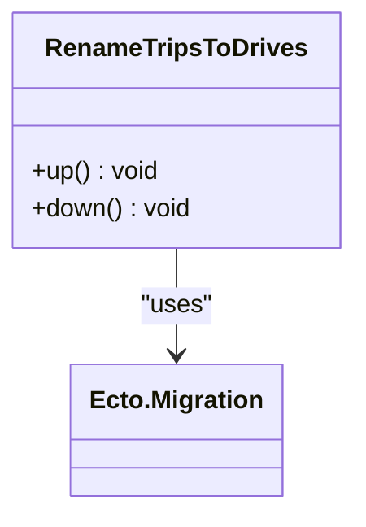
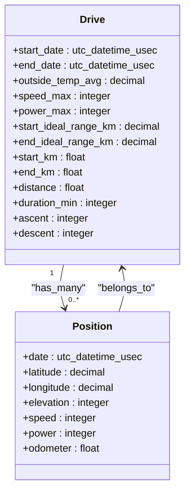
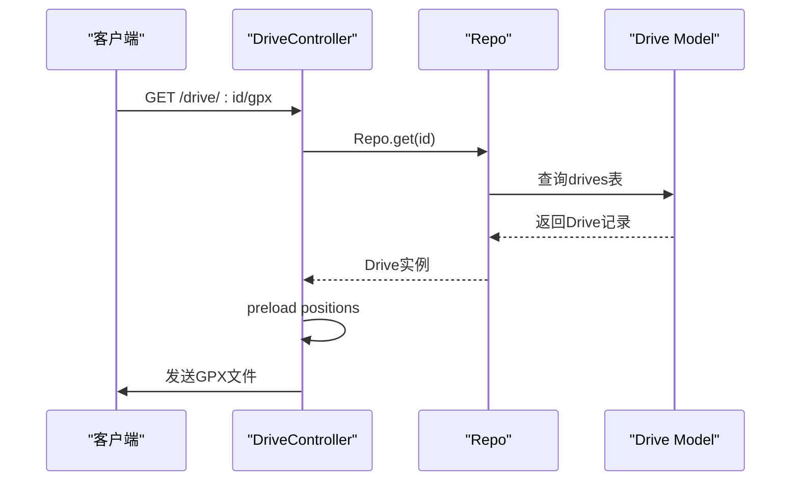
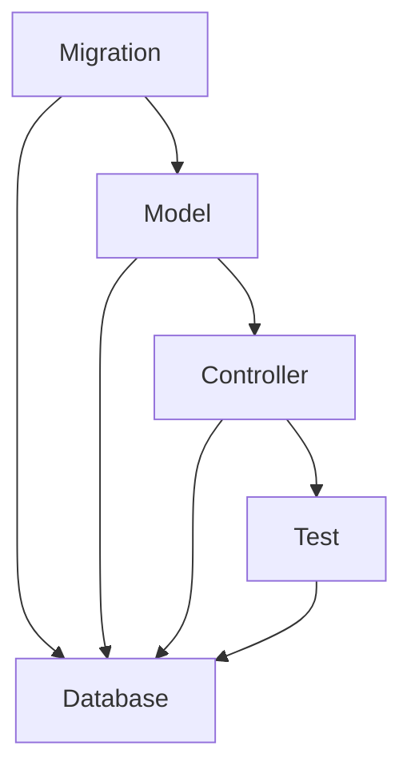

# 表重命名模式

<cite>
**本文档中引用的文件**   
- [20190330160000_create_trips.exs](file://priv/repo/migrations/20190330160000_create_trips.exs)
- [20190330170000_create_positions.exs](file://priv/repo/migrations/20190330170000_create_positions.exs)
- [20190812191616_rename_trips_to_drives.exs](file://priv/repo/migrations/20190812191616_rename_trips_to_drives.exs)
- [20200203120311_cascade_delete.exs](file://priv/repo/migrations/20200203120311_cascade_delete.exs)
- [drive.ex](file://lib/teslamate/log/drive.ex)
- [position.ex](file://lib/teslamate/log/position.ex)
- [drive_controller.ex](file://lib/teslamate_web/controllers/drive_controller.ex)
- [drive_view.ex](file://lib/teslamate_web/views/drive_view.ex)
- [log_drive_test.exs](file://test/teslamate/log/log_drive_test.exs)
- [drive_controller_test.exs](file://test/teslamate_web/controllers/drive_controller_test.exs)
</cite>

## 目录
1. [引言](#引言)
2. [项目结构](#项目结构)
3. [核心组件](#核心组件)
4. [架构概述](#架构概述)
5. [详细组件分析](#详细组件分析)
6. [依赖分析](#依赖分析)
7. [性能考虑](#性能考虑)
8. [故障排除指南](#故障排除指南)
9. [结论](#结论)

## 引言
本文深入探讨TeslaMate项目中从trips表重命名为drives表的工程实践，阐述大规模重构中的数据迁移策略。重点分析如何通过原子性操作确保服务不中断，如何处理外键依赖关系，以及如何协调应用层代码与数据库变更的发布节奏。包含迁移脚本解析、视图过渡方案和错误回滚机制，确保高可用环境下的安全演进。

## 项目结构
TeslaMate项目采用典型的Elixir/Phoenix应用结构，数据库迁移文件位于`priv/repo/migrations/`目录下，应用逻辑代码位于`lib/teslamate/`目录中。表重命名操作主要涉及数据库迁移、模型定义和控制器代码的协同变更。

**图表来源**
- [20190812191616_rename_trips_to_drives.exs](file://priv/repo/migrations/20190812191616_rename_trips_to_drives.exs#L1-L23)
- [drive.ex](file://lib/teslamate/log/drive.ex#L1-L79)
- [position.ex](file://lib/teslamate/log/position.ex#L1-L79)

**章节来源**
- [20190812191616_rename_trips_to_drives.exs](file://priv/repo/migrations/20190812191616_rename_trips_to_drives.exs#L1-L23)
- [drive.ex](file://lib/teslamate/log/drive.ex#L1-L79)

## 核心组件
表重命名的核心组件包括数据库迁移脚本、Ecto模型定义和Web控制器。迁移脚本负责执行数据库级别的重命名操作，模型定义反映新的表名和字段名，控制器代码则使用更新后的模型进行数据访问。

**章节来源**
- [20190812191616_rename_trips_to_drives.exs](file://priv/repo/migrations/20190812191616_rename_trips_to_drives.exs#L1-L23)
- [drive.ex](file://lib/teslamate/log/drive.ex#L1-L79)
- [drive_controller.ex](file://lib/teslamate_web/controllers/drive_controller.ex#L1-L31)

## 架构概述
TeslaMate的表重命名实践遵循了数据库迁移的最佳实践，通过Ecto迁移模块实现原子性操作。整个过程包括创建迁移脚本、更新模型定义、修改应用代码和测试验证四个阶段。

**图表来源**
- [20190812191616_rename_trips_to_drives.exs](file://priv/repo/migrations/20190812191616_rename_trips_to_drives.exs#L1-L23)
- [drive.ex](file://lib/teslamate/log/drive.ex#L1-L79)

## 详细组件分析

### 迁移脚本分析
迁移脚本`20190812191616_rename_trips_to_drives.exs`实现了从trips表到drives表的重命名，包括表名、字段名和约束名的全面更新。

**图表来源**
- [20190812191616_rename_trips_to_drives.exs](file://priv/repo/migrations/20190812191616_rename_trips_to_drives.exs#L1-L23)

**章节来源**
- [20190812191616_rename_trips_to_drives.exs](file://priv/repo/migrations/20190812191616_rename_trips_to_drives.exs#L1-L23)

### 模型定义分析
`drive.ex`模型文件定义了drives表的结构，包括字段定义和关联关系。该模型通过Ecto的schema宏映射到数据库表。

**图表来源**
- [drive.ex](file://lib/teslamate/log/drive.ex#L8-L39)
- [position.ex](file://lib/teslamate/log/position.ex#L7-L39)

**章节来源**
- [drive.ex](file://lib/teslamate/log/drive.ex#L1-L79)
- [position.ex](file://lib/teslamate/log/position.ex#L1-L79)

### 控制器分析
`drive_controller.ex`文件中的控制器处理与drives表相关的HTTP请求，如GPX文件导出。控制器通过Ecto Repo访问数据库。

**图表来源**
- [drive_controller.ex](file://lib/teslamate_web/controllers/drive_controller.ex#L10-L20)
- [drive.ex](file://lib/teslamate/log/drive.ex#L1-L79)

**章节来源**
- [drive_controller.ex](file://lib/teslamate_web/controllers/drive_controller.ex#L1-L31)
- [drive.ex](file://lib/teslamate/log/drive.ex#L1-L79)

## 依赖分析
表重命名操作涉及多个组件的协同变更，包括数据库迁移、模型定义、控制器代码和测试用例。这些组件之间存在紧密的依赖关系。

**图表来源**
- [20190812191616_rename_trips_to_drives.exs](file://priv/repo/migrations/20190812191616_rename_trips_to_drives.exs#L1-L23)
- [drive.ex](file://lib/teslamate/log/drive.ex#L1-L79)
- [drive_controller.ex](file://lib/teslamate_web/controllers/drive_controller.ex#L1-L31)
- [drive_controller_test.exs](file://test/teslamate_web/controllers/drive_controller_test.exs#L1-L82)

**章节来源**
- [20190812191616_rename_trips_to_drives.exs](file://priv/repo/migrations/20190812191616_rename_trips_to_drives.exs#L1-L23)
- [drive.ex](file://lib/teslamate/log/drive.ex#L1-L79)
- [drive_controller.ex](file://lib/teslamate_web/controllers/drive_controller.ex#L1-L31)
- [drive_controller_test.exs](file://test/teslamate_web/controllers/drive_controller_test.exs#L1-L82)

## 性能考虑
表重命名操作在PostgreSQL中是元数据操作，通常非常快速。然而，对于大型表，重命名外键约束和索引可能需要额外的时间。TeslaMate通过在迁移脚本中明确处理这些约束，确保了操作的高效性。

## 故障排除指南
当表重命名出现问题时，可以通过以下步骤进行排查：
1. 检查迁移脚本是否正确执行
2. 验证数据库中表名和约束名是否已更新
3. 确认应用模型与数据库结构匹配
4. 检查控制器代码是否使用正确的模型名称

**章节来源**
- [20190812191616_rename_trips_to_drives.exs](file://priv/repo/migrations/20190812191616_rename_trips_to_drives.exs#L1-L23)
- [drive.ex](file://lib/teslamate/log/drive.ex#L1-L79)
- [drive_controller.ex](file://lib/teslamate_web/controllers/drive_controller.ex#L1-L31)

## 结论
TeslaMate的表重命名实践展示了在高可用环境中进行数据库重构的成熟方法。通过原子性迁移脚本、清晰的模型定义和全面的测试覆盖，确保了数据迁移的安全性和可靠性。这种工程实践为类似的大规模重构提供了有价值的参考。