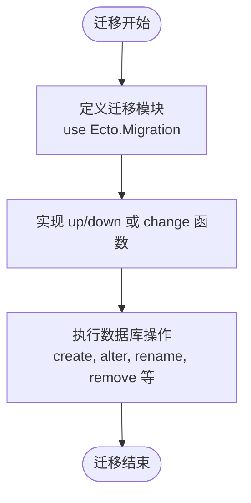
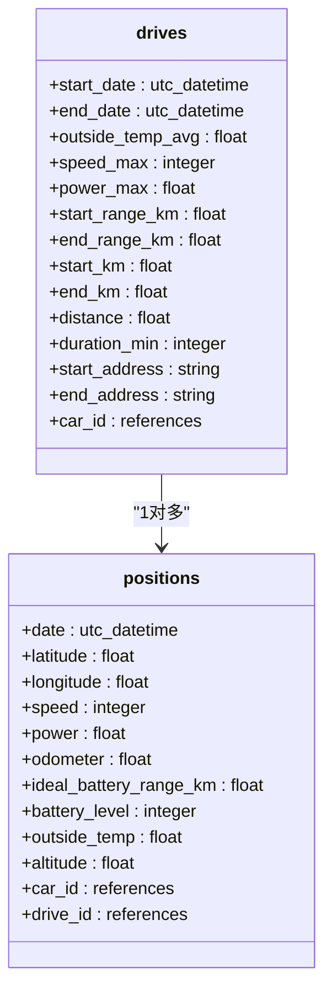
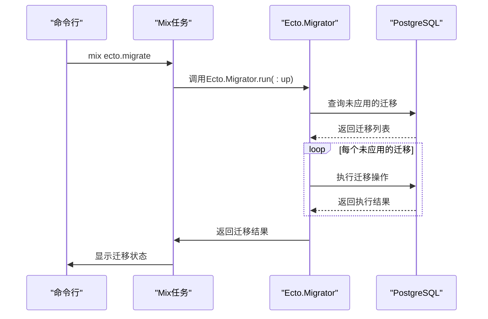

# 模式演进与迁移管理

<cite>
**本文档中引用的文件**  
- [20190330160000_create_trips.exs](file://priv/repo/migrations/20190330160000_create_trips.exs)
- [20190812191616_rename_trips_to_drives.exs](file://priv/repo/migrations/20190812191616_rename_trips_to_drives.exs)
- [20190821143938_add_constraints.exs](file://priv/repo/migrations/20190821143938_add_constraints.exs)
- [20190821155748_drop_consumption_columns.exs](file://priv/repo/migrations/20190821155748_drop_consumption_columns.exs)
- [20190810105216_unit_of_length_and_temperature.exs](file://priv/repo/migrations/20190810105216_unit_of_length_and_temperature.exs)
- [20190816165713_extend_car_table.exs](file://priv/repo/migrations/20190816165713_extend_car_table.exs)
- [20190828094708_add_battery_range.exs](file://priv/repo/migrations/20190828094708_add_battery_range.exs)
- [repo.ex](file://lib/teslamate/repo.ex)
- [config.exs](file://config/config.exs)
- [mix.exs](file://mix.exs)
- [release.ex](file://lib/teslamate/release.ex)
- [.formatter.exs](file://.formatter.exs)
- [priv/repo/migrations/.formatter.exs](file://priv/repo/migrations/.formatter.exs)
</cite>

## 目录
1. [引言](#引言)
2. [数据库模式演进历史](#数据库模式演进历史)
3. [Ecto迁移机制详解](#ecto迁移机制详解)
4. [迁移文件版本化与执行顺序](#迁移文件版本化与执行顺序)
5. [生产环境迁移最佳实践](#生产环境迁移最佳实践)
6. [破坏性变更处理案例](#破坏性变更处理案例)
7. [迁移管理命令](#迁移管理命令)
8. [结论](#结论)

## 引言
TeslaMate是一个用于跟踪和分析特斯拉车辆数据的开源项目，其后端采用Elixir语言和Ecto框架构建，使用PostgreSQL作为持久化存储。随着功能的不断迭代，数据库模式需要持续演进。本文档详细描述了TeslaMate数据库模式的演进过程和迁移管理机制，重点介绍如何使用Ecto.Migrations安全地进行模式变更，包括字段添加、重命名、类型修改和约束调整等操作。

**本文档中引用的文件**  
- [config.exs](file://config/config.exs)
- [repo.ex](file://lib/teslamate/repo.ex)

## 数据库模式演进历史
TeslaMate的数据库模式经历了从初始版本到当前版本的持续演进。通过分析`priv/repo/migrations/`目录下的迁移文件，可以清晰地看到其演进路径。

### 初始模式创建
项目初期创建了核心数据表，包括车辆（cars）、行程（trips）、位置（positions）、状态（states）等。例如，`20190330160000_create_trips.exs`文件定义了行程表的初始结构，包含起止时间、温度、速度、能耗等字段。

**本文档中引用的文件**  
- [20190330160000_create_trips.exs](file://priv/repo/migrations/20190330160000_create_trips.exs)

### 模式扩展与优化
随着需求变化，数据库模式不断扩展。例如：
- `20190816165713_extend_car_table.exs`为车辆表添加了VIN码、名称和版本等字段
- `20190828094708_add_battery_range.exs`在位置表中增加了电池续航字段
- `20190810105216_unit_of_length_and_temperature.exs`引入了长度和温度单位枚举类型，并重构了设置表

**本文档中引用的文件**  
- [20190816165713_extend_car_table.exs](file://priv/repo/migrations/20190816165713_extend_car_table.exs)
- [20190828094708_add_battery_range.exs](file://priv/repo/migrations/20190828094708_add_battery_range.exs)
- [20190810105216_unit_of_length_and_temperature.exs](file://priv/repo/migrations/20190810105216_unit_of_length_and_temperature.exs)

### 约束与完整性
为了保证数据完整性，项目引入了各种约束。`20190821143938_add_constraints.exs`文件为状态表和更新表添加了正持续时间约束，并为状态表创建了唯一索引，确保每辆车在同一时间只有一个未结束的状态。

**本文档中引用的文件**  
- [20190821143938_add_constraints.exs](file://priv/repo/migrations/20190821143938_add_constraints.exs)

## Ecto迁移机制详解
Ecto.Migrations是Elixir中用于管理数据库模式变更的强大工具。TeslaMate项目充分利用了这一机制来安全地进行模式演进。

### 迁移文件结构
每个迁移文件都是一个Elixir模块，使用`use Ecto.Migration`宏。迁移模块通常包含`up/0`和`down/0`函数，分别定义了模式升级和降级的操作。对于非破坏性变更，也可以使用`change/0`函数，Ecto会自动推导出对应的`down`操作。

**本文档中引用的文件**  
- [20190812191616_rename_trips_to_drives.exs](file://priv/repo/migrations/20190812191616_rename_trips_to_drives.exs)
- [20190821155748_drop_consumption_columns.exs](file://priv/repo/migrations/20190821155748_drop_consumption_columns.exs)

### 常见模式变更操作
#### 字段添加
使用`alter table(:table_name) do add(:field_name, :type) end`语法添加新字段。例如为位置表添加电池续航字段。

#### 字段重命名
使用`rename(table(:table_name), :old_name, to: :new_name)`重命名字段。这在表结构调整时非常有用。

#### 类型修改
虽然Ecto不直接支持类型修改，但可以通过`execute/1`函数执行原生SQL语句来实现。例如修改字段的数据类型或约束。

#### 约束调整
使用`create(constraint(...))`和`create(unique_index(...))`添加约束，使用`drop(constraint(...))`移除约束。

**本文档中引用的文件**  
- [20190821143938_add_constraints.exs](file://priv/repo/migrations/20190821143938_add_constraints.exs)
- [20190810105216_unit_of_length_and_temperature.exs](file://priv/repo/migrations/20190810105216_unit_of_length_and_temperature.exs)

## 迁移文件版本化与执行顺序
TeslaMate采用基于时间戳的版本化命名策略，确保迁移文件按正确顺序执行。

### 版本化命名策略
所有迁移文件都以UTC时间戳开头（格式为YYYYMMDDHHMMSS），后跟描述性名称。这种命名方式确保了文件按时间顺序排列，从而保证迁移按正确的顺序执行。例如`20190812191616_rename_trips_to_drives.exs`表示2019年8月12日19:16:16创建的重命名迁移。

### 执行顺序管理
Ecto通过`scheme_migrations`表跟踪已应用的迁移。每次执行`mix ecto.migrate`时，Ecto会比较本地迁移文件与数据库中的记录，按时间戳顺序应用未执行的迁移。这种机制确保了所有环境中的模式一致性。

**本文档中引用的文件**  
- [20190812191616_rename_trips_to_drives.exs](file://priv/repo/migrations/20190812191616_rename_trips_to_drives.exs)
- [20190821155748_drop_consumption_columns.exs](file://priv/repo/migrations/20190821155748_drop_consumption_columns.exs)

## 生产环境迁移最佳实践
在生产环境中应用数据库迁移需要格外谨慎，以避免数据丢失或服务中断。

### 备份策略
在执行任何迁移之前，必须对数据库进行完整备份。TeslaMate项目在`website/docs/maintenance/backup_restore.mdx`文档中详细描述了备份和恢复流程。

### 测试流程
所有迁移都应在开发和测试环境中充分测试。项目通过`mix test`命令运行测试套件，确保迁移不会破坏现有功能。

### 回滚方案
每个迁移都应提供可靠的回滚机制。对于`change/0`函数定义的迁移，Ecto可以自动回滚。对于复杂的`up/0`和`down/0`迁移，必须仔细测试回滚逻辑。

**本文档中引用的文件**  
- [release.ex](file://lib/teslamate/release.ex)

## 破坏性变更处理案例
### 表重命名案例分析
`20190812191616_rename_trips_to_drives.exs`是一个典型的破坏性变更案例，将`trips`表重命名为`drives`，并相应更新外键引用。

该迁移不仅重命名了主表，还处理了相关联的外键约束和索引：
1. 使用`rename(table(:trips), to: table(:drives))`重命名主表
2. 使用`rename(table(:positions), :trip_id, to: :drive_id)`重命名外键字段
3. 使用`execute/1`函数重命名索引和外键约束

这种全面的处理方式确保了数据完整性和引用一致性。

**本文档中引用的文件**  
- [20190812191616_rename_trips_to_drives.exs](file://priv/repo/migrations/20190812191616_rename_trips_to_drives.exs)
- [20190330170000_create_positions.exs](file://priv/repo/migrations/20190330170000_create_positions.exs)

## 迁移管理命令
TeslaMate项目提供了多种命令来管理数据库迁移。

### 迁移执行
- `mix ecto.migrate`：应用所有未执行的迁移
- `mix ecto.migrate --to VERSION`：迁移到指定版本
- `mix ecto.migrate --step N`：向前迁移N步

### 迁移回滚
- `mix ecto.rollback`：回滚最后一步迁移
- `mix ecto.rollback --to VERSION`：回滚到指定版本
- `mix ecto.rollback --step N`：向后回滚N步

### 自定义释放任务
项目在`lib/teslamate/release.ex`中定义了自定义的发布任务，包括`migrate/0`和`rollback/2`函数，可以在生产环境中安全地执行迁移操作。

**本文档中引用的文件**  
- [mix.exs](file://mix.exs)
- [release.ex](file://lib/teslamate/release.ex)

## 结论
TeslaMate项目展示了如何在生产环境中安全、可靠地管理数据库模式演进。通过使用Ecto.Migrations，项目实现了版本化、可回滚的模式变更管理。基于时间戳的命名策略确保了迁移的正确执行顺序，而详细的`up/0`和`down/0`函数提供了对复杂变更的精确控制。在生产环境中，结合备份、测试和回滚方案，可以最大限度地降低迁移风险。这种系统化的迁移管理方法为其他Elixir/Phoenix项目提供了有价值的参考。