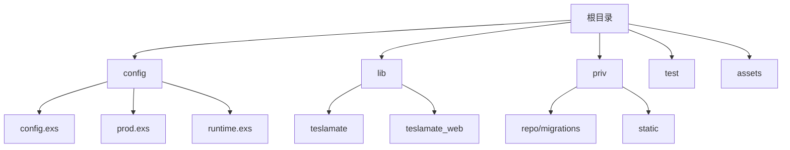
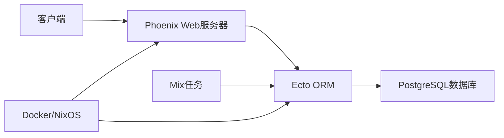
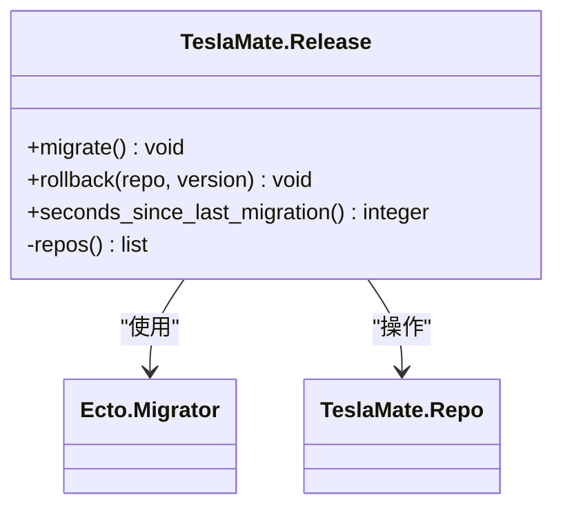
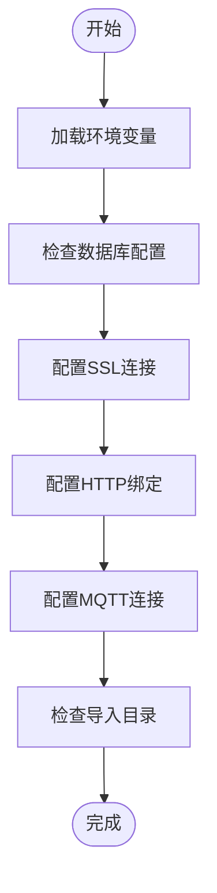
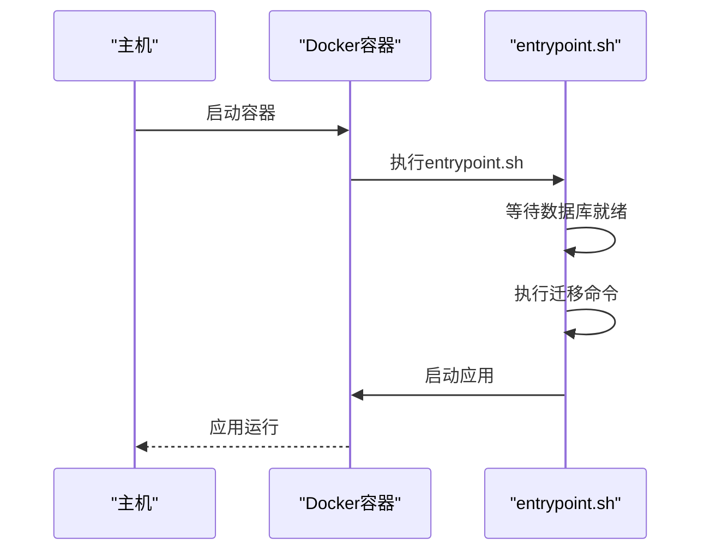
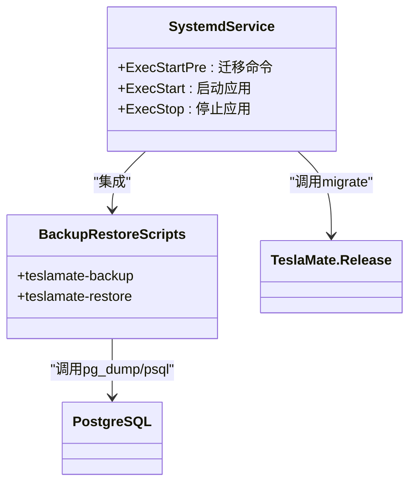
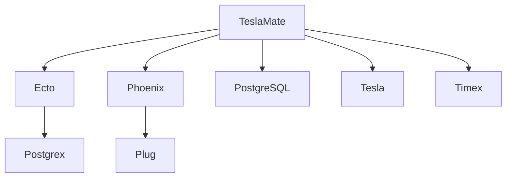

# 生产环境迁移策略

<cite>
**本文档引用的文件**  
- [release.ex](file://lib/teslamate/release.ex)
- [runtime.exs](file://config/runtime.exs)
- [prod.exs](file://config/prod.exs)
- [application.ex](file://lib/teslamate/application.ex)
- [mix.exs](file://mix.exs)
- [repo.ex](file://lib/teslamate/repo.ex)
- [database_check.ex](file://lib/teslamate/database_check.ex)
- [upgrading.mdx](file://website/docs/upgrading.mdx)
- [backup_restore.mdx](file://website/docs/maintenance/backup_restore.mdx)
- [Dockerfile](file://Dockerfile)
- [entrypoint.sh](file://entrypoint.sh)
- [module.nix](file://nix/module.nix)
- [backup_and_restore.nix](file://nix/backup_and_restore.nix)
</cite>

## 目录
1. [引言](#引言)
2. [项目结构](#项目结构)
3. [核心组件](#核心组件)
4. [架构概述](#架构概述)
5. [详细组件分析](#详细组件分析)
6. [依赖分析](#依赖分析)
7. [性能考虑](#性能考虑)
8. [故障排除指南](#故障排除指南)
9. [结论](#结论)

## 引言
本文档深入探讨在生产环境中安全执行数据库迁移的策略，基于TeslaMate项目的实现。我们将分析如何通过自定义Mix任务在应用升级前自动执行迁移，研究配置文件对迁移行为的影响，并结合Docker或NixOS部署流程实现无缝更新。

## 项目结构
TeslaMate项目采用标准的Elixir应用结构，包含配置、库、测试和静态资源等目录。数据库迁移脚本位于`priv/repo/migrations`目录中，每个迁移文件按时间戳命名，确保执行顺序。

**图示来源**
- [config](file://config)
- [lib](file://lib)
- [priv](file://priv)

**本节来源**
- [config](file://config)
- [lib](file://lib)
- [priv](file://priv)

## 核心组件
系统的核心组件包括数据库迁移管理、运行时配置处理和应用生命周期管理。关键文件包括`release.ex`中的迁移逻辑、`runtime.exs`中的动态配置以及`application.ex`中的启动流程。

**本节来源**
- [release.ex](file://lib/teslamate/release.ex#L1-L34)
- [runtime.exs](file://config/runtime.exs#L1-L190)
- [application.ex](file://lib/teslamate/application.ex#L1-L81)

## 架构概述
TeslaMate采用分层架构，前端通过Phoenix框架提供Web界面，后端通过Ecto与PostgreSQL数据库交互。部署时支持Docker和NixOS两种主要方式，均在启动时自动执行数据库迁移。

**图示来源**
- [application.ex](file://lib/teslamate/application.ex#L6-L17)
- [repo.ex](file://lib/teslamate/repo.ex#L1-L6)
- [Dockerfile](file://Dockerfile#L1-L81)

## 详细组件分析

### 迁移任务分析
TeslaMate通过`TeslaMate.Release`模块提供迁移功能，包含迁移和回滚操作。

#### 迁移任务实现

**图示来源**
- [release.ex](file://lib/teslamate/release.ex#L1-L34)
- [repo.ex](file://lib/teslamate/repo.ex#L1-L6)

#### 运行时配置分析
运行时配置文件`runtime.exs`动态处理环境变量，影响数据库连接和迁移行为。

**图示来源**
- [runtime.exs](file://config/runtime.exs#L1-L190)
- [prod.exs](file://config/prod.exs#L1-L15)

**本节来源**
- [release.ex](file://lib/teslamate/release.ex#L1-L34)
- [runtime.exs](file://config/runtime.exs#L1-L190)

### 部署流程分析
分析Docker和NixOS两种部署方式中的迁移执行机制。

#### Docker部署流程

**图示来源**
- [Dockerfile](file://Dockerfile#L1-L81)
- [entrypoint.sh](file://entrypoint.sh#L1-L24)

#### NixOS部署流程

**图示来源**
- [module.nix](file://nix/module.nix#L1-L368)
- [backup_and_restore.nix](file://nix/backup_and_restore.nix#L1-L50)

**本节来源**
- [Dockerfile](file://Dockerfile#L1-L81)
- [entrypoint.sh](file://entrypoint.sh#L1-L24)
- [module.nix](file://nix/module.nix#L1-L368)

## 依赖分析
系统依赖关系清晰，主要依赖Ecto进行数据库操作，Phoenix提供Web服务，PostgreSQL作为持久化存储。

**图示来源**
- [mix.exs](file://mix.exs#L1-L114)
- [prod.exs](file://config/prod.exs#L1-L15)

**本节来源**
- [mix.exs](file://mix.exs#L1-L114)
- [prod.exs](file://config/prod.exs#L1-L15)

## 性能考虑
在执行数据库迁移时需要考虑连接池大小、超时设置和长事务处理等性能因素。`runtime.exs`文件中配置了数据库连接池大小和超时时间，这些设置直接影响迁移操作的性能和稳定性。

## 故障排除指南
当迁移失败时，系统提供了多种恢复机制。通过`TeslaMate.Release.rollback`函数可以回滚到指定版本，同时建议在迁移前创建数据库备份。

**本节来源**
- [release.ex](file://lib/teslamate/release.ex#L13-L17)
- [backup_restore.mdx](file://website/docs/maintenance/backup_restore.mdx#L1-L102)

## 结论
TeslaMate通过精心设计的迁移策略确保了生产环境的稳定性。自定义Mix任务、自动化部署流程和完善的备份恢复机制共同构成了一个可靠的数据库迁移解决方案。建议在生产环境中遵循文档中的最佳实践，确保数据安全和系统稳定。