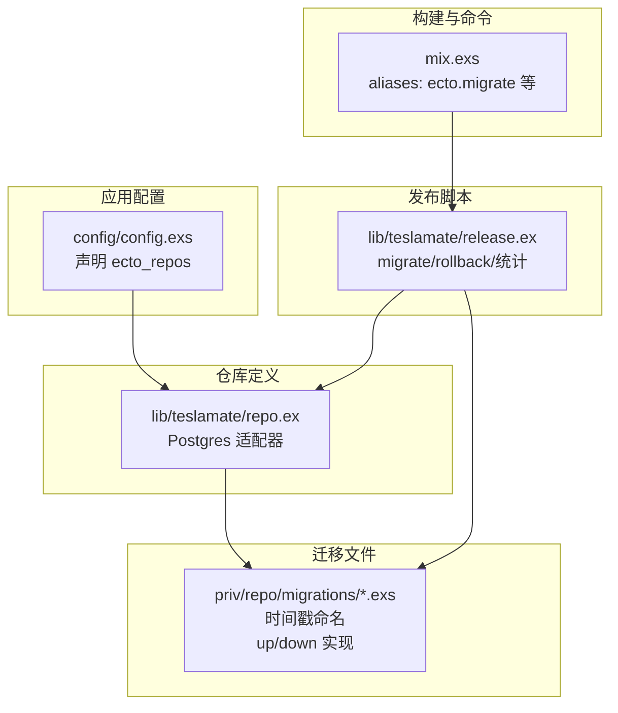
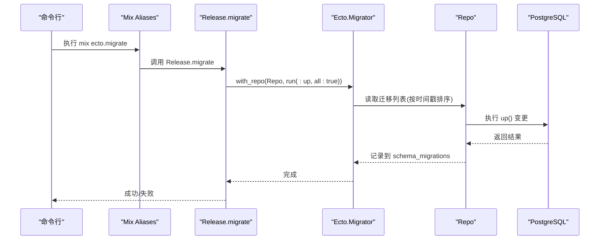
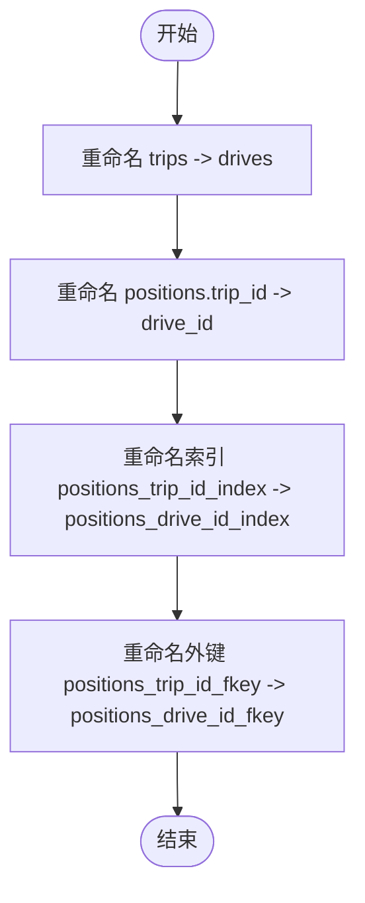
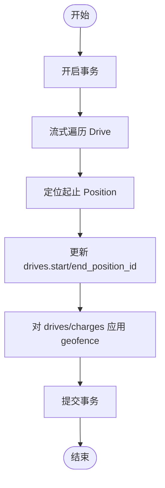
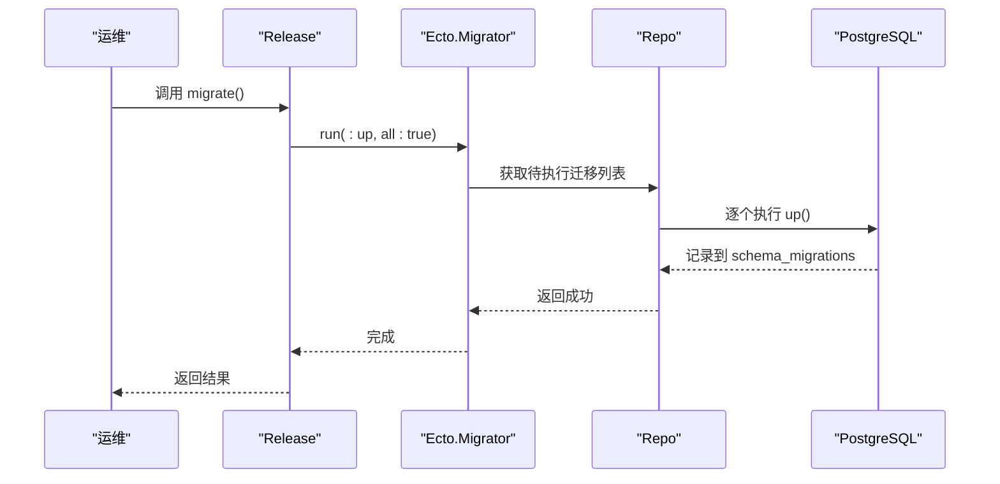
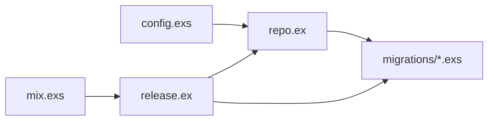

# 迁移流程与执行机制

<cite>
**本文引用的文件**
- [lib/teslamate/repo.ex](file://lib/teslamate/repo.ex)
- [config/config.exs](file://config/config.exs)
- [lib/teslamate/release.ex](file://lib/teslamate/release.ex)
- [mix.exs](file://mix.exs)
- [priv/repo/migrations/20190812191616_rename_trips_to_drives.exs](file://priv/repo/migrations/20190812191616_rename_trips_to_drives.exs)
- [priv/repo/migrations/20190330150000_create_car.exs](file://priv/repo/migrations/20190330150000_create_car.exs)
- [priv/repo/migrations/20190330160000_create_trips.exs](file://priv/repo/migrations/20190330160000_create_trips.exs)
- [priv/repo/migrations/20190821143938_add_constraints.exs](file://priv/repo/migrations/20190821143938_add_constraints.exs)
- [priv/repo/migrations/20200203120311_cascade_delete.exs](file://priv/repo/migrations/20200203120311_cascade_delete.exs)
- [priv/repo/migrations/20190925182253_add_geofence_id_to_addresses.exs](file://priv/repo/migrations/20190925182253_add_geofence_id_to_addresses.exs)
- [priv/repo/migrations/20191003132415_add_position_ids_and_apply_geofences.exs](file://priv/repo/migrations/20191003132415_add_position_ids_and_apply_geofences.exs)
- [priv/repo/migrations/20191026145925_phase_correction.exs](file://priv/repo/migrations/20191026145925_phase_correction.exs)
- [priv/repo/migrations/20191212215130_remove_phase_correction.exs](file://priv/repo/migrations/20191212215130_remove_phase_correction.exs)
- [priv/repo/migrations/20200203180529_location_based_charge_cost.exs](file://priv/repo/migrations/20200203180529_location_based_charge_cost.exs)
</cite>

## 目录
1. [引言](#引言)
2. [项目结构](#项目结构)
3. [核心组件](#核心组件)
4. [架构总览](#架构总览)
5. [详细组件分析](#详细组件分析)
6. [依赖关系分析](#依赖关系分析)
7. [性能考量](#性能考量)
8. [故障排查指南](#故障排查指南)
9. [结论](#结论)

## 引言
本文件系统性阐述 TeslaMate 中数据库迁移的完整流程，覆盖迁移文件的创建、版本控制、执行顺序与依赖管理；解释 Ecto.Migration 如何保证迁移的原子性与一致性；以“重命名 trips 到 drives”为例说明变更实施步骤；并结合 mix 命令与 release.ex 的迁移任务，说明生产环境零停机部署的支撑方式，最后提供常见问题排查与回滚策略。

## 项目结构
TeslaMate 使用 Ecto 作为 ORM 和迁移框架，数据库迁移文件位于 priv/repo/migrations 目录，按时间戳前缀命名，确保自然排序即为执行顺序。应用通过配置文件声明仓库，启动时由 Release 脚本统一执行迁移。

图表来源
- [config/config.exs](file://config/config.exs#L1-L30)
- [lib/teslamate/repo.ex](file://lib/teslamate/repo.ex#L1-L6)
- [lib/teslamate/release.ex](file://lib/teslamate/release.ex#L1-L34)
- [mix.exs](file://mix.exs#L76-L85)

章节来源
- [config/config.exs](file://config/config.exs#L1-L30)
- [lib/teslamate/repo.ex](file://lib/teslamate/repo.ex#L1-L6)
- [lib/teslamate/release.ex](file://lib/teslamate/release.ex#L1-L34)
- [mix.exs](file://mix.exs#L76-L85)

## 核心组件
- 仓库定义：TeslaMate.Repo 使用 Postgres 适配器，是所有迁移与查询的入口。
- 配置：在 config.exs 中声明 ecto_repos，确保应用加载后可被迁移器发现。
- 发布脚本：Release 提供 migrate/rollback 方法，封装 Ecto.Migrator 的调用，并可查询最近一次迁移的时间。
- 迁移文件：以时间戳命名，每个文件包含 up/down 两部分，遵循 Ecto.Migration 接口。

章节来源
- [lib/teslamate/repo.ex](file://lib/teslamate/repo.ex#L1-L6)
- [config/config.exs](file://config/config.exs#L1-L30)
- [lib/teslamate/release.ex](file://lib/teslamate/release.ex#L1-L34)

## 架构总览
下图展示从命令到数据库的迁移执行路径，以及 Ecto.Migrator 如何按顺序运行 up/down 并记录到 schema_migrations 表。

图表来源
- [mix.exs](file://mix.exs#L76-L85)
- [lib/teslamate/release.ex](file://lib/teslamate/release.ex#L1-L34)

## 详细组件分析

### 迁移文件组织与版本控制
- 命名规范：以时间戳前缀命名，例如 20190330150000_create_car.exs，确保自然排序即为执行顺序。
- 版本控制：Ecto 在 schema_migrations 表中记录已执行的迁移版本，避免重复执行。
- 依赖管理：迁移之间通过外键、索引、约束等逻辑建立依赖关系；执行顺序由时间戳决定，必要时通过 flush() 分割大事务，降低锁竞争。

章节来源
- [priv/repo/migrations/20190330150000_create_car.exs](file://priv/repo/migrations/20190330150000_create_car.exs#L1-L18)
- [priv/repo/migrations/20190330160000_create_trips.exs](file://priv/repo/migrations/20190330160000_create_trips.exs#L1-L29)
- [lib/teslamate/release.ex](file://lib/teslamate/release.ex#L1-L34)

### Ecto.Migration 原子性与一致性保障
- 单个迁移在一个事务内执行：up()/down() 由 Ecto.Migrator 统一调度，若任一步骤失败，整个迁移回滚。
- 显式事务：在需要跨表数据转换或复杂更新时，迁移内部使用 Repo.transaction 包裹，确保数据一致性。
- 刷新与分割：使用 flush() 将 DDL 与 DML 分割，减少长事务持有锁的时间，提升并发能力。
- 外键与约束：通过 create/constraint/index 等操作建立强一致的约束，配合 cascade/nilify_all 控制删除行为。

章节来源
- [priv/repo/migrations/20190821143938_add_constraints.exs](file://priv/repo/migrations/20190821143938_add_constraints.exs#L1-L10)
- [priv/repo/migrations/20200203120311_cascade_delete.exs](file://priv/repo/migrations/20200203120311_cascade_delete.exs#L1-L72)
- [priv/repo/migrations/20190925182253_add_geofence_id_to_addresses.exs](file://priv/repo/migrations/20190925182253_add_geofence_id_to_addresses.exs#L1-L151)

### 案例解析：重命名 trips 到 drives（20190812191616）
该迁移通过 rename(table(...)) 将 trips 表重命名为 drives，并同步修改 positions 表的列名与外键约束、索引名称，确保引用完整性。

图表来源
- [priv/repo/migrations/20190812191616_rename_trips_to_drives.exs](file://priv/repo/migrations/20190812191616_rename_trips_to_drives.exs#L1-L24)

章节来源
- [priv/repo/migrations/20190812191616_rename_trips_to_drives.exs](file://priv/repo/migrations/20190812191616_rename_trips_to_drives.exs#L1-L24)

### 复杂数据迁移：位置与围栏关联（20191003132415）
该迁移在事务中为每条 drive 关联起止位置，并对 drives/charges 应用 geofence，涉及流式处理大量数据，使用 Repo.stream 与事务包裹，保证一致性。

图表来源
- [priv/repo/migrations/20191003132415_add_position_ids_and_apply_geofences.exs](file://priv/repo/migrations/20191003132415_add_position_ids_and_apply_geofences.exs#L57-L118)

章节来源
- [priv/repo/migrations/20191003132415_add_position_ids_and_apply_geofences.exs](file://priv/repo/migrations/20191003132415_add_position_ids_and_apply_geofences.exs#L57-L118)

### 级联删除策略调整（20200203120311）
该迁移通过 drop/constraint/alter/references(on_delete: ...) 精细调整多表级联删除策略，先删除旧约束，flush 后再重建新约束，确保引用完整性。

章节来源
- [priv/repo/migrations/20200203120311_cascade_delete.exs](file://priv/repo/migrations/20200203120311_cascade_delete.exs#L1-L72)

### 地理围栏字段演进（20191026145925 与 20191212215130）
- 添加 phase_correction 字段（20191026145925），随后移除（20191212215130），体现字段生命周期管理与回滚设计。

章节来源
- [priv/repo/migrations/20191026145925_phase_correction.exs](file://priv/repo/migrations/20191026145925_phase_correction.exs#L1-L9)
- [priv/repo/migrations/20191212215130_remove_phase_correction.exs](file://priv/repo/migrations/20191212215130_remove_phase_correction.exs#L1-L9)

### 地址与围栏关联（20190925182253）
该迁移引入 geofence_id 字段并建立地址与围栏的多对一关系，使用 Repo.transaction 对现有数据进行批量更新，确保一致性。

章节来源
- [priv/repo/migrations/20190925182253_add_geofence_id_to_addresses.exs](file://priv/repo/migrations/20190925182253_add_geofence_id_to_addresses.exs#L1-L151)

### 生产环境零停机部署支持
- 发布脚本统一迁移：Release.migrate 通过 Ecto.Migrator.with_repo 调用 run(:up, all: true)，自动按顺序执行未执行的迁移。
- 回滚能力：Release.rollback 支持指定版本回滚，便于快速修复问题。
- 最近迁移时间：seconds_since_last_migration 查询 schema_migrations，可用于健康检查与部署后验证。

图表来源
- [lib/teslamate/release.ex](file://lib/teslamate/release.ex#L1-L34)

章节来源
- [lib/teslamate/release.ex](file://lib/teslamate/release.ex#L1-L34)

### mix 命令使用场景
- 初始化与测试：setup、test、ci 等 aliases 内含 ecto.migrate，确保环境准备与迁移同步。
- 日常开发：mix ecto.migrate 执行全部未执行迁移；mix ecto.rollback 执行单次回滚或指定版本回滚（需配合 Ecto.Migrator 的 down/to 参数）。

章节来源
- [mix.exs](file://mix.exs#L76-L85)

## 依赖关系分析
- 应用配置与仓库：config.exs 声明 ecto_repos，Repo 使用 Postgres 适配器。
- 迁移执行链路：Release.migrate -> Ecto.Migrator -> Repo -> PostgreSQL。
- 迁移文件依赖：通过时间戳顺序与 DDL/DML 语义建立依赖；必要时通过 flush() 分割，避免锁争用。

图表来源
- [config/config.exs](file://config/config.exs#L1-L30)
- [lib/teslamate/repo.ex](file://lib/teslamate/repo.ex#L1-L6)
- [lib/teslamate/release.ex](file://lib/teslamate/release.ex#L1-L34)
- [mix.exs](file://mix.exs#L76-L85)

章节来源
- [config/config.exs](file://config/config.exs#L1-L30)
- [lib/teslamate/repo.ex](file://lib/teslamate/repo.ex#L1-L6)
- [lib/teslamate/release.ex](file://lib/teslamate/release.ex#L1-L34)
- [mix.exs](file://mix.exs#L76-L85)

## 性能考量
- 事务拆分：在大型迁移中使用 flush() 将 DDL 与 DML 分离，缩短锁持有时间，提升并发。
- 流式处理：对海量数据的更新采用 Repo.stream，边读边写，降低内存占用。
- 约束与索引：在迁移中合理添加唯一索引与检查约束，提升查询效率与数据一致性。
- 删除策略：通过 on_delete: :delete_all/:nilify_all 控制级联行为，避免全表扫描与死锁。

章节来源
- [priv/repo/migrations/20190925182253_add_geofence_id_to_addresses.exs](file://priv/repo/migrations/20190925182253_add_geofence_id_to_addresses.exs#L1-L151)
- [priv/repo/migrations/20200203120311_cascade_delete.exs](file://priv/repo/migrations/20200203120311_cascade_delete.exs#L1-L72)

## 故障排查指南
- 迁移冲突
  - 症状：多个迁移同时修改同一张表或列，导致执行失败。
  - 处理：合并相关迁移，或在迁移中使用 flush() 分割 DDL/DML；必要时在 up 中先 drop 再 add，down 中逆序恢复。
  - 参考：级联删除迁移中对约束的先删后建策略。

- 部分执行失败
  - 症状：up 执行到一半失败，数据库处于中间状态。
  - 处理：利用 Ecto.Migrator 的原子性，失败会回滚；修复后重新执行；若需手动介入，使用 down 回滚到上一个稳定版本后再重试。
  - 参考：事务包裹的数据迁移（如地址与围栏关联迁移）。

- 回滚策略
  - 单次回滚：mix ecto.rollback 或 Release.rollback(repo, version)。
  - 指定版本：down 到目标版本，确保 down() 与 up() 一一对应。
  - 参考：重命名迁移的 down() 与 up() 对称实现。

- 生产验证
  - 使用 seconds_since_last_migration 检查 schema_migrations 最近插入时间，确认迁移是否成功完成。
  - 参考：Release.seconds_since_last_migration 的实现。

章节来源
- [lib/teslamate/release.ex](file://lib/teslamate/release.ex#L1-L34)
- [priv/repo/migrations/20190812191616_rename_trips_to_drives.exs](file://priv/repo/migrations/20190812191616_rename_trips_to_drives.exs#L1-L24)
- [priv/repo/migrations/20190925182253_add_geofence_id_to_addresses.exs](file://priv/repo/migrations/20190925182253_add_geofence_id_to_addresses.exs#L1-L151)
- [priv/repo/migrations/20200203120311_cascade_delete.exs](file://priv/repo/migrations/20200203120311_cascade_delete.exs#L1-L72)

## 结论
TeslaMate 的迁移体系以 Ecto.Migration 为核心，通过时间戳命名、严格的 up/down 设计、事务与 flush 的组合，确保迁移的原子性与一致性。Release 脚本与 mix aliases 将迁移无缝集成到开发与生产流程，支持零停机部署与快速回滚。实践中应重视迁移之间的依赖与锁争用，优先采用事务与流式处理，配合合理的约束与索引设计，保障大规模数据演进的稳定性与性能。