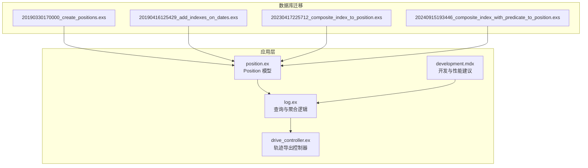
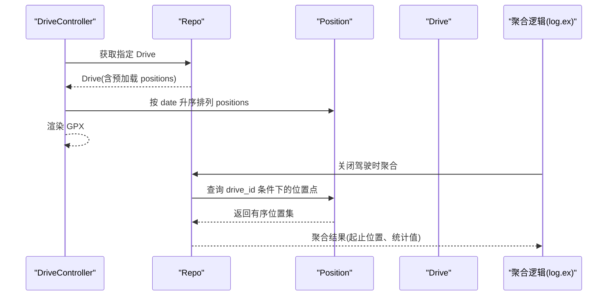
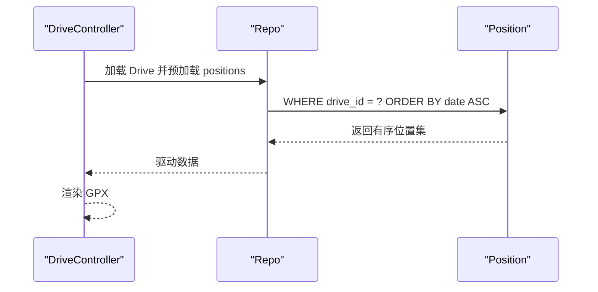
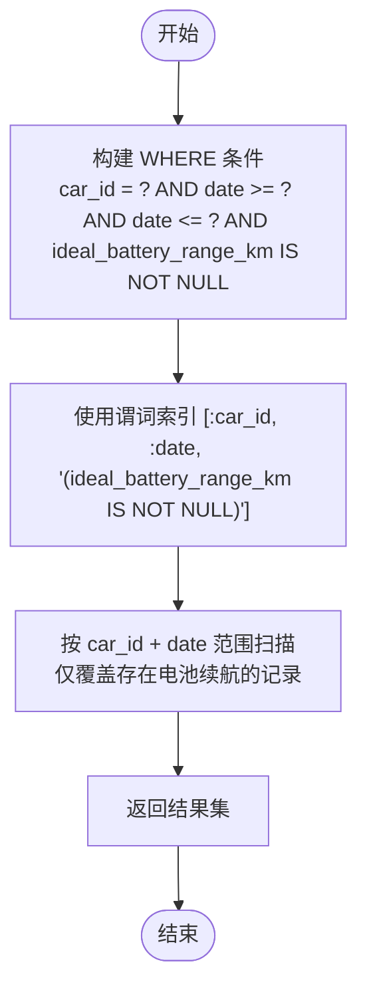
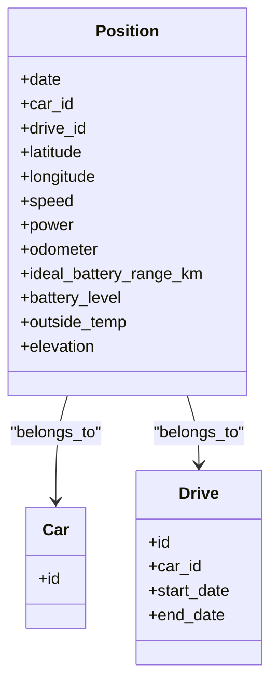
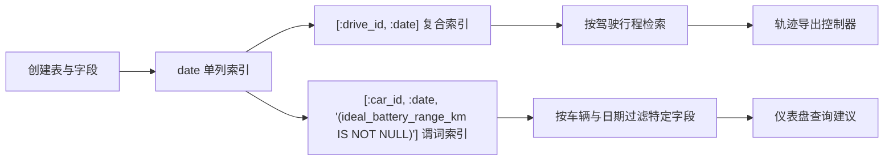

# 复合索引设计

<cite>
**本文引用的文件**
- [20190330170000_create_positions.exs](file://priv/repo/migrations/20190330170000_create_positions.exs)
- [20190416125429_add_indexes_on_dates.exs](file://priv/repo/migrations/20190416125429_add_indexes_on_dates.exs)
- [20230417225712_composite_index_to_position.exs](file://priv/repo/migrations/20230417225712_composite_index_to_position.exs)
- [20240915193446_composite_index_with_predicate_to_position.exs](file://priv/repo/migrations/20240915193446_composite_index_with_predicate_to_position.exs)
- [position.ex](file://lib/teslamate/log/position.ex)
- [log.ex](file://lib/teslamate/log.ex)
- [drive_controller.ex](file://lib/teslamate_web/controllers/drive_controller.ex)
- [development.mdx](file://website/docs/development.mdx)
</cite>

## 目录
1. [简介](#简介)
2. [项目结构](#项目结构)
3. [核心组件](#核心组件)
4. [架构总览](#架构总览)
5. [详细组件分析](#详细组件分析)
6. [依赖关系分析](#依赖关系分析)
7. [性能考量](#性能考量)
8. [故障排查指南](#故障排查指南)
9. [结论](#结论)

## 简介
本文件围绕 TeslaMate 项目中 Position 表的复合索引设计展开，重点分析以下两个复合索引：
- [:drive_id, :date]：用于按驾驶行程（drive）和时间排序快速检索驾驶轨迹
- [:car_id, :date, “(ideal_battery_range_km IS NOT NULL)”]：用于在仅需要带电池续航信息的位置点时，通过谓词索引减少扫描范围，降低 I/O 开销

文档将解释复合索引的最左前缀匹配原则、查询条件顺序对执行计划的影响，并结合实际查询用例（如按车辆和日期筛选驾驶轨迹）说明复合索引如何提升查询效率、减少 I/O。

## 项目结构
与 Position 表及索引相关的代码与迁移文件分布如下：
- 数据库迁移：创建表与索引的历史演进
- 模型定义：Position 的字段与关系
- 查询逻辑：驱动聚合、轨迹导出等涉及 Position 的查询
- 文档建议：开发文档中关于索引使用与 EXPLAIN 分析的建议

图表来源
- [20190330170000_create_positions.exs](file://priv/repo/migrations/20190330170000_create_positions.exs#L1-L28)
- [20190416125429_add_indexes_on_dates.exs](file://priv/repo/migrations/20190416125429_add_indexes_on_dates.exs#L1-L8)
- [20230417225712_composite_index_to_position.exs](file://priv/repo/migrations/20230417225712_composite_index_to_position.exs#L1-L8)
- [20240915193446_composite_index_with_predicate_to_position.exs](file://priv/repo/migrations/20240915193446_composite_index_with_predicate_to_position.exs#L1-L9)
- [position.ex](file://lib/teslamate/log/position.ex#L1-L79)
- [log.ex](file://lib/teslamate/log.ex#L144-L327)
- [drive_controller.ex](file://lib/teslamate_web/controllers/drive_controller.ex#L1-L31)
- [development.mdx](file://website/docs/development.mdx#L166-L202)

章节来源
- [20190330170000_create_positions.exs](file://priv/repo/migrations/20190330170000_create_positions.exs#L1-L28)
- [20190416125429_add_indexes_on_dates.exs](file://priv/repo/migrations/20190416125429_add_indexes_on_dates.exs#L1-L8)
- [20230417225712_composite_index_to_position.exs](file://priv/repo/migrations/20230417225712_composite_index_to_position.exs#L1-L8)
- [20240915193446_composite_index_with_predicate_to_position.exs](file://priv/repo/migrations/20240915193446_composite_index_with_predicate_to_position.exs#L1-L9)
- [position.ex](file://lib/teslamate/log/position.ex#L1-L79)
- [log.ex](file://lib/teslamate/log.ex#L144-L327)
- [drive_controller.ex](file://lib/teslamate_web/controllers/drive_controller.ex#L1-L31)
- [development.mdx](file://website/docs/development.mdx#L166-L202)

## 核心组件
- Position 表与字段
  - 表包含时间戳、地理坐标、速度、电量、里程、温度、海拔、电池续航等字段，并关联 car_id 与 drive_id。
  - 字段类型与精度在历史迁移中有优化，以平衡存储与查询精度。

- 复合索引
  - 历史单列索引：为 date 创建了单列索引。
  - 复合索引一：[:drive_id, :date]，用于按驾驶行程分组并按时间排序。
  - 复合索引二：[:car_id, :date, “(ideal_battery_range_km IS NOT NULL)”]，通过谓词索引仅覆盖存在电池续航信息的位置点，减少扫描范围。

- 查询与聚合
  - 驱动聚合：在关闭驾驶时，对 Position 进行窗口函数聚合，计算起止位置、平均温度、最大功率、里程差、时长等。
  - 轨迹导出：控制器按日期顺序加载某次驾驶的所有位置点，用于生成 GPX 文件。

章节来源
- [20190330170000_create_positions.exs](file://priv/repo/migrations/20190330170000_create_positions.exs#L1-L28)
- [20190416125429_add_indexes_on_dates.exs](file://priv/repo/migrations/20190416125429_add_indexes_on_dates.exs#L1-L8)
- [20230417225712_composite_index_to_position.exs](file://priv/repo/migrations/20230417225712_composite_index_to_position.exs#L1-L8)
- [20240915193446_composite_index_with_predicate_to_position.exs](file://priv/repo/migrations/20240915193446_composite_index_with_predicate_to_position.exs#L1-L9)
- [position.ex](file://lib/teslamate/log/position.ex#L1-L79)
- [log.ex](file://lib/teslamate/log.ex#L246-L327)
- [drive_controller.ex](file://lib/teslamate_web/controllers/drive_controller.ex#L1-L31)

## 架构总览
下图展示了 Position 表的索引与查询路径之间的关系，以及驱动聚合与轨迹导出的关键流程。

图表来源
- [drive_controller.ex](file://lib/teslamate_web/controllers/drive_controller.ex#L1-L31)
- [log.ex](file://lib/teslamate/log.ex#L246-L327)

## 详细组件分析

### 复合索引设计与最左前缀匹配
- 最左前缀匹配原则
  - 对于复合索引 (A, B, C)，查询条件必须从 A 开始，才能有效利用索引；若只使用 B 或 C，则无法命中该复合索引。
  - 在 TeslaMate 中：
    - [:drive_id, :date]：查询通常以 drive_id 限定范围，再按 date 排序，符合最左前缀匹配。
    - [:car_id, :date, “(ideal_battery_range_km IS NOT NULL)”]：查询需包含 car_id 与 date，且谓词条件“存在电池续航”可与索引列共同生效，从而减少扫描范围。

- 索引列顺序选择的最佳实践
  - 列顺序应优先满足最常见的过滤条件与排序需求。
  - 对于按驾驶行程检索轨迹：drive_id 更具区分度，先于 date 可显著缩小扫描范围。
  - 对于按车辆检索并过滤特定字段：car_id 先于 date，再以谓词限定字段非空，可减少 I/O。

- 与单列索引的对比
  - 单列索引仅能加速单一维度的过滤或排序；复合索引可在过滤与排序上同时受益，尤其当过滤列具有高选择性时。
  - 在 Positions 表中，drive_id 与 car_id 均具备高区分度，配合 date 排序，复合索引能带来更优的执行计划。

章节来源
- [20230417225712_composite_index_to_position.exs](file://priv/repo/migrations/20230417225712_composite_index_to_position.exs#L1-L8)
- [20240915193446_composite_index_with_predicate_to_position.exs](file://priv/repo/migrations/20240915193446_composite_index_with_predicate_to_position.exs#L1-L9)
- [development.mdx](file://website/docs/development.mdx#L166-L202)

### 实际查询用例与性能影响

#### 用例一：按驾驶行程筛选并按时间排序
- 场景描述
  - 需要获取某次驾驶的所有位置点，并按时间升序排列，以便生成轨迹文件。
- 查询特征
  - 过滤条件：drive_id 精确匹配
  - 排序条件：按 date 升序
- 索引命中与收益
  - 使用 [:drive_id, :date] 复合索引可直接按 drive_id 定位范围，并按 date 顺序返回，避免全表扫描与额外排序。
- 相关实现
  - 控制器按日期顺序加载位置点，用于渲染 GPX。
  - 关闭驾驶时的聚合逻辑也基于 drive_id 进行窗口聚合。

图表来源
- [drive_controller.ex](file://lib/teslamate_web/controllers/drive_controller.ex#L1-L31)
- [log.ex](file://lib/teslamate/log.ex#L246-L327)

章节来源
- [drive_controller.ex](file://lib/teslamate_web/controllers/drive_controller.ex#L1-L31)
- [log.ex](file://lib/teslamate/log.ex#L246-L327)

#### 用例二：按车辆与日期筛选并过滤特定字段
- 场景描述
  - 需要按 car_id 与 date 过滤位置点，并仅保留存在电池续航信息的数据，以减少数据量与 I/O。
- 查询特征
  - 过滤条件：car_id 精确匹配、date 范围过滤、谓词“存在电池续航”
- 索引命中与收益
  - 使用 [:car_id, :date, “(ideal_battery_range_km IS NOT NULL)”] 谓词索引，可将扫描限制在满足谓词的子集上，显著减少 I/O。
- 开发文档建议
  - 文档明确建议在仪表盘查询中，若 15 秒间隔足够，可通过添加“存在电池续航 + 车辆过滤”的 WHERE 条件来减少扫描。

图表来源
- [20240915193446_composite_index_with_predicate_to_position.exs](file://priv/repo/migrations/20240915193446_composite_index_with_predicate_to_position.exs#L1-L9)
- [development.mdx](file://website/docs/development.mdx#L166-L202)

章节来源
- [20240915193446_composite_index_with_predicate_to_position.exs](file://priv/repo/migrations/20240915193446_composite_index_with_predicate_to_position.exs#L1-L9)
- [development.mdx](file://website/docs/development.mdx#L166-L202)

### 复合索引与模型/查询的关系
- Position 模型
  - 定义了 date、car_id、drive_id 等关键字段，以及与 Car、Drive 的关联，为复合索引提供基础。
- 查询与聚合
  - 关闭驾驶时的聚合逻辑依赖 drive_id 进行窗口聚合，确保按时间顺序处理位置点。
  - 轨迹导出控制器依赖按 date 升序的查询能力，保证轨迹顺序正确。

图表来源
- [position.ex](file://lib/teslamate/log/position.ex#L1-L79)

章节来源
- [position.ex](file://lib/teslamate/log/position.ex#L1-L79)
- [log.ex](file://lib/teslamate/log.ex#L246-L327)

## 依赖关系分析
- 迁移文件到模型与查询的依赖链
  - 创建表与字段：为后续索引与查询奠定基础
  - 单列索引：date 列的早期索引
  - 复合索引：[:drive_id, :date] 提升按驾驶行程检索的效率
  - 谓词索引：[:car_id, :date, “(ideal_battery_range_km IS NOT NULL)”] 优化带特定字段的查询
- 查询与索引的耦合
  - 控制器与聚合逻辑均依赖按 drive_id 与 date 的高效访问
  - 开发文档强调通过 EXPLAIN ANALYZE 诊断索引使用情况，指导性能优化

图表来源
- [20190330170000_create_positions.exs](file://priv/repo/migrations/20190330170000_create_positions.exs#L1-L28)
- [20190416125429_add_indexes_on_dates.exs](file://priv/repo/migrations/20190416125429_add_indexes_on_dates.exs#L1-L8)
- [20230417225712_composite_index_to_position.exs](file://priv/repo/migrations/20230417225712_composite_index_to_position.exs#L1-L8)
- [20240915193446_composite_index_with_predicate_to_position.exs](file://priv/repo/migrations/20240915193446_composite_index_with_predicate_to_position.exs#L1-L9)
- [drive_controller.ex](file://lib/teslamate_web/controllers/drive_controller.ex#L1-L31)
- [development.mdx](file://website/docs/development.mdx#L166-L202)

章节来源
- [20190330170000_create_positions.exs](file://priv/repo/migrations/20190330170000_create_positions.exs#L1-L28)
- [20190416125429_add_indexes_on_dates.exs](file://priv/repo/migrations/20190416125429_add_indexes_on_dates.exs#L1-L8)
- [20230417225712_composite_index_to_position.exs](file://priv/repo/migrations/20230417225712_composite_index_to_position.exs#L1-L8)
- [20240915193446_composite_index_with_predicate_to_position.exs](file://priv/repo/migrations/20240915193446_composite_index_with_predicate_to_position.exs#L1-L9)
- [drive_controller.ex](file://lib/teslamate_web/controllers/drive_controller.ex#L1-L31)
- [development.mdx](file://website/docs/development.mdx#L166-L202)

## 性能考量
- 复合索引的收益
  - 减少 I/O：通过索引直接定位范围并按顺序返回，避免全表扫描与额外排序
  - 提升查询效率：在高基数列（如 drive_id、car_id）与时间列（date）组合查询中尤为明显
- 谓词索引的适用场景
  - 当查询总是要求某个字段非空或满足特定条件时，使用谓词索引可进一步缩小扫描范围
- 开发建议
  - 使用 EXPLAIN ANALYZE 分析查询计划，确认索引被使用
  - 在仪表盘等高频查询中，遵循文档建议添加“存在电池续航 + 车辆过滤”的 WHERE 条件，减少数据量

章节来源
- [development.mdx](file://website/docs/development.mdx#L166-L202)

## 故障排查指南
- 症状：查询缓慢或扫描范围过大
  - 排查步骤
    - 使用 EXPLAIN ANALYZE 查看执行计划，确认是否命中预期索引
    - 检查 WHERE 条件是否满足最左前缀匹配（例如 [:drive_id, :date] 需以 drive_id 开始）
    - 对于谓词索引，确认 WHERE 中包含 car_id、date 与谓词条件
- 建议
  - 若查询未命中索引，调整查询条件顺序或补充缺失的过滤列
  - 在高频查询中，尽量复用已存在的复合索引列，避免在 date 上进行函数操作导致索引失效

章节来源
- [development.mdx](file://website/docs/development.mdx#L166-L202)

## 结论
- TeslaMate 在 Position 表上实施了两类复合索引，分别服务于“按驾驶行程检索轨迹”和“按车辆与日期过滤特定字段”的典型场景。
- 复合索引遵循最左前缀匹配原则，查询条件顺序直接影响索引命中与执行效率。
- 通过谓词索引与合理的 WHERE 设计，可显著减少 I/O，提升查询性能；开发文档提供了使用 EXPLAIN 分析与优化的实践建议。
- 在实际应用中，应优先满足高选择性列（drive_id、car_id）与排序列（date）的组合，确保索引发挥最大效用。