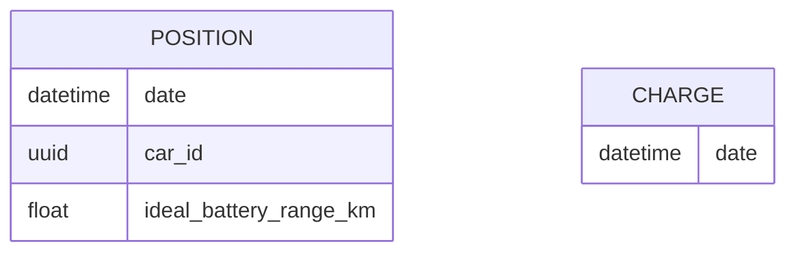
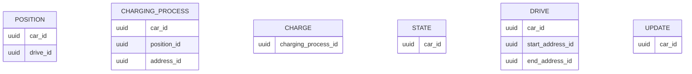
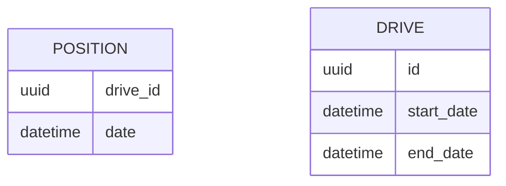

# 索引策略与查询优化

<cite>
**本文档引用的文件**  
- [20190330170000_create_positions.exs](file://priv/repo/migrations/20190330170000_create_positions.exs)
- [20190416125429_add_indexes_on_dates.exs](file://priv/repo/migrations/20190416125429_add_indexes_on_dates.exs)
- [20190717184003_add_fkey_indexes.exs](file://priv/repo/migrations/20190717184003_add_fkey_indexes.exs)
- [20230417225712_composite_index_to_position.exs](file://priv/repo/migrations/20230417225712_composite_index_to_position.exs)
- [20240915193446_composite_index_with_predicate_to_position.exs](file://priv/repo/migrations/20240915193446_composite_index_with_predicate_to_position.exs)
- [position.ex](file://lib/teslamate/log/position.ex)
- [log.ex](file://lib/teslamate/log.ex)
- [vehicle.ex](file://lib/teslamate/vehicles/vehicle.ex)
- [database-info.json](file://grafana/dashboards/database-info.json)
- [development.mdx](file://website/docs/development.mdx)
</cite>

## 目录
1. [引言](#引言)
2. [索引设计策略](#索引设计策略)
3. [复合索引在Position表中的应用](#复合索引在position表中的应用)
4. [部分索引优化特定查询场景](#部分索引优化特定查询场景)
5. [实际查询用例分析](#实际查询用例分析)
6. [查询计划优化方法](#查询计划优化方法)
7. [EXPLAIN ANALYZE使用示例](#explain-analyze使用示例)
8. [结论](#结论)

## 引言
TeslaMate是一个用于跟踪特斯拉车辆数据的开源项目，其核心功能依赖于高效的数据库查询性能。随着车辆数据的持续采集，Position表会积累大量记录（每辆车约30,000公里产生1GB数据），因此合理的索引设计对系统性能至关重要。本文深入分析该项目的索引策略，包括单列索引、复合索引和部分索引的应用，以及如何通过EXPLAIN ANALYZE诊断慢查询。

**本文档引用的文件**  
- [20190330170000_create_positions.exs](file://priv/repo/migrations/20190330170000_create_positions.exs)
- [20190416125429_add_indexes_on_dates.exs](file://priv/repo/migrations/20190416125429_add_indexes_on_dates.exs)
- [20190717184003_add_fkey_indexes.exs](file://priv/repo/migrations/20190717184003_add_fkey_indexes.exs)
- [20230417225712_composite_index_to_position.exs](file://priv/repo/migrations/20230417225712_composite_index_to_position.exs)
- [20240915193446_composite_index_with_predicate_to_position.exs](file://priv/repo/migrations/20240915193446_composite_index_with_predicate_to_position.exs)

## 索引设计策略
TeslaMate项目采用了多种索引策略来优化查询性能，主要包括单列索引、复合索引和部分索引。

### 单列索引
单列索引是最基础的索引类型，适用于在单个字段上进行查询过滤的场景。在TeslaMate中，早期的迁移文件就创建了基于日期的单列索引：



**图示来源**  
- [20190416125429_add_indexes_on_dates.exs](file://priv/repo/migrations/20190416125429_add_indexes_on_dates.exs#L5-L6)

这些索引为按时间范围检索数据提供了基础支持，如查询特定日期的充电记录或位置信息。

### 外键索引
为了优化表间连接查询的性能，项目在多个外键字段上创建了索引：



**图示来源**  
- [20190717184003_add_fkey_indexes.exs](file://priv/repo/migrations/20190717184003_add_fkey_indexes.exs#L5-L21)

这些索引确保了通过车辆ID、行程ID等关联字段进行查询时的高效性。

## 复合索引在Position表中的应用
复合索引是针对多列组合查询的优化手段，在TeslaMate中得到了充分应用。

### drive_id与date的复合索引
2023年4月的迁移文件引入了drive_id和date字段的复合索引：



该复合索引替代了原有的单一drive_id索引，能够更高效地支持按行程和时间范围查询位置数据的场景。例如在计算行程统计信息时，系统需要查询特定drive_id下按时间排序的位置记录：

```elixir
def close_drive(%Drive{id: id} = drive, opts \\ []) do
  drive_data =
    from p in Position,
      where: p.drive_id == ^id,
      order_by: [asc: p.date],
      ...
end
```

**代码来源**  
- [20230417225712_composite_index_to_position.exs](file://priv/repo/migrations/20230417225712_composite_index_to_position.exs#L5-L6)
- [log.ex](file://lib/teslamate/log.ex#L247-L282)

复合索引的优势在于它同时满足了两个查询条件：通过drive_id快速定位到特定行程的所有位置记录，然后利用date字段的有序性避免额外的排序操作。

## 部分索引优化特定查询场景
部分索引（Partial Index）是PostgreSQL提供的一种高级索引类型，只对满足特定条件的数据子集创建索引，能够显著减少索引大小并提高查询效率。

### 带条件的部分索引
2024年9月的迁移文件引入了一个创新的部分索引设计：

```elixir
create index(:positions, [:car_id, :date, "(ideal_battery_range_km IS NOT NULL)"],
         where: "ideal_battery_range_km IS NOT NULL"
       )
```

这个索引具有以下特点：
1. **复合结构**：包含car_id、date和一个表达式
2. **条件过滤**：仅包含ideal_battery_range_km不为空的记录
3. **查询优化**：专门针对需要排除流式API数据的查询场景

这种设计源于项目文档中提到的性能优化建议："如果15秒间隔的数据足够，考虑通过添加`ideal_battery_range_km IS NOT NULL and car_id = $car_id`作为WHERE条件来排除流式数据"。

**代码来源**  
- [20240915193446_composite_index_with_predicate_to_position.exs](file://priv/repo/migrations/20240915193446_composite_index_with_predicate_to_position.exs#L5-L7)
- [development.mdx](file://website/docs/development.mdx#L172-L174)

该索引特别适用于仪表板查询，能够快速定位到非流式API采集的有效位置数据，避免扫描大量低价值的流式数据点。

## 实际查询用例分析
让我们分析几个典型的查询用例，了解索引如何影响查询性能。

### 按时间范围检索驾驶记录
这是最常见的查询场景之一，用于显示车辆的历史行程。系统通过以下方式实现：

```elixir
def get_positions_without_elevation(min_id \\ 0, opts \\ []) do
  date_earliest = DateTime.add(DateTime.utc_now(), -10, :day)
  naive_date_earliest = DateTime.to_naive(date_earliest)
  
  Position
  |> where([p], p.id > ^min_id and is_nil(p.elevation) and p.date > ^naive_date_earliest)
  |> order_by(asc: :id)
  |> limit(^limit)
  |> Repo.all()
end
```

此查询利用了date字段的单列索引，能够快速定位到最近10天内的位置记录。结合id的隐式索引（主键），实现了高效的分页查询。

**代码来源**  
- [log.ex](file://lib/teslamate/log.ex#L173-L227)

### 获取最新位置信息
系统需要频繁获取车辆的最新位置，这通过以下查询实现：

```elixir
def get_latest_position(%Car{id: id}) do
  Position
  |> where(car_id: ^id)
  |> order_by(desc: :date)
  |> limit(1)
  |> Repo.one()
end
```

该查询受益于car_id的外键索引和date的单列索引。数据库可以先通过car_id索引快速定位到特定车辆的所有位置记录，然后利用date索引的倒序扫描直接获取最新的一条记录，避免了全表扫描和排序操作。

**代码来源**  
- [log.ex](file://lib/teslamate/log.ex#L165-L171)

## 查询计划优化方法
为了确保查询性能，TeslaMate项目推荐使用PostgreSQL的性能分析工具。

### 索引使用监控
项目在Grafana仪表板中集成了索引使用情况的监控：

```sql
SELECT
    relname AS "Table",
    indexrelname AS "Index",
    idx_scan AS "Index Scans",
    idx_tup_read AS "Tuples Read",
    idx_tup_fetch AS "Tuples Fetched",
    PG_RELATION_SIZE(indexrelid) as "Index Size"
FROM
    pg_stat_all_indexes
WHERE
    schemaname NOT LIKE 'pg_%' AND
    indexrelname IS NOT NULL
ORDER BY 3 DESC;
```

这个查询可以帮助识别哪些索引被频繁使用，哪些索引可能是冗余的。

**代码来源**  
- [database-info.json](file://grafana/dashboards/database-info.json#L875-L884)

### 查询性能瓶颈识别
通过pg_stat_statements扩展，可以识别执行时间最长的SQL语句：

```sql
SELECT query, calls, mean_exec_time, total_exec_time 
FROM pg_stat_statements 
ORDER BY mean_exec_time DESC 
LIMIT 10;
```

这种方法能够帮助开发者发现潜在的性能瓶颈，针对性地进行优化。

**代码来源**  
- [development.mdx](file://website/docs/development.mdx#L200-L202)

## EXPLAIN ANALYZE使用示例
EXPLAIN ANALYZE是PostgreSQL提供的强大工具，用于分析查询执行计划。

### 启用pg_stat_statements
首先需要在数据库配置中启用该扩展：

```yaml
services:
  database:
    image: postgres:18-trixie
    command: postgres -c shared_preload_libraries=pg_stat_statements
```

然后创建扩展：

```sql
CREATE EXTENSION IF NOT EXISTS pg_stat_statements;
```

### 分析慢查询
对于可疑的慢查询，可以使用EXPLAIN ANALYZE来获取详细的执行信息：

```sql
EXPLAIN ANALYZE 
SELECT * FROM positions 
WHERE car_id = 'xxx' AND date > '2024-01-01' 
ORDER BY date DESC LIMIT 100;
```

输出结果将显示：
- 查询规划器选择的执行计划
- 每个操作的实际执行时间
- 行数估算的准确性
- 是否使用了预期的索引

这种方法可以帮助验证索引的有效性，并指导进一步的优化。

**代码来源**  
- [development.mdx](file://website/docs/development.mdx#L175-L202)

## 结论
TeslaMate项目的索引设计体现了对实际查询模式的深刻理解。通过单列索引、复合索引和部分索引的有机结合，系统能够在海量位置数据中实现高效的查询性能。关键的设计原则包括：

1. **基于查询模式设计索引**：索引创建紧密围绕实际的查询需求，如按车辆、时间、行程等维度的查询。
2. **渐进式优化**：通过迁移文件可以看出，索引策略是随着项目发展不断演进的，从简单的单列索引到复杂的部分索引。
3. **性能监控先行**：项目鼓励开发者使用EXPLAIN ANALYZE和pg_stat_statements来诊断性能问题，确保优化措施的有效性。
4. **存储效率考量**：部分索引的使用不仅提高了查询性能，还减少了索引的存储空间占用。

这些策略共同确保了系统在处理大规模车辆数据时仍能保持良好的响应性能，为用户提供流畅的数据可视化体验。