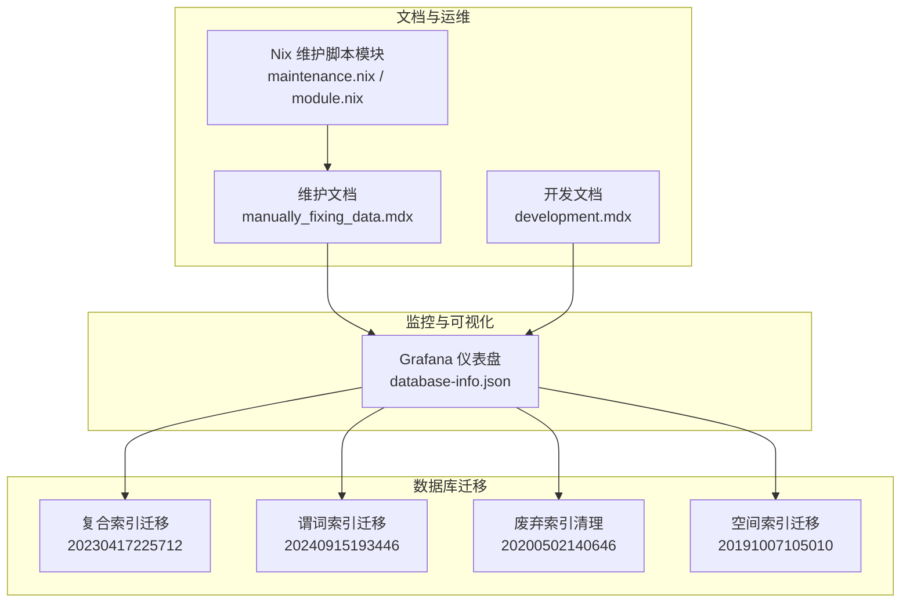
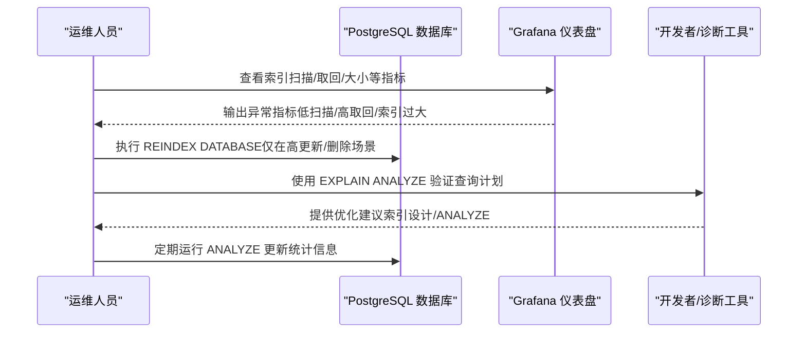
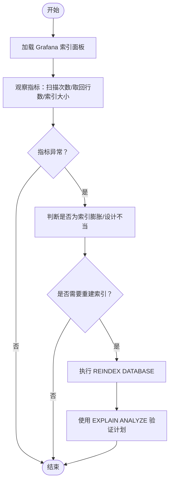
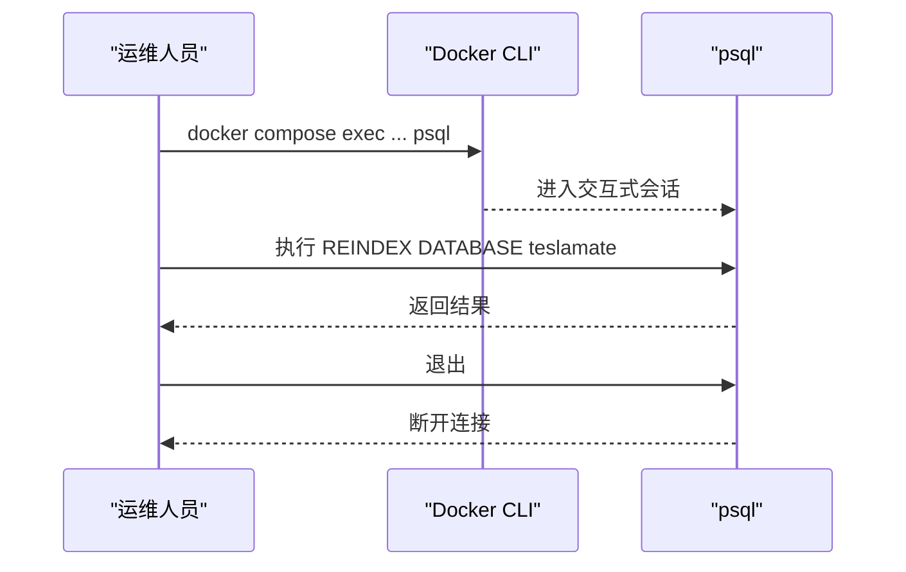
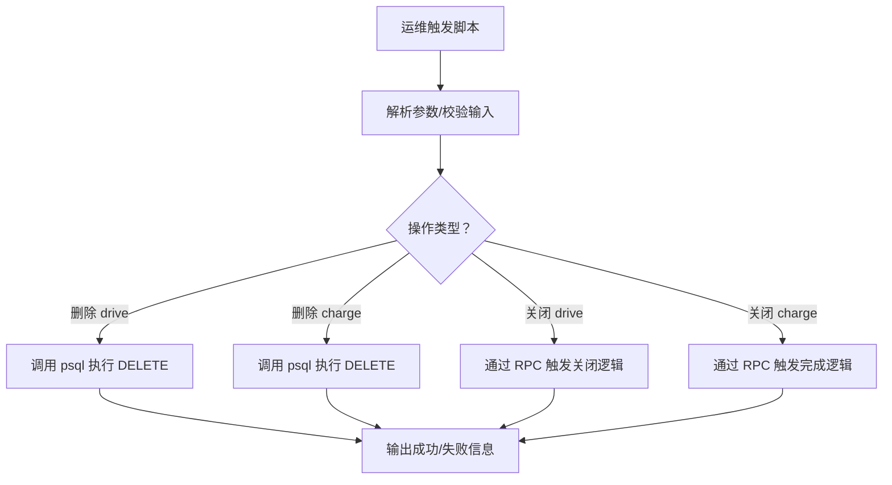
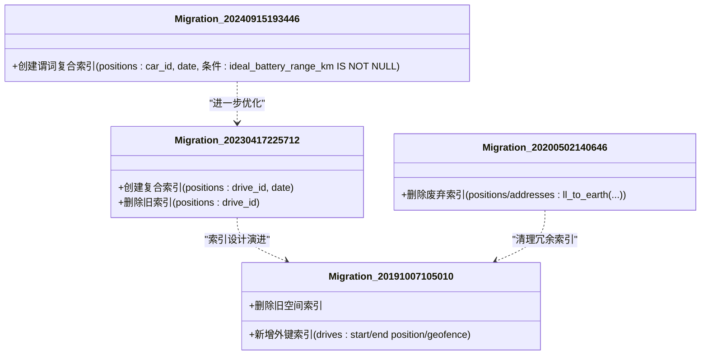
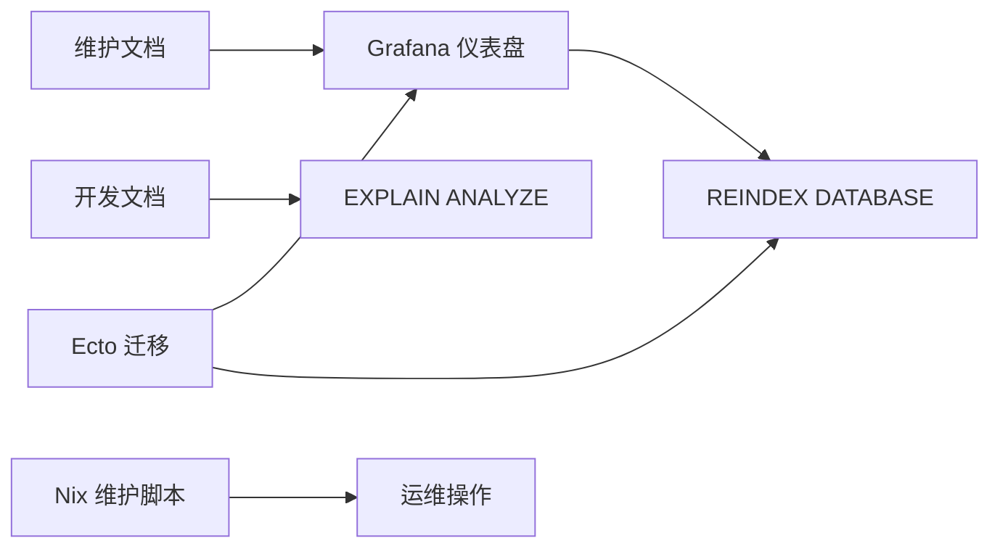

# 索引维护与优化

<cite>
**本文引用的文件**
- [manually_fixing_data.mdx](file://website/docs/maintenance/manually_fixing_data.mdx)
- [database-info.json](file://grafana/dashboards/database-info.json)
- [development.mdx](file://website/docs/development.mdx)
- [maintenance.nix](file://nix/maintenance.nix)
- [module.nix](file://nix/module.nix)
- [runtime.exs](file://config/runtime.exs)
- [20240915193446_composite_index_with_predicate_to_position.exs](file://priv/repo/migrations/20240915193446_composite_index_with_predicate_to_position.exs)
- [20230417225712_composite_index_to_position.exs](file://priv/repo/migrations/20230417225712_composite_index_to_position.exs)
- [20200502140646_drop_unused_indexes.exs](file://priv/repo/migrations/20200502140646_drop_unused_indexes.exs)
- [20191007105010_add_new_fkey_indexes.exs](file://priv/repo/migrations/20191007105010_add_new_fkey_indexes.exs)
</cite>

## 目录
1. [简介](#简介)
2. [项目结构](#项目结构)
3. [核心组件](#核心组件)
4. [架构总览](#架构总览)
5. [详细组件分析](#详细组件分析)
6. [依赖关系分析](#依赖关系分析)
7. [性能考量](#性能考量)
8. [故障排查指南](#故障排查指南)
9. [结论](#结论)
10. [附录](#附录)

## 简介
本文件围绕数据库索引的维护策略展开，结合仓库中已有的文档与监控仪表盘，系统性说明：
- 在高更新/删除频率工作负载下，索引性能退化（如索引膨胀）的表现与成因
- 如何使用 REINDEX DATABASE 命令进行索引重建
- 如何通过监控指标评估索引健康状况（如索引扫描次数、取回行数、索引大小）
- 自动化维护脚本的编写建议
- 定期 ANALYZE 对查询计划器选择最优索引的重要性

## 项目结构
该仓库提供了多处与数据库维护相关的内容：
- 维护文档：包含 REINDEX DATABASE 的使用说明与注意事项
- Grafana 仪表盘：展示索引扫描、取回行数、索引大小等关键指标
- 开发文档：建议启用 pg_stat_statements 并使用 EXPLAIN ANALYZE 进行诊断
- Nix 维护脚本模块：提供删除/关闭记录的便捷脚本，便于批量维护
- Ecto 迁移：包含复合索引、谓词索引、废弃索引清理等历史变更

图表来源
- [manually_fixing_data.mdx](file://website/docs/maintenance/manually_fixing_data.mdx#L193-L215)
- [database-info.json](file://grafana/dashboards/database-info.json#L880-L906)
- [development.mdx](file://website/docs/development.mdx#L177-L202)
- [maintenance.nix](file://nix/maintenance.nix#L59-L97)
- [module.nix](file://nix/module.nix#L216-L229)
- [20230417225712_composite_index_to_position.exs](file://priv/repo/migrations/20230417225712_composite_index_to_position.exs#L1-L8)
- [20240915193446_composite_index_with_predicate_to_position.exs](file://priv/repo/migrations/20240915193446_composite_index_with_predicate_to_position.exs#L1-L9)
- [20200502140646_drop_unused_indexes.exs](file://priv/repo/migrations/20200502140646_drop_unused_indexes.exs#L1-L8)
- [20191007105010_add_new_fkey_indexes.exs](file://priv/repo/migrations/20191007105010_add_new_fkey_indexes.exs#L1-L17)

章节来源
- [manually_fixing_data.mdx](file://website/docs/maintenance/manually_fixing_data.mdx#L193-L215)
- [database-info.json](file://grafana/dashboards/database-info.json#L880-L906)
- [development.mdx](file://website/docs/development.mdx#L177-L202)
- [maintenance.nix](file://nix/maintenance.nix#L59-L97)
- [module.nix](file://nix/module.nix#L216-L229)

## 核心组件
- 维护文档中的 REINDEX DATABASE 指南：明确在高更新/删除场景下进行索引重建的时机与步骤
- Grafana 仪表盘中的索引监控面板：提供索引扫描次数、取回行数、索引大小等指标，用于评估索引健康度
- 开发文档中的 pg_stat_statements 启用与 EXPLAIN ANALYZE 使用建议：辅助定位慢查询与索引使用问题
- Nix 维护脚本模块：提供删除/关闭记录的便捷脚本，减少碎片化与膨胀风险
- Ecto 迁移中的索引变更：体现对索引设计的持续优化与清理

章节来源
- [manually_fixing_data.mdx](file://website/docs/maintenance/manually_fixing_data.mdx#L193-L215)
- [database-info.json](file://grafana/dashboards/database-info.json#L880-L906)
- [development.mdx](file://website/docs/development.mdx#L177-L202)
- [maintenance.nix](file://nix/maintenance.nix#L59-L97)
- [20230417225712_composite_index_to_position.exs](file://priv/repo/migrations/20230417225712_composite_index_to_position.exs#L1-L8)
- [20240915193446_composite_index_with_predicate_to_position.exs](file://priv/repo/migrations/20240915193446_composite_index_with_predicate_to_position.exs#L1-L9)
- [20200502140646_drop_unused_indexes.exs](file://priv/repo/migrations/20200502140646_drop_unused_indexes.exs#L1-L8)
- [20191007105010_add_new_fkey_indexes.exs](file://priv/repo/migrations/20191007105010_add_new_fkey_indexes.exs#L1-L17)

## 架构总览
下图展示了从“索引健康监控”到“索引重建与优化”的闭环流程，以及与自动化脚本的关系。

图表来源
- [database-info.json](file://grafana/dashboards/database-info.json#L880-L906)
- [manually_fixing_data.mdx](file://website/docs/maintenance/manually_fixing_data.mdx#L193-L215)
- [development.mdx](file://website/docs/development.mdx#L177-L202)

## 详细组件分析

### 组件A：索引健康监控与指标解读
- 关键指标
  - 索引扫描次数（idx_scan）：反映索引被使用的频率
  - 取回行数（idx_tup_read/idx_tup_fetch）：反映索引命中后需要回表读取的行数
  - 索引大小（PG_RELATION_SIZE(indexrelid)）：反映索引膨胀程度
- 指标解读要点
  - 若 idx_scan 较低而 idx_tup_fetch 较高，可能索引未被有效利用或存在覆盖索引缺失
  - 若索引大小异常增大且扫描次数不高，可能存在索引膨胀（碎片化）
  - 结合仪表盘描述提示，当数据库经历大量更新/删除时，可能出现索引膨胀，需考虑重建

图表来源
- [database-info.json](file://grafana/dashboards/database-info.json#L880-L906)
- [manually_fixing_data.mdx](file://website/docs/maintenance/manually_fixing_data.mdx#L193-L215)

章节来源
- [database-info.json](file://grafana/dashboards/database-info.json#L880-L906)
- [manually_fixing_data.mdx](file://website/docs/maintenance/manually_fixing_data.mdx#L193-L215)

### 组件B：REINDEX DATABASE 的使用与时机
- 使用场景
  - 高更新/删除频率的工作负载（如导入数据、删除车辆等）
  - 出现索引膨胀导致性能下降
- 操作步骤
  - 连接数据库容器并进入 psql
  - 执行 REINDEX DATABASE 命令
  - 退出 psql
- 注意事项
  - 执行前应备份数据
  - 仅在必要时执行，避免不必要的停机窗口

图表来源
- [manually_fixing_data.mdx](file://website/docs/maintenance/manually_fixing_data.mdx#L193-L215)

章节来源
- [manually_fixing_data.mdx](file://website/docs/maintenance/manually_fixing_data.mdx#L193-L215)

### 组件C：自动化维护脚本与批量操作
- 脚本能力
  - 删除指定 drive/charge 记录
  - 关闭 drive/charging_process
- 价值
  - 通过批量删除/关闭减少碎片化与膨胀风险
  - 降低后续 ANALYZE/REINDEX 的压力
- 部署方式
  - 通过 Nix 模块打包并安装到系统路径，便于运维使用

图表来源
- [maintenance.nix](file://nix/maintenance.nix#L59-L97)
- [module.nix](file://nix/module.nix#L216-L229)

章节来源
- [maintenance.nix](file://nix/maintenance.nix#L59-L97)
- [module.nix](file://nix/module.nix#L216-L229)

### 组件D：索引设计演进与清理
- 复合索引
  - 将常用过滤列组合建立复合索引，减少回表成本
- 谓词索引
  - 仅对满足特定条件的数据建立索引，提高选择性
- 废弃索引清理
  - 及时删除不再使用的索引，避免维护成本与写放大

图表来源
- [20230417225712_composite_index_to_position.exs](file://priv/repo/migrations/20230417225712_composite_index_to_position.exs#L1-L8)
- [20240915193446_composite_index_with_predicate_to_position.exs](file://priv/repo/migrations/20240915193446_composite_index_with_predicate_to_position.exs#L1-L9)
- [20200502140646_drop_unused_indexes.exs](file://priv/repo/migrations/20200502140646_drop_unused_indexes.exs#L1-L8)
- [20191007105010_add_new_fkey_indexes.exs](file://priv/repo/migrations/20191007105010_add_new_fkey_indexes.exs#L1-L17)

章节来源
- [20230417225712_composite_index_to_position.exs](file://priv/repo/migrations/20230417225712_composite_index_to_position.exs#L1-L8)
- [20240915193446_composite_index_with_predicate_to_position.exs](file://priv/repo/migrations/20240915193446_composite_index_with_predicate_to_position.exs#L1-L9)
- [20200502140646_drop_unused_indexes.exs](file://priv/repo/migrations/20200502140646_drop_unused_indexes.exs#L1-L8)
- [20191007105010_add_new_fkey_indexes.exs](file://priv/repo/migrations/20191007105010_add_new_fkey_indexes.exs#L1-L17)

### 组件E：ANALYZE 与查询规划器
- 重要性
  - 统计信息直接影响查询规划器对索引的选择
  - 缺失或过时的统计可能导致次优执行计划
- 建议做法
  - 在大规模数据变更后（如导入、删除大量记录）运行 ANALYZE
  - 结合 pg_stat_statements 识别慢查询并针对性优化

章节来源
- [development.mdx](file://website/docs/development.mdx#L177-L202)

## 依赖关系分析
- 文档与监控
  - 维护文档指导何时执行 REINDEX
  - Grafana 仪表盘提供量化指标支持决策
- 工具链
  - Nix 维护脚本模块提供自动化入口
  - 开发文档建议启用 pg_stat_statements 与 EXPLAIN ANALYZE
- 索引设计
  - Ecto 迁移体现了索引设计的演进与清理，影响监控指标与查询性能

图表来源
- [manually_fixing_data.mdx](file://website/docs/maintenance/manually_fixing_data.mdx#L193-L215)
- [database-info.json](file://grafana/dashboards/database-info.json#L880-L906)
- [development.mdx](file://website/docs/development.mdx#L177-L202)
- [maintenance.nix](file://nix/maintenance.nix#L59-L97)
- [20230417225712_composite_index_to_position.exs](file://priv/repo/migrations/20230417225712_composite_index_to_position.exs#L1-L8)
- [20240915193446_composite_index_with_predicate_to_position.exs](file://priv/repo/migrations/20240915193446_composite_index_with_predicate_to_position.exs#L1-L9)
- [20200502140646_drop_unused_indexes.exs](file://priv/repo/migrations/20200502140646_drop_unused_indexes.exs#L1-L8)

章节来源
- [manually_fixing_data.mdx](file://website/docs/maintenance/manually_fixing_data.mdx#L193-L215)
- [database-info.json](file://grafana/dashboards/database-info.json#L880-L906)
- [development.mdx](file://website/docs/development.mdx#L177-L202)
- [maintenance.nix](file://nix/maintenance.nix#L59-L97)
- [20230417225712_composite_index_to_position.exs](file://priv/repo/migrations/20230417225712_composite_index_to_position.exs#L1-L8)
- [20240915193446_composite_index_with_predicate_to_position.exs](file://priv/repo/migrations/20240915193446_composite_index_with_predicate_to_position.exs#L1-L9)
- [20200502140646_drop_unused_indexes.exs](file://priv/repo/migrations/20200502140646_drop_unused_indexes.exs#L1-L8)

## 性能考量
- 高更新/删除工作负载下的索引膨胀
  - 现象：索引大小异常增长、扫描效率下降
  - 解决：在必要时执行 REINDEX DATABASE
- 查询计划器依赖统计信息
  - 建议在大规模变更后运行 ANALYZE，确保规划器选择最优索引
- 监控先行
  - 先用 Grafana 指标判断是否需要重建，再决定是否执行 REINDEX

[本节为通用性能讨论，不直接分析具体文件]

## 故障排查指南
- 快速定位慢查询
  - 启用并使用 pg_stat_statements，查看平均/总执行时间排名靠前的语句
- 索引健康检查
  - 关注索引扫描次数、取回行数与索引大小
  - 若发现索引膨胀迹象，按维护文档指引执行 REINDEX DATABASE
- 自动化批量处理
  - 使用 Nix 维护脚本进行批量删除/关闭，减少碎片化

章节来源
- [development.mdx](file://website/docs/development.mdx#L177-L202)
- [database-info.json](file://grafana/dashboards/database-info.json#L880-L906)
- [maintenance.nix](file://nix/maintenance.nix#L59-L97)

## 结论
- 在高更新/删除工作负载下，索引膨胀会导致性能退化，应结合监控指标与维护文档适时执行 REINDEX DATABASE
- 通过 ANALYZE 保持统计信息新鲜，有助于查询规划器选择最优索引
- 利用 Grafana 指标与 pg_stat_statements 进行诊断，配合自动化脚本实现可重复、低风险的维护流程

[本节为总结性内容，不直接分析具体文件]

## 附录
- 环境变量与数据库连接
  - 通过运行时配置文件设置数据库连接参数，确保监控与维护脚本能够正确访问数据库
- 维护脚本安装
  - 通过 Nix 模块将维护脚本安装到系统路径，便于运维统一管理

章节来源
- [runtime.exs](file://config/runtime.exs#L101-L121)
- [module.nix](file://nix/module.nix#L216-L229)