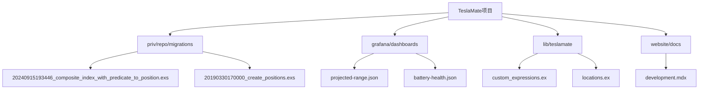
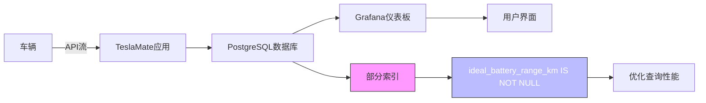
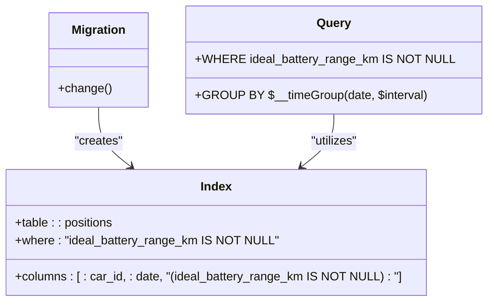
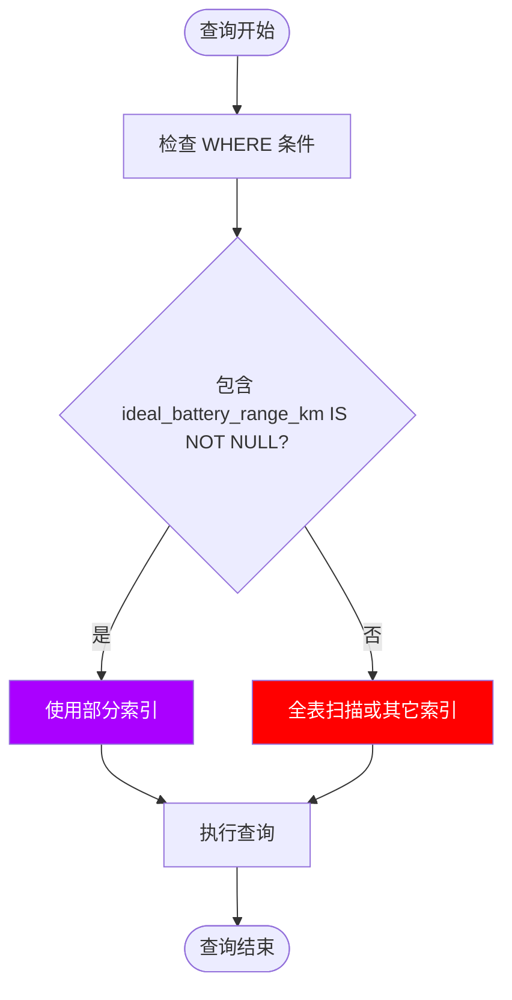
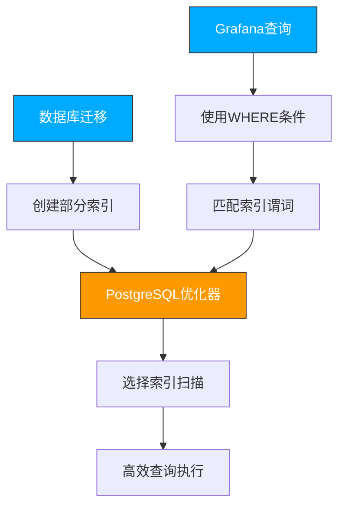

# 部分索引（带条件索引）

<cite>
**本文档中引用的文件**  
- [20240915193446_composite_index_with_predicate_to_position.exs](file://priv/repo/migrations/20240915193446_composite_index_with_predicate_to_position.exs)
- [20190330170000_create_positions.exs](file://priv/repo/migrations/20190330170000_create_positions.exs)
- [development.mdx](file://website/docs/development.mdx)
- [projected-range.json](file://grafana/dashboards/projected-range.json)
- [custom_expressions.ex](file://lib/teslamate/custom_expressions.ex)
- [locations.ex](file://lib/teslamate/locations.ex)
</cite>

## 目录
1. [引言](#引言)
2. [项目结构](#项目结构)
3. [核心组件](#核心组件)
4. [架构概述](#架构概述)
5. [详细组件分析](#详细组件分析)
6. [依赖分析](#依赖分析)
7. [性能考虑](#性能考虑)
8. [故障排除指南](#故障排除指南)
9. [结论](#结论)

## 引言
本文档详细阐述了TeslaMate系统中部分索引的应用，特别是针对`ideal_battery_range_km`字段非空记录创建的条件索引。该索引通过仅包含满足特定条件的数据行来优化稀疏数据列的查询性能，显著减少索引大小和维护开销。文档将结合迁移文件中的WHERE条件语法，说明其在特定分析查询（如仅分析包含理想续航数据的位置记录）中的优势。同时讨论部分索引的适用场景、查询规划器识别条件索引的机制，以及潜在的查询优化陷阱。

**部分索引的优势在于：**
- **减小索引体积**：仅索引满足条件的行，避免为大量NULL值创建索引条目
- **提升查询性能**：针对特定查询模式优化，加快WHERE条件匹配的查询速度
- **降低维护成本**：减少INSERT/UPDATE/DELETE操作对索引的更新负担
- **优化存储利用**：避免为稀疏数据列创建全表索引造成的空间浪费

## 项目结构
TeslaMate项目采用典型的Elixir/Phoenix应用结构，其中数据库迁移文件和查询逻辑是理解部分索引应用的关键。`priv/repo/migrations`目录包含了数据库模式演进的历史，而`grafana/dashboards`目录中的JSON文件揭示了实际查询使用模式。

**图源**  
- [20240915193446_composite_index_with_predicate_to_position.exs](file://priv/repo/migrations/20240915193446_composite_index_with_predicate_to_position.exs)
- [projected-range.json](file://grafana/dashboards/projected-range.json)
- [development.mdx](file://website/docs/development.mdx)

## 核心组件
TeslaMate的核心功能包括车辆数据记录、位置追踪和数据分析。其中，`positions`表作为最主要的数据存储，记录了车辆的实时状态，包括电池续航信息。部分索引的应用主要集中在优化对该表的查询性能。

**关键组件关系：**
- `positions`表：存储车辆位置和状态数据，包含`ideal_battery_range_km`等关键字段
- 迁移模块：定义数据库模式变更，包括索引创建
- Grafana仪表板：消费数据，执行分析查询
- 自定义表达式：提供数据库查询的抽象层

**部分索引组件源**
- [20240915193446_composite_index_with_predicate_to_position.exs](file://priv/repo/migrations/20240915193446_composite_index_with_predicate_to_position.exs)
- [20190330170000_create_positions.exs](file://priv/repo/migrations/20190330170000_create_positions.exs)

## 架构概述
TeslaMate采用分层架构，数据从车辆通过API采集，存储在PostgreSQL数据库中，然后通过Grafana进行可视化分析。部分索引作为数据库优化层的关键技术，连接了数据存储和数据分析两个层面。

**图源**  
- [20240915193446_composite_index_with_predicate_to_position.exs](file://priv/repo/migrations/20240915193446_composite_index_with_predicate_to_position.exs)
- [projected-range.json](file://grafana/dashboards/projected-range.json)

## 详细组件分析

### 部分索引实现分析
TeslaMate在`positions`表上创建了基于`ideal_battery_range_km`字段的条件索引，这是优化稀疏数据查询的典型应用。该索引仅包含`ideal_battery_range_km`字段非空的记录，有效减少了索引大小。

**图源**  
- [20240915193446_composite_index_with_predicate_to_position.exs](file://priv/repo/migrations/20240915193446_composite_index_with_predicate_to_position.exs)
- [projected-range.json](file://grafana/dashboards/projected-range.json)

### 查询模式分析
部分索引的有效性依赖于查询模式与索引条件的一致性。TeslaMate的Grafana仪表板中多个查询都显式包含了`ideal_battery_range_km IS NOT NULL`条件，确保能够利用该部分索引。

**图源**  
- [projected-range.json](file://grafana/dashboards/projected-range.json)
- [development.mdx](file://website/docs/development.mdx)

## 依赖分析
部分索引的实现和使用涉及多个组件的协同工作，包括数据库迁移、查询逻辑和应用配置。

**图源**  
- [20240915193446_composite_index_with_predicate_to_position.exs](file://priv/repo/migrations/20240915193446_composite_index_with_predicate_to_position.exs)
- [projected-range.json](file://grafana/dashboards/projected-range.json)
- [development.mdx](file://website/docs/development.mdx)

## 性能考虑
部分索引在TeslaMate中的应用带来了显著的性能优势，但也需要注意一些潜在的陷阱。

**性能优势：**
- **索引大小减少**：由于`ideal_battery_range_km`是稀疏字段，部分索引只包含非空值，大幅减小了索引体积
- **查询速度提升**：对于分析理想续航的查询，可以直接使用索引定位相关数据
- **写入性能改善**：当插入`ideal_battery_range_km`为NULL的记录时，无需更新索引

**潜在陷阱：**
- **查询规划器识别**：必须确保查询的WHERE条件与索引谓词完全匹配，否则无法使用部分索引
- **统计信息准确性**：PostgreSQL需要准确的统计信息来决定是否使用部分索引
- **复合查询复杂性**：在复杂查询中，优化器可能难以确定部分索引的适用性

**性能考虑源**
- [development.mdx](file://website/docs/development.mdx)
- [projected-range.json](file://grafana/dashboards/projected-range.json)

## 故障排除指南
当部分索引未按预期工作时，可以采用以下方法进行诊断和优化。

**诊断步骤：**
1. 使用`EXPLAIN ANALYZE`检查查询执行计划
2. 确认查询的WHERE条件与索引谓词匹配
3. 检查表和索引的统计信息是否最新
4. 验证数据分布是否符合预期

**常见问题：**
- **索引未被使用**：查询条件与索引谓词不完全匹配
- **性能未提升**：数据分布变化导致全表扫描更优
- **维护开销高**：频繁更新索引列导致性能下降

**故障排除源**
- [development.mdx](file://website/docs/development.mdx)
- [custom_expressions.ex](file://lib/teslamate/custom_expressions.ex)

## 结论
TeslaMate中针对`ideal_battery_range_km`字段创建的部分索引是一个优秀的数据库优化实践。通过仅索引非空记录，系统有效减少了索引大小和维护开销，同时提升了特定分析查询的性能。这种优化策略特别适用于稀疏数据列的场景，但需要确保查询模式与索引条件保持一致。开发者在使用部分索引时，应充分理解查询规划器的工作机制，并定期监控索引的使用情况和性能表现。