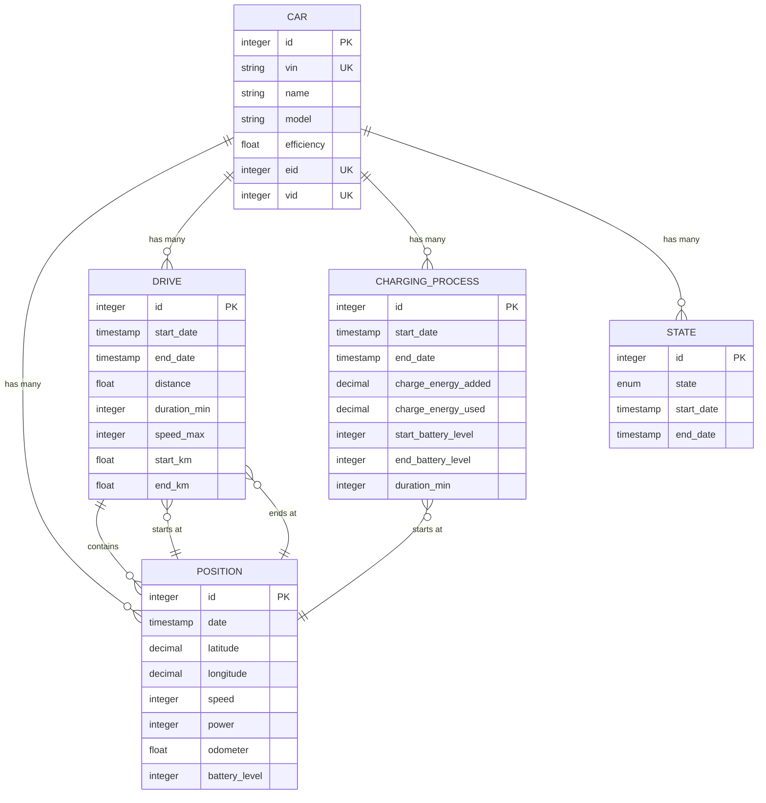
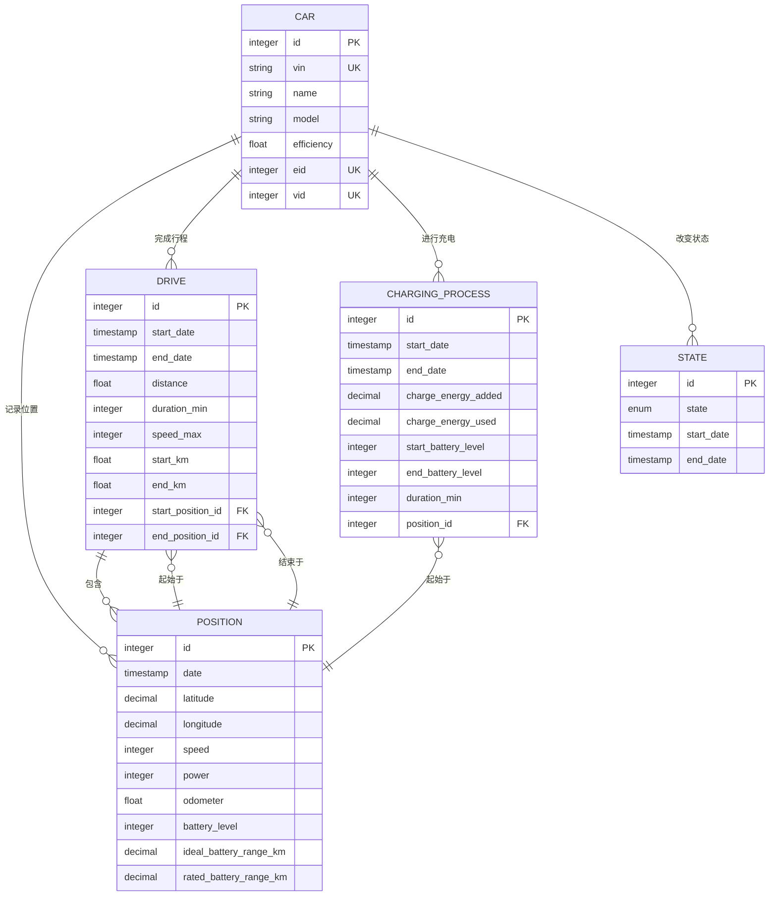

# 数据模型与数据库设计

<cite>
**本文档中引用的文件**  
- [car.ex](file://lib/teslamate/log/car.ex)
- [drive.ex](file://lib/teslamate/log/drive.ex)
- [charging_process.ex](file://lib/teslamate/log/charging_process.ex)
- [state.ex](file://lib/teslamate/log/state.ex)
- [position.ex](file://lib/teslamate/log/position.ex)
- [20190330150000_create_car.exs](file://priv/repo/migrations/20190330150000_create_car.exs)
- [20190330160000_create_trips.exs](file://priv/repo/migrations/20190330160000_create_trips.exs)
- [20190330170000_create_positions.exs](file://priv/repo/migrations/20190330170000_create_positions.exs)
- [20190330180000_create_states.exs](file://priv/repo/migrations/20190330180000_create_states.exs)
- [20190330190000_create_charging_processes.exs](file://priv/repo/migrations/20190330190000_create_charging_processes.exs)
- [20190717184003_add_fkey_indexes.exs](file://priv/repo/migrations/20190717184003_add_fkey_indexes.exs)
- [20191003132415_add_position_ids_and_apply_geofences.exs](file://priv/repo/migrations/20191003132415_add_position_ids_and_apply_geofences.exs)
- [20191020130234_increase_datetime_precision.exs](file://priv/repo/migrations/20191020130234_increase_datetime_precision.exs)
- [20200203120311_cascade_delete.exs](file://priv/repo/migrations/20200203120311_cascade_delete.exs)
- [20200410112005_database_efficiency_improvements.exs](file://priv/repo/migrations/20200410112005_database_efficiency_improvements.exs)
- [20240915193446_composite_index_with_predicate_to_position.exs](file://priv/repo/migrations/20240915193446_composite_index_with_predicate_to_position.exs)
- [repo.ex](file://lib/teslamate/repo.ex)
- [custom_expressions.ex](file://lib/teslamate/custom_expressions.ex)
</cite>

## 目录
1. [简介](#简介)
2. [核心实体与字段定义](#核心实体与字段定义)
3. [实体关系与外键约束](#实体关系与外键约束)
4. [索引策略与性能优化](#索引策略与性能优化)
5. [数据生命周期与归档策略](#数据生命周期与归档策略)
6. [Ecto模型映射机制](#ecto模型映射机制)
7. [自定义查询表达式](#自定义查询表达式)
8. [数据库模式图](#数据库模式图)

## 简介
TeslaMate 是一个用于记录和分析特斯拉车辆数据的开源系统，其后端基于 Elixir 和 Ecto 构建，使用 PostgreSQL 作为持久化存储。本文档详细说明其数据库架构，重点关注核心实体（Car、Drive、ChargingProcess、State、Position）之间的关系、字段定义、索引策略和数据生命周期管理。通过分析 Ecto 模型和数据库迁移文件，揭示了系统如何高效地存储和查询车辆的驾驶、充电和状态数据。

## 核心实体与字段定义
TeslaMate 的数据库设计围绕车辆（Car）这一核心实体展开，其他所有数据均与特定车辆相关联。主要实体及其关键字段的业务含义如下：

### 车辆 (Car)
车辆实体存储车辆的静态信息和唯一标识。
- `vin`: 车辆识别号码，全球唯一，用于标识特定车辆。
- `eid` 和 `vid`: 车辆在特斯拉API中的内部标识符。
- `name`: 用户为车辆设置的自定义名称。
- `model`, `trim_badging`: 车辆型号和配置信息。
- `efficiency`: 车辆的能效系数，用于计算能耗。

**Section sources**
- [car.ex](file://lib/teslamate/log/car.ex#L8-L22)
- [20190330150000_create_car.exs](file://priv/repo/migrations/20190330150000_create_car.exs#L5-L10)

### 驾驶行程 (Drive)
驾驶行程实体记录一次完整的驾驶会话。
- `start_date`, `end_date`: 行程的开始和结束时间，精度为微秒。
- `distance`: 行驶总距离（公里）。
- `duration_min`: 行程持续时间（分钟）。
- `speed_max`: 最高速度（km/h）。
- `start_km`, `end_km`: 行程开始和结束时的总里程。
- `outside_temp_avg`: 行程期间外部温度平均值。

**Section sources**
- [drive.ex](file://lib/teslamate/log/drive.ex#L9-L26)
- [20190330160000_create_trips.exs](file://priv/repo/migrations/20190330160000_create_trips.exs#L6-L25)

### 充电过程 (ChargingProcess)
充电过程实体记录一次完整的充电会话。
- `start_date`, `end_date`: 充电的开始和结束时间。
- `charge_energy_added`: 充入的电量（kWh）。
- `charge_energy_used`: 充电过程中消耗的总电量（kWh），包括损耗。
- `start_battery_level`, `end_battery_level`: 充电开始和结束时的电池电量百分比。
- `duration_min`: 充电持续时间（分钟）。
- `cost`: 充电费用（如果配置了计费规则）。

**Section sources**
- [charging_process.ex](file://lib/teslamate/log/charging_process.ex#L9-L22)
- [20190330190000_create_charging_processes.exs](file://priv/repo/migrations/20190330190000_create_charging_processes.exs#L7-L17)

### 车辆状态 (State)
车辆状态实体记录车辆在不同状态（在线、离线、休眠）下的持续时间。
- `state`: 枚举类型，值为 `online`, `offline`, `asleep`。
- `start_date`, `end_date`: 状态的开始和结束时间。
- 该表用于追踪车辆的可用性和连接状态。

**Section sources**
- [state.ex](file://lib/teslamate/log/state.ex#L8-L12)
- [20190330180000_create_states.exs](file://priv/repo/migrations/20190330180000_create_states.exs#L9-L12)

### 位置点 (Position)
位置点实体是数据采集的最小单位，以高频率记录车辆的实时状态。
- `date`: 位置记录的时间戳。
- `latitude`, `longitude`: 车辆的经纬度坐标。
- `speed`, `power`: 当前速度和电机功率。
- `odometer`: 车辆总里程。
- `battery_level`: 当前电池电量百分比。
- `ideal_battery_range_km`, `rated_battery_range_km`: 估算的理想和额定续航里程。
- `inside_temp`, `outside_temp`: 车内和车外温度。

**Section sources**
- [position.ex](file://lib/teslamate/log/position.ex#L8-L36)
- [20190330170000_create_positions.exs](file://priv/repo/migrations/20190330170000_create_positions.exs#L6-L24)

## 实体关系与外键约束
各实体通过外键紧密关联，形成一个以 `Car` 为中心的星型数据模型。

### 主要关系
- **Car 与 Position**: 一对多关系。一辆车产生多个位置点记录。`positions` 表通过 `car_id` 外键关联到 `cars` 表。
- **Car 与 Drive**: 一对多关系。一辆车可以有多个驾驶行程。`drives` 表通过 `car_id` 外键关联到 `cars` 表。
- **Car 与 ChargingProcess**: 一对多关系。一辆车可以有多个充电过程。`charging_processes` 表通过 `car_id` 外键关联到 `cars` 表。
- **Car 与 State**: 一对多关系。一辆车有多个状态变更记录。`states` 表通过 `car_id` 外键关联到 `cars` 表。
- **Drive 与 Position**: 一对多关系。一个驾驶行程包含多个位置点。`positions` 表通过 `drive_id` 外键关联到 `drives` 表。
- **ChargingProcess 与 Position**: 一对一关系。每个充电过程都从一个特定的位置点开始。`charging_processes` 表通过 `position_id` 外键关联到 `positions` 表。
- **Drive 与 Position (起点/终点)**: 一个驾驶行程的起点和终点都是一个位置点。`drives` 表通过 `start_position_id` 和 `end_position_id` 外键关联到 `positions` 表。

### 删除行为 (CASCADE DELETE)
系统通过 `CASCADE DELETE` 策略维护数据完整性。当删除一辆车时，其关联的所有数据（位置、行程、充电、状态等）也会被自动删除，确保不会留下孤立的记录。这一策略在 `20200203120311_cascade_delete.exs` 迁移中定义。

**Diagram sources**
- [car.ex](file://lib/teslamate/log/car.ex#L25-L28)
- [drive.ex](file://lib/teslamate/log/drive.ex#L27-L38)
- [charging_process.ex](file://lib/teslamate/log/charging_process.ex#L23-L27)
- [state.ex](file://lib/teslamate/log/state.ex#L13)
- [position.ex](file://lib/teslamate/log/position.ex#L37-L38)
- [20191003132415_add_position_ids_and_apply_geofences.exs](file://priv/repo/migrations/20191003132415_add_position_ids_and_apply_geofences.exs#L23-L27)

## 索引策略与性能优化
为了应对高频数据写入和复杂查询，TeslaMate 实施了多层次的索引和优化策略。

### 外键索引
所有外键字段都建立了索引，以加速 JOIN 操作和级联删除。
- `positions(car_id)`
- `drives(car_id)`
- `charging_processes(car_id)`
- `states(car_id)`

这些索引在 `20190717184003_add_fkey_indexes.exs` 迁移中创建。

### 复合索引与查询优化
针对特定查询模式，创建了高效的复合索引。
- **位置表复合索引**: `20240915193446_composite_index_with_predicate_to_position.exs` 迁移为 `positions` 表创建了 `(car_id, date)` 的复合索引，并带有 `WHERE drive_id IS NULL` 的条件。这极大地优化了查询车辆非驾驶状态下的位置数据的性能。
- **日期范围查询优化**: 所有涉及时间范围的字段（如 `start_date`, `end_date`）都使用了高精度的 `:utc_datetime_usec` 类型，以支持微秒级的时间查询。这一变更在 `20191020130234_increase_datetime_precision.exs` 迁移中完成。

### 数据类型优化
`20200410112005_database_efficiency_improvements.exs` 迁移对多个表进行了数据类型优化，以减少存储空间并提高查询效率：
- 将 `cars.id` 从默认的 `:bigint` 修改为 `:smallint`，因为车辆数量通常很少。
- 将 `charging_processes` 和 `charges` 表中的浮点数字段（如 `charge_energy_added`）修改为 `:decimal` 类型，并指定了精度（如 `precision: 8, scale: 2`），以确保电量计算的精确性。
- 对温度、续航里程等数值字段也进行了精度和缩放的优化。

**Section sources**
- [20190717184003_add_fkey_indexes.exs](file://priv/repo/migrations/20190717184003_add_fkey_indexes.exs#L5-L21)
- [20191020130234_increase_datetime_precision.exs](file://priv/repo/migrations/20191020130234_increase_datetime_precision.exs#L5-L32)
- [20200410112005_database_efficiency_improvements.exs](file://priv/repo/migrations/20200410112005_database_efficiency_improvements.exs#L1-L111)
- [20240915193446_composite_index_with_predicate_to_position.exs](file://priv/repo/migrations/20240915193446_composite_index_with_predicate_to_position.exs)

## 数据生命周期与归档策略
TeslaMate 的数据生命周期管理主要通过数据库层面的约束和应用逻辑来实现。
- **数据完整性**: 通过 `NOT NULL` 约束（如 `cars.vin`, `drives.start_date`）和 `UNIQUE` 约束（如 `cars.vin`）确保核心数据的完整性和唯一性。
- **级联删除**: 如前所述，`CASCADE DELETE` 策略确保了当主实体（如 Car）被删除时，所有相关数据被自动清理，防止数据碎片化。
- **数据归档**: 文档中未明确提及自动归档策略。系统似乎倾向于长期存储所有数据，依赖高效的索引和查询优化来处理大数据量。用户可能需要通过外部脚本或手动操作来归档或清理历史数据。

**Section sources**
- [car.ex](file://lib/teslamate/log/car.ex#L48)
- [drive.ex](file://lib/teslamate/log/drive.ex#L69)
- [20200203120311_cascade_delete.exs](file://priv/repo/migrations/20200203120311_cascade_delete.exs)

## Ecto模型映射机制
TeslaMate 使用 Ecto 作为其 ORM（对象关系映射）层，将数据库表映射为 Elixir 模块。

### Schema 映射
每个数据库表都有一个对应的 Ecto Schema 模块，定义在 `lib/teslamate/log/` 目录下。
- `TeslaMate.Log.Car` 映射到 `cars` 表。
- `TeslaMate.Log.Drive` 映射到 `drives` 表。
- 通过 `schema "table_name"` 宏建立映射关系。
- 字段通过 `field :field_name, :type` 定义，关系通过 `belongs_to`, `has_many` 等宏定义。

### Repository (Repo)
所有数据库操作都通过 `TeslaMate.Repo` 模块进行，该模块使用 `Ecto.Repo` 并配置为 PostgreSQL 适配器。这提供了统一的接口来执行查询、插入、更新和删除操作。

**Section sources**
- [car.ex](file://lib/teslamate/log/car.ex#L1-L8)
- [repo.ex](file://lib/teslamate/repo.ex#L1-L5)

## 自定义查询表达式
为了实现复杂的数据库查询，TeslaMate 在 `lib/teslamate/custom_expressions.ex` 文件中定义了自定义的 Ecto 查询表达式。这些表达式封装了 PostgreSQL 的特定函数或复杂的 SQL 片段，允许在 Ecto 查询中以函数式的方式调用。例如，可能包含用于计算两点间距离、处理地理空间数据或执行特定聚合操作的函数。这使得业务逻辑层可以使用简洁的 Elixir 代码来执行高性能的数据库操作。

**Section sources**
- [custom_expressions.ex](file://lib/teslamate/custom_expressions.ex)

## 数据库模式图
下图综合展示了 TeslaMate 的核心数据库模式及其关系。

**Diagram sources**
- [car.ex](file://lib/teslamate/log/car.ex)
- [drive.ex](file://lib/teslamate/log/drive.ex)
- [charging_process.ex](file://lib/teslamate/log/charging_process.ex)
- [state.ex](file://lib/teslamate/log/state.ex)
- [position.ex](file://lib/teslamate/log/position.ex)