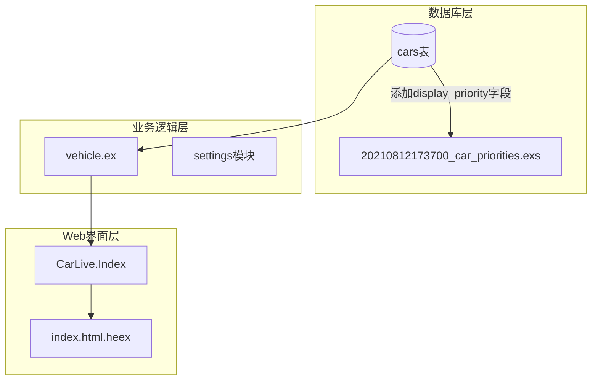
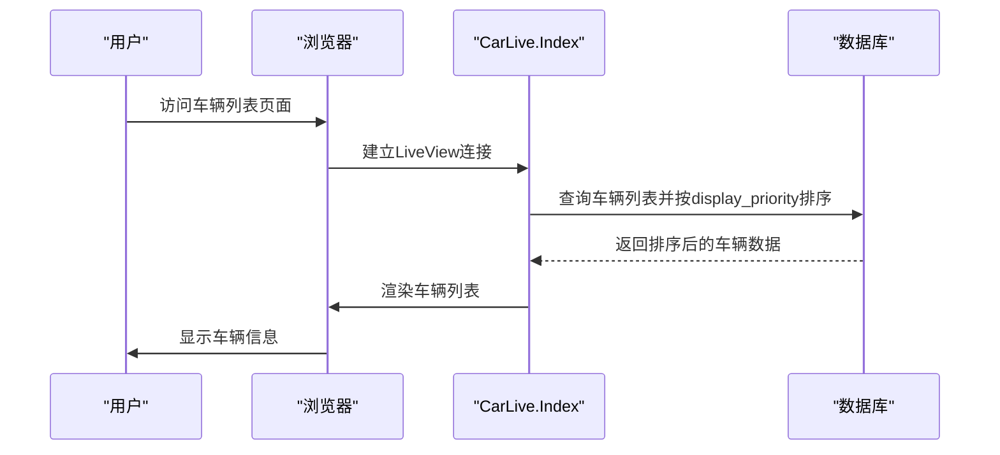
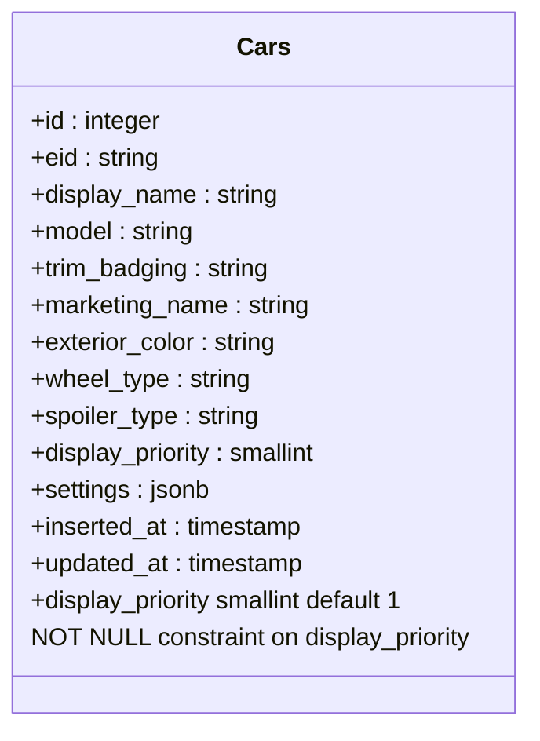
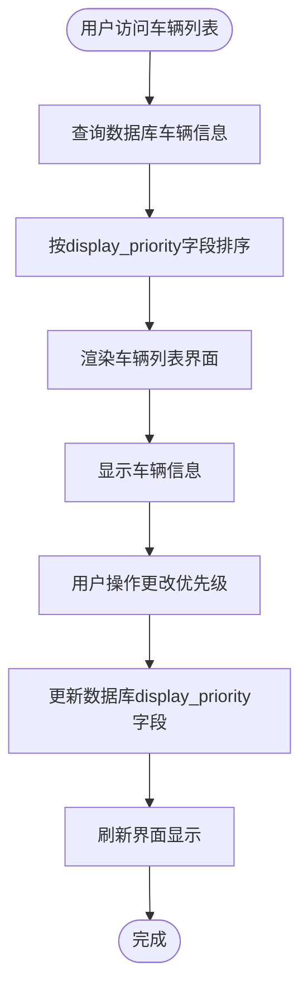
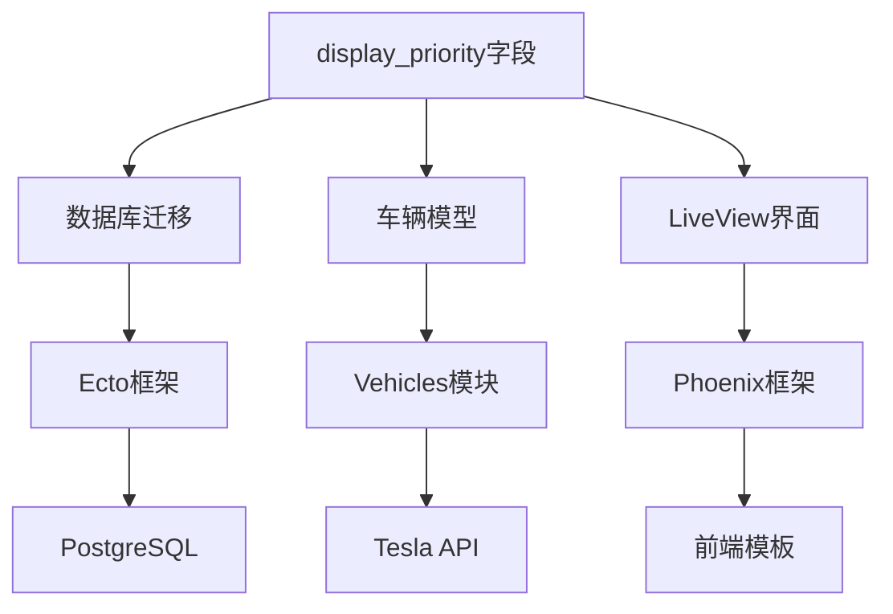

# 车辆优先级管理

<cite>
**本文档引用的文件**
- [car_priorities.exs](file://priv/repo/migrations/20210812173700_car_priorities.exs)
- [add_not_null_constraint_to_display_priority.exs](file://priv/repo/migrations/20210831153305_add_not_null_constraint_to_display_priority.exs)
- [index.ex](file://lib/teslamate_web/live/car_live/index.ex)
- [index.html.heex](file://lib/teslamate_web/live/car_live/index.html.heex)
- [vehicle.ex](file://lib/teslamate/vehicles/vehicle.ex)
</cite>

## 目录
1. [引言](#引言)
2. [项目结构](#项目结构)
3. [核心组件](#核心组件)
4. [架构概述](#架构概述)
5. [详细组件分析](#详细组件分析)
6. [依赖分析](#依赖分析)
7. [性能考虑](#性能考虑)
8. [故障排除指南](#故障排除指南)
9. [结论](#结论)
10. [附录](#附录)（如有必要）

## 引言
本文档详细说明了TeslaMate系统中车辆优先级管理机制的设计与实现，重点阐述`display_priority`字段在多车辆环境下的排序逻辑及其对用户界面显示顺序的影响。文档将解释该字段的默认值设置策略、用户自定义优先级的实现方式，并结合Web界面代码说明优先级变更的处理流程，最后提供数据库查询示例展示优先级排序效果。

## 项目结构
TeslaMate系统采用Elixir语言开发，基于Phoenix框架构建Web界面。车辆优先级管理功能主要涉及数据库迁移、车辆模型定义和Web界面展示三个层面。系统通过Ecto进行数据库操作，使用LiveView实现动态界面更新。



**图表来源**
- [car_priorities.exs](file://priv/repo/migrations/20210812173700_car_priorities.exs#L1-L9)
- [vehicle.ex](file://lib/teslamate/vehicles/vehicle.ex#L1-L800)
- [index.ex](file://lib/teslamate_web/live/car_live/index.ex#L1-L46)
- [index.html.heex](file://lib/teslamate_web/live/car_live/index.html.heex#L1-L7)

**章节来源**
- [car_priorities.exs](file://priv/repo/migrations/20210812173700_car_priorities.exs#L1-L9)
- [index.ex](file://lib/teslamate_web/live/car_live/index.ex#L1-L46)

## 核心组件
`display_priority`字段是车辆优先级管理的核心，它决定了多车辆环境下车辆在用户界面中的显示顺序。该字段在数据库层面被定义为小整数类型，具有默认值1且不允许为空，确保了所有车辆都有明确的显示优先级。

**章节来源**
- [car_priorities.exs](file://priv/repo/migrations/20210812173700_car_priorities.exs#L1-L9)
- [add_not_null_constraint_to_display_priority.exs](file://priv/repo/migrations/20210831153305_add_not_null_constraint_to_display_priority.exs#L1-L15)

## 架构概述
车辆优先级管理机制贯穿于系统的数据层、业务逻辑层和表现层。当用户访问车辆列表页面时，系统从数据库查询车辆信息并按`display_priority`字段排序，然后通过LiveView将排序后的车辆列表实时渲染到前端界面。



**图表来源**
- [index.ex](file://lib/teslamate_web/live/car_live/index.ex#L1-L46)
- [index.html.heex](file://lib/teslamate_web/live/car_live/index.html.heex#L1-L7)

## 详细组件分析

### 数据库设计分析
车辆优先级功能通过数据库迁移文件实现，确保了`display_priority`字段的正确创建和约束设置。



**图表来源**
- [car_priorities.exs](file://priv/repo/migrations/20210812173700_car_priorities.exs#L1-L9)
- [add_not_null_constraint_to_display_priority.exs](file://priv/repo/migrations/20210831153305_add_not_null_constraint_to_display_priority.exs#L1-L15)

#### 显示优先级字段设计
`display_priority`字段的设计目的和使用场景如下：
- **设计目的**：在多车辆环境中控制车辆在用户界面中的显示顺序
- **数据类型**：小整数（smallint），节省存储空间
- **默认值**：1，确保新添加的车辆有合理的默认显示位置
- **约束**：不允许为空，保证所有车辆都有明确的优先级
- **排序逻辑**：数值越小，显示优先级越高，在列表中位置越靠前

**章节来源**
- [car_priorities.exs](file://priv/repo/migrations/20210812173700_car_priorities.exs#L1-L9)
- [add_not_null_constraint_to_display_priority.exs](file://priv/repo/migrations/20210831153305_add_not_null_constraint_to_display_priority.exs#L1-L15)

### Web界面处理流程分析
车辆优先级变更的处理流程涉及前端界面交互和后端数据处理。



**图表来源**
- [index.ex](file://lib/teslamate_web/live/car_live/index.ex#L1-L46)
- [index.html.heex](file://lib/teslamate_web/live/car_live/index.html.heex#L1-L7)

#### 优先级变更处理流程
当用户更改车辆显示优先级时，系统处理流程如下：
1. 用户在Web界面触发优先级更改操作
2. 前端通过LiveView发送更新请求
3. 后端接收请求并验证输入
4. 更新数据库中对应车辆的`display_priority`字段
5. 触发界面重新排序和渲染
6. 向用户反馈操作结果

**章节来源**
- [index.ex](file://lib/teslamate_web/live/car_live/index.ex#L1-L46)
- [index.html.heex](file://lib/teslamate_web/live/car_live/index.html.heex#L1-L7)

## 依赖分析
车辆优先级管理机制依赖于系统中的多个组件，包括数据库、车辆管理模块和Web框架。



**图表来源**
- [car_priorities.exs](file://priv/repo/migrations/20210812173700_car_priorities.exs#L1-L9)
- [vehicle.ex](file://lib/teslamate/vehicles/vehicle.ex#L1-L800)
- [index.ex](file://lib/teslamate_web/live/car_live/index.ex#L1-L46)

**章节来源**
- [car_priorities.exs](file://priv/repo/migrations/20210812173700_car_priorities.exs#L1-L9)
- [vehicle.ex](file://lib/teslamate/vehicles/vehicle.ex#L1-L800)
- [index.ex](file://lib/teslamate_web/live/car_live/index.ex#L1-L46)

## 性能考虑
`display_priority`字段的设计考虑了性能因素：
- 使用小整数类型减少存储空间
- 在查询时可快速排序
- 不需要复杂的索引策略
- 对多车辆环境下的列表渲染性能影响最小

## 故障排除指南
如果车辆显示顺序不符合预期，可以按照以下步骤排查：
1. 检查数据库中`display_priority`字段的值是否正确
2. 确认查询语句是否包含按`display_priority`排序的逻辑
3. 验证LiveView是否正确接收和处理排序后的数据
4. 检查前端模板是否按正确顺序渲染车辆

**章节来源**
- [index.ex](file://lib/teslamate_web/live/car_live/index.ex#L1-L46)
- [index.html.heex](file://lib/teslamate_web/live/car_live/index.html.heex#L1-L7)

## 结论
`display_priority`字段为TeslaMate系统提供了灵活的车辆显示顺序管理机制。通过在数据库层面定义该字段并设置合理的默认值和约束，系统确保了多车辆环境下用户界面的一致性和可预测性。Web界面通过LiveView实现了优先级变更的实时反馈，为用户提供了直观的操作体验。

## 附录

### 数据库查询示例
以下是展示优先级排序效果的数据库查询示例：

```sql
SELECT id, display_name, display_priority 
FROM cars 
ORDER BY display_priority ASC, inserted_at DESC;
```

此查询将按`display_priority`字段升序排列车辆，优先级数值小的车辆排在前面；对于优先级相同的车辆，则按创建时间降序排列。

**章节来源**
- [car_priorities.exs](file://priv/repo/migrations/20210812173700_car_priorities.exs#L1-L9)

### 默认值设置策略
`display_priority`字段的默认值设置策略如下：
- **默认值**：1
- **原因**：为新添加的车辆提供合理的默认显示位置
- **优势**：简化用户操作，避免新车辆因优先级未设置而显示异常
- **灵活性**：用户可随时根据需要调整优先级数值

**章节来源**
- [car_priorities.exs](file://priv/repo/migrations/20210812173700_car_priorities.exs#L6)
- [add_not_null_constraint_to_display_priority.exs](file://priv/repo/migrations/20210831153305_add_not_null_constraint_to_display_priority.exs#L6)