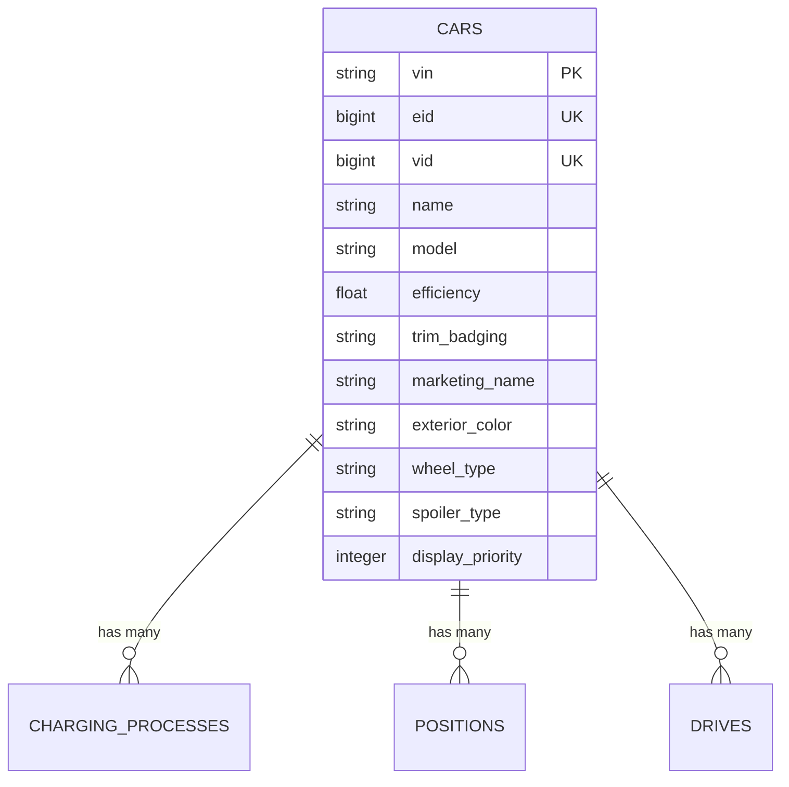
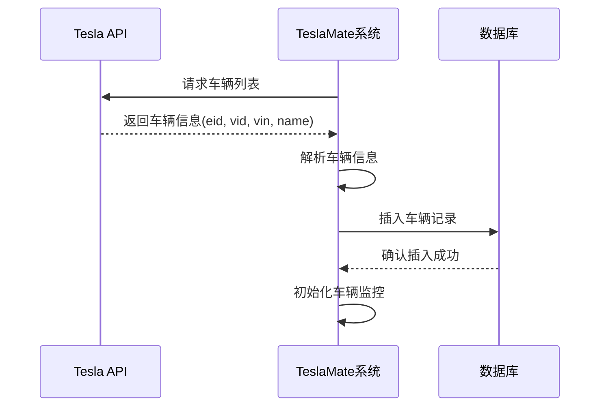
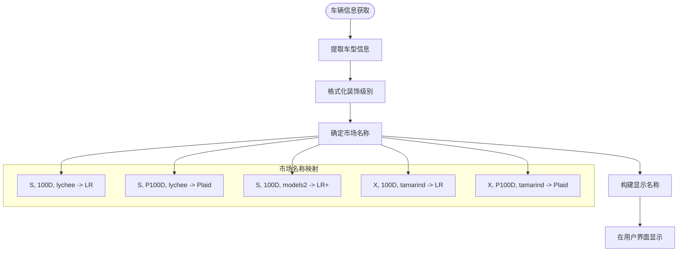
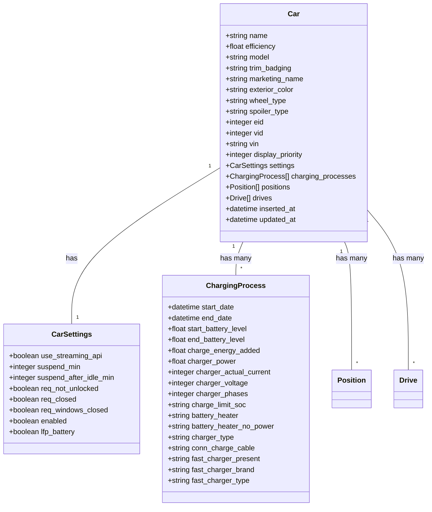
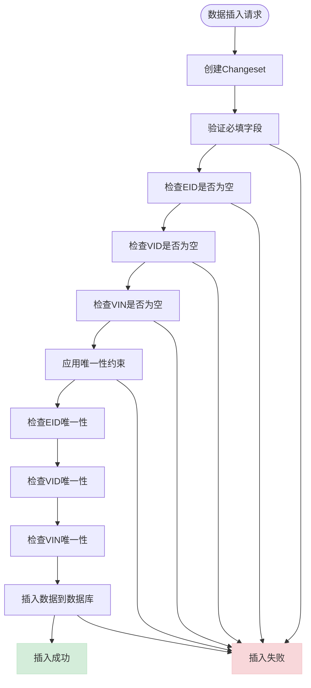

# 车辆基本信息

<cite>
**本文档引用的文件**
- [20190330150000_create_car.exs](file://priv/repo/migrations/20190330150000_create_car.exs)
- [20190816165713_extend_car_table.exs](file://priv/repo/migrations/20190816165713_extend_car_table.exs)
- [20190903151524_add_unique_index_on_vins.exs](file://priv/repo/migrations/20190903151524_add_unique_index_on_vins.exs)
- [20210812173700_car_priorities.exs](file://priv/repo/migrations/20210812173700_car_priorities.exs)
- [20220422132017_add_marketing_name_to_car.exs](file://priv/repo/migrations/20220422132017_add_marketing_name_to_car.exs)
- [car.ex](file://lib/teslamate/log/car.ex)
- [vehicle.ex](file://lib/teslamate/vehicles/vehicle.ex)
- [summary.ex](file://lib/teslamate/vehicles/vehicle/summary.ex)
- [identification_test.exs](file://test/teslamate/vehicles/identification_test.exs)
- [settings_test.exs](file://test/teslamate_web/live/settings_test.exs)
</cite>

## 目录
1. [简介](#简介)
2. [核心字段定义](#核心字段定义)
3. [唯一性约束与索引设计](#唯一性约束与索引设计)
4. [车辆标识符来源与作用](#车辆标识符来源与作用)
5. [显示逻辑与用户界面](#显示逻辑与用户界面)
6. [数据类型与约束条件](#数据类型与约束条件)
7. [数据验证与插入操作](#数据验证与插入操作)
8. [实际数据库记录示例](#实际数据库记录示例)

## 简介
本文档详细说明TeslaMate系统中车辆基本信息的存储与管理机制。重点介绍Car表中vin、eid、vid、name、model等核心字段的定义、用途和约束条件。文档还解释了车辆标识符的来源、唯一性约束的设计原理，以及display_name在用户界面中的显示逻辑。通过分析Ecto模型代码，展示数据验证和插入操作的实现方式，并提供实际数据库记录示例。

## 核心字段定义
Car表的核心字段包括车辆识别码（VIN）、外部ID（EID）、车辆ID（VID）、名称（Name）和车型（Model）。这些字段共同构成了车辆的基本信息体系。

- **vin**: 车辆识别号码（Vehicle Identification Number），是车辆的全球唯一标识符，由17位字符组成，包含车辆制造商、车型年份、生产序列等信息。
- **eid**: 外部ID（External ID），来自Tesla API的车辆标识符，用于与Tesla服务器通信时识别车辆。
- **vid**: 车辆ID（Vehicle ID），也是来自Tesla API的标识符，与eid类似，但可能有不同的生成规则和用途。
- **name**: 车辆名称，通常由车主在Tesla应用程序中设置，用于在多车辆账户中区分不同车辆。
- **model**: 车型标识，表示车辆的基本型号，如"S"、"3"、"X"、"Y"等。

这些字段在系统初始化时从Tesla API获取，并在车辆首次注册时存储到数据库中。随着车辆信息的更新，这些字段也会相应地进行同步。

**Section sources**
- [20190330150000_create_car.exs](file://priv/repo/migrations/20190330150000_create_car.exs#L6-L9)
- [20190816165713_extend_car_table.exs](file://priv/repo/migrations/20190816165713_extend_car_table.exs#L6-L8)
- [car.ex](file://lib/teslamate/log/car.ex#L8-L21)

## 唯一性约束与索引设计
为了确保数据的完整性和查询效率，Car表设计了多个唯一性约束和索引。这些约束防止了重复数据的插入，并优化了基于关键字段的查询性能。

系统在eid、vid和vin字段上都建立了唯一性索引，确保每个车辆的这些标识符在整个系统中都是唯一的。这种设计避免了同一车辆被多次注册或数据重复的问题。



**Diagram sources**
- [20190330150000_create_car.exs](file://priv/repo/migrations/20190330150000_create_car.exs#L14-L15)
- [20190903151524_add_unique_index_on_vins.exs](file://priv/repo/migrations/20190903151524_add_unique_index_on_vins.exs#L5)
- [car.ex](file://lib/teslamate/log/car.ex#L50-L52)

## 车辆标识符来源与作用
车辆标识符（VIN、EID、VID）来源于Tesla的车辆API，每个标识符在系统中都有特定的作用和使用场景。

VIN（车辆识别号码）是车辆的物理标识，通常刻在车辆的挡风玻璃下方或发动机舱内。在系统中，VIN作为车辆的主要唯一标识符，用于确保车辆数据的准确性和一致性。EID和VID是Tesla API提供的数字标识符，用于与Tesla服务器进行通信。EID通常用于身份验证和授权，而VID用于车辆状态查询和命令发送。

这些标识符的获取发生在车辆首次连接到TeslaMate系统时。系统通过Tesla API获取车辆的详细信息，包括这些标识符，并将其存储在本地数据库中。后续的所有车辆操作都基于这些标识符进行。



**Diagram sources**
- [vehicle.ex](file://lib/teslamate/vehicles/vehicle.ex#L775-L796)
- [car.ex](file://lib/teslamate/log/car.ex#L33-L54)
- [identification_test.exs](file://test/teslamate/vehicles/identification_test.exs#L72-L77)

## 显示逻辑与用户界面
在用户界面中，车辆信息的显示逻辑经过精心设计，以提供清晰、直观的用户体验。display_name（显示名称）是用户在Tesla应用程序中设置的车辆名称，它在TeslaMate的Web界面中作为车辆的主要标识显示。

系统通过车辆的model、trim_badging（装饰级别）和marketing_name（市场名称）等字段构建丰富的车辆信息展示。例如，一个Model S P100D车辆会显示为"S P100D"，而更详细的市场名称如"Plaid"也会在适当的位置显示。



**Diagram sources**
- [vehicle.ex](file://lib/teslamate/vehicles/vehicle.ex#L78-L95)
- [summary.ex](file://lib/teslamate/vehicles/vehicle/summary.ex#L79)
- [summary.html.heex](file://lib/teslamate_web/live/car_live/summary.html.heex#L42)

## 数据类型与约束条件
Car表中的各个字段都有明确的数据类型和约束条件，以确保数据的完整性和一致性。

- **vin**: 文本类型（:text），必须唯一，不能为空
- **eid**: 大整数类型（:bigint），必须唯一，不能为空
- **vid**: 大整数类型（:bigint），必须唯一，不能为空
- **name**: 文本类型（:text），可为空
- **model**: 字符串类型（:string），可为空
- **efficiency**: 浮点数类型（:float），表示车辆能效

这些数据类型和约束条件在数据库迁移文件中定义，并在Ecto模型中通过changeset函数进行验证。系统还通过唯一性约束确保eid、vid和vin的唯一性，防止数据重复。



**Diagram sources**
- [20190330150000_create_car.exs](file://priv/repo/migrations/20190330150000_create_car.exs#L6-L9)
- [20190816165713_extend_car_table.exs](file://priv/repo/migrations/20190816165713_extend_car_table.exs#L6-L8)
- [car.ex](file://lib/teslamate/log/car.ex#L8-L30)

## 数据验证与插入操作
数据验证和插入操作通过Ecto的changeset机制实现，确保只有符合约束条件的数据才能被插入数据库。

在插入新车辆记录时，系统首先创建一个changeset，然后应用一系列验证规则。这些规则包括字段必填验证（validate_required）和唯一性约束验证（unique_constraint）。只有当所有验证都通过时，数据才会被插入到数据库中。



**Diagram sources**
- [car.ex](file://lib/teslamate/log/car.ex#L33-L54)
- [vehicle.ex](file://lib/teslamate/vehicles/vehicle.ex#L784-L796)
- [settings_test.exs](file://test/teslamate_web/live/settings_test.exs#L273-L274)

## 实际数据库记录示例
以下是一个实际的Car表数据库记录示例，展示了各字段的典型值：

```json
{
  "id": 1,
  "name": "My Tesla",
  "efficiency": 0.153,
  "model": "S",
  "trim_badging": "P100D",
  "marketing_name": "Plaid",
  "exterior_color": "Midnight Silver",
  "wheel_type": "Slipstream",
  "spoiler_type": "Active",
  "eid": 12345678901234567,
  "vid": 987654321,
  "vin": "5YJSA1E34GF123456",
  "display_priority": 1,
  "inserted_at": "2023-01-01T00:00:00Z",
  "updated_at": "2023-01-01T00:00:00Z"
}
```

在这个示例中：
- **vin**: "5YJSA1E34GF123456" 是车辆的17位识别号码
- **eid**: 12345678901234567 是来自Tesla API的外部ID
- **vid**: 987654321 是车辆ID
- **name**: "My Tesla" 是用户设置的车辆名称
- **model**: "S" 表示这是Model S车型
- **marketing_name**: "Plaid" 表示这是高性能版本

这些数据共同构成了车辆的完整信息，支持系统对车辆状态的监控和管理。

**Section sources**
- [identification_test.exs](file://test/teslamate/vehicles/identification_test.exs#L116-L134)
- [settings_test.exs](file://test/teslamate_web/live/settings_test.exs#L265-L269)
- [vehicle.ex](file://lib/teslamate/vehicles/vehicle.ex#L775-L796)