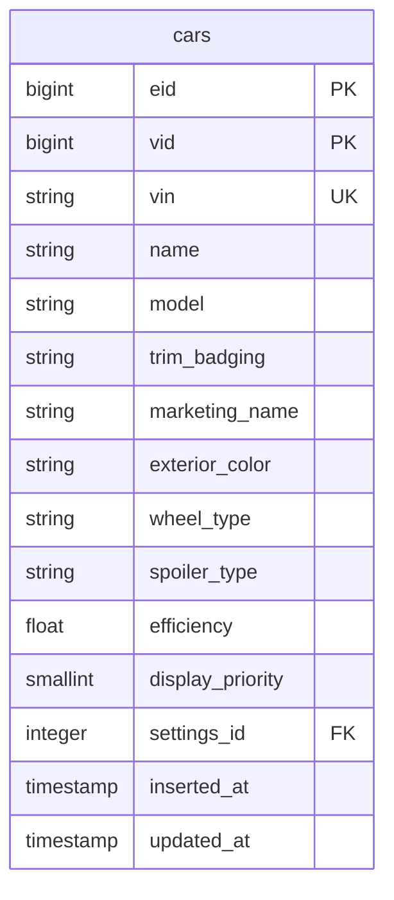
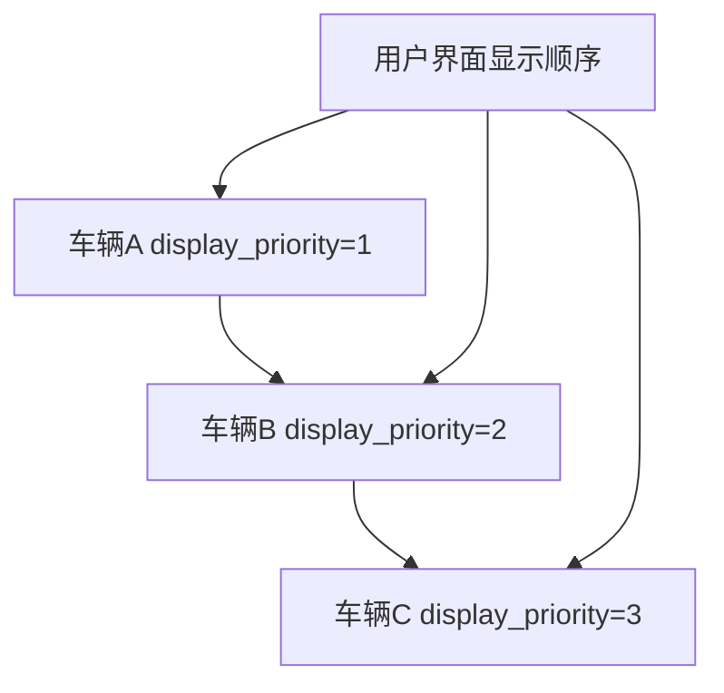
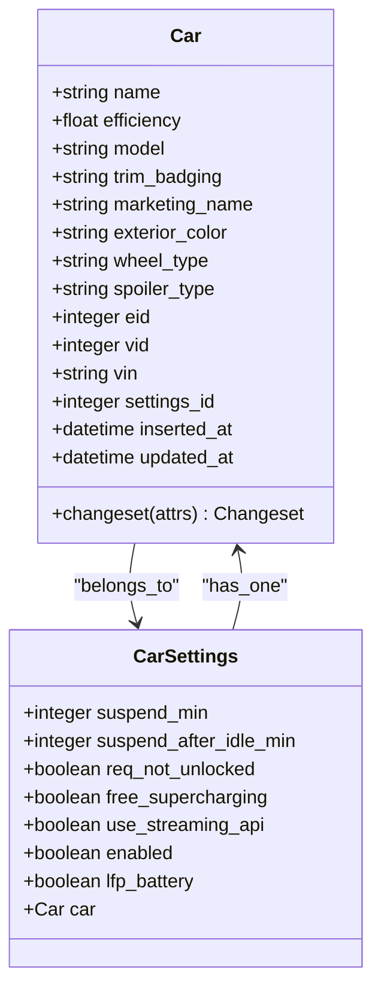

# 车辆数据模型

<cite>
**本文档引用的文件**   
- [car.ex](file://lib/teslamate/log/car.ex)
- [car_settings.ex](file://lib/teslamate/settings/car_settings.ex)
- [vehicle.ex](file://lib/teslamate/vehicles/vehicle.ex)
- [summary.ex](file://lib/teslamate/vehicles/vehicle/summary.ex)
- [create_car.exs](file://priv/repo/migrations/20190330150000_create_car.exs)
- [extend_car_table.exs](file://priv/repo/migrations/20190816165713_extend_car_table.exs)
- [add_vehicle_config_attrbitues.exs](file://priv/repo/migrations/20200302100654_add_vehicle_config_attrbitues.exs)
- [car_priorities.exs](file://priv/repo/migrations/20210812173700_car_priorities.exs)
- [log.ex](file://lib/teslamate/log.ex)
</cite>

## 目录
1. [简介](#简介)
2. [车辆表结构](#车辆表结构)
3. [核心字段定义](#核心字段定义)
4. [车辆配置属性](#车辆配置属性)
5. [车辆优先级设计](#车辆优先级设计)
6. [车辆状态管理](#车辆状态管理)
7. [Ecto模型与数据库映射](#ecto模型与数据库映射)
8. [查询接口使用方法](#查询接口使用方法)

## 简介
本文档详细说明TeslaMate项目中车辆数据模型的设计与实现。文档涵盖Car表的结构、核心字段的业务含义、车辆配置属性的存储方式、车辆优先级的设计目的以及车辆状态管理机制。通过分析Ecto模型与数据库表的映射关系，以及相关查询接口的使用方法，为开发者提供全面的参考。

## 车辆表结构
车辆数据存储在数据库的`cars`表中，该表通过Ecto迁移文件定义。表结构随着项目发展逐步演进，从最初的简单结构扩展为包含丰富车辆信息的完整模型。

**图表来源**
- [create_car.exs](file://priv/repo/migrations/20190330150000_create_car.exs#L1-L17)
- [extend_car_table.exs](file://priv/repo/migrations/20190816165713_extend_car_table.exs#L1-L11)
- [add_vehicle_config_attrbitues.exs](file://priv/repo/migrations/20200302100654_add_vehicle_config_attrbitues.exs#L1-L11)
- [car_priorities.exs](file://priv/repo/migrations/20210812173700_car_priorities.exs#L1-L9)

**本节来源**
- [create_car.exs](file://priv/repo/migrations/20190330150000_create_car.exs#L1-L17)

## 核心字段定义
车辆数据模型包含多个核心字段，用于标识和描述车辆的基本信息。

### VIN字段
车辆识别号码（VIN）是车辆的唯一标识符，用于在系统中准确识别特定车辆。该字段在数据库中具有唯一约束，确保每辆车的VIN不会重复。

**本节来源**
- [car.ex](file://lib/teslamate/log/car.ex#L21)
- [create_car.exs](file://priv/repo/migrations/20190330150000_create_car.exs#L6)

### 显示名称字段
显示名称（display_name）是用户为车辆设置的自定义名称，用于在用户界面中直观地识别车辆。该名称通常比VIN更易于记忆和识别。

**本节来源**
- [vehicle.ex](file://lib/teslamate/vehicles/vehicle.ex#L50)
- [summary.ex](file://lib/teslamate/vehicles/vehicle/summary.ex#L79)

### 车型字段
车型（model）字段标识车辆的基本型号，如Model S、Model 3、Model X或Model Y。该信息从车辆配置中提取，并用于分类和显示车辆。

**本节来源**
- [vehicle.ex](file://lib/teslamate/vehicles/vehicle.ex#L64-L75)
- [car.ex](file://lib/teslamate/log/car.ex#L11)

### 装饰徽章字段
装饰徽章（trim_badging）字段表示车辆的具体配置级别，如"100D"、"P100D"或"74D"。该信息用于区分同一车型下的不同性能版本。

**本节来源**
- [vehicle.ex](file://lib/teslamate/vehicles/vehicle.ex#L54)
- [car.ex](file://lib/teslamate/log/car.ex#L12)

## 车辆配置属性
车辆的物理配置属性通过多个字段存储，这些属性反映了车辆的外观和配置特征。

### 轮毂类型
轮毂类型（wheel_type）字段存储车辆安装的轮毂型号，如"Pinwheel18"或"TurboAllSeason19"。该信息从车辆配置中获取，并用于准确描述车辆外观。

**本节来源**
- [vehicle.ex](file://lib/teslamate/vehicles/vehicle.ex#L56)
- [car.ex](file://lib/teslamate/log/car.ex#L15)

### 外观颜色
外观颜色（exterior_color）字段记录车辆的外部油漆颜色，如"MidnightSilver"或"SolidBlack"。该属性与车辆的实际外观一致，用于在系统中准确表示车辆。

**本节来源**
- [vehicle.ex](file://lib/teslamate/vehicles/vehicle.ex#L55)
- [car.ex](file://lib/teslamate/log/car.ex#L14)

### 尾翼类型
尾翼类型（spoiler_type）字段标识车辆是否配备尾翼以及尾翼的类型，如"Passive"或"None"。该信息主要用于Model S和Model X等配备可伸缩尾翼的车型。

**本节来源**
- [vehicle.ex](file://lib/teslamate/vehicles/vehicle.ex#L57)
- [car.ex](file://lib/teslamate/log/car.ex#L16)

## 车辆优先级设计
车辆优先级机制用于控制车辆在用户界面中的显示顺序和处理优先级。

### 优先级字段
优先级（priority）字段在系统中用于确定车辆的处理顺序。虽然当前代码中主要实现的是显示优先级，但该设计为未来可能的处理优先级功能预留了空间。

### 显示优先级
显示优先级（display_priority）字段是一个小整数，用于确定多辆车在用户界面中的显示顺序。默认值为1，数值越小的车辆在列表中位置越靠前。

**图表来源**
- [car_priorities.exs](file://priv/repo/migrations/20210812173700_car_priorities.exs#L1-L9)
- [add_not_null_constraint_to_display_priority.exs](file://priv/repo/migrations/20210831153305_add_not_null_constraint_to_display_priority.exs#L1-L15)

**本节来源**
- [car_priorities.exs](file://priv/repo/migrations/20210812173700_car_priorities.exs#L1-L9)

## 车辆状态管理
系统通过复杂的状态管理机制跟踪车辆的实时状态和历史状态。

### 在线状态
车辆的在线状态由系统通过定期轮询和流式API监控。状态包括"online"（在线）、"offline"（离线）和"asleep"（休眠），系统根据状态调整数据采集频率。

**本节来源**
- [vehicle.ex](file://lib/teslamate/vehicles/vehicle.ex#L304-L435)
- [summary.ex](file://lib/teslamate/vehicles/vehicle/summary.ex#L49-L67)

### 软件更新状态
系统监控车辆的软件更新状态，包括是否有可用更新、更新下载进度和安装进度。这些信息从车辆状态的software_update字段中提取。

**本节来源**
- [summary.ex](file://lib/teslamate/vehicles/vehicle/summary.ex#L229-L234)
- [vehicle/state.ex](file://lib/tesla_api/vehicle/state.ex#L362-L368)

### 电池信息
电池信息包括电池电量（battery_level）、充电状态（charging_state）、可用电池电量（usable_battery_level）以及各种续航里程（ideal、rated、est_battery_range）。这些数据用于监控车辆的能源状态。

**本节来源**
- [summary.ex](file://lib/teslamate/vehicles/vehicle/summary.ex#L101-L115)
- [vehicle/state.ex](file://lib/tesla_api/vehicle/state.ex#L243-L270)

## Ecto模型与数据库映射
Ecto模型定义了车辆数据在应用程序中的结构，并与数据库表进行映射。

### Car模型
Car模型是车辆数据的核心Ecto模式，定义了与数据库表`cars`的映射关系。模型包含字段定义、关联关系和变更集（changeset）逻辑。

**图表来源**
- [car.ex](file://lib/teslamate/log/car.ex#L8-L30)
- [car_settings.ex](file://lib/teslamate/settings/car_settings.ex#L7-L17)

**本节来源**
- [car.ex](file://lib/teslamate/log/car.ex#L8-L30)

## 查询接口使用方法
系统提供了多种查询接口用于访问车辆数据。

### 列表查询
`list_cars/0`函数返回系统中所有车辆的列表，按ID排序。这是获取所有车辆基本信息的主要接口。

**本节来源**
- [log.ex](file://lib/teslamate/log.ex#L18-L20)

### 单个车辆查询
`get_car!/1`和`get_car_by/1`函数用于根据ID或属性获取单个车辆记录。`get_car!/1`在车辆不存在时会抛出异常，而`get_car_by/1`在未找到时返回nil。

**本节来源**
- [log.ex](file://lib/teslamate/log.ex#L22-L27)

### 状态查询
`get_current_state/1`函数获取车辆的当前状态记录，包括状态类型和开始时间。`get_earliest_state/1`函数获取车辆的最早状态记录。

**本节来源**
- [log.ex](file://lib/teslamate/log.ex#L80-L84)
- [log.ex](file://lib/teslamate/log.ex#L130-L136)

### 创建与更新
`create_or_update_car/1`函数使用变更集创建或更新车辆记录。该函数处理了数据库的插入或更新操作，并确保相关设置的正确关联。

**本节来源**
- [log.ex](file://lib/teslamate/log.ex#L35-L38)
- [car.ex](file://lib/teslamate/log/car.ex#L33-L53)