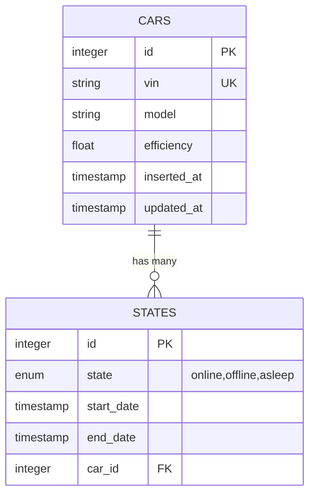
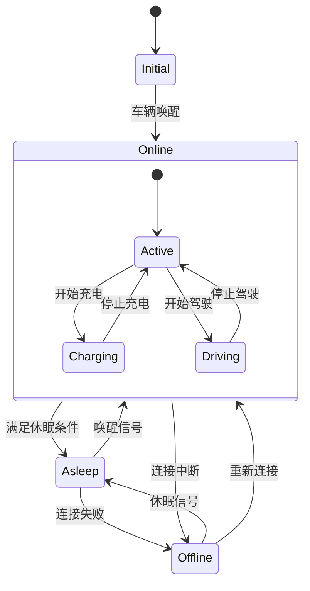
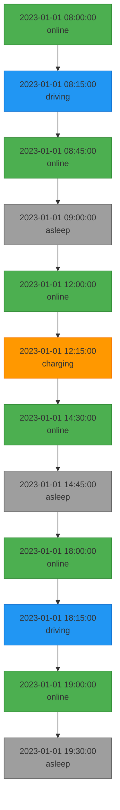

# 车辆状态管理

<cite>
**本文档引用的文件**  
- [state.ex](file://lib/teslamate/log/state.ex)
- [car.ex](file://lib/teslamate/log/car.ex)
- [log.ex](file://lib/teslamate/log.ex)
- [vehicle.ex](file://lib/teslamate/vehicles/vehicle.ex)
- [20190330180000_create_states.exs](file://priv/repo/migrations/20190330180000_create_states.exs)
- [20190330150000_create_car.exs](file://priv/repo/migrations/20190330150000_create_car.exs)
- [20200203120311_cascade_delete.exs](file://priv/repo/migrations/20200203120311_cascade_delete.exs)
- [log_state_test.exs](file://test/teslamate/log/log_state_test.exs)
</cite>

## 目录
1. [车辆状态定义](#车辆状态定义)
2. [状态表与车辆表的关联关系](#状态表与车辆表的关联关系)
3. [状态持续时间计算机制](#状态持续时间计算机制)
4. [状态转换机制与状态机模式](#状态转换机制与状态机模式)
5. [典型状态序列示例](#典型状态序列示例)
6. [状态数据在能耗分析和驾驶统计中的应用](#状态数据在能耗分析和驾驶统计中的应用)

## 车辆状态定义

TeslaMate系统定义了三种车辆状态：online（在线）、offline（离线）和asleep（休眠）。这些状态通过数据库中的枚举类型`states_status`进行定义，确保状态值的合法性和一致性。每种状态代表车辆与系统通信的不同级别：

- **online**：车辆处于活跃连接状态，可以实时接收和发送数据
- **offline**：车辆已断开连接，无法进行实时通信
- **asleep**：车辆进入低功耗休眠模式，系统主动断开连接以节省资源

这些状态定义在数据库迁移文件中通过SQL语句创建，确保了数据完整性和类型安全。

**Section sources**
- [20190330180000_create_states.exs](file://priv/repo/migrations/20190330180000_create_states.exs#L5-L6)
- [state.ex](file://lib/teslamate/log/state.ex#L8)

## 状态表与车辆表的关联关系

状态表（states）与车辆表（cars）之间存在明确的关联关系，通过外键约束实现数据完整性。在Ecto模型中，这种关系通过`belongs_to(:car, Car)`声明，表示每个状态记录都属于一个特定的车辆。

数据库层面，`car_id`字段作为外键引用`cars`表的主键，确保每个状态记录都对应一个有效的车辆。这种设计实现了数据的规范化，避免了冗余和不一致。

### 级联删除约束的设计考量

系统采用了`on_delete: :delete_all`的级联删除策略，这在数据库迁移文件`20200203120311_cascade_delete.exs`中实现。这种设计考量包括：

1. **数据完整性**：当一辆车辆被删除时，其所有相关状态记录也会被自动清除，避免了孤立的"孤儿"记录
2. **存储效率**：及时清理不再需要的数据，优化数据库存储空间
3. **逻辑一致性**：保持业务逻辑的一致性，已删除车辆的状态信息不再具有意义
4. **维护简便**：简化数据清理操作，无需手动删除关联记录

这种级联删除机制通过数据库级别的约束实现，比应用层的清理更加可靠和高效。

**Diagram sources**
- [20190330180000_create_states.exs](file://priv/repo/migrations/20190330180000_create_states.exs#L8-L15)
- [20190330150000_create_car.exs](file://priv/repo/migrations/20190330150000_create_car.exs#L5-L12)
- [20200203120311_cascade_delete.exs](file://priv/repo/migrations/20200203120311_cascade_delete.exs)

**Section sources**
- [state.ex](file://lib/teslamate/log/state.ex#L13)
- [car.ex](file://lib/teslamate/log/car.ex#L23)
- [20200203120311_cascade_delete.exs](file://priv/repo/migrations/20200203120311_cascade_delete.exs)

## 状态持续时间计算机制

状态记录通过`start_date`和`end_date`两个时间戳字段来计算状态的持续时间。这种设计模式具有以下特点：

- **start_date**：记录状态开始的精确时间，为必填字段，确保每个状态都有明确的起点
- **end_date**：记录状态结束的时间，为空值时表示该状态仍在持续

当一个车辆的状态发生变化时，系统会自动完成当前状态记录（设置`end_date`），并创建新的状态记录。这种机制确保了状态序列的连续性和完整性。

状态持续时间的计算通过以下方式实现：
1. 对于已完成的状态，持续时间 = `end_date` - `start_date`
2. 对于正在进行的状态，`end_date`为空，表示状态仍在持续
3. 系统通过事务确保状态转换的原子性，避免数据不一致

这种设计支持精确的时间序列分析，为能耗计算、驾驶统计等提供基础数据。

**Section sources**
- [state.ex](file://lib/teslamate/log/state.ex#L10-L11)
- [log.ex](file://lib/teslamate/log.ex#L67-L68)
- [log_state_test.exs](file://test/teslamate/log/log_state_test.exs#L51-L52)

## 状态转换机制与状态机模式

系统采用状态机模式管理车辆状态的转换，核心逻辑分布在多个模块中。状态转换的触发条件和处理流程如下：

### 状态转换触发条件

状态转换由车辆的实际状态变化触发，主要通过Tesla API的车辆状态轮询和流式API实现。当检测到车辆状态变化时，系统会调用`Log.start_state/3`函数启动新的状态。

### 状态处理流程

**Diagram sources**
- [vehicle.ex](file://lib/teslamate/vehicles/vehicle.ex#L746-L772)
- [log.ex](file://lib/teslamate/log.ex#L58-L77)

**Section sources**
- [vehicle.ex](file://lib/teslamate/vehicles/vehicle.ex#L746-L772)
- [log.ex](file://lib/teslamate/log.ex#L58-L77)

状态转换的核心处理逻辑包括：
1. **检查当前状态**：通过`get_current_state/1`函数获取车辆的当前状态
2. **状态去重**：如果新状态与当前状态相同，则直接返回现有记录
3. **完成当前状态**：如果状态发生变化，则更新当前状态的`end_date`
4. **创建新状态**：插入新的状态记录，设置`start_date`为当前时间

这种状态机模式确保了状态转换的有序性和可追溯性，避免了状态混乱和数据冲突。

## 典型状态序列示例

典型的车辆状态序列展示了车辆在日常使用中的状态变化模式。以下是一个完整的24小时周期示例：

**Diagram sources**
- [log_state_test.exs](file://test/teslamate/log/log_state_test.exs#L61-L79)

该序列展示了车辆在一天中的典型使用模式：早晨通勤、午间充电、傍晚通勤，以及在非使用时段进入休眠状态。每个状态转换都记录了精确的时间戳，为后续分析提供了完整的时间序列数据。

## 状态数据在能耗分析和驾驶统计中的应用

车辆状态数据在能耗分析和驾驶统计中发挥着关键作用，为多种分析功能提供基础支持：

### 能耗分析

1. **充电效率计算**：通过分析`charging`状态期间的电池电量变化和能量输入，计算充电效率
2. **驾驶能耗分析**：结合`driving`状态的持续时间和距离，计算单位距离能耗
3. **休眠能耗监测**：监控`asleep`状态期间的电池电量变化，评估"吸血鬼耗电"（vampire drain）

### 驾驶统计

1. **驾驶时间统计**：累计`driving`状态的持续时间，生成每日/每周驾驶时长报告
2. **车辆利用率分析**：计算车辆处于`online`状态的时间占比，评估车辆使用频率
3. **充电行为分析**：统计充电次数、平均充电时长和充电量，了解用户充电习惯

状态数据与其他数据表（如位置、充电过程、驾驶记录）的关联分析，为用户提供全面的车辆使用洞察，支持优化驾驶行为和充电策略。

**Section sources**
- [log.ex](file://lib/teslamate/log.ex#L48-L54)
- [log.ex](file://lib/teslamate/log.ex#L632-L674)