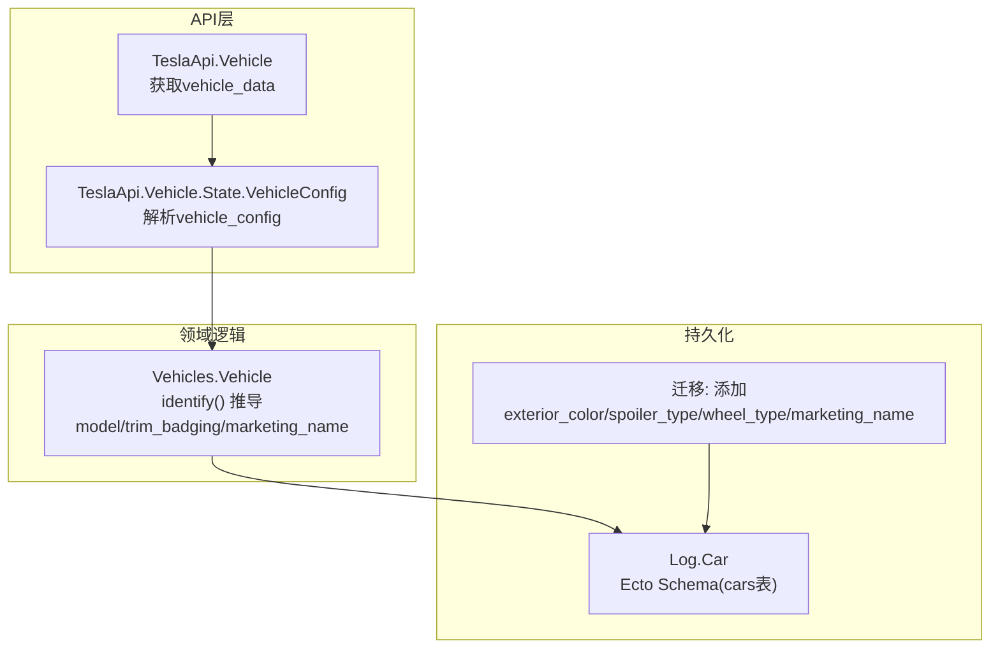
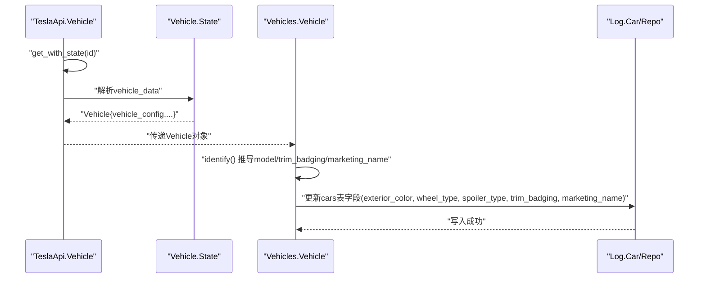
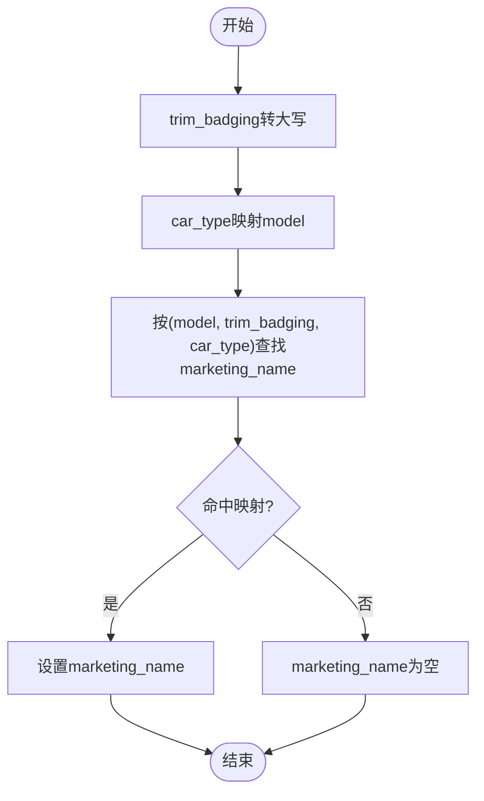
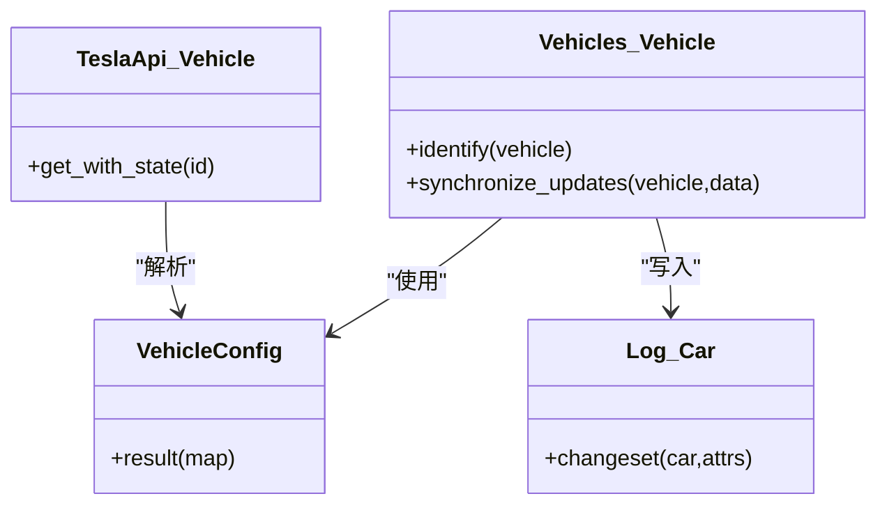

# 车辆配置属性

<cite>
**本文引用的文件**
- [lib/teslamate/vehicles/vehicle.ex](file://lib/teslamate/vehicles/vehicle.ex)
- [lib/tesla_api/vehicle/state.ex](file://lib/tesla_api/vehicle/state.ex)
- [lib/tesla_api/vehicle.ex](file://lib/tesla_api/vehicle.ex)
- [lib/teslamate/log/car.ex](file://lib/teslamate/log/car.ex)
- [priv/repo/migrations/20200302100654_add_vehicle_config_attrbitues.exs](file://priv/repo/migrations/20200302100654_add_vehicle_config_attrbitues.exs)
- [priv/repo/migrations/20220422132017_add_marketing_name_to_car.exs](file://priv/repo/migrations/20220422132017_add_marketing_name_to_car.exs)
- [priv/repo/migrations/20190828150058_do_not_require_efficiency.exs](file://priv/repo/migrations/20190828150058_do_not_require_efficiency.exs)
- [priv/repo/migrations/20190330150000_create_car.exs](file://priv/repo/migrations/20190330150000_create_car.exs)
- [test/teslamate/vehicles_test.exs](file://test/teslamate/vehicles_test.exs)
- [test/teslamate/vehicles/vehicle/updating_test.exs](file://test/teslamate/vehicles/vehicle/updating_test.exs)
</cite>

## 目录
1. [简介](#简介)
2. [项目结构](#项目结构)
3. [核心组件](#核心组件)
4. [架构总览](#架构总览)
5. [详细组件分析](#详细组件分析)
6. [依赖关系分析](#依赖关系分析)
7. [性能考量](#性能考量)
8. [故障排查指南](#故障排查指南)
9. [结论](#结论)
10. [附录](#附录)

## 简介
本文件聚焦于车辆配置属性的存储与业务含义，重点覆盖以下字段：
- exterior_color：外观颜色
- wheel_type：轮毂类型
- spoiler_type：尾翼类型
- trim_badging：装饰条（如“100D”、“P100D”等）
- marketing_name：营销名称（如“LR”、“Plaid”等）

内容涵盖：
- 这些属性如何从特斯拉API获取并持久化到数据库
- 配置数据的查询与使用模式
- trim_badging与model字段的关系
- marketing_name在多语言环境下的处理策略
- 常见配置值的枚举列表与数据更新机制

## 项目结构
围绕车辆配置属性的关键模块与迁移如下：
- 数据模型与持久化：Log.Car（cars表）定义了上述字段的Ecto Schema与changeset
- API解析层：TeslaApi.Vehicle.State.VehicleConfig负责将API返回的vehicle_config映射为结构体
- 领域逻辑：Vehicles.Vehicle.identify用于从VehicleConfig推导model、trim_badging、marketing_name，并写入cars表
- 迁移：添加exterior_color、spoiler_type、wheel_type、marketing_name等字段

图表来源
- [lib/tesla_api/vehicle.ex](file://lib/tesla_api/vehicle.ex#L51-L67)
- [lib/tesla_api/vehicle/state.ex](file://lib/tesla_api/vehicle/state.ex#L216-L274)
- [lib/teslamate/vehicles/vehicle.ex](file://lib/teslamate/vehicles/vehicle.ex#L50-L111)
- [lib/teslamate/log/car.ex](file://lib/teslamate/log/car.ex#L1-L55)
- [priv/repo/migrations/20200302100654_add_vehicle_config_attrbitues.exs](file://priv/repo/migrations/20200302100654_add_vehicle_config_attrbitues.exs#L1-L11)
- [priv/repo/migrations/20220422132017_add_marketing_name_to_car.exs](file://priv/repo/migrations/20220422132017_add_marketing_name_to_car.exs#L1-L9)

章节来源
- [lib/teslamate/log/car.ex](file://lib/teslamate/log/car.ex#L1-L55)
- [lib/tesla_api/vehicle/state.ex](file://lib/tesla_api/vehicle/state.ex#L216-L274)
- [lib/teslamate/vehicles/vehicle.ex](file://lib/teslamate/vehicles/vehicle.ex#L50-L111)
- [priv/repo/migrations/20200302100654_add_vehicle_config_attrbitues.exs](file://priv/repo/migrations/20200302100654_add_vehicle_config_attrbitues.exs#L1-L11)
- [priv/repo/migrations/20220422132017_add_marketing_name_to_car.exs](file://priv/repo/migrations/20220422132017_add_marketing_name_to_car.exs#L1-L9)

## 核心组件
- 外观颜色exterior_color：来自vehicle_config.exterior_color，存储于cars表
- 轮毂类型wheel_type：来自vehicle_config.wheel_type，存储于cars表
- 尾翼类型spoiler_type：来自vehicle_config.spoiler_type，存储于cars表
- 装饰条trim_badging：来自vehicle_config.trim_badging，存储于cars表；与model共同决定marketing_name
- 营销名称marketing_name：由identify()根据model、trim_badging与原始car_type推导得出，存储于cars表

章节来源
- [lib/tesla_api/vehicle/state.ex](file://lib/tesla_api/vehicle/state.ex#L245-L274)
- [lib/teslamate/log/car.ex](file://lib/teslamate/log/car.ex#L1-L55)
- [lib/teslamate/vehicles/vehicle.ex](file://lib/teslamate/vehicles/vehicle.ex#L50-L111)

## 架构总览
下图展示了从特斯拉API拉取vehicle_data，解析vehicle_config，推导配置并持久化的完整流程。

图表来源
- [lib/tesla_api/vehicle.ex](file://lib/tesla_api/vehicle.ex#L51-L67)
- [lib/tesla_api/vehicle/state.ex](file://lib/tesla_api/vehicle/state.ex#L216-L274)
- [lib/teslamate/vehicles/vehicle.ex](file://lib/teslamate/vehicles/vehicle.ex#L50-L111)
- [lib/teslamate/log/car.ex](file://lib/teslamate/log/car.ex#L1-L55)

## 详细组件分析

### 外观颜色exterior_color
- 来源：TeslaApi.Vehicle.State.VehicleConfig.exterior_color
- 存储：cars表exterior_color字段
- 使用：在identify()中直接透传至最终写入

章节来源
- [lib/tesla_api/vehicle/state.ex](file://lib/tesla_api/vehicle/state.ex#L245-L274)
- [lib/teslamate/log/car.ex](file://lib/teslamate/log/car.ex#L1-L55)

### 轮毂类型wheel_type
- 来源：TeslaApi.Vehicle.State.VehicleConfig.wheel_type
- 存储：cars表wheel_type字段
- 使用：在identify()中直接透传至最终写入

章节来源
- [lib/tesla_api/vehicle/state.ex](file://lib/tesla_api/vehicle/state.ex#L245-L274)
- [lib/teslamate/log/car.ex](file://lib/teslamate/log/car.ex#L1-L55)

### 尾翼类型spoiler_type
- 来源：TeslaApi.Vehicle.State.VehicleConfig.spoiler_type
- 存储：cars表spoiler_type字段
- 使用：在identify()中直接透传至最终写入

章节来源
- [lib/tesla_api/vehicle/state.ex](file://lib/tesla_api/vehicle/state.ex#L245-L274)
- [lib/teslamate/log/car.ex](file://lib/teslamate/log/car.ex#L1-L55)

### 装饰条trim_badging与model的关系
- 来源：TeslaApi.Vehicle.State.VehicleConfig.trim_badging
- 识别规则：
  - trim_badging统一转为大写
  - 通过car_type映射为model（如“models”/“models2”→“S”，“model3”→“3”，“modelx”→“X”，“modely”→“Y”，另有“lychee”→“S”，“tamarind”→“X”）
- 与marketing_name的关系：
  - marketing_name由model、trim_badging与原始car_type组合映射得到
  - 若无法匹配映射表，则marketing_name为空

图表来源
- [lib/teslamate/vehicles/vehicle.ex](file://lib/teslamate/vehicles/vehicle.ex#L50-L111)

章节来源
- [lib/teslamate/vehicles/vehicle.ex](file://lib/teslamate/vehicles/vehicle.ex#L50-L111)
- [test/teslamate/vehicles_test.exs](file://test/teslamate/vehicles_test.exs#L111-L148)

### 营销名称marketing_name的多语言处理策略
- 当前实现：marketing_name为英文或英文+后缀的字符串，未见本地化逻辑
- 建议策略：
  - 在UI层引入翻译键（如“LR”、“Plaid”），通过Gettext进行本地化
  - 或在服务端维护映射表，按用户语言返回对应文案
- 注意：本仓库未发现直接的多语言实现，建议在前端或视图层补充

章节来源
- [lib/teslamate/vehicles/vehicle.ex](file://lib/teslamate/vehicles/vehicle.ex#L50-L111)

### 配置字段的存储与迁移
- 初始表结构包含：eid、vid、model、efficiency等
- 后续迁移逐步添加：
  - 2020-03-02：添加exterior_color、spoiler_type、wheel_type
  - 2022-04-22：添加marketing_name
  - 2019-08-28：将version重命名为trim_badging，并允许efficiency/model为空
- cars表字段与Ecto Schema一致，支持trim_badging、marketing_name、exterior_color、wheel_type、spoiler_type

章节来源
- [priv/repo/migrations/20190330150000_create_car.exs](file://priv/repo/migrations/20190330150000_create_car.exs#L1-L17)
- [priv/repo/migrations/20200302100654_add_vehicle_config_attrbitues.exs](file://priv/repo/migrations/20200302100654_add_vehicle_config_attrbitues.exs#L1-L11)
- [priv/repo/migrations/20220422132017_add_marketing_name_to_car.exs](file://priv/repo/migrations/20220422132017_add_marketing_name_to_car.exs#L1-L9)
- [priv/repo/migrations/20190828150058_do_not_require_efficiency.exs](file://priv/repo/migrations/20190828150058_do_not_require_efficiency.exs#L1-L21)
- [lib/teslamate/log/car.ex](file://lib/teslamate/log/car.ex#L1-L55)

### 配置数据的查询与使用模式
- 查询模式：
  - 通过Log.Car Ecto Schema读取cars表中的配置字段
  - 可按car_id筛选，结合其他维度（如drives、charging_processes）进行统计
- 使用模式：
  - identify()在在线状态时被调用，将VehicleConfig转换为可展示的model、trim_badging、marketing_name并写入cars
  - marketing_name可用于界面显示与筛选

章节来源
- [lib/teslamate/log/car.ex](file://lib/teslamate/log/car.ex#L1-L55)
- [lib/teslamate/vehicles/vehicle.ex](file://lib/teslamate/vehicles/vehicle.ex#L772-L800)

### 常见配置值枚举（基于映射与测试）
- model映射（来自car_type）：
  - “models”/“models2”/“lychee” → “S”
  - “model3” → “3”
  - “modelx”/“tamarind” → “X”
  - “modely” → “Y”
- trim_badging（大写化）：
  - 示例：100D、P100D、74D、74、62、50
- marketing_name映射（部分示例）：
  - “S + 100D + lychee” → “LR”
  - “S + P100D + lychee” → “Plaid”
  - “S + 100D + models2” → “LR+”
  - “3 + P74D + *” → “LR AWD Performance”
  - “3 + 74D + *” → “LR AWD”
  - “3 + 74 + *” → “LR”
  - “3 + 62 + *” → “MR”
  - “3 + 50 + *” → “SR+”
  - “X + 100D + tamarind” → “LR”
  - “X + P100D + tamarind” → “Plaid”
  - “Y + P74D + *” → “LR AWD Performance”
  - “Y + 74D + *” → “LR AWD”
  - “Y + 74 + *” → “LR”
  - “Y + 50 + *” → “SR”

章节来源
- [lib/teslamate/vehicles/vehicle.ex](file://lib/teslamate/vehicles/vehicle.ex#L50-L111)
- [test/teslamate/vehicles_test.exs](file://test/teslamate/vehicles_test.exs#L111-L148)

### 数据更新机制
- 拉取与解析：
  - TeslaApi.Vehicle.get_with_state()一次性拉取vehicle_data，包含vehicle_config
  - TeslaApi.Vehicle.State.VehicleConfig.result()将JSON映射为结构体
- 写入与同步：
  - Vehicles.Vehicle.identify()在在线状态下调用，将识别结果写入cars表
  - 同步软件更新版本：Vehicles.Vehicle.synchronize_updates()记录缺失的软件版本更新
- 测试验证：
  - updating_test.exs验证了更新状态流转与日志记录

章节来源
- [lib/tesla_api/vehicle.ex](file://lib/tesla_api/vehicle.ex#L51-L67)
- [lib/tesla_api/vehicle/state.ex](file://lib/tesla_api/vehicle/state.ex#L216-L274)
- [lib/teslamate/vehicles/vehicle.ex](file://lib/teslamate/vehicles/vehicle.ex#L772-L800)
- [lib/teslamate/vehicles/vehicle.ex](file://lib/teslamate/vehicles/vehicle.ex#L1615-L1640)
- [test/teslamate/vehicles/vehicle/updating_test.exs](file://test/teslamate/vehicles/vehicle/updating_test.exs#L70-L138)

## 依赖关系分析
- TeslaApi.Vehicle依赖TeslaApi.Vehicle.State.VehicleConfig解析vehicle_config
- Vehicles.Vehicle依赖TeslaApi.Vehicle.State.VehicleConfig进行识别与写入
- Log.Car作为Ecto Schema承载cars表字段，供写入与查询
- 迁移脚本确保数据库schema包含上述字段

图表来源
- [lib/tesla_api/vehicle.ex](file://lib/tesla_api/vehicle.ex#L51-L67)
- [lib/tesla_api/vehicle/state.ex](file://lib/tesla_api/vehicle/state.ex#L216-L274)
- [lib/teslamate/vehicles/vehicle.ex](file://lib/teslamate/vehicles/vehicle.ex#L50-L111)
- [lib/teslamate/log/car.ex](file://lib/teslamate/log/car.ex#L1-L55)

章节来源
- [lib/tesla_api/vehicle.ex](file://lib/tesla_api/vehicle.ex#L51-L67)
- [lib/tesla_api/vehicle/state.ex](file://lib/tesla_api/vehicle/state.ex#L216-L274)
- [lib/teslamate/vehicles/vehicle.ex](file://lib/teslamate/vehicles/vehicle.ex#L50-L111)
- [lib/teslamate/log/car.ex](file://lib/teslamate/log/car.ex#L1-L55)

## 性能考量
- API拉取频率：系统根据车辆状态动态调整轮询间隔（睡眠/离线/在线/驾驶/充电），避免频繁请求
- 流式订阅：当启用流式API时，优先使用流式数据，减少HTTP轮询压力
- 数据库写入：identify()在事务中批量写入，降低并发冲突

章节来源
- [lib/teslamate/vehicles/vehicle.ex](file://lib/teslamate/vehicles/vehicle.ex#L34-L48)
- [lib/teslamate/vehicles/vehicle.ex](file://lib/teslamate/vehicles/vehicle.ex#L772-L800)

## 故障排查指南
- 未获取到vehicle_config
  - 现象：identify()返回错误
  - 排查：确认TeslaApi.Vehicle.get_with_state()是否成功返回vehicle_data
- marketing_name为空
  - 现象：识别不到匹配项
  - 排查：检查model与trim_badging映射是否覆盖当前组合
- 数据库字段缺失
  - 现象：cars表缺少exterior_color/spoiler_type/wheel_type/marketing_name
  - 排查：执行相应迁移脚本

章节来源
- [lib/teslamate/vehicles/vehicle.ex](file://lib/teslamate/vehicles/vehicle.ex#L108-L111)
- [priv/repo/migrations/20200302100654_add_vehicle_config_attrbitues.exs](file://priv/repo/migrations/20200302100654_add_vehicle_config_attrbitues.exs#L1-L11)
- [priv/repo/migrations/20220422132017_add_marketing_name_to_car.exs](file://priv/repo/migrations/20220422132017_add_marketing_name_to_car.exs#L1-L9)

## 结论
- 外观颜色、轮毂类型、尾翼类型与装饰条、营销名称均来自特斯拉API的vehicle_config，并在在线状态下写入cars表
- model与trim_badging共同决定marketing_name，映射规则明确但不覆盖所有组合
- marketing_name当前未做本地化，建议在UI层增加翻译键
- 更新机制通过get_with_state一次性拉取并识别，同时记录软件更新版本

## 附录
- 字段清单与来源
  - exterior_color：vehicle_config.exterior_color
  - wheel_type：vehicle_config.wheel_type
  - spoiler_type：vehicle_config.spoiler_type
  - trim_badging：vehicle_config.trim_badging（大写化）
  - marketing_name：由model、trim_badging与car_type映射得到