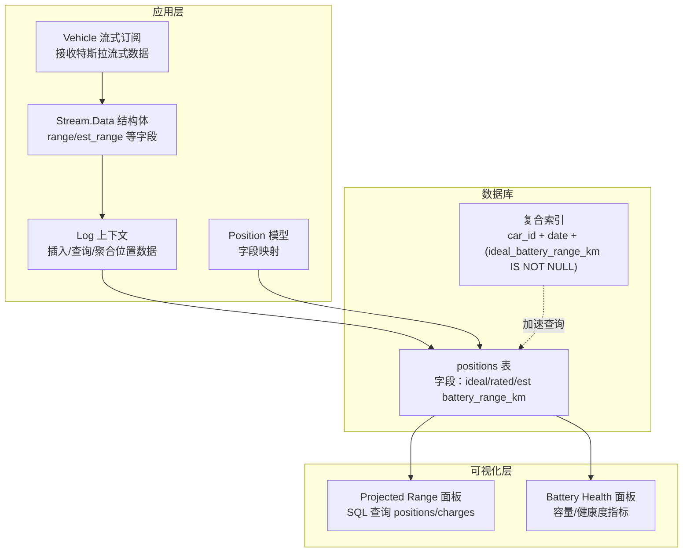
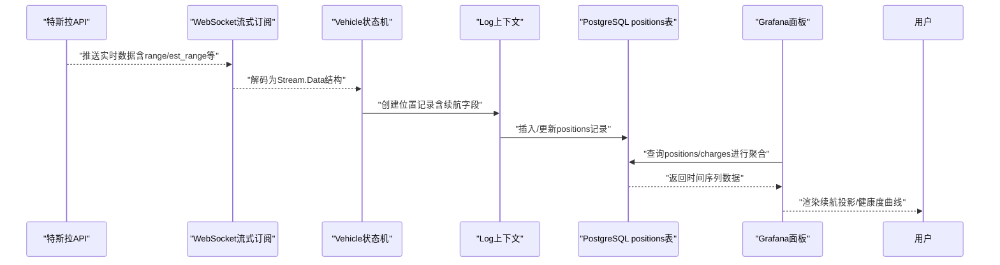
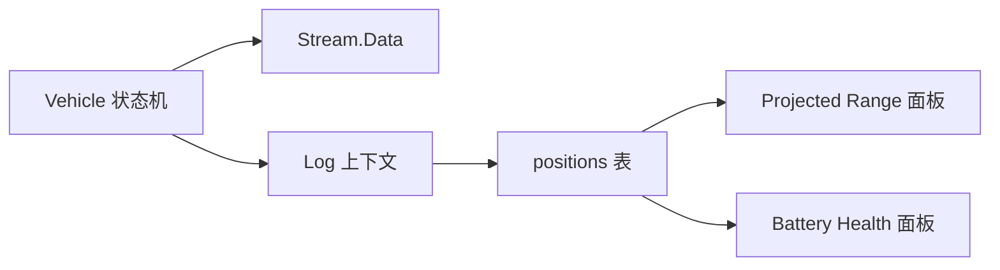

# 电池续航里程模型

<cite>
**本文引用的文件**
- [positions 表迁移：添加 battery_range_km 字段](file://priv/repo/migrations/20190828094708_add_battery_range.exs)
- [positions 表迁移：重命名为 rated_battery_range_km](file://priv/repo/migrations/20190913175011_add_rated_range_to_drives.exs)
- [positions 表迁移：复合索引优化（带谓词）](file://priv/repo/migrations/20240915193446_composite_index_with_predicate_to_position.exs)
- [数据库效率改进（字段精度调整）](file://priv/repo/migrations/20200410112005_database_efficiency_improvements.exs)
- [positions 模型定义（包含理想/估计/标称续航字段）](file://lib/teslamate/log/position.ex)
- [位置日志上下文（插入/查询/聚合逻辑）](file://lib/teslamate/log.ex)
- [车辆流式数据结构（包含 range/est_range 字段）](file://lib/tesla_api/stream/data.ex)
- [车辆流式连接与位置写入流程](file://lib/teslamate/vehicles/vehicle.ex)
- [车辆摘要（包含理想/估计/标称续航字段映射）](file://lib/teslamate/vehicles/vehicle/summary.ex)
- [Grafana 面板：Projected Range（续航投影）](file://grafana/dashboards/projected-range.json)
- [Grafana 面板：Battery Health（电池健康）](file://grafana/dashboards/battery-health.json)
- [开发文档：Streaming API 数据与 positions 表使用建议](file://website/docs/development.mdx)
- [环境变量：Tesla API 主机与轮询间隔](file://website/docs/configuration/environment_variables.md)
</cite>

## 目录
1. [简介](#简介)
2. [项目结构](#项目结构)
3. [核心组件](#核心组件)
4. [架构总览](#架构总览)
5. [详细组件分析](#详细组件分析)
6. [依赖关系分析](#依赖关系分析)
7. [性能考量](#性能考量)
8. [故障排查指南](#故障排查指南)
9. [结论](#结论)
10. [附录](#附录)

## 简介
本文件系统性阐述 TeslaMate 中“电池续航里程（battery_range_km）”的数据模型设计与使用方式，解释该字段为何被添加到 positions 表中，并说明其记录的是车辆基于当前电池状态估算的可行驶里程；同时明确该数据来源于特斯拉 API 的实时流式数据，解释其更新频率与来源；最后给出在分析车辆能效与充电策略中的应用方法，以及如何通过该字段的变化趋势判断电池健康状况，并提供数据查询示例以绘制特定行程中的续航里程衰减曲线。

## 项目结构
围绕 battery_range_km 的关键文件分布如下：
- 数据库层：positions 表的迁移脚本定义了字段演进历史（从 battery_range_km 到 rated_battery_range_km），并引入了复合索引与精度优化。
- 应用层：positions 模型定义了理想/估计/标称三种续航字段；Log 上下文负责位置数据的插入、查询与聚合；Vehicle 流式订阅将特斯拉 API 实时数据转换为位置记录。
- 可视化层：Grafana 面板通过 SQL 查询将 positions 与 charges 联合，生成“续航投影”曲线与“电池健康”相关指标。

图表来源
- [positions 表迁移：添加 battery_range_km 字段](file://priv/repo/migrations/20190828094708_add_battery_range.exs#L1-L9)
- [positions 表迁移：重命名为 rated_battery_range_km](file://priv/repo/migrations/20190913175011_add_rated_range_to_drives.exs#L1-L29)
- [positions 表迁移：复合索引优化（带谓词）](file://priv/repo/migrations/20240915193446_composite_index_with_predicate_to_position.exs#L1-L9)
- [数据库效率改进（字段精度调整）](file://priv/repo/migrations/20200410112005_database_efficiency_improvements.exs#L61-L79)
- [positions 模型定义（包含理想/估计/标称续航字段）](file://lib/teslamate/log/position.ex#L1-L79)
- [位置日志上下文（插入/查询/聚合逻辑）](file://lib/teslamate/log.ex#L146-L375)
- [车辆流式数据结构（包含 range/est_range 字段）](file://lib/tesla_api/stream/data.ex#L1-L47)
- [车辆流式连接与位置写入流程](file://lib/teslamate/vehicles/vehicle.ex#L440-L520)
- [Grafana 面板：Projected Range（续航投影）](file://grafana/dashboards/projected-range.json#L180-L190)
- [Grafana 面板：Battery Health（电池健康）](file://grafana/dashboards/battery-health.json#L1-L200)

章节来源
- [positions 表迁移：添加 battery_range_km 字段](file://priv/repo/migrations/20190828094708_add_battery_range.exs#L1-L9)
- [positions 表迁移：重命名为 rated_battery_range_km](file://priv/repo/migrations/20190913175011_add_rated_range_to_drives.exs#L1-L29)
- [positions 表迁移：复合索引优化（带谓词）](file://priv/repo/migrations/20240915193446_composite_index_with_predicate_to_position.exs#L1-L9)
- [数据库效率改进（字段精度调整）](file://priv/repo/migrations/20200410112005_database_efficiency_improvements.exs#L61-L79)
- [positions 模型定义（包含理想/估计/标称续航字段）](file://lib/teslamate/log/position.ex#L1-L79)
- [位置日志上下文（插入/查询/聚合逻辑）](file://lib/teslamate/log.ex#L146-L375)
- [车辆流式数据结构（包含 range/est_range 字段）](file://lib/tesla_api/stream/data.ex#L1-L47)
- [车辆流式连接与位置写入流程](file://lib/teslamate/vehicles/vehicle.ex#L440-L520)
- [Grafana 面板：Projected Range（续航投影）](file://grafana/dashboards/projected-range.json#L180-L190)
- [Grafana 面板：Battery Health（电池健康）](file://grafana/dashboards/battery-health.json#L1-L200)

## 核心组件
- positions 表字段演进
  - 历史字段：最初添加 battery_range_km，用于记录基于当前电池状态估算的续航里程。
  - 后续演进：在驱动与充电数据中分别重命名为 ideal/rated 两类字段，以区分“理想续航”和“标称续航”，并保留 est（估计）字段用于实时流式数据。
- positions 模型
  - 定义了 ideal_battery_range_km、est_battery_range_km、rated_battery_range_km 三个字段，均支持读写后刷新，便于在流式数据到达时快速回写。
- Log 上下文
  - 提供插入位置记录、获取最新位置、按时间段查询位置等能力；在驱动关闭时，会基于位置窗口聚合计算起止的理想/标称续航。
- Vehicle 流式订阅
  - 订阅特斯拉流式 WebSocket，解析 range/est_range 等字段，转换为位置记录并写入数据库。
- Grafana 面板
  - Projected Range 面板通过 SQL 将 positions 与 charges 联合，按时间分组生成续航投影曲线；Battery Health 面板则展示电池容量与健康度相关指标。

章节来源
- [positions 表迁移：添加 battery_range_km 字段](file://priv/repo/migrations/20190828094708_add_battery_range.exs#L1-L9)
- [positions 表迁移：重命名为 rated_battery_range_km](file://priv/repo/migrations/20190913175011_add_rated_range_to_drives.exs#L1-L29)
- [positions 模型定义（包含理想/估计/标称续航字段）](file://lib/teslamate/log/position.ex#L1-L79)
- [位置日志上下文（插入/查询/聚合逻辑）](file://lib/teslamate/log.ex#L146-L375)
- [车辆流式数据结构（包含 range/est_range 字段）](file://lib/tesla_api/stream/data.ex#L1-L47)
- [车辆流式连接与位置写入流程](file://lib/teslamate/vehicles/vehicle.ex#L440-L520)
- [Grafana 面板：Projected Range（续航投影）](file://grafana/dashboards/projected-range.json#L180-L190)
- [Grafana 面板：Battery Health（电池健康）](file://grafana/dashboards/battery-health.json#L1-L200)

## 架构总览
以下序列图展示了从特斯拉流式数据到数据库 positions 表，再到 Grafana 可视化的完整链路：

图表来源
- [车辆流式连接与位置写入流程](file://lib/teslamate/vehicles/vehicle.ex#L440-L520)
- [位置日志上下文（插入/查询/聚合逻辑）](file://lib/teslamate/log.ex#L146-L375)
- [Grafana 面板：Projected Range（续航投影）](file://grafana/dashboards/projected-range.json#L180-L190)

## 详细组件分析

### positions 表字段演进与设计动机
- 设计动机
  - positions 表用于记录车辆在不同时间点的状态快照，其中包含续航里程字段，便于后续分析能耗、效率与充电策略。
  - 早期字段 battery_range_km 仅记录“基于当前电池状态估算的续航里程”，但随着业务发展，需要区分“理想续航”（无风阻/温度/驾驶风格影响）与“标称续航”（官方标定值），因此引入 ideal/rated 两套字段。
- 字段演进历程
  - 初始添加：battery_range_km（float）
  - 驱动/充电数据重命名：将 positions 中的 battery_range_km 重命名为 rated_battery_range_km，同时在 drives/charging_processes/charges 中补充对应字段，以便在行程与充电过程中记录起止续航。
  - 复合索引优化：为 car_id/date/ideal_battery_range_km 添加带谓词的索引，提升按车与时间过滤的理想续航查询性能。
  - 字段精度优化：对 numeric 类型字段统一设置精度与小数位，确保续航数值的稳定存储与计算。
- 为什么放在 positions 表
  - positions 是高频写入的表，承载了车辆运行过程中的细粒度状态；将续航字段纳入其中，可直接与速度、功率、电量等字段关联，便于绘制续航衰减曲线与分析驾驶行为对续航的影响。

章节来源
- [positions 表迁移：添加 battery_range_km 字段](file://priv/repo/migrations/20190828094708_add_battery_range.exs#L1-L9)
- [positions 表迁移：重命名为 rated_battery_range_km](file://priv/repo/migrations/20190913175011_add_rated_range_to_drives.exs#L1-L29)
- [positions 表迁移：复合索引优化（带谓词）](file://priv/repo/migrations/20240915193446_composite_index_with_predicate_to_position.exs#L1-L9)
- [数据库效率改进（字段精度调整）](file://priv/repo/migrations/20200410112005_database_efficiency_improvements.exs#L61-L79)

### 位置模型与字段映射
- positions 模型定义了三类续航字段：
  - ideal_battery_range_km：理想续航（无外部干扰）
  - est_battery_range_km：估计续航（来自实时流式数据）
  - rated_battery_range_km：标称续航（官方标定值）
- 这些字段均声明为 decimal 并启用读写后刷新，确保在流式数据到达时能及时回写最新值。

章节来源
- [positions 模型定义（包含理想/估计/标称续航字段）](file://lib/teslamate/log/position.ex#L1-L79)

### 流式数据来源与更新频率
- 来源
  - 特斯拉 API 的 WebSocket 流式接口，持续推送车辆实时状态，包括 speed、odometer、soc、elevation、range、est_range、heading 等字段。
- 更新频率
  - 车辆在线/驾驶/充电等状态下，系统根据环境变量配置的轮询间隔动态调整拉取频率；在启用流式 API 时，主要依赖 WebSocket 推送，从而实现更接近实时的数据更新。
- 关键参数
  - 轮询间隔由环境变量控制（如 POLLING_DRIVING_INTERVAL、POLLING_CHARGING_INTERVAL 等），默认值在开发文档中有说明。

章节来源
- [车辆流式数据结构（包含 range/est_range 字段）](file://lib/tesla_api/stream/data.ex#L1-L47)
- [车辆流式连接与位置写入流程](file://lib/teslamate/vehicles/vehicle.ex#L440-L520)
- [环境变量：Tesla API 主机与轮询间隔](file://website/docs/configuration/environment_variables.md#L40-L61)

### 位置写入与聚合逻辑
- 写入流程
  - Vehicle 状态机在收到流式数据后，构造位置记录（包含日期、经纬度、速度、功率、电量、续航等字段），并通过 Log 上下文插入到 positions 表。
- 聚合逻辑
  - 在驱动结束时，系统通过窗口函数按时间顺序聚合位置数据，提取起止的理想/标称续航，用于驱动记录的统计与展示。
- 查询优化
  - 通过复合索引 car_id/date/ideal_battery_range_km（带谓词）加速筛选与排序，减少大数据量下的查询开销。

章节来源
- [位置日志上下文（插入/查询/聚合逻辑）](file://lib/teslamate/log.ex#L146-L375)
- [位置日志上下文（驱动聚合）](file://lib/teslamate/log.ex#L236-L375)
- [positions 表迁移：复合索引优化（带谓词）](file://priv/repo/migrations/20240915193446_composite_index_with_predicate_to_position.exs#L1-L9)

### 可视化与应用：续航投影与电池健康
- 续航投影（Projected Range）
  - 通过联合查询 positions 与 charges，按时间分组计算“续航投影”，并支持选择 ideal 或 rated 作为首选范围。
  - 面板支持时间区间与聚合间隔选择，便于观察不同时间段内的续航变化趋势。
- 电池健康（Battery Health）
  - 面板展示“可用容量（CurrentCapacity）”、“新电池容量（MaxCapacity）”等指标，结合 ideal/rated 续航曲线，辅助判断电池健康状况与衰减趋势。
- 能效与充电策略
  - 通过 ideal/rated 续航与充电能量的对比，可推导出能效因子，指导优化驾驶习惯与充电策略。

章节来源
- [Grafana 面板：Projected Range（续航投影）](file://grafana/dashboards/projected-range.json#L180-L190)
- [Grafana 面板：Battery Health（电池健康）](file://grafana/dashboards/battery-health.json#L1-L200)
- [位置日志上下文（驱动聚合）](file://lib/teslamate/log.ex#L236-L375)

### 电池健康判断：基于续航衰减曲线的趋势分析
- 方法论
  - 观察某次行程或充电周期内，ideal/rated 续航随电量/时间的变化趋势，若出现异常陡降或平台期过长，可能提示电池老化、热管理问题或驾驶习惯影响。
  - 结合 Battery Health 面板中的 CurrentCapacity 与 MaxCapacity 差异，进一步确认健康度。
- 实践建议
  - 使用 Grafana 的“Projected Range”面板，选择合适的聚合间隔与时间范围，叠加充电事件标注，识别续航衰减的关键节点。

章节来源
- [Grafana 面板：Projected Range（续航投影）](file://grafana/dashboards/projected-range.json#L180-L190)
- [Grafana 面板：Battery Health（电池健康）](file://grafana/dashboards/battery-health.json#L1-L200)

### 数据查询示例：绘制特定行程中的续航里程衰减曲线
以下为在 Grafana 中常用的 SQL 查询思路（路径引用）：
- 联合 positions 与 charges，按时间分组计算“续航投影”
  - 查询路径参考：[Grafana 面板：Projected Range（续航投影）](file://grafana/dashboards/projected-range.json#L180-L190)
- 仅查询 positions 中的理想续航（带谓词索引优化）
  - 查询路径参考：[positions 表迁移：复合索引优化（带谓词）](file://priv/repo/migrations/20240915193446_composite_index_with_predicate_to_position.exs#L1-L9)
- 驱动起止续航聚合（用于行程统计）
  - 查询路径参考：[位置日志上下文（驱动聚合）](file://lib/teslamate/log.ex#L236-L375)

章节来源
- [Grafana 面板：Projected Range（续航投影）](file://grafana/dashboards/projected-range.json#L180-L190)
- [positions 表迁移：复合索引优化（带谓词）](file://priv/repo/migrations/20240915193446_composite_index_with_predicate_to_position.exs#L1-L9)
- [位置日志上下文（驱动聚合）](file://lib/teslamate/log.ex#L236-L375)

## 依赖关系分析
- 组件耦合
  - Vehicle 状态机依赖 TeslaApi.Stream 解析流式数据；Log 上下文负责持久化；Grafana 面板依赖 PostgreSQL 数据源进行查询与可视化。
- 外部依赖
  - 特斯拉 API 的 WebSocket 服务与轮询策略，受环境变量控制；数据库层面通过索引与字段精度优化提升查询性能。
- 潜在循环依赖
  - 当前结构清晰，未发现循环依赖；Vehicle 与 Log 之间为单向调用关系。

图表来源
- [车辆流式连接与位置写入流程](file://lib/teslamate/vehicles/vehicle.ex#L440-L520)
- [位置日志上下文（插入/查询/聚合逻辑）](file://lib/teslamate/log.ex#L146-L375)
- [Grafana 面板：Projected Range（续航投影）](file://grafana/dashboards/projected-range.json#L180-L190)
- [Grafana 面板：Battery Health（电池健康）](file://grafana/dashboards/battery-health.json#L1-L200)

## 性能考量
- 索引优化
  - 为 car_id/date/ideal_battery_range_km 添加带谓词的复合索引，显著降低大规模查询的成本。
- 字段精度
  - 对 numeric 类型字段统一设置精度与小数位，避免浮点误差累积，保证续航数值的稳定性。
- 查询建议
  - 开发文档建议在启用流式 API 时，尽量按 car_id 与 ideal_battery_range_km IS NOT NULL 进行过滤，减少无关数据扫描。

章节来源
- [positions 表迁移：复合索引优化（带谓词）](file://priv/repo/migrations/20240915193446_composite_index_with_predicate_to_position.exs#L1-L9)
- [数据库效率改进（字段精度调整）](file://priv/repo/migrations/20200410112005_database_efficiency_improvements.exs#L61-L79)
- [开发文档：Streaming API 数据与 positions 表使用建议](file://website/docs/development.mdx#L166-L202)

## 故障排查指南
- 无续航数据
  - 检查是否启用流式 API；确认 WebSocket 连接成功且未断开。
  - 确认 positions 表中 ideal_battery_range_km 是否存在非空值（可通过带谓词索引查询验证）。
- 续航曲线异常
  - 对比 ideal 与 rated 曲线差异，若差异过大，可能与驾驶习惯、环境温度或热管理系统有关。
  - 结合 Battery Health 面板查看 CurrentCapacity 与 MaxCapacity 的差值，评估电池健康度。
- 查询缓慢
  - 确认已创建带谓词的复合索引；必要时使用 EXPLAIN ANALYZE 分析查询计划。

章节来源
- [开发文档：Streaming API 数据与 positions 表使用建议](file://website/docs/development.mdx#L166-L202)
- [Grafana 面板：Battery Health（电池健康）](file://grafana/dashboards/battery-health.json#L1-L200)
- [Grafana 面板：Projected Range（续航投影）](file://grafana/dashboards/projected-range.json#L180-L190)

## 结论
battery_range_km（现为 ideal/rated/est 三类字段）在 TeslaMate 中承担着“基于当前电池状态估算的可行驶里程”的核心角色。其数据来源于特斯拉 API 的实时流式推送，写入 positions 表后，通过 Log 上下文与 Grafana 面板实现高效的查询与可视化。借助 ideal/rated 续航曲线与 Battery Health 指标，用户可以有效分析能效、制定充电策略，并通过续航衰减趋势判断电池健康状况。为保障性能，应充分利用带谓词的复合索引与字段精度优化，并遵循开发文档的查询建议。

## 附录
- 相关文件路径
  - [positions 表迁移：添加 battery_range_km 字段](file://priv/repo/migrations/20190828094708_add_battery_range.exs#L1-L9)
  - [positions 表迁移：重命名为 rated_battery_range_km](file://priv/repo/migrations/20190913175011_add_rated_range_to_drives.exs#L1-L29)
  - [positions 表迁移：复合索引优化（带谓词）](file://priv/repo/migrations/20240915193446_composite_index_with_predicate_to_position.exs#L1-L9)
  - [数据库效率改进（字段精度调整）](file://priv/repo/migrations/20200410112005_database_efficiency_improvements.exs#L61-L79)
  - [positions 模型定义（包含理想/估计/标称续航字段）](file://lib/teslamate/log/position.ex#L1-L79)
  - [位置日志上下文（插入/查询/聚合逻辑）](file://lib/teslamate/log.ex#L146-L375)
  - [车辆流式数据结构（包含 range/est_range 字段）](file://lib/tesla_api/stream/data.ex#L1-L47)
  - [车辆流式连接与位置写入流程](file://lib/teslamate/vehicles/vehicle.ex#L440-L520)
  - [Grafana 面板：Projected Range（续航投影）](file://grafana/dashboards/projected-range.json#L180-L190)
  - [Grafana 面板：Battery Health（电池健康）](file://grafana/dashboards/battery-health.json#L1-L200)
  - [开发文档：Streaming API 数据与 positions 表使用建议](file://website/docs/development.mdx#L166-L202)
  - [环境变量：Tesla API 主机与轮询间隔](file://website/docs/configuration/environment_variables.md#L40-L61)