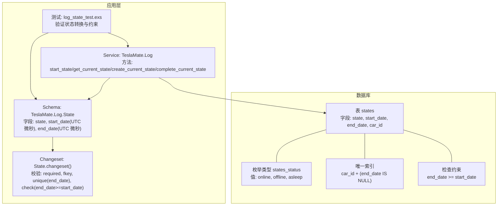
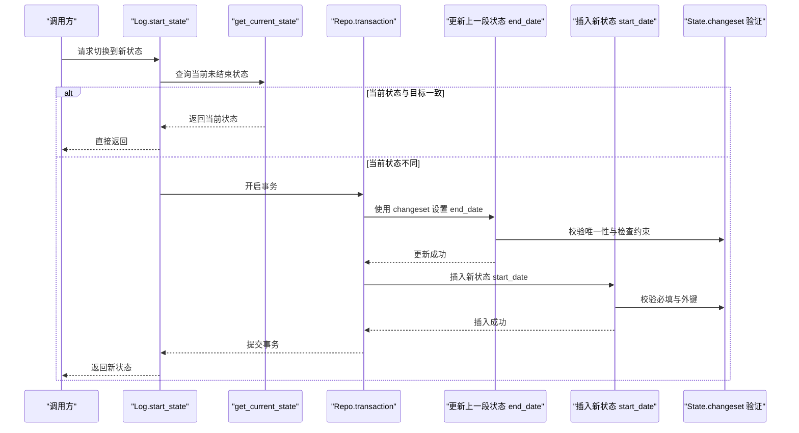
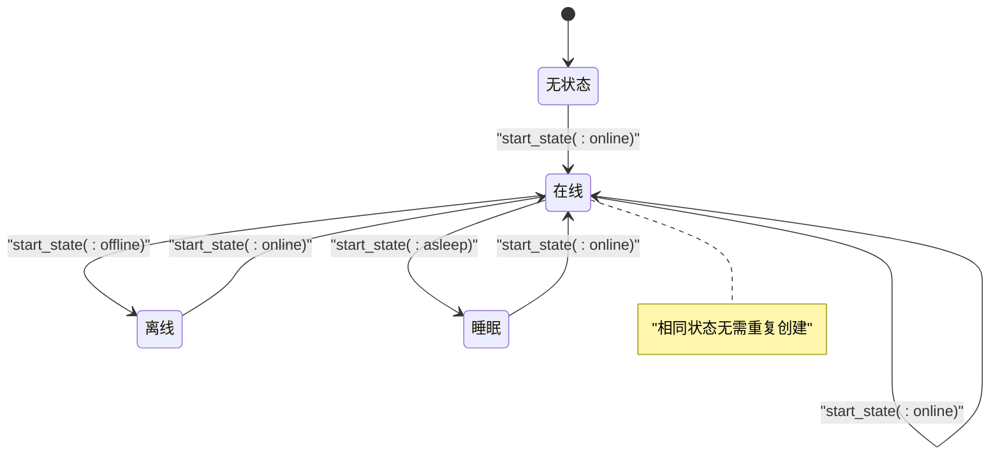
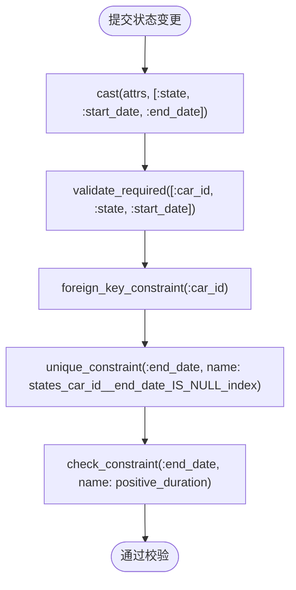
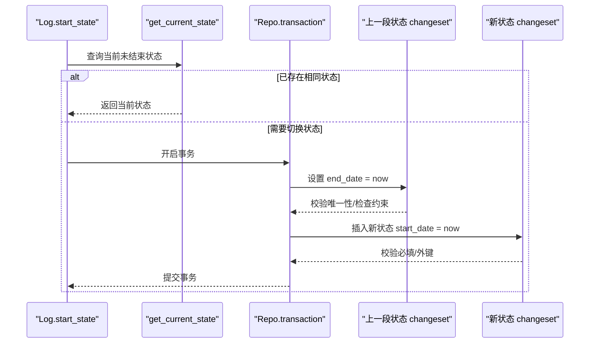
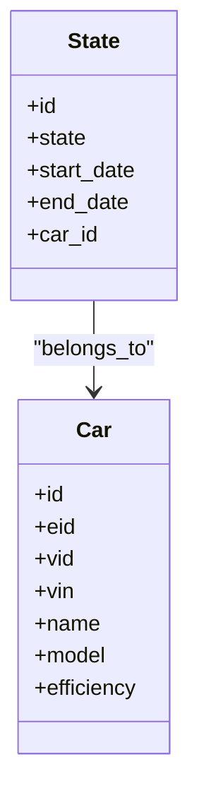

# 车辆状态核心字段

<cite>
**本文引用的文件**
- [lib/teslamate/log/state.ex](file://lib/teslamate/log/state.ex)
- [priv/repo/migrations/20190330180000_create_states.exs](file://priv/repo/migrations/20190330180000_create_states.exs)
- [priv/repo/migrations/20190821143938_add_constraints.exs](file://priv/repo/migrations/20190821143938_add_constraints.exs)
- [lib/teslamate/log.ex](file://lib/teslamate/log.ex)
- [test/teslamate/log/log_state_test.exs](file://test/teslamate/log/log_state_test.exs)
- [lib/teslamate/log/car.ex](file://lib/teslamate/log/car.ex)
- [lib/teslamate/vehicles/vehicle.ex](file://lib/teslamate/vehicles/vehicle.ex)
</cite>

## 目录
1. [简介](#简介)
2. [项目结构](#项目结构)
3. [核心组件](#核心组件)
4. [架构总览](#架构总览)
5. [详细组件分析](#详细组件分析)
6. [依赖分析](#依赖分析)
7. [性能考虑](#性能考虑)
8. [故障排查指南](#故障排查指南)
9. [结论](#结论)

## 简介
本文件聚焦于车辆状态模型中的三个核心字段：state（状态）、start_date（开始时间）与 end_date（结束时间）。我们将系统性地解释：
- state 的三种枚举值（online、offline、asleep）的语义与在车辆生命周期中的转换逻辑；
- start_date 与 end_date 的时间精度（微秒级 UTC 时间）及如何用于计算状态持续时长；
- 数据完整性约束（外键 car_id、唯一性约束确保“当前状态唯一”、检查约束确保结束时间不早于开始时间）；
- changeset 函数如何验证与处理状态数据，并通过测试用例展示其行为。

## 项目结构
围绕状态模型的关键文件组织如下：
- 数据库迁移定义了状态表结构、枚举类型与约束；
- Ecto Schema 定义了状态实体与字段类型；
- 业务服务层负责状态的创建、完成与当前状态查询；
- 测试覆盖了状态变更、唯一性与错误场景。

图表来源
- [priv/repo/migrations/20190330180000_create_states.exs](file://priv/repo/migrations/20190330180000_create_states.exs#L1-L18)
- [priv/repo/migrations/20190821143938_add_constraints.exs](file://priv/repo/migrations/20190821143938_add_constraints.exs#L1-L10)
- [lib/teslamate/log/state.ex](file://lib/teslamate/log/state.ex#L1-L32)
- [lib/teslamate/log.ex](file://lib/teslamate/log.ex#L56-L128)
- [test/teslamate/log/log_state_test.exs](file://test/teslamate/log/log_state_test.exs#L1-L91)

章节来源
- [priv/repo/migrations/20190330180000_create_states.exs](file://priv/repo/migrations/20190330180000_create_states.exs#L1-L18)
- [priv/repo/migrations/20190821143938_add_constraints.exs](file://priv/repo/migrations/20190821143938_add_constraints.exs#L1-L10)
- [lib/teslamate/log/state.ex](file://lib/teslamate/log/state.ex#L1-L32)
- [lib/teslamate/log.ex](file://lib/teslamate/log.ex#L56-L128)
- [test/teslamate/log/log_state_test.exs](file://test/teslamate/log/log_state_test.exs#L1-L91)

## 核心组件
- 状态表与枚举
  - 表 states 包含字段：state（枚举）、start_date（UTC 微秒）、end_date（UTC 微秒）、car_id（外键）。
  - 枚举类型 states_status 的合法值为 online、offline、asleep。
- 约束
  - 唯一性约束：在同一 car_id 下，仅允许存在一个 end_date 为 NULL 的“当前状态”记录。
  - 检查约束：end_date 必须不早于 start_date。
- Ecto Changeset
  - 校验必填项：car_id、state、start_date；
  - 外键约束：car_id 必须指向存在的 car；
  - 唯一性约束：对 end_date 的唯一性校验（当 end_date 为 NULL 时）；
  - 检查约束：end_date 必须晚于 start_date。
- 服务层方法
  - start_state：根据当前状态决定是否需要先完成上一段状态再开启新状态；
  - get_current_state：查询当前未结束的状态；
  - create_current_state/complete_current_state：用于恢复或补全历史状态的边界情况。

章节来源
- [priv/repo/migrations/20190330180000_create_states.exs](file://priv/repo/migrations/20190330180000_create_states.exs#L1-L18)
- [priv/repo/migrations/20190821143938_add_constraints.exs](file://priv/repo/migrations/20190821143938_add_constraints.exs#L1-L10)
- [lib/teslamate/log/state.ex](file://lib/teslamate/log/state.ex#L1-L32)
- [lib/teslamate/log.ex](file://lib/teslamate/log.ex#L56-L128)

## 架构总览
状态模型贯穿数据库层、Ecto 层与业务服务层，形成“写入—校验—查询—事务化更新”的闭环。

图表来源
- [lib/teslamate/log.ex](file://lib/teslamate/log.ex#L56-L78)
- [lib/teslamate/log.ex](file://lib/teslamate/log.ex#L80-L101)
- [lib/teslamate/log/state.ex](file://lib/teslamate/log/state.ex#L16-L31)

章节来源
- [lib/teslamate/log.ex](file://lib/teslamate/log.ex#L56-L128)
- [lib/teslamate/log/state.ex](file://lib/teslamate/log/state.ex#L16-L31)

## 详细组件分析

### 字段定义与时间精度
- state
  - 类型：Ecto.Enum，值域为 :online、:offline、:asleep。
  - 存储：数据库侧以枚举类型 states_status 存储。
- start_date
  - 类型：:utc_datetime_usec（微秒级 UTC 时间）。
  - 语义：某状态的起始时刻；首次创建时由服务层注入当前 UTC 微秒时间。
- end_date
  - 类型：:utc_datetime_usec（微秒级 UTC 时间）。
  - 语义：某状态的结束时刻；当前状态为 NULL；历史状态必须有明确结束时间。

时间精度与持续时长计算
- 由于 start_date 与 end_date 均为微秒级 UTC 时间，因此状态持续时长可直接通过两者差值计算，且具备微秒级分辨率。
- 在业务层，服务方法会使用当前时间作为 end_date 或新状态的 start_date，保证时间连续性与单调性。

章节来源
- [lib/teslamate/log/state.ex](file://lib/teslamate/log/state.ex#L1-L32)
- [lib/teslamate/log.ex](file://lib/teslamate/log.ex#L56-L78)

### 状态枚举与生命周期转换
- 有效状态值
  - online：车辆在线，通常表示可接收指令与数据流；
  - offline：车辆离线，通常表示无法连接但未进入睡眠；
  - asleep：车辆睡眠，通常表示停止数据流并降低功耗。
- 转换逻辑
  - 当收到新的状态事件时，若当前存在未结束状态且与目标状态不同，则先将当前状态结束（设置 end_date），再插入新状态（设置 start_date）。
  - 若当前状态与目标一致，则直接返回当前状态，避免重复写入。
  - 特殊场景：当需要恢复历史状态或修复边界情况时，提供 create_current_state/complete_current_state 方法，确保“当前状态唯一”。

图表来源
- [lib/teslamate/log.ex](file://lib/teslamate/log.ex#L56-L78)
- [lib/teslamate/vehicles/vehicle.ex](file://lib/teslamate/vehicles/vehicle.ex#L746-L770)

章节来源
- [lib/teslamate/log.ex](file://lib/teslamate/log.ex#L56-L128)
- [lib/teslamate/vehicles/vehicle.ex](file://lib/teslamate/vehicles/vehicle.ex#L746-L770)

### 数据完整性约束
- 外键约束（car_id）
  - 状态记录必须关联到有效的 car；changeset 中通过 foreign_key_constraint 校验。
- 唯一性约束（当前状态唯一）
  - 在同一 car_id 下，仅允许存在一条 end_date 为 NULL 的记录，确保“当前状态唯一”。
  - 迁移中通过复合唯一索引实现；changeset 中通过 unique_constraint 对 end_date 的谓词表达进行校验。
- 检查约束（结束时间晚于开始时间）
  - 迁移中通过 check 约束 end_date >= start_date；
  - changeset 中通过 check_constraint 对该条件进行校验。

图表来源
- [lib/teslamate/log/state.ex](file://lib/teslamate/log/state.ex#L16-L31)
- [priv/repo/migrations/20190821143938_add_constraints.exs](file://priv/repo/migrations/20190821143938_add_constraints.exs#L1-L10)

章节来源
- [lib/teslamate/log/state.ex](file://lib/teslamate/log/state.ex#L16-L31)
- [priv/repo/migrations/20190821143938_add_constraints.exs](file://priv/repo/migrations/20190821143938_add_constraints.exs#L1-L10)

### changeset 验证与处理流程
- 输入处理
  - cast 将传入属性映射到 schema 字段；
- 必填校验
  - 必须提供 car_id、state、start_date；
- 关联校验
  - 外键 car_id 必须存在；
- 唯一性校验
  - 在同一 car_id 下，end_date 为 NULL 的记录必须唯一；
- 检查校验
  - end_date 必须不早于 start_date；
- 事务化更新
  - 当从一种状态切换到另一种状态时，服务层使用事务：
    - 先以当前时间为 end_date 更新上一段状态；
    - 再以当前时间为 start_date 插入新状态；
  - 该流程确保状态序列的连续性与完整性。

图表来源
- [lib/teslamate/log.ex](file://lib/teslamate/log.ex#L56-L78)
- [lib/teslamate/log.ex](file://lib/teslamate/log.ex#L80-L101)
- [lib/teslamate/log/state.ex](file://lib/teslamate/log/state.ex#L16-L31)

章节来源
- [lib/teslamate/log.ex](file://lib/teslamate/log.ex#L56-L128)
- [lib/teslamate/log/state.ex](file://lib/teslamate/log/state.ex#L16-L31)

### 测试用例要点
- 正常创建：验证创建状态后 car_id、state、start_date、end_date 的预期值；
- 不重复创建：当目标状态与当前状态一致时，不应产生新记录；
- 切换状态：从 online 切换到 offline 时，应先完成上一段状态再开启新状态；
- 多车并发：多辆车各自维护独立的当前状态；
- 错误场景：非法状态值与不存在的 car_id 应返回错误的 changeset。

章节来源
- [test/teslamate/log/log_state_test.exs](file://test/teslamate/log/log_state_test.exs#L1-L91)

## 依赖分析
- 状态表依赖
  - 枚举类型 states_status；
  - 唯一索引确保 car_id + (end_date IS NULL) 唯一；
  - 检查约束确保 end_date >= start_date；
- Ecto 层依赖
  - State.changeset 依赖 car_id 外键、唯一性与检查约束；
- 服务层依赖
  - start_state 依赖 get_current_state 与 Repo.transaction；
  - create_current_state/complete_current_state 依赖查询与更新；
- 外键关系
  - states.car_id 引用 cars.id；
  - cars 表本身具有唯一性约束（如 eid、vid、vin 等）。

图表来源
- [lib/teslamate/log/car.ex](file://lib/teslamate/log/car.ex#L1-L55)
- [lib/teslamate/log/state.ex](file://lib/teslamate/log/state.ex#L1-L32)

章节来源
- [lib/teslamate/log/car.ex](file://lib/teslamate/log/car.ex#L1-L55)
- [lib/teslamate/log/state.ex](file://lib/teslamate/log/state.ex#L1-L32)
- [priv/repo/migrations/20190330150000_create_car.exs](file://priv/repo/migrations/20190330150000_create_car.exs#L1-L18)

## 性能考虑
- 时间精度
  - 使用微秒级时间戳可提升统计与报表的精度，但需注意数据库与驱动对微秒的支持差异。
- 索引与约束
  - 唯一索引 car_id + (end_date IS NULL) 可快速定位“当前状态”，减少查询成本；
  - 检查约束在写入阶段即拦截非法数据，避免后续修复成本。
- 事务化更新
  - 切换状态采用单事务，保证一致性与原子性，避免中间态导致的竞态。

## 故障排查指南
- 常见错误与定位
  - “当前状态必须先完成”：尝试开启新状态但存在 end_date 为 NULL 的记录，需先完成上一段状态；
  - “结束日期必须晚于开始日期”：end_date 设置早于 start_date；
  - “car_id 不存在”：外键引用无效；
  - “状态值无效”：state 非法枚举值。
- 排查步骤
  - 检查当前状态：调用 get_current_state，确认是否存在未结束记录；
  - 校验 changeset 错误：查看 errors_on(changeset) 获取具体字段与原因；
  - 回滚事务：若切换状态失败，确认事务回滚是否正确处理；
  - 数据修复：必要时使用 create_current_state/complete_current_state 修复边界情况。

章节来源
- [lib/teslamate/log/state.ex](file://lib/teslamate/log/state.ex#L16-L31)
- [lib/teslamate/log.ex](file://lib/teslamate/log.ex#L80-L101)
- [test/teslamate/log/log_state_test.exs](file://test/teslamate/log/log_state_test.exs#L82-L91)

## 结论
- state、start_date、end_date 三者共同构成车辆状态序列的最小完整模型；
- 枚举值 online、offline、asleep 明确了车辆在不同阶段的行为特征；
- 微秒级 UTC 时间确保高精度的时间度量与统计；
- 外键、唯一性与检查约束共同保障数据一致性；
- changeset 与服务层的事务化更新确保状态切换的正确性与可恢复性。