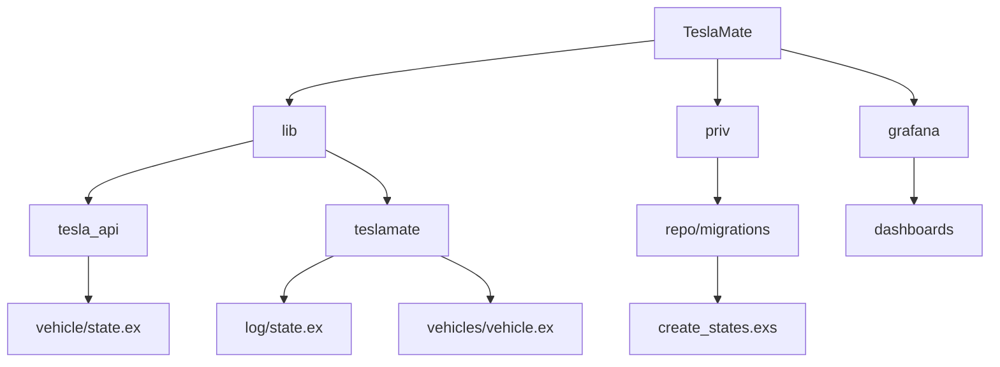
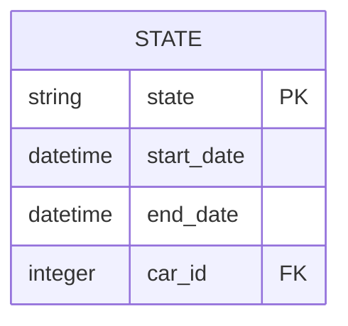
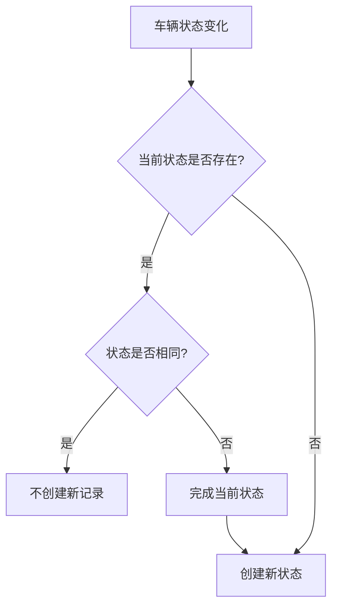
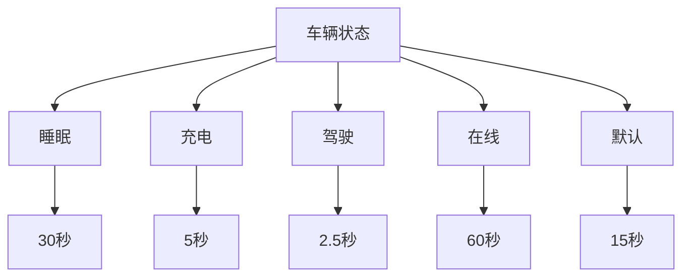
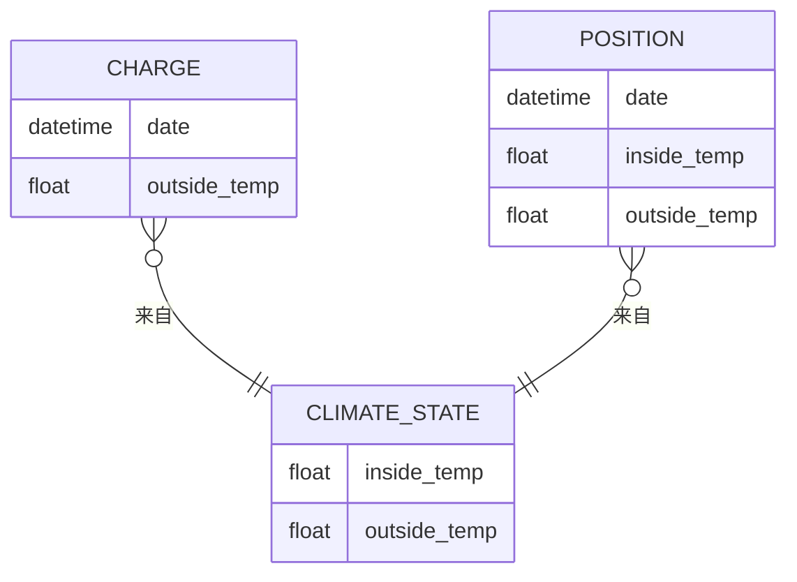
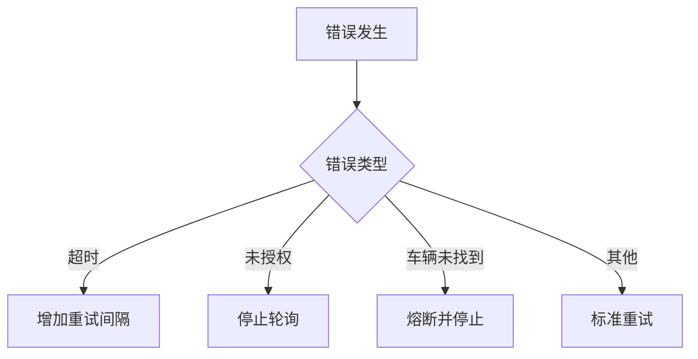
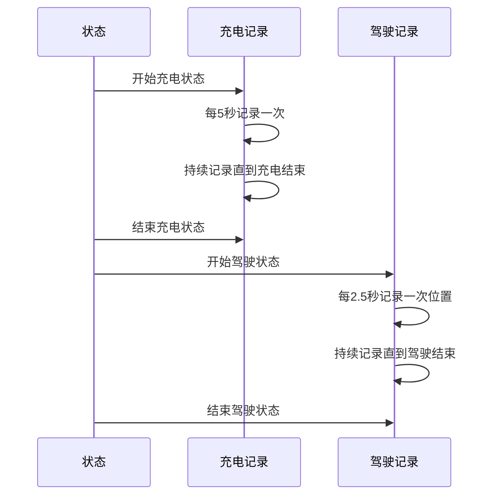

# 车辆状态模型

<cite>
**本文档引用的文件**  
- [state.ex](file://lib/tesla_api/vehicle/state.ex)
- [state.ex](file://lib/teslamate/log/state.ex)
- [vehicle.ex](file://lib/teslamate/vehicles/vehicle.ex)
- [create_states.exs](file://priv/repo/migrations/20190330180000_create_states.exs)
- [charge.ex](file://lib/teslamate/log/charge.ex)
- [summary.ex](file://lib/teslamate/vehicles/vehicle/summary.ex)
- [environment_variables.md](file://website/docs/configuration/environment_variables.md)
</cite>

## 目录
1. [项目结构](#项目结构)
2. [核心组件](#核心组件)
3. [状态数据模型](#状态数据模型)
4. [状态记录机制](#状态记录机制)
5. [采样策略与更新频率](#采样策略与更新频率)
6. [温度记录机制](#温度记录机制)
7. [数据存储与压缩](#数据存储与压缩)
8. [异常与缺失数据处理](#异常与缺失数据处理)
9. [时间序列关系](#时间序列关系)

## 项目结构

TeslaMate项目是一个用于跟踪和记录特斯拉车辆状态的系统，其核心功能围绕车辆状态数据的采集、存储和分析。项目采用Elixir语言开发，使用Ecto作为ORM框架与PostgreSQL数据库交互。主要目录包括`lib`（核心逻辑）、`priv/repo/migrations`（数据库迁移）、`grafana/dashboards`（可视化仪表板）等。

**Diagram sources**
- [lib/tesla_api/vehicle/state.ex](file://lib/tesla_api/vehicle/state.ex)
- [lib/teslamate/log/state.ex](file://lib/teslamate/log/state.ex)
- [lib/teslamate/vehicles/vehicle.ex](file://lib/teslamate/vehicles/vehicle.ex)
- [priv/repo/migrations/20190330180000_create_states.exs](file://priv/repo/migrations/20190330180000_create_states.exs)

**Section sources**
- [lib/tesla_api/vehicle/state.ex](file://lib/tesla_api/vehicle/state.ex)
- [lib/teslamate/log/state.ex](file://lib/teslamate/log/state.ex)
- [lib/teslamate/vehicles/vehicle.ex](file://lib/teslamate/vehicles/vehicle.ex)
- [priv/repo/migrations/20190330180000_create_states.exs](file://priv/repo/migrations/20190330180000_create_states.exs)

## 核心组件

车辆状态数据模型的核心组件包括车辆状态记录（State）、充电记录（Charge）和位置记录（Position）。这些组件通过Ecto Schema定义，与数据库表直接映射。车辆状态由`TeslaMate.Vehicles.Vehicle`模块管理，该模块使用GenStateMachine实现车辆状态机，处理车辆在不同状态（在线、离线、睡眠、驾驶、充电等）之间的转换。

**Section sources**
- [lib/teslamate/vehicles/vehicle.ex](file://lib/teslamate/vehicles/vehicle.ex)
- [lib/teslamate/log/state.ex](file://lib/teslamate/log/state.ex)
- [lib/teslamate/log/charge.ex](file://lib/teslamate/log/charge.ex)

## 状态数据模型

车辆状态数据模型的核心是`states`表，该表记录了车辆在不同状态下的持续时间。`states`表通过`create_states.exs`迁移文件创建，包含以下字段：
- `state`: 枚举类型，值为'online'、'offline'、'asleep'，表示车辆的当前状态。
- `start_date`: UTC日期时间，表示状态开始的时间。
- `end_date`: UTC日期时间，表示状态结束的时间，为空表示当前状态仍在持续。
- `car_id`: 外键，关联到`cars`表。

**Diagram sources**
- [priv/repo/migrations/20190330180000_create_states.exs](file://priv/repo/migrations/20190330180000_create_states.exs)

**Section sources**
- [priv/repo/migrations/20190330180000_create_states.exs](file://priv/repo/migrations/20190330180000_create_states.exs)
- [lib/teslamate/log/state.ex](file://lib/teslamate/log/state.ex)

## 状态记录机制

车辆状态的记录由`TeslaMate.Log.State`模块管理。当车辆状态发生变化时，系统会调用`start_state/3`函数开始一个新的状态记录。如果当前状态与新状态相同，则不创建新记录；如果状态不同，则先完成当前状态记录（设置`end_date`），然后创建新的状态记录。`get_current_state/1`函数用于获取车辆的当前状态（`end_date`为空的记录）。

**Diagram sources**
- [lib/teslamate/log/state.ex](file://lib/teslamate/log/state.ex)

**Section sources**
- [lib/teslamate/log/state.ex](file://lib/teslamate/log/state.ex)
- [lib/teslamate/log.ex](file://lib/teslamate/log.ex)

## 采样策略与更新频率

车辆状态的采样频率根据车辆的当前状态动态调整，由环境变量控制：
- `POLLING_ASLEEP_INTERVAL`: 车辆睡眠时的采样间隔，默认30秒。
- `POLLING_CHARGING_INTERVAL`: 车辆充电时的采样间隔，默认5秒。
- `POLLING_DRIVING_INTERVAL`: 车辆驾驶时的采样间隔，默认2.5秒。
- `POLLING_ONLINE_INTERVAL`: 车辆在线时的采样间隔，默认60秒。
- `POLLING_DEFAULT_INTERVAL`: 默认采样间隔，默认15秒。

**Diagram sources**
- [lib/teslamate/vehicles/vehicle.ex](file://lib/teslamate/vehicles/vehicle.ex)
- [website/docs/configuration/environment_variables.md](file://website/docs/configuration/environment_variables.md)

**Section sources**
- [lib/teslamate/vehicles/vehicle.ex](file://lib/teslamate/vehicles/vehicle.ex)
- [website/docs/configuration/environment_variables.md](file://website/docs/configuration/environment_variables.md)

## 温度记录机制

车辆内部温度（inside_temp）和外部温度（outside_temp）的记录与车辆状态和位置记录相关联。外部温度（outside_temp）来自车辆的气候状态（climate_state），在充电记录（charges表）和位置记录（positions表）中都有存储。内部温度（inside_temp）同样来自气候状态，存储在positions表中。`add_inside_temp.exs`迁移文件在positions表中添加了inside_temp字段。

**Diagram sources**
- [lib/tesla_api/vehicle/state.ex](file://lib/tesla_api/vehicle/state.ex)
- [lib/teslamate/log/charge.ex](file://lib/teslamate/log/charge.ex)
- [priv/repo/migrations/20190415103933_add_inside_temp.exs](file://priv/repo/migrations/20190415103933_add_inside_temp.exs)

**Section sources**
- [lib/tesla_api/vehicle/state.ex](file://lib/tesla_api/vehicle/state.ex)
- [lib/teslamate/log/charge.ex](file://lib/teslamate/log/charge.ex)
- [priv/repo/migrations/20190415103933_add_inside_temp.exs](file://priv/repo/migrations/20190415103933_add_inside_temp.exs)

## 数据存储与压缩

车辆状态数据的存储策略主要依赖于数据库的定期采样和状态持续时间记录。系统不采用传统的时间序列数据库压缩算法，而是通过记录状态的开始和结束时间来隐式压缩数据。对于充电过程，系统在`charges`表中记录每个充电事件的详细信息，包括电池电量（battery_level）、充电能量（charge_energy_added）等，这些数据在充电过程中以较高频率（每5秒）采样。

**Section sources**
- [lib/teslamate/log/charge.ex](file://lib/teslamate/log/charge.ex)
- [lib/teslamate/vehicles/vehicle.ex](file://lib/teslamate/vehicles/vehicle.ex)

## 异常与缺失数据处理

系统通过多种机制处理异常和缺失数据：
1. **状态机容错**：在`handle_event/4`中，对各种错误（如超时、未授权）进行处理，并根据当前状态调整重试间隔。
2. **数据完整性**：通过Ecto的changeset验证确保数据完整性，如`start_date`不能为空。
3. **熔断机制**：使用`:fuse`库实现熔断器，防止在API错误或车辆未找到时无限重试。
4. **数据恢复**：在车辆从离线或睡眠状态恢复时，尝试恢复最后已知的值。

**Diagram sources**
- [lib/teslamate/vehicles/vehicle.ex](file://lib/teslamate/vehicles/vehicle.ex)

**Section sources**
- [lib/teslamate/vehicles/vehicle.ex](file://lib/teslamate/vehicles/vehicle.ex)

## 时间序列关系

车辆状态与充电过程、驾驶记录之间存在明确的时间序列关系。状态记录（State）定义了车辆宏观状态的持续时间，而充电记录（Charge）和驾驶记录（Drive）则在这些状态内提供更细粒度的数据。例如，在`charging`状态期间，系统会创建一个`ChargingProcess`，并在此过程中以5秒间隔记录多个`Charge`记录。同样，在`driving`状态期间，系统会创建`Drive`记录，并在其中记录多个`Position`记录。

**Diagram sources**
- [lib/teslamate/vehicles/vehicle.ex](file://lib/teslamate/vehicles/vehicle.ex)
- [lib/teslamate/log/charge.ex](file://lib/teslamate/log/charge.ex)
- [lib/teslamate/log/state.ex](file://lib/teslamate/log/state.ex)

**Section sources**
- [lib/teslamate/vehicles/vehicle.ex](file://lib/teslamate/vehicles/vehicle.ex)
- [lib/teslamate/log/charge.ex](file://lib/teslamate/log/charge.ex)
- [lib/teslamate/log/state.ex](file://lib/teslamate/log/state.ex)