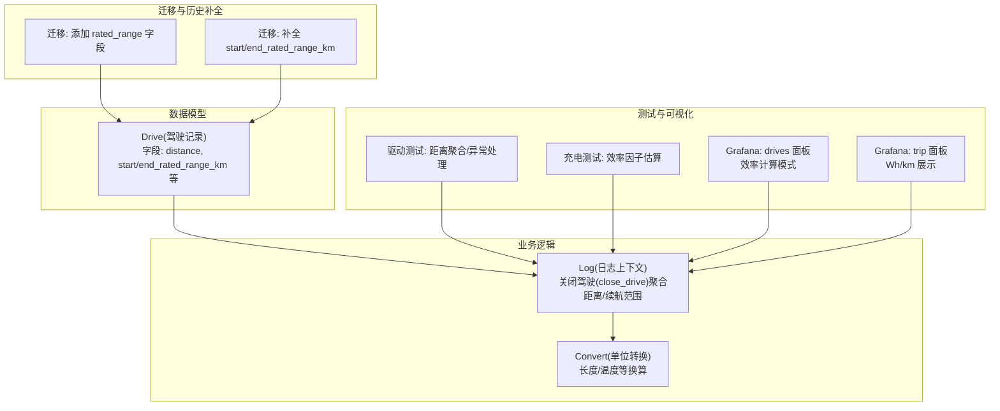
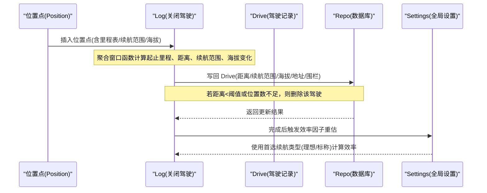
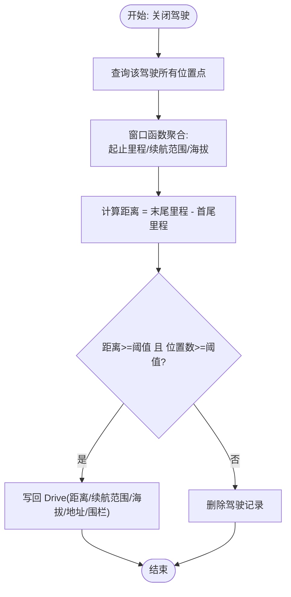
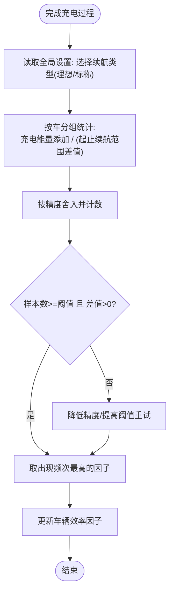
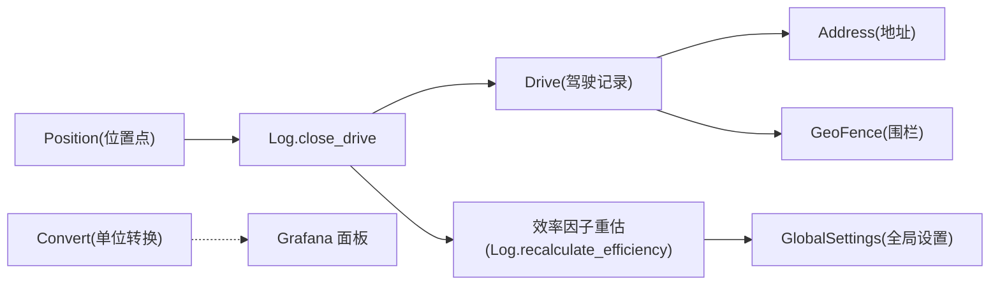

# 行驶距离与能效模型

<cite>
**本文引用的文件**
- [lib/teslamate/log/drive.ex](file://lib/teslamate/log/drive.ex)
- [lib/teslamate/log.ex](file://lib/teslamate/log.ex)
- [lib/teslamate/convert.ex](file://lib/teslamate/convert.ex)
- [priv/repo/migrations/20190913175011_add_rated_range_to_drives.exs](file://priv/repo/migrations/20190913175011_add_rated_range_to_drives.exs)
- [priv/repo/migrations/20190913175543_set_start_and_end_rated_range_km.exs](file://priv/repo/migrations/20190913175543_set_start_and_end_rated_range_km.exs)
- [test/teslamate/log/log_drive_test.exs](file://test/teslamate/log/log_drive_test.exs)
- [test/teslamate/log/log_charging_test.exs](file://test/teslamate/log/log_charging_test.exs)
- [grafana/dashboards/drives.json](file://grafana/dashboards/drives.json)
- [grafana/dashboards/trip.json](file://grafana/dashboards/trip.json)
- [lib/teslamate_web/controllers/drive_controller.ex](file://lib/teslamate_web/controllers/drive_controller.ex)
</cite>

## 目录
1. [引言](#引言)
2. [项目结构](#项目结构)
3. [核心组件](#核心组件)
4. [架构总览](#架构总览)
5. [详细组件分析](#详细组件分析)
6. [依赖关系分析](#依赖关系分析)
7. [性能考量](#性能考量)
8. [故障排查指南](#故障排查指南)
9. [结论](#结论)
10. [附录](#附录)

## 引言
本文件聚焦于驾驶记录中的“距离”和“能效”数据模型，系统性解析以下关键问题：
- distance 字段的单位与精度：如何从里程表读数差值计算并进行精度控制。
- efficiency 字段的计算方式：基于充电过程的能量添加与理想/标称续航范围差值的比率算法。
- start_rated_range_km 和 end_rated_range_km 的来源与在续航评估中的作用。
- 驾驶距离准确性验证：通过里程表差值、位置点数量阈值与删除无效驾驶记录的机制。
- 异常数据检测与处理：无效驾驶记录的判定、删除策略与边界条件。
- 实际案例：能效数据在驾驶行为分析中的应用示例。

## 项目结构
围绕驾驶记录与能效的核心代码主要分布在以下模块：
- 数据模型定义：drives 表与 Drive 结构体
- 距离与续航范围聚合：Log 模块中关闭驾驶流程时的聚合逻辑
- 单位转换工具：Convert 模块
- 迁移脚本：为 drives 表增加 rated_range 字段及补全历史数据
- 测试用例：覆盖距离聚合、异常数据处理与效率因子估算
- 可视化配置：Grafana 面板对距离、能耗与效率的展示

图表来源
- [lib/teslamate/log/drive.ex](file://lib/teslamate/log/drive.ex#L1-L79)
- [lib/teslamate/log.ex](file://lib/teslamate/log.ex#L236-L375)
- [lib/teslamate/convert.ex](file://lib/teslamate/convert.ex#L1-L53)
- [priv/repo/migrations/20190913175011_add_rated_range_to_drives.exs](file://priv/repo/migrations/20190913175011_add_rated_range_to_drives.exs#L1-L29)
- [priv/repo/migrations/20190913175543_set_start_and_end_rated_range_km.exs](file://priv/repo/migrations/20190913175543_set_start_rated_range_km.exs#L66-L100)
- [test/teslamate/log/log_drive_test.exs](file://test/teslamate/log/log_drive_test.exs#L1-L200)
- [test/teslamate/log/log_charging_test.exs](file://test/teslamate/log/log_charging_test.exs#L607-L735)
- [grafana/dashboards/drives.json](file://grafana/dashboards/drives.json#L1602-L1625)
- [grafana/dashboards/trip.json](file://grafana/dashboards/trip.json#L1566-L1621)

章节来源
- [lib/teslamate/log/drive.ex](file://lib/teslamate/log/drive.ex#L1-L79)
- [lib/teslamate/log.ex](file://lib/teslamate/log.ex#L236-L375)
- [lib/teslamate/convert.ex](file://lib/teslamate/convert.ex#L1-L53)
- [priv/repo/migrations/20190913175011_add_rated_range_to_drives.exs](file://priv/repo/migrations/20190913175011_add_rated_range_to_drives.exs#L1-L29)
- [priv/repo/migrations/20190913175543_set_start_and_end_rated_range_km.exs](file://priv/repo/migrations/20190913175543_set_start_and_end_rated_range_km.exs#L66-L100)
- [test/teslamate/log/log_drive_test.exs](file://test/teslamate/log/log_drive_test.exs#L1-L200)
- [test/teslamate/log/log_charging_test.exs](file://test/teslamate/log/log_charging_test.exs#L607-L735)
- [grafana/dashboards/drives.json](file://grafana/dashboards/drives.json#L1602-L1625)
- [grafana/dashboards/trip.json](file://grafana/dashboards/trip.json#L1566-L1621)

## 核心组件
- Drive 数据模型：包含驾驶起止时间、平均内外温、最高速度、功率极值、起止里程、行驶距离、时长、爬升/下降、起止理想/标称续航范围以及关联的起止地址/地理围栏/位置等。
- Log.close_drive：在结束一次驾驶时，从该驾驶的所有位置点聚合统计，计算距离、续航范围、海拔变化等，并写回 Drive 记录；若距离过小或位置不足则删除该驾驶记录。
- Convert：提供长度单位换算（英里/公里）、摄氏/华氏等常用转换函数。
- 迁移脚本：为 drives 表新增 rated_range 字段并补全历史驾驶的起止标称续航范围。
- Grafana 面板：支持按“按距离”或“坡度调整”两种方式计算效率，用于驾驶行为分析与能耗对比。

章节来源
- [lib/teslamate/log/drive.ex](file://lib/teslamate/log/drive.ex#L1-L79)
- [lib/teslamate/log.ex](file://lib/teslamate/log.ex#L236-L375)
- [lib/teslamate/convert.ex](file://lib/teslamate/convert.ex#L1-L53)
- [priv/repo/migrations/20190913175011_add_rated_range_to_drives.exs](file://priv/repo/migrations/20190913175011_add_rated_range_to_drives.exs#L1-L29)
- [priv/repo/migrations/20190913175543_set_start_and_end_rated_range_km.exs](file://priv/repo/migrations/20190913175543_set_start_and_end_rated_range_km.exs#L66-L100)
- [grafana/dashboards/drives.json](file://grafana/dashboards/drives.json#L1602-L1625)

## 架构总览
下图展示了从位置点到驾驶记录的聚合路径，以及效率因子估算与可视化的关系。

图表来源
- [lib/teslamate/log.ex](file://lib/teslamate/log.ex#L236-L375)
- [lib/teslamate/log.ex](file://lib/teslamate/log.ex#L632-L675)
- [grafana/dashboards/drives.json](file://grafana/dashboards/drives.json#L1602-L1625)

## 详细组件分析

### 距离字段的单位与精度控制
- 单位来源：Log.close_drive 中使用窗口函数对同一驾驶内的位置点进行聚合，其中距离由“末尾里程表读数 - 首尾里程表读数”得到，字段类型为浮点型。
- 精度控制：测试用例显示距离字段保留多位小数，且在 UI 展示时可按面板配置进行舍入与单位切换（例如以公里为单位）。
- 验证机制：当位置点数量小于阈值或计算出的距离小于最小阈值时，系统会删除该驾驶记录，避免无效数据进入统计。

图表来源
- [lib/teslamate/log.ex](file://lib/teslamate/log.ex#L236-L375)
- [test/teslamate/log/log_drive_test.exs](file://test/teslamate/log/log_drive_test.exs#L157-L200)

章节来源
- [lib/teslamate/log.ex](file://lib/teslamate/log.ex#L236-L375)
- [test/teslamate/log/log_drive_test.exs](file://test/teslamate/log/log_drive_test.exs#L130-L200)

### 能效字段的计算方式
- 计算依据：效率因子通过“充电能量添加 / (起止续航范围差值)”估算，优先使用全局设置中指定的续航类型（理想或标称），并按不同精度与最低样本数阈值进行筛选与取众数。
- 精度与阈值：系统尝试不同精度与样本阈值组合，选择出现次数最多且满足阈值的因子作为最终效率值。
- 适用场景：效率因子可用于驾驶行为分析，如比较不同驾驶模式下的能耗表现、识别高能耗工况等。

图表来源
- [lib/teslamate/log.ex](file://lib/teslamate/log.ex#L632-L675)
- [test/teslamate/log/log_charging_test.exs](file://test/teslamate/log/log_charging_test.exs#L607-L735)
- [grafana/dashboards/drives.json](file://grafana/dashboards/drives.json#L1602-L1625)

章节来源
- [lib/teslamate/log.ex](file://lib/teslamate/log.ex#L632-L675)
- [test/teslamate/log/log_charging_test.exs](file://test/teslamate/log/log_charging_test.exs#L607-L735)
- [grafana/dashboards/drives.json](file://grafana/dashboards/drives.json#L1602-L1625)

### start_rated_range_km 与 end_rated_range_km 的来源与作用
- 来源：迁移脚本将 positions 表中的电池续航字段重命名为 rated_battery_range_km，并在 drives 表新增 start/end_rated_range_km 字段；随后通过扫描每个驾驶的首尾位置，补全其起止标称续航范围。
- 作用：用于驾驶期间的续航评估与能耗分析，配合效率因子计算，支撑“坡度调整”等高级效率计算模式。

章节来源
- [priv/repo/migrations/20190913175011_add_rated_range_to_drives.exs](file://priv/repo/migrations/20190913175011_add_rated_range_to_drives.exs#L1-L29)
- [priv/repo/migrations/20190913175543_set_start_and_end_rated_range_km.exs](file://priv/repo/migrations/20190913175543_set_start_and_end_rated_range_km.exs#L66-L100)
- [lib/teslamate/log.ex](file://lib/teslamate/log.ex#L284-L343)

### 驾驶距离准确性验证与异常数据处理
- 准确性验证：Log.close_drive 在聚合完成后检查“位置点数量”和“距离阈值”，仅当两者均满足时才保留驾驶记录；否则删除该驾驶及其位置点。
- 异常处理：测试覆盖了单点、零里程、无移动等异常情形，确保系统不会产生无效驾驶记录。
- 地址与围栏：在聚合过程中可选地根据起止位置查找并链接最近的地址与地理围栏，提升数据可用性。

章节来源
- [lib/teslamate/log.ex](file://lib/teslamate/log.ex#L236-L375)
- [test/teslamate/log/log_drive_test.exs](file://test/teslamate/log/log_drive_test.exs#L157-L200)

### 实际案例：能效数据在驾驶行为分析中的应用
- 案例一：对比不同驾驶模式下的效率因子，识别高能耗工况（如频繁急加速/制动、长时间怠速等），结合海拔变化与速度分布进行归因。
- 案例二：评估不同路线的能耗差异，结合“坡度调整”效率计算模式，剔除地形因素影响，更公平地比较驾驶风格。
- 案例三：结合 Grafana 面板，按周/月维度汇总“平均能耗(kWh/100km 或 Wh/km)”与“平均效率因子”，形成趋势报告，辅助优化驾驶行为。

章节来源
- [grafana/dashboards/drives.json](file://grafana/dashboards/drives.json#L1602-L1625)
- [grafana/dashboards/trip.json](file://grafana/dashboards/trip.json#L1566-L1621)
- [lib/teslamate/log.ex](file://lib/teslamate/log.ex#L632-L675)

## 依赖关系分析
- Drive 模型依赖位置点与地址/围栏信息，用于丰富驾驶记录的上下文。
- Log.close_drive 依赖位置点聚合与地址/围栏查找，同时在完成后触发效率因子重估。
- Convert 提供单位换算能力，便于在不同界面或导出场景下统一单位。
- 迁移脚本为历史数据补全提供了基础，确保后续聚合与分析的完整性。

图表来源
- [lib/teslamate/log.ex](file://lib/teslamate/log.ex#L236-L375)
- [lib/teslamate/log.ex](file://lib/teslamate/log.ex#L632-L675)
- [lib/teslamate/convert.ex](file://lib/teslamate/convert.ex#L1-L53)
- [grafana/dashboards/drives.json](file://grafana/dashboards/drives.json#L1602-L1625)

章节来源
- [lib/teslamate/log.ex](file://lib/teslamate/log.ex#L236-L375)
- [lib/teslamate/log.ex](file://lib/teslamate/log.ex#L632-L675)
- [lib/teslamate/convert.ex](file://lib/teslamate/convert.ex#L1-L53)
- [grafana/dashboards/drives.json](file://grafana/dashboards/drives.json#L1602-L1625)

## 性能考量
- 聚合窗口函数：Log.close_drive 使用窗口函数一次性聚合，避免多次扫描，减少 IO 压力。
- 分页与流式处理：历史补全采用事务流式处理，避免一次性加载大量记录造成内存压力。
- 精度与阈值：效率因子估算采用多轮精度与阈值尝试，平衡准确度与稳定性。
- 可视化：Grafana 面板通过字段计算与单位配置，减少前端复杂逻辑，提升渲染性能。

[本节为通用指导，不直接分析具体文件]

## 故障排查指南
- 驾驶记录被删除：检查位置点数量是否低于阈值，或距离是否小于最小阈值。
- 距离异常为 0：确认里程表读数是否一致或缺失，以及是否存在短时间内的重复点。
- 效率因子未更新：确认充电过程是否满足时长、电量上限与能量添加等条件，以及首选续航类型设置是否正确。
- 导出/GPX：可通过控制器接口导出驾驶轨迹，便于外部工具进一步分析。

章节来源
- [lib/teslamate/log.ex](file://lib/teslamate/log.ex#L236-L375)
- [test/teslamate/log/log_drive_test.exs](file://test/teslamate/log/log_drive_test.exs#L157-L200)
- [lib/teslamate_web/controllers/drive_controller.ex](file://lib/teslamate_web/controllers/drive_controller.ex#L1-L31)

## 结论
本文件系统梳理了驾驶记录中“距离”与“能效”的数据模型与实现细节，明确了：
- distance 字段由里程表差值计算，具备严格的阈值与数量验证，确保数据质量。
- efficiency 字段通过充电过程的能量添加与续航范围差值的比率估算，并支持多种精度与阈值策略。
- start_rated_range_km 与 end_rated_range_km 来源于位置点的标称续航范围，用于续航评估与效率分析。
- 系统通过删除无效驾驶记录与多轮校验，有效提升数据可靠性。
- Grafana 面板与单位转换工具为能效数据的可视化与跨单位展示提供了支撑。

[本节为总结，不直接分析具体文件]

## 附录
- 单位转换参考：长度单位换算（英里/公里）、温度换算（摄氏/华氏）等。
- 迁移脚本参考：为 drives 表新增 rated_range 字段并补全历史数据。
- 可视化参考：Grafana 面板对效率计算模式与能耗单位的支持。

章节来源
- [lib/teslamate/convert.ex](file://lib/teslamate/convert.ex#L1-L53)
- [priv/repo/migrations/20190913175011_add_rated_range_to_drives.exs](file://priv/repo/migrations/20190913175011_add_rated_range_to_drives.exs#L1-L29)
- [priv/repo/migrations/20190913175543_set_start_and_end_rated_range_km.exs](file://priv/repo/migrations/20190913175543_set_start_and_end_rated_range_km.exs#L66-L100)
- [grafana/dashboards/drives.json](file://grafana/dashboards/drives.json#L1602-L1625)
- [grafana/dashboards/trip.json](file://grafana/dashboards/trip.json#L1566-L1621)