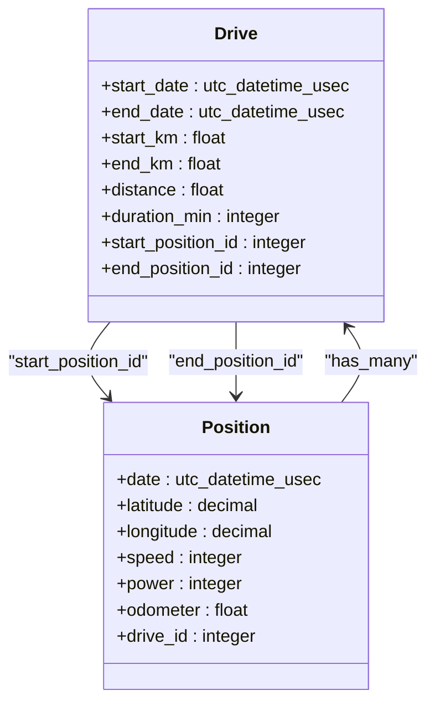

# 驾驶与位置数据关联模型

<cite>
**本文档引用文件**  
- [drive.ex](file://lib/teslamate/log/drive.ex)
- [position.ex](file://lib/teslamate/log/position.ex)
- [drive_controller.ex](file://lib/teslamate_web/controllers/drive_controller.ex)
- [20191003130650_add_start_and_end_position_to_drives.exs](file://priv/repo/migrations/20191003130650_add_start_and_end_position_to_drives.exs)
- [20200203120311_cascade_delete.exs](file://priv/repo/migrations/20200203120311_cascade_delete.exs)
- [20230417225712_composite_index_to_position.exs](file://priv/repo/migrations/20230417225712_composite_index_to_position.exs)
- [20240915193446_composite_index_with_predicate_to_position.exs](file://priv/repo/migrations/20240915193446_composite_index_with_predicate_to_position.exs)
- [log.ex](file://lib/teslamate/log.ex)
</cite>

## 目录
1. [引言](#引言)
2. [驾驶与位置数据关联机制](#驾驶与位置数据关联机制)
3. [外键设计与级联删除策略](#外键设计与级联删除策略)
4. [复合索引性能优化](#复合索引性能优化)
5. [Ecto预加载与分页查询优化](#ecto预加载与分页查询优化)
6. [结论](#结论)

## 引言
本文档详细阐述TeslaMate系统中驾驶记录与位置数据之间的关联机制。重点分析`start_position_id`和`end_position_id`外键的设计原理及其在轨迹重建中的作用，探讨`positions`表中`drive_id`外键的级联删除策略（nilify_all）对数据完整性的影响，并分析复合索引在连接查询中的性能优势。同时，结合代码示例展示如何通过Ecto预加载关联位置数据，并讨论大数据量下的分页查询优化策略。

## 驾驶与位置数据关联机制

TeslaMate系统通过精心设计的数据库模式实现了驾驶记录与位置数据的高效关联。核心机制体现在`drives`表与`positions`表之间的双向关系设计。

在`drives`表中，通过`start_position_id`和`end_position_id`两个外键字段，分别指向`positions`表中的起始和结束位置记录。这种设计使得每个驾驶记录都能精确地关联到其行程的起点和终点位置，为轨迹重建提供了关键的锚点数据。



**图示来源**  
- [drive.ex](file://lib/teslamate/log/drive.ex#L8-L39)
- [position.ex](file://lib/teslamate/log/position.ex#L7-L39)

当一个驾驶会话结束时，系统会执行复杂的查询操作来填充驾驶记录的完整信息。通过窗口函数（window functions）计算行程的统计信息，如平均温度、最高速度、最大功率等，并确定起始和结束位置的ID。这一过程在`log.ex`文件的`close_drive/2`函数中实现，确保了驾驶记录的完整性和准确性。

**本节来源**  
- [drive.ex](file://lib/teslamate/log/drive.ex#L8-L39)
- [log.ex](file://lib/teslamate/log.ex#L243-L375)

## 外键设计与级联删除策略

### start_position_id 和 end_position_id 外键设计

`start_position_id`和`end_position_id`外键的设计遵循了数据完整性与查询效率的平衡原则。这两个字段在`drives`表中作为可选外键存在，允许为空值，这为数据的灵活性提供了保障。

在数据库迁移文件`20191003130650_add_start_and_end_position_to_drives.exs`中，可以看到这两个字段的创建过程：

```elixir
alter table(:drives) do
  add(:start_position_id, references(:positions))
  add(:end_position_id, references(:positions))
end
```

这种设计的关键优势在于：
1. **轨迹重建效率**：通过直接存储起止位置ID，避免了每次查询时都需要通过日期范围查找最接近的时间点位置记录，大大提高了查询性能。
2. **数据一致性**：即使原始位置数据后续发生变化，起止位置的引用仍然保持不变，确保了驾驶记录的历史准确性。
3. **灵活性**：允许为空的设计考虑到了数据采集可能不完整的情况，如驾驶开始时位置数据尚未记录。

### drive_id 外键的级联删除策略

`positions`表中的`drive_id`外键采用了`nilify_all`级联删除策略，这一设计对数据完整性有着深远的影响。在`20200203120311_cascade_delete.exs`迁移文件中，可以看到这一策略的实现：

```elixir
alter table(:positions) do
  modify(:drive_id, references(:drives, on_delete: :nilify_all))
end
```

`nilify_all`策略的具体含义是：当一个驾驶记录被删除时，所有关联的位置记录不会被删除，而是将其`drive_id`字段设置为`NULL`。这种设计带来了以下优势：

1. **位置数据持久性**：位置数据作为原始采集数据，具有独立的价值。即使某个驾驶记录被删除（如误识别的驾驶会话），位置数据仍然保留，可用于后续分析或重新关联。
2. **数据完整性保护**：避免了级联删除可能导致的大规模数据丢失风险，特别是在处理历史数据修正时。
3. **灵活性**：被"释放"的位置数据可以被重新关联到其他驾驶记录，或用于独立的地理空间分析。

这种策略体现了系统设计中对原始数据价值的尊重，将驾驶记录视为对位置数据的"解释"或"分组"，而非其生存周期的控制者。

**本节来源**  
- [20191003130650_add_start_and_end_position_to_drives.exs](file://priv/repo/migrations/20191003130650_add_start_and_end_position_to_drives.exs#L5-L7)
- [20200203120311_cascade_delete.exs](file://priv/repo/migrations/20200203120311_cascade_delete.exs#L70-L72)

## 复合索引性能优化

### 复合索引的设计原理

TeslaMate系统通过精心设计的复合索引显著提升了连接查询的性能。复合索引利用了数据库的B-tree结构特性，将多个字段组合成一个有序的索引键，从而支持更高效的范围查询和等值查询。

在`20230417225712_composite_index_to_position.exs`迁移文件中，创建了基于`drive_id`和`date`的复合索引：

```elixir
create index(:positions, [:drive_id, :date])
```

这一设计的原理在于：
1. **查询模式匹配**：最常见的查询是获取某个驾驶会话的所有位置数据，这需要按`drive_id`过滤，并通常按时间顺序排列。
2. **索引覆盖**：复合索引不仅加速了过滤，还天然地按时间排序，避免了额外的排序操作。
3. **索引选择性**：`drive_id`提供了较高的选择性，而`date`字段在`drive_id`确定后形成了有序序列。

### 基于car_id和date的联合索引

更进一步，系统在`20240915193446_composite_index_with_predicate_to_position.exs`中创建了带条件的复合索引：

```elixir
create index(:positions, [:car_id, :date, "(ideal_battery_range_km IS NOT NULL)"],
             where: "ideal_battery_range_km IS NOT NULL")
```

这个索引的设计体现了高级的性能优化思想：
1. **部分索引（Partial Index）**：只索引`ideal_battery_range_km`不为空的记录，减小了索引大小，提高了缓存效率。
2. **多字段组合**：`car_id`和`date`的组合完美匹配了按车辆和时间范围查询的需求。
3. **查询优化**：当查询某辆车在某段时间内的有效位置数据时，数据库可以直接使用此索引来快速定位，避免了全表扫描和额外的过滤操作。

这种索引设计特别适用于驾驶-位置关联查询，因为：
- 大多数分析查询都是按车辆进行的
- 时间范围是常见的过滤条件
- 电池续航数据是重要的分析维度

通过这种复合索引，系统能够高效地处理复杂的时空查询，为驾驶行为分析、能耗统计等功能提供了坚实的性能基础。

**本节来源**  
- [20230417225712_composite_index_to_position.exs](file://priv/repo/migrations/20230417225712_composite_index_to_position.exs#L5-L6)
- [20240915193446_composite_index_with_predicate_to_position.exs](file://priv/repo/migrations/20240915193446_composite_index_with_predicate_to_position.exs#L5-L7)

## Ecto预加载与分页查询优化

### Ecto预加载关联数据

在TeslaMate的Web控制器中，通过Ecto的强大预加载功能高效地获取关联的位置数据。以`drive_controller.ex`中的GPX导出功能为例：

```elixir
def gpx(conn, %{"id" => id}) do
  drive =
    Drive
    |> Repo.get(id)
    |> Repo.preload(positions: from(p in Position, order_by: p.date))
```

这一代码展示了Ecto预加载的核心优势：
1. **减少查询次数**：通过一次预加载，避免了N+1查询问题，将多个查询合并为一个高效的JOIN查询。
2. **灵活的排序**：在预加载时直接指定`order_by: p.date`，确保位置数据按时间顺序排列，满足轨迹重建的需求。
3. **声明式语法**：使用Ecto的查询语法，代码清晰易懂，与数据库操作解耦。

预加载机制在内部生成了高效的SQL查询，类似于：
```sql
SELECT * FROM drives WHERE id = ?
JOIN positions ON positions.drive_id = drives.id 
ORDER BY positions.date
```

### 大数据量下的分页查询优化

对于包含大量位置数据的长距离驾驶记录，直接加载所有数据可能导致内存溢出和性能下降。系统采用了多种优化策略来应对这一挑战：

1. **流式处理**：在`log.ex`的`get_positions_without_elevation/2`函数中，使用`Repo.stream()`来处理大量数据，避免一次性加载到内存中。

2. **分页查询**：通过`limit`和`offset`（或游标分页）来分批获取数据。虽然在提供的代码片段中未直接展示，但这是处理大数据集的标准做法。

3. **增量加载**：前端应用可以实现懒加载，只在用户滚动到特定位置时才请求对应的数据块。

4. **数据聚合**：对于不需要原始精度的分析场景，可以预先计算并存储聚合数据（如每分钟的平均值），大幅减少数据量。

5. **索引优化**：如前所述，复合索引确保了分页查询的高效性，即使在大数据集上也能快速定位。

这些优化策略共同确保了系统在处理包含数千个位置点的长距离驾驶记录时仍能保持良好的性能和响应速度。

**本节来源**  
- [drive_controller.ex](file://lib/teslamate_web/controllers/drive_controller.ex#L10-L14)
- [log.ex](file://lib/teslamate/log.ex#L173-L226)

## 结论
TeslaMate系统通过精心设计的数据库模式和查询优化策略，实现了驾驶记录与位置数据的高效关联。`start_position_id`和`end_position_id`外键的设计为轨迹重建提供了精确的锚点，而`nilify_all`级联删除策略则保护了原始位置数据的完整性。复合索引的使用显著提升了连接查询的性能，特别是基于`car_id`和`date`的联合索引，为时空查询提供了强大的支持。通过Ecto的预加载功能和分页查询优化，系统能够在大数据量下保持高效的数据访问性能。这些设计决策共同构成了一个既保证数据完整性又具备高性能的驾驶数据分析系统。