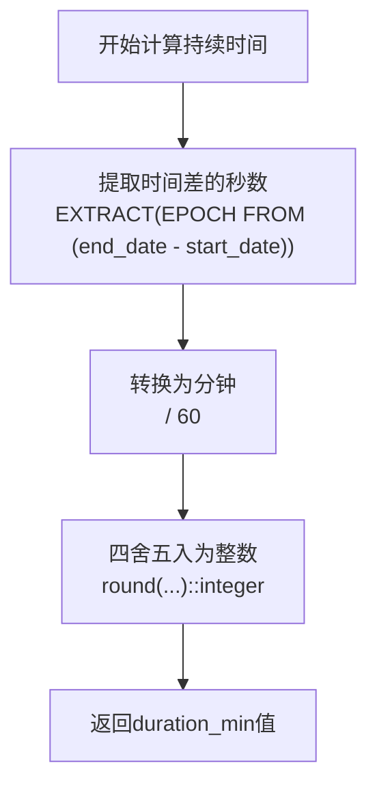
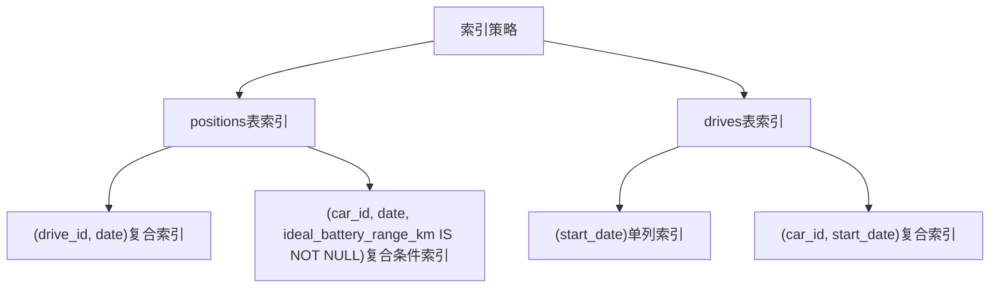
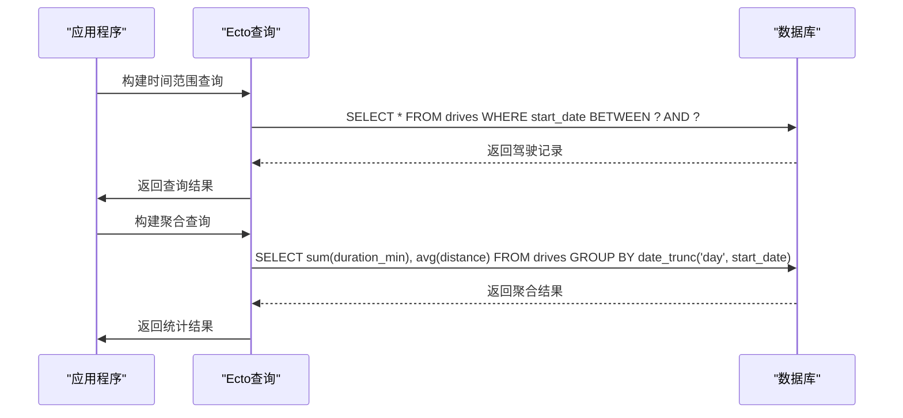
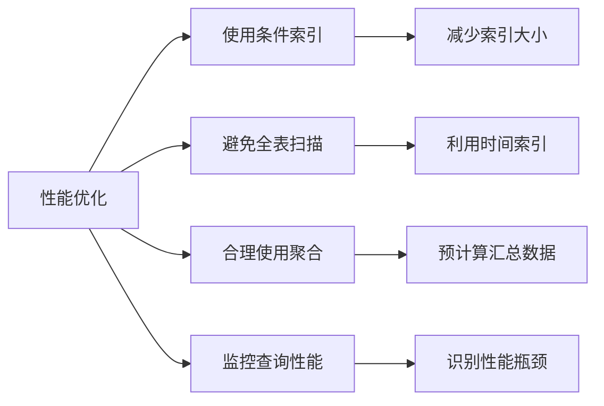

# 驾驶时间与持续时间模型

<cite>
**本文档引用的文件**
- [drive.ex](file://lib/teslamate/log/drive.ex)
- [log.ex](file://lib/teslamate/log.ex)
- [position.ex](file://lib/teslamate/log/position.ex)
- [20191020130234_increase_datetime_precision.exs](file://priv/repo/migrations/20191020130234_increase_datetime_precision.exs)
- [20190416125429_add_indexes_on_dates.exs](file://priv/repo/migrations/20190416125429_add_indexes_on_dates.exs)
- [20230417225712_composite_index_to_position.exs](file://priv/repo/migrations/20230417225712_composite_index_to_position.exs)
- [20240915193446_composite_index_with_predicate_to_position.exs](file://priv/repo/migrations/20240915193446_composite_index_with_predicate_to_position.exs)
- [custom_expressions.ex](file://lib/teslamate/custom_expressions.ex)
- [drives.json](file://grafana/dashboards/drives.json)
- [statistics.json](file://grafana/dashboards/statistics.json)
</cite>

## 目录
1. [简介](#简介)
2. [时间字段存储格式与精度](#时间字段存储格式与精度)
3. [持续时间计算逻辑](#持续时间计算逻辑)
4. [数据库索引策略](#数据库索引策略)
5. [时间范围查询与聚合](#时间范围查询与聚合)
6. [性能优化建议](#性能优化建议)

## 简介
本文档详细说明TeslaMate系统中驾驶时间数据模型的设计与实现，重点分析`start_date`和`end_date`字段的存储格式与精度处理机制，`duration_min`字段的计算逻辑，以及相关的数据库索引策略和查询优化方法。

## 时间字段存储格式与精度

驾驶记录中的时间字段采用高精度时间戳存储，确保时间计算的准确性。`start_date`和`end_date`字段在数据库中定义为`:utc_datetime_usec`类型，支持微秒级精度。

```mermaid
erDiagram
DRIVES {
:utc_datetime_usec start_date
:utc_datetime_usec end_date
:integer duration_min
}
POSITIONS {
:utc_datetime_usec date
:float odometer
}
DRIVES ||--o{ POSITIONS : "包含"
```

**图源**
- [drive.ex](file://lib/teslamate/log/drive.ex#L8-L10)
- [position.ex](file://lib/teslamate/log/position.ex#L8)
- [20191020130234_increase_datetime_precision.exs](file://priv/repo/migrations/20191020130234_increase_datetime_precision.exs#L10-L13)

**本节源**
- [drive.ex](file://lib/teslamate/log/drive.ex#L8-L10)
- [20191020130234_increase_datetime_precision.exs](file://priv/repo/migrations/20191020130234_increase_datetime_precision.exs#L10-L13)

## 持续时间计算逻辑

`duration_min`字段表示驾驶持续时间（以分钟为单位），其值通过计算驾驶开始和结束时间之间的差值得到。系统使用PostgreSQL的`EXTRACT(EPOCH FROM ...)`函数计算时间差的秒数，然后转换为分钟并四舍五入为整数。



**图源**
- [log.ex](file://lib/teslamate/log.ex#L262-L267)
- [custom_expressions.ex](file://lib/teslamate/custom_expressions.ex#L14-L23)

**本节源**
- [log.ex](file://lib/teslamate/log.ex#L262-L267)
- [custom_expressions.ex](file://lib/teslamate/custom_expressions.ex#L14-L23)

## 数据库索引策略

为优化按时间段检索驾驶记录的性能，系统在相关表上建立了多个索引。这些索引特别针对时间范围查询进行了优化，确保在大数据量下的查询效率。



**图源**
- [20230417225712_composite_index_to_position.exs](file://priv/repo/migrations/20230417225712_composite_index_to_position.exs#L5)
- [20240915193446_composite_index_with_predicate_to_position.exs](file://priv/repo/migrations/20240915193446_composite_index_with_predicate_to_position.exs#L5-L7)
- [20190416125429_add_indexes_on_dates.exs](file://priv/repo/migrations/20190416125429_add_indexes_on_dates.exs#L5)

**本节源**
- [20230417225712_composite_index_to_position.exs](file://priv/repo/migrations/20230417225712_composite_index_to_position.exs#L5)
- [20240915193446_composite_index_with_predicate_to_position.exs](file://priv/repo/migrations/20240915193446_composite_index_with_predicate_to_position.exs#L5-L7)
- [20190416125429_add_indexes_on_dates.exs](file://priv/repo/migrations/20190416125429_add_indexes_on_dates.exs#L5)

## 时间范围查询与聚合

在Ecto中进行时间范围查询时，系统使用`where`子句结合时间比较操作符来筛选特定时间段内的驾驶记录。对于聚合操作，使用`group_by`和`sum`等函数对数据进行统计分析。



**图源**
- [statistics.json](file://grafana/dashboards/statistics.json#L653-L654)
- [drives.json](file://grafana/dashboards/drives.json#L558-L607)

**本节源**
- [statistics.json](file://grafana/dashboards/statistics.json#L653-L654)
- [drives.json](file://grafana/dashboards/drives.json#L558-L607)

## 性能优化建议

为确保系统在处理大量驾驶数据时的性能，建议采用以下优化策略：

1. **使用条件索引**：利用`ideal_battery_range_km IS NOT NULL`等条件创建部分索引，减少索引大小并提高查询效率
2. **避免全表扫描**：在查询中始终包含时间范围条件，利用时间索引进行快速定位
3. **合理使用聚合**：对于长时间段的统计分析，考虑预先计算并存储汇总数据
4. **监控查询性能**：使用`pg_stat_statements`扩展监控查询执行时间，识别性能瓶颈



**图源**
- [20240915193446_composite_index_with_predicate_to_position.exs](file://priv/repo/migrations/20240915193446_composite_index_with_predicate_to_position.exs#L5-L7)
- [website/docs/development.mdx](file://website/docs/development.mdx#L175-L202)

**本节源**
- [20240915193446_composite_index_with_predicate_to_position.exs](file://priv/repo/migrations/20240915193446_composite_index_with_predicate_to_position.exs#L5-L7)
- [website/docs/development.mdx](file://website/docs/development.mdx#L175-L202)