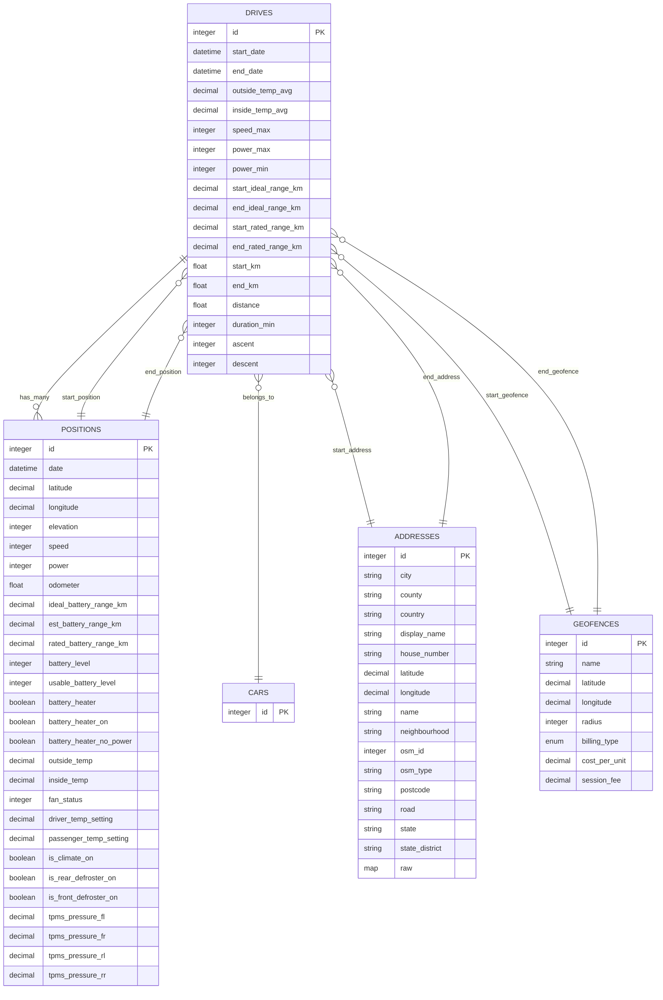
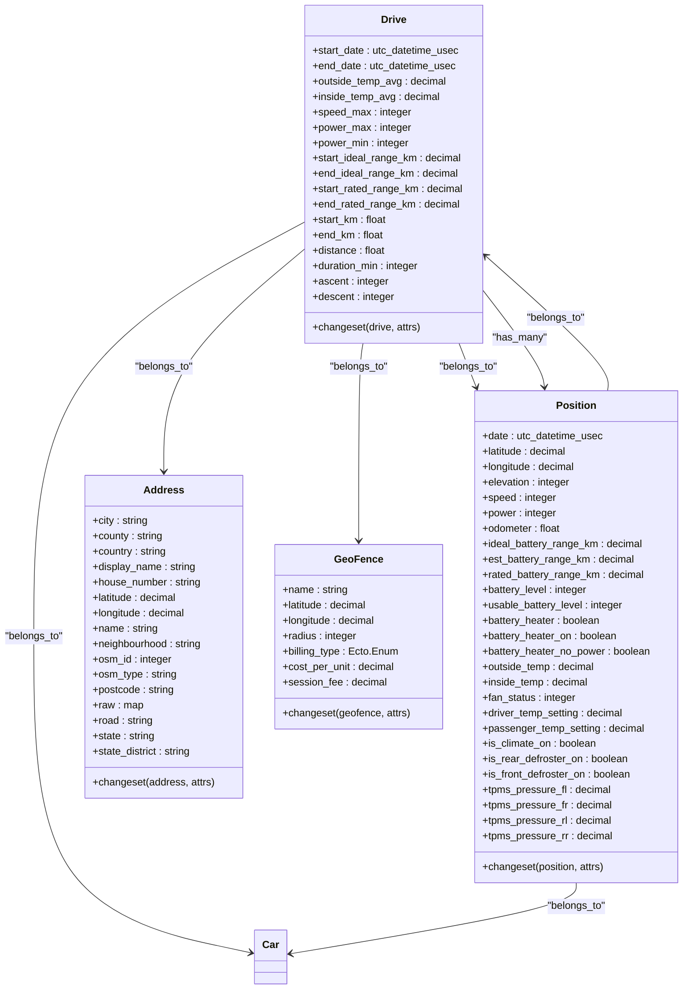
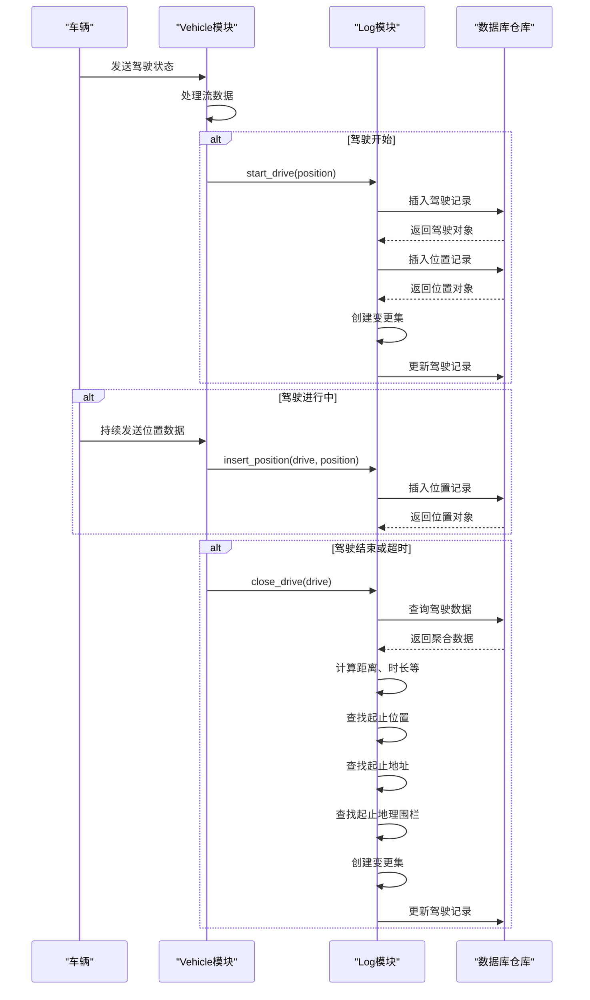
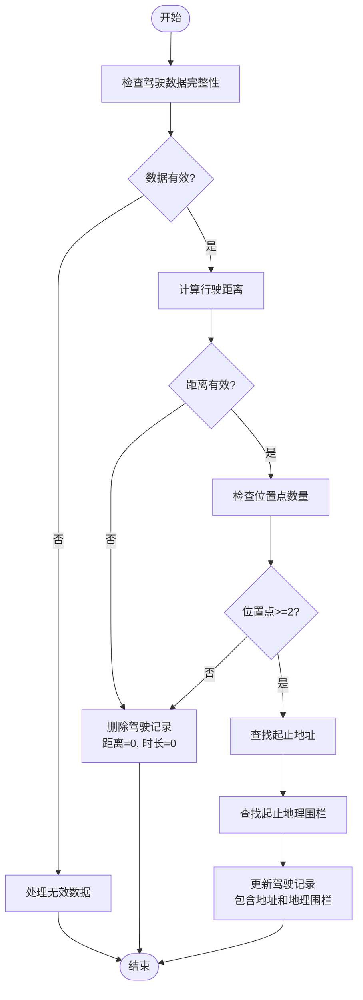
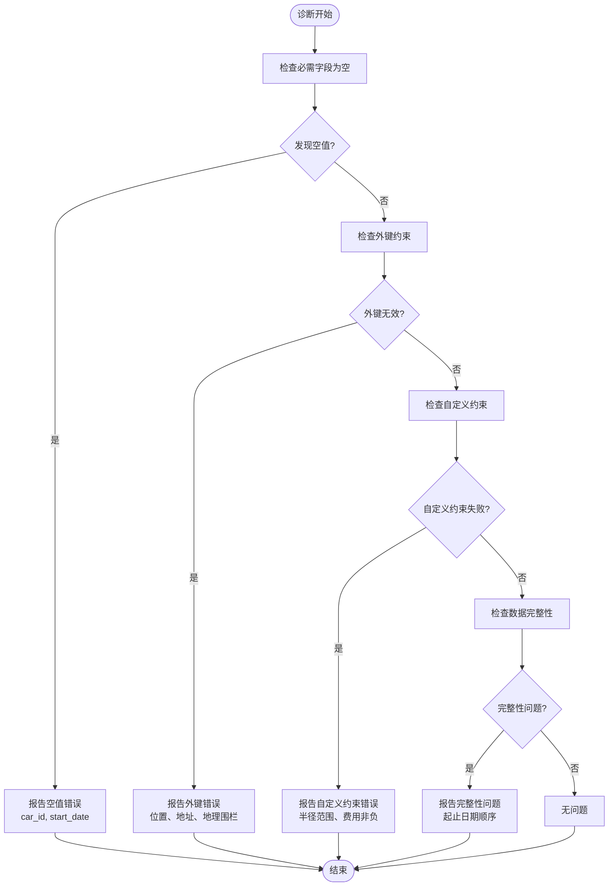

# 驾驶记录完整性约束

<cite>
**本文档中引用的文件**  
- [drive.ex](file://lib/teslamate/log/drive.ex)
- [position.ex](file://lib/teslamate/log/position.ex)
- [address.ex](file://lib/teslamate/locations/address.ex)
- [geo_fence.ex](file://lib/teslamate/locations/geo_fence.ex)
- [log.ex](file://lib/teslamate/log.ex)
- [vehicle.ex](file://lib/teslamate/vehicles/vehicle.ex)
- [add_constraints.exs](file://priv/repo/migrations/20190821143938_add_constraints.exs)
- [cascade_delete.exs](file://priv/repo/migrations/20200203120311_cascade_delete.exs)
</cite>

## 目录
1. [引言](#引言)
2. [驾驶数据模型完整性约束](#驾驶数据模型完整性约束)
3. [应用层验证规则](#应用层验证规则)
4. [数据验证流程与变更集实现](#数据验证流程与变更集实现)
5. [异常驾驶记录处理策略](#异常驾驶记录处理策略)
6. [常见数据异常诊断与修复](#常见数据异常诊断与修复)

## 引言
本文档全面记录TeslaMate系统中驾驶数据模型的完整性约束和验证规则。文档详细说明了非空约束、外键约束和自定义检查约束的实现方式，解释了系统如何处理不完整或异常的驾驶记录，并描述了数据验证流程在变更集（changeset）中的实现机制。通过数据库约束和应用层验证双重保障数据质量，确保驾驶记录的准确性和一致性。

## 驾驶数据模型完整性约束

**图示来源**
- [drive.ex](file://lib/teslamate/log/drive.ex#L8-L39)
- [position.ex](file://lib/teslamate/log/position.ex#L7-L38)
- [address.ex](file://lib/teslamate/locations/address.ex#L5-L23)
- [geo_fence.ex](file://lib/teslamate/locations/geo_fence.ex#L6-L16)

**本节来源**
- [drive.ex](file://lib/teslamate/log/drive.ex)
- [position.ex](file://lib/teslamate/log/position.ex)
- [address.ex](file://lib/teslamate/locations/address.ex)
- [geo_fence.ex](file://lib/teslamate/locations/geo_fence.ex)

## 应用层验证规则

**图示来源**
- [drive.ex](file://lib/teslamate/log/drive.ex#L42-L77)
- [position.ex](file://lib/teslamate/log/position.ex#L42-L76)
- [address.ex](file://lib/teslamate/locations/address.ex#L27-L55)
- [geo_fence.ex](file://lib/teslamate/locations/geo_fence.ex#L20-L35)

**本节来源**
- [drive.ex](file://lib/teslamate/log/drive.ex#L42-L77)
- [position.ex](file://lib/teslamate/log/position.ex#L42-L76)
- [address.ex](file://lib/teslamate/locations/address.ex#L27-L55)
- [geo_fence.ex](file://lib/teslamate/locations/geo_fence.ex#L20-L35)

## 数据验证流程与变更集实现

**图示来源**
- [vehicle.ex](file://lib/teslamate/vehicles/vehicle.ex#L1545-L1559)
- [log.ex](file://lib/teslamate/log.ex#L329-L374)
- [log.ex](file://lib/teslamate/log.ex#L377-L393)

**本节来源**
- [log.ex](file://lib/teslamate/log.ex#L329-L393)
- [vehicle.ex](file://lib/teslamate/vehicles/vehicle.ex#L1545-L1567)

## 异常驾驶记录处理策略

**图示来源**
- [log.ex](file://lib/teslamate/log.ex#L346-L374)

**本节来源**
- [log.ex](file://lib/teslamate/log.ex#L346-L374)
- [vehicle.ex](file://lib/teslamate/vehicles/vehicle.ex#L369-L387)

## 常见数据异常诊断与修复

**图示来源**
- [drive.ex](file://lib/teslamate/log/drive.ex#L69-L76)
- [geo_fence.ex](file://lib/teslamate/locations/geo_fence.ex#L31-L34)
- [add_constraints.exs](file://priv/repo/migrations/20190821143938_add_constraints.exs#L6-L7)

**本节来源**
- [drive.ex](file://lib/teslamate/log/drive.ex#L69-L76)
- [geo_fence.ex](file://lib/teslamate/locations/geo_fence.ex#L31-L34)
- [add_constraints.exs](file://priv/repo/migrations/20190821143938_add_constraints.exs)
- [cascade_delete.exs](file://priv/repo/migrations/20200203120311_cascade_delete.exs)