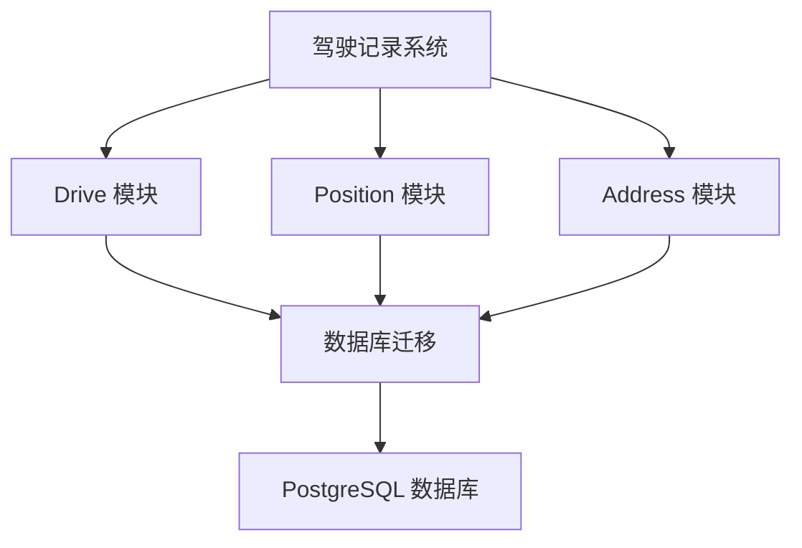
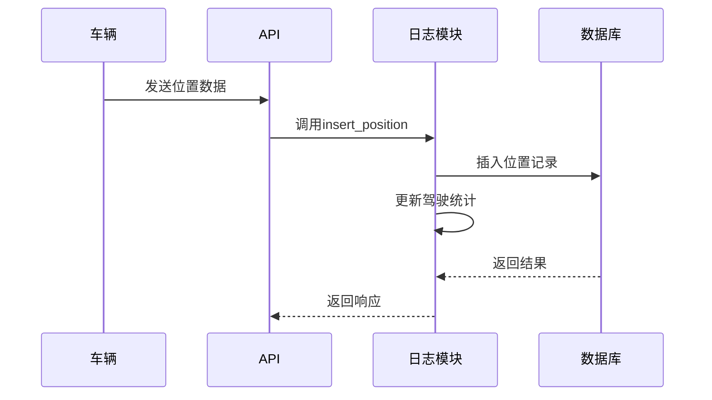
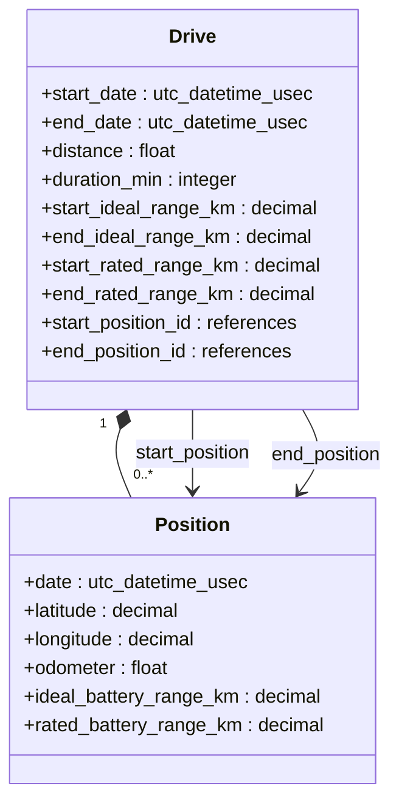
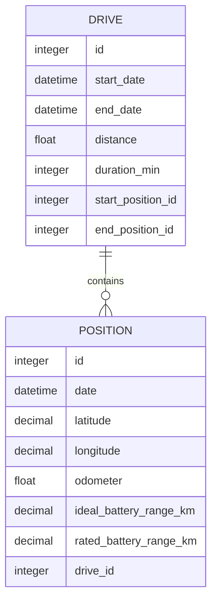
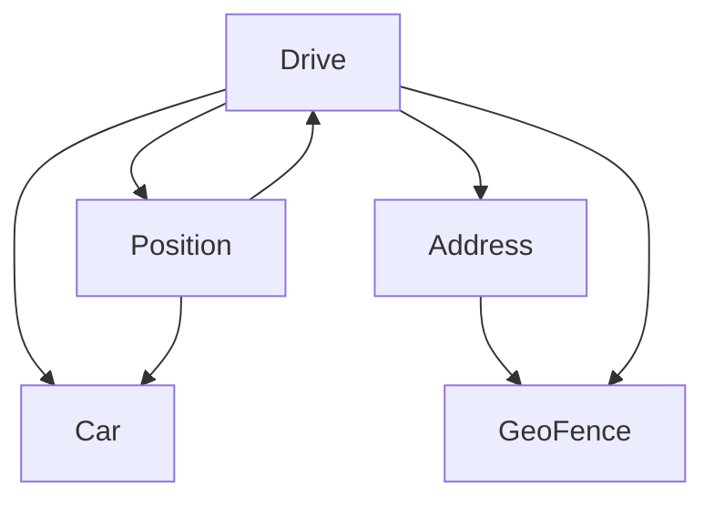

# 驾驶记录模型

<cite>
**本文档引用的文件**  
- [drive.ex](file://lib/teslamate/log/drive.ex)
- [position.ex](file://lib/teslamate/log/position.ex)
- [address.ex](file://lib/teslamate/locations/address.ex)
- [20190330160000_create_trips.exs](file://priv/repo/migrations/20190330160000_create_trips.exs)
- [20190812191616_rename_trips_to_drives.exs](file://priv/repo/migrations/20190812191616_rename_trips_to_drives.exs)
- [20190913175011_add_rated_range_to_drives.exs](file://priv/repo/migrations/20190913175011_add_rated_range_to_drives.exs)
- [20191003130650_add_start_and_end_position_to_drives.exs](file://priv/repo/migrations/20191003130650_add_start_and_end_position_to_drives.exs)
- [20230417225712_composite_index_to_position.exs](file://priv/repo/migrations/20230417225712_composite_index_to_position.exs)
- [20240915193446_composite_index_with_predicate_to_position.exs](file://priv/repo/migrations/20240915193446_composite_index_with_predicate_to_position.exs)
- [log_drive_test.exs](file://test/teslamate/log/log_drive_test.exs)
</cite>

## 目录
1. [项目结构](#项目结构)
2. [核心组件](#核心组件)
3. [架构概述](#架构概述)
4. [详细组件分析](#详细组件分析)
5. [依赖分析](#依赖分析)

## 项目结构

本项目采用Elixir语言开发，基于Phoenix框架构建，主要用于记录和分析特斯拉车辆的驾驶数据。项目结构清晰，主要分为以下几个部分：

- `lib/`：核心业务逻辑代码，包含日志记录、位置处理、车辆管理等模块。
- `priv/repo/migrations/`：数据库迁移文件，定义了数据表结构的演进过程。
- `test/`：测试代码，包含单元测试和集成测试。
- `config/`：配置文件，管理不同环境下的应用配置。
- `grafana/`：Grafana仪表板配置，用于可视化驾驶数据。

驾驶记录相关的核心数据模型主要位于`lib/teslamate/log/`目录下，包括`drive.ex`和`position.ex`两个主要模块。

**图源**
- [drive.ex](file://lib/teslamate/log/drive.ex)
- [position.ex](file://lib/teslamate/log/position.ex)
- [address.ex](file://lib/teslamate/locations/address.ex)

**节源**
- [drive.ex](file://lib/teslamate/log/drive.ex)
- [position.ex](file://lib/teslamate/log/position.ex)

## 核心组件

驾驶记录模型的核心组件包括`Drive`（驾驶记录）和`Position`（位置数据）两个Ecto Schema。`Drive`表记录每次驾驶的总体信息，如起止时间、距离、能耗等；`Position`表则记录驾驶过程中的详细位置信息，包括经纬度、速度、电量等。

`Drive`表通过`has_many :positions`与`Position`表建立关联，每个驾驶记录包含多个位置点。同时，`Drive`表还通过`belongs_to :start_position`和`belongs_to :end_position`关联到具体的起始和结束位置。

**节源**
- [drive.ex](file://lib/teslamate/log/drive.ex)
- [position.ex](file://lib/teslamate/log/position.ex)

## 架构概述

系统采用典型的分层架构，数据从车辆通过API采集后，经过处理存储到PostgreSQL数据库中。驾驶记录的创建流程如下：

1. 车辆开始移动时，调用`Log.start_drive/1`创建一个新的驾驶记录。
2. 在驾驶过程中，定期调用`Log.insert_position/2`插入位置数据。
3. 驾驶结束后，调用`Log.close_drive/2`关闭驾驶记录，计算并填充各项统计指标。

**图源**
- [drive.ex](file://lib/teslamate/log/drive.ex)
- [position.ex](file://lib/teslamate/log/position.ex)
- [log_drive_test.exs](file://test/teslamate/log/log_drive_test.exs)

## 详细组件分析

### Drive 模型分析

`Drive`模型是驾驶记录的核心，其字段设计经过多次演进。最初名为`trips`，后重命名为`drives`以更准确地描述其用途。

#### 核心字段计算方式

- **start_date 和 end_date**：记录驾驶的开始和结束时间。`start_date`在创建驾驶记录时设置，`end_date`在调用`close_drive`时根据最后一条位置记录的时间自动填充。
- **distance**：驾驶距离，通过计算起始和结束位置的里程差值得到。在`close_drive`过程中，系统会查找该驾驶记录的所有位置点，取第一个和最后一个位置的`odometer`值进行计算。
- **duration**：驾驶时长，通过`end_date`和`start_date`的时间差计算得出，以分钟为单位存储在`duration_min`字段中。

**图源**
- [drive.ex](file://lib/teslamate/log/drive.ex#L8-L39)
- [position.ex](file://lib/teslamate/log/position.ex#L7-L38)

#### 起始和结束位置关联机制

驾驶记录通过`start_position_id`和`end_position_id`外键直接关联到具体的起始和结束位置记录。这种设计避免了每次查询时都需要通过时间戳查找第一条和最后一条位置记录的开销，提高了查询效率。

在`close_drive`操作中，系统会自动设置这两个字段的值。具体逻辑是：查找该驾驶记录下按时间排序的第一个和最后一个`Position`记录，将其ID分别赋值给`start_position_id`和`end_position_id`。

**节源**
- [drive.ex](file://lib/teslamate/log/drive.ex#L27-L28)
- [20191003130650_add_start_and_end_position_to_drives.exs](file://priv/repo/migrations/20191003130650_add_start_and_end_position_to_drives.exs)

#### 效率和额定续航记录方法

- **efficiency（效率）**：早期版本中包含此字段，但后来被移除。系统不再直接存储效率值，而是通过其他数据计算得出。
- **rated_range（额定续航）**：系统同时记录理想续航（ideal range）和额定续航（rated range）。`start_rated_range_km`和`end_rated_range_km`字段分别存储驾驶开始和结束时的额定续航里程。这些值从位置记录中的`rated_battery_range_km`字段获取。

在2019年9月的迁移中，系统通过`20190913175543_set_start_and_end_rated_range_km.exs`迁移文件，使用Ecto查询为所有现有驾驶记录批量填充了额定续航数据。

**节源**
- [20190913175011_add_rated_range_to_drives.exs](file://priv/repo/migrations/20190913175011_add_rated_range_to_drives.exs)
- [20190913175543_set_start_and_end_rated_range_km.exs](file://priv/repo/migrations/20190913175543_set_start_and_end_rated_range_km.exs)

### 驾驶记录与位置数据关联关系

驾驶记录与位置数据之间存在一对多的关系。每个`Drive`记录可以关联多个`Position`记录，这些记录通过`drive_id`外键与驾驶记录关联。

#### 复合索引优化策略

为了优化查询性能，系统采用了复合索引策略：

1. 在`positions`表上创建了`(:drive_id, :date)`复合索引，这使得按驾驶记录ID和时间范围查询位置数据变得非常高效。
2. 创建了带条件的复合索引`(:car_id, :date, "(ideal_battery_range_km IS NOT NULL)")`，专门优化对包含有效续航数据的位置查询。

这些索引显著提升了驾驶记录分析和报表生成的性能，特别是在处理大量历史数据时。

**图源**
- [20230417225712_composite_index_to_position.exs](file://priv/repo/migrations/20230417225712_composite_index_to_position.exs)
- [20240915193446_composite_index_with_predicate_to_position.exs](file://priv/repo/migrations/20240915193446_composite_index_with_predicate_to_position.exs)

### 数据完整性约束和验证规则

系统实施了严格的数据完整性约束：

1. **必填字段验证**：`Drive`模型要求`car_id`和`start_date`必须存在；`Position`模型要求`car_id`、`date`、`latitude`和`longitude`必须存在。
2. **外键约束**：所有外键关系都设置了数据库级别的约束，确保数据引用的完整性。
3. **驾驶记录清理规则**：系统会自动清理无效的驾驶记录。如果一个驾驶记录没有位置数据，或者只有单个位置数据，或者行驶距离为零，系统会在关闭时自动删除该记录。

这些规则确保了数据的质量和一致性，避免了大量无效或冗余数据的积累。

**节源**
- [drive.ex](file://lib/teslamate/log/drive.ex#L69-L77)
- [position.ex](file://lib/teslamate/log/position.ex#L74-L76)
- [log_drive_test.exs](file://test/teslamate/log/log_drive_test.exs#L157-L210)

## 依赖分析

驾驶记录模型依赖于多个核心模块：

**图源**
- [drive.ex](file://lib/teslamate/log/drive.ex)
- [position.ex](file://lib/teslamate/log/position.ex)
- [address.ex](file://lib/teslamate/locations/address.ex)

**节源**
- [drive.ex](file://lib/teslamate/log/drive.ex)
- [position.ex](file://lib/teslamate/log/position.ex)
- [address.ex](file://lib/teslamate/locations/address.ex)