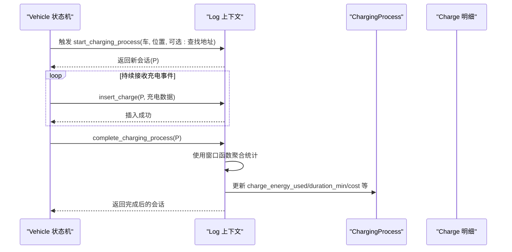
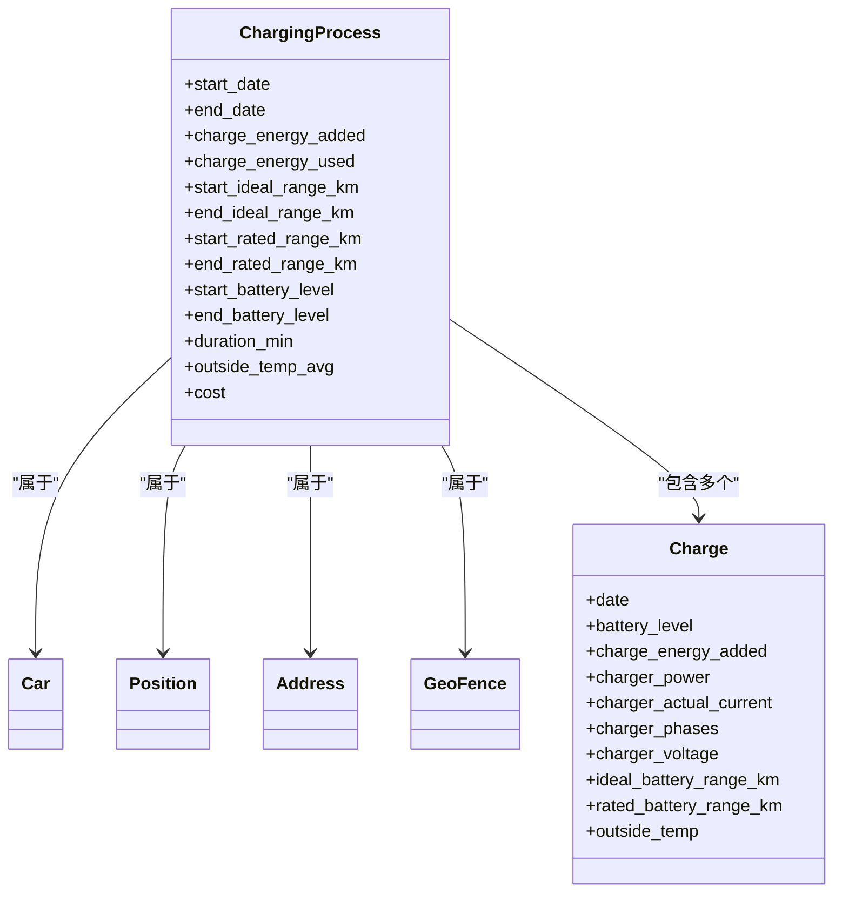
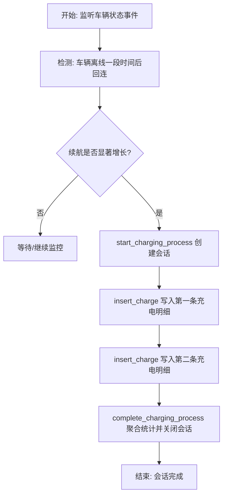
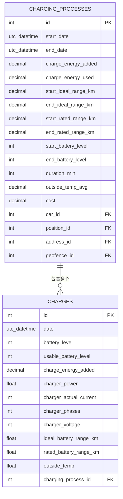
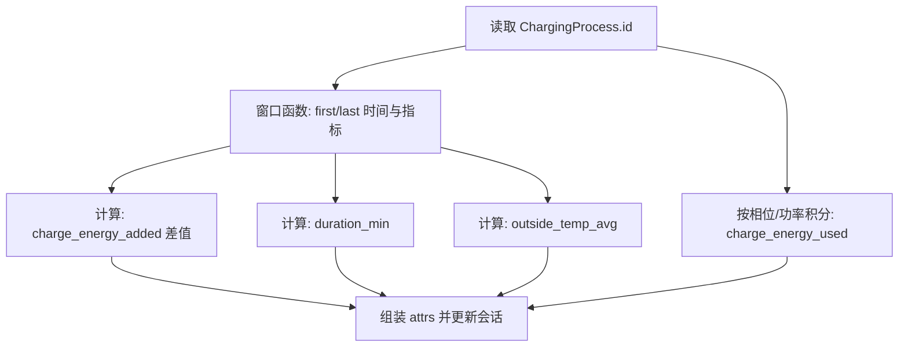
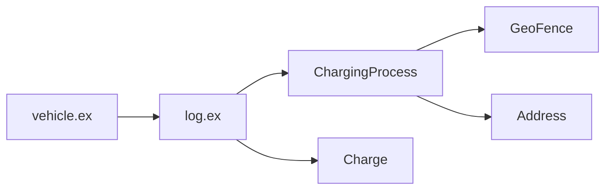

# 充电会话管理

<cite>
**本文引用的文件**
- [charging_process.ex](file://lib/teslamate/log/charging_process.ex)
- [charge.ex](file://lib/teslamate/log/charge.ex)
- [log.ex](file://lib/teslamate/log.ex)
- [vehicle.ex](file://lib/teslamate/vehicles/vehicle.ex)
- [state.ex](file://lib/tesla_api/vehicle/state.ex)
- [20190330190000_create_charging_processes.exs](file://priv/repo/migrations/20190330190000_create_charging_processes.exs)
- [20190330200000_create_charges.exs](file://priv/repo/migrations/20190330200000_create_charges.exs)
- [20191026185642_calculate_charge_energy_used.exs](file://priv/repo/migrations/20191026185642_calculate_charge_energy_used.exs)
- [20191212230527_recalc_energy_used.exs](file://priv/repo/migrations/20191212230527_recalc_energy_used.exs)
- [20191117042320_add_cost_field_to_charges.exs](file://priv/repo/migrations/20191117042320_add_cost_field_to_charges.exs)
- [20191017003836_add_est_total_charge_energy.exs](file://priv/repo/migrations/20191017003836_add_est_total_charge_energy.exs)
- [20190415192200_add_address_to_charging_process.exs](file://priv/repo/migrations/20190415192200_add_address_to_charging_process.exs)
- [20200116190926_charges_add_usable_battery_level.exs](file://priv/repo/migrations/20200116190926_charges_add_usable_battery_level.exs)
- [20190805092941_fix_incomplete_charging_processes.exs](file://priv/repo/migrations/20190805092941_fix_incomplete_charging_processes.exs)
- [20190813184320_fix_incomplete_charging_processes_v2.exs](file://priv/repo/migrations/20190813184320_fix_incomplete_charging_processes_v2.exs)
- [log_charging_test.exs](file://test/teslamate/log/log_charging_test.exs)
- [charging_test.exs](file://test/teslamate/vehicles/vehicle/charging_test.exs)
- [cost.html.heex](file://lib/teslamate_web/live/charge_live/cost.html.heex)
</cite>

## 目录
1. [简介](#简介)
2. [项目结构](#项目结构)
3. [核心组件](#核心组件)
4. [架构总览](#架构总览)
5. [详细组件分析](#详细组件分析)
6. [依赖关系分析](#依赖关系分析)
7. [性能考量](#性能考量)
8. [故障排查指南](#故障排查指南)
9. [结论](#结论)
10. [附录](#附录)

## 简介
本章节聚焦于充电会话管理，围绕 ChargingProcess 数据模型的设计与实现展开，系统性阐述：
- 充电会话的开始与结束条件检测机制（基于车辆状态变化）
- ChargingProcess 结构体字段定义及其语义（如 charge_energy_used、charge_energy_added、duration_min 等）
- 数据库表结构的演进与迁移文件说明
- 充电会话与 Charge 明细记录的关联关系
- 使用窗口函数计算会话起止时间、电池电量变化等聚合指标
- 完整的会话创建、更新与关闭流程示例
- 异常场景（如网络中断）下的会话处理策略

## 项目结构
充电会话管理涉及以下关键模块与文件：
- 数据模型层：ChargingProcess、Charge
- 日志上下文：Log（负责会话生命周期管理与统计聚合）
- 车辆状态机：Vehicle（负责根据车辆状态触发会话开始/结束）
- 迁移文件：定义 ChargingProcesses 与 Charges 表结构及字段演化
- 前端展示：成本与时长在页面中展示

```mermaid
graph TB
subgraph "数据模型"
CP["ChargingProcess<br/>会话主表"]
CH["Charge<br/>充电明细"]
end
subgraph "日志上下文"
LOG["Log<br/>start/insert/complete"]
end
subgraph "车辆状态机"
VEH["Vehicle<br/>状态事件驱动"]
end
subgraph "迁移与存储"
MIG1["迁移: 创建 charging_processes"]
MIG2["迁移: 创建 charges"]
MIG3["迁移: 计算 charge_energy_used"]
end
subgraph "前端"
UI["cost.html.heex<br/>展示 duration_min/energy"]
end
VEH --> LOG
LOG --> CP
LOG --> CH
CP <- --> CH
MIG1 --> CP
MIG2 --> CH
MIG3 --> LOG
UI --> CP
```

图表来源
- [charging_process.ex](file://lib/teslamate/log/charging_process.ex#L1-L61)
- [charge.ex](file://lib/teslamate/log/charge.ex#L29-L67)
- [log.ex](file://lib/teslamate/log.ex#L410-L444)
- [vehicle.ex](file://lib/teslamate/vehicles/vehicle.ex#L1010-L1040)
- [20190330190000_create_charging_processes.exs](file://priv/repo/migrations/20190330190000_create_charging_processes.exs#L1-L23)
- [20190330200000_create_charges.exs](file://priv/repo/migrations/20190330200000_create_charges.exs#L1-L27)
- [20191026185642_calculate_charge_energy_used.exs](file://priv/repo/migrations/20191026185642_calculate_charge_energy_used.exs#L73-L101)
- [cost.html.heex](file://lib/teslamate_web/live/charge_live/cost.html.heex#L72-L100)

章节来源
- [charging_process.ex](file://lib/teslamate/log/charging_process.ex#L1-L61)
- [charge.ex](file://lib/teslamate/log/charge.ex#L29-L67)
- [log.ex](file://lib/teslamate/log.ex#L410-L444)
- [vehicle.ex](file://lib/teslamate/vehicles/vehicle.ex#L1010-L1040)

## 核心组件
- ChargingProcess（会话主表）
  - 字段：start_date、end_date、charge_energy_added、charge_energy_used、start_ideal_range_km、end_ideal_range_km、start_rated_range_km、end_rated_range_km、start_battery_level、end_battery_level、duration_min、outside_temp_avg、cost
  - 关系：belongs_to car/position/address/geofence；has_many charges
- Charge（充电明细）
  - 字段：date、battery_heater_on/battery_heater/battery_heater_no_power、battery_level、usable_battery_level、charge_energy_added、charger_actual_current、charger_phases、charger_pilot_current、charger_power、charger_voltage、conn_charge_cable、fast_charger_present、fast_charger_brand、fast_charger_type、ideal_battery_range_km、rated_battery_range_km、not_enough_power_to_heat、outside_temp
  - 关系：belongs_to charging_process
- Log（日志上下文）
  - 提供 start_charging_process、insert_charge、complete_charging_process 等方法，完成会话生命周期管理与统计聚合
- Vehicle（车辆状态机）
  - 基于车辆状态事件（如“离线后回连且理想续航显著增长”）自动触发会话开始与结束

章节来源
- [charging_process.ex](file://lib/teslamate/log/charging_process.ex#L1-L61)
- [charge.ex](file://lib/teslamate/log/charge.ex#L29-L67)
- [log.ex](file://lib/teslamate/log.ex#L410-L444)
- [vehicle.ex](file://lib/teslamate/vehicles/vehicle.ex#L1010-L1040)

## 架构总览
充电会话管理的控制流如下：
- 车辆状态机监听在线/离线事件，当满足“离线一段时间后回连且理想续航显著增长”时，自动开启会话并插入两条 Charge 记录，随后关闭会话
- 日志上下文负责：
  - start_charging_process：创建会话并写入位置、地址、地理围栏信息
  - insert_charge：向会话写入每条充电明细
  - complete_charging_process：使用窗口函数聚合统计，计算 charge_energy_used、duration_min、cost 等字段并更新会话



图表来源
- [vehicle.ex](file://lib/teslamate/vehicles/vehicle.ex#L1010-L1040)
- [log.ex](file://lib/teslamate/log.ex#L410-L444)
- [log.ex](file://lib/teslamate/log.ex#L450-L649)

## 详细组件分析

### ChargingProcess 数据模型设计
- 字段语义
  - start_date/end_date：会话起止时间
  - charge_energy_added：累计添加电量（kWh），采用 decimal 类型以避免浮点误差
  - charge_energy_used：实际消耗电量（kWh），通过窗口函数与相位/功率推导计算
  - start_ideal_range_km/end_ideal_range_km、start_rated_range_km/end_rated_range_km：起止理想/标称续航（km）
  - start_battery_level/end_battery_level：起止电池百分比
  - duration_min：会话时长（分钟）
  - outside_temp_avg：会话期间平均外部温度
  - cost：会话费用（按地理围栏计费规则计算）
- 关系
  - belongs_to car/position/address/geofence
  - has_many charges



图表来源
- [charging_process.ex](file://lib/teslamate/log/charging_process.ex#L1-L61)
- [charge.ex](file://lib/teslamate/log/charge.ex#L29-L67)

章节来源
- [charging_process.ex](file://lib/teslamate/log/charging_process.ex#L1-L61)
- [charge.ex](file://lib/teslamate/log/charge.ex#L29-L67)

### 充电会话开始与结束条件检测
- 开始条件
  - 车辆离线一段时间后回连，且回连时刻的理想续航较离线前显著增长
  - 系统自动调用 start_charging_process 并插入两条 Charge 记录，随后 complete_charging_process
- 结束条件
  - complete_charging_process 通过窗口函数对 Charge 明细进行聚合，计算起止时间、电量变化与时长，并据此关闭会话
- 状态机驱动
  - vehicle.ex 中的 handle_event 在“离线回连+续航增长”条件下，事务性地创建会话、插入两条 Charge、关闭会话并广播状态



图表来源
- [vehicle.ex](file://lib/teslamate/vehicles/vehicle.ex#L1010-L1040)
- [log.ex](file://lib/teslamate/log.ex#L410-L444)
- [log.ex](file://lib/teslamate/log.ex#L445-L509)

章节来源
- [vehicle.ex](file://lib/teslamate/vehicles/vehicle.ex#L1010-L1040)
- [log_charging_test.exs](file://test/teslamate/log/log_charging_test.exs#L764-L804)

### 字段定义与含义详解
- charge_energy_added
  - 会话内累计添加电量（kWh），使用 decimal 存储，避免累积误差
  - 计算逻辑：窗口函数取最后一条与第一条 charge_energy_added 的差值，若为 0 或为空则退而求其次取最大值
- charge_energy_used
  - 实际消耗电量（kWh），通过窗口函数对相邻两条 Charge 的功率/电流/电压/相位进行积分计算
  - 若缺失相位信息，则直接使用 charger_power；否则按 I×V×相位换算
- duration_min
  - 会话时长（分钟），由窗口函数取最后时间减去起始时间
- start_ideal_range_km/end_ideal_range_km、start_rated_range_km/end_rated_range_km
  - 会话起止理想/标称续航（km），用于效率与成本计算
- start_battery_level/end_battery_level、outside_temp_avg
  - 会话起止电池百分比与平均外部温度
- cost
  - 会话费用，依据地理围栏计费类型（按 kWh 或按分钟）与会话费、单价计算

章节来源
- [log.ex](file://lib/teslamate/log.ex#L450-L649)
- [20191117042320_add_cost_field_to_charges.exs](file://priv/repo/migrations/20191117042320_add_cost_field_to_charges.exs#L1-L9)

### 数据库表结构与迁移演进
- 初始表结构
  - charging_processes：包含 start_date、end_date、charge_energy_added、start_soc、end_soc、start_battery_level、end_battery_level、calculated_max_range、duration_min、outside_temp_avg、car_id、position_id 等字段
  - charges：包含 date、battery_heater_on、battery_level、charge_energy_added、charger_actual_current、charger_phases、charger_pilot_current、charger_power、charger_voltage、fast_charger_present、conn_charge_cable、fast_charger_brand、fast_charger_type、ideal_battery_range_km、not_enough_power_to_heat、outside_temp、charging_process_id 等字段
- 字段演化
  - 添加 address_id（会话级地址）
  - 添加 cost 字段（会话费用）
  - 添加 charge_energy_used、charge_energy_used_confidence、interval_sec（估计总耗电）
  - 为 charges 添加 usable_battery_level
- 计算字段迁移
  - 通过窗口函数与相位/功率推导计算 charge_energy_used，并在历史数据上批量重算



图表来源
- [20190330190000_create_charging_processes.exs](file://priv/repo/migrations/20190330190000_create_charging_processes.exs#L1-L23)
- [20190330200000_create_charges.exs](file://priv/repo/migrations/20190330200000_create_charges.exs#L1-L27)
- [20190415192200_add_address_to_charging_process.exs](file://priv/repo/migrations/20190415192200_add_address_to_charging_process.exs#L1-L9)
- [20191117042320_add_cost_field_to_charges.exs](file://priv/repo/migrations/20191117042320_add_cost_field_to_charges.exs#L1-L9)
- [20191017003836_add_est_total_charge_energy.exs](file://priv/repo/migrations/20191017003836_add_est_total_charge_energy.exs#L1-L11)
- [20200116190926_charges_add_usable_battery_level.exs](file://priv/repo/migrations/20200116190926_charges_add_usable_battery_level.exs#L1-L9)

章节来源
- [20190330190000_create_charging_processes.exs](file://priv/repo/migrations/20190330190000_create_charging_processes.exs#L1-L23)
- [20190330200000_create_charges.exs](file://priv/repo/migrations/20190330200000_create_charges.exs#L1-L27)
- [20191026185642_calculate_charge_energy_used.exs](file://priv/repo/migrations/20191026185642_calculate_charge_energy_used.exs#L73-L101)
- [20191212230527_recalc_energy_used.exs](file://priv/repo/migrations/20191212230527_recalc_energy_used.exs#L116-L153)

### 会话与 Charge 明细的关联关系
- ChargingProcess.has_many Charge
- Charge.belongs_to ChargingProcess
- complete_charging_process 通过窗口函数对 Charge 明细进行聚合，生成会话级统计并更新 ChargingProcess

章节来源
- [charging_process.ex](file://lib/teslamate/log/charging_process.ex#L23-L29)
- [charge.ex](file://lib/teslamate/log/charge.ex#L29-L31)
- [log.ex](file://lib/teslamate/log.ex#L450-L649)

### 窗口函数与聚合指标计算
- 起止时间：first_value/last_value(c.date)
- 续航与电量：first_value/last_value(c.ideal_battery_range_km/rated_battery_range_km)、first_value/last_value(c.battery_level)
- 平均温度：avg(c.outside_temp)
- 电量差：coalesce(nullif(last_value(...) ,0), max(...)) - first_value(...)
- 时长：duration_min(last_value(c.date), first_value(c.date))
- 实际耗电：按相位/功率积分，正向累加



图表来源
- [log.ex](file://lib/teslamate/log.ex#L450-L649)
- [20191026185642_calculate_charge_energy_used.exs](file://priv/repo/migrations/20191026185642_calculate_charge_energy_used.exs#L73-L101)

章节来源
- [log.ex](file://lib/teslamate/log.ex#L450-L649)
- [20191026185642_calculate_charge_energy_used.exs](file://priv/repo/migrations/20191026185642_calculate_charge_energy_used.exs#L73-L101)

### 会话创建、更新与关闭流程示例
- 创建会话
  - start_charging_process：写入 car_id、position、address_id、geofence_id、start_date
- 插入明细
  - insert_charge：写入每条充电事件的详细参数（含功率、电流、相位、电压、电量等）
- 关闭会话
  - complete_charging_process：窗口函数聚合，计算 charge_energy_used、duration_min、cost 并更新会话
- 成本计算
  - 根据地理围栏计费类型（按 kWh 或按分钟）与单价、会话费计算

章节来源
- [log.ex](file://lib/teslamate/log.ex#L410-L444)
- [log.ex](file://lib/teslamate/log.ex#L445-L509)
- [log.ex](file://lib/teslamate/log.ex#L582-L630)
- [cost.html.heex](file://lib/teslamate_web/live/charge_live/cost.html.heex#L72-L100)

### 异常情况与网络中断处理策略
- 无效充电数据
  - 当 Charge 数据校验失败（如 charger_phases<=0、缺少必填字段）时，insert_charge 返回错误变更集，日志记录警告并忽略该条数据
- 网络中断
  - 车辆离线期间仍可记录位置与状态；回连后若检测到续航显著增长，自动触发会话创建与关闭，确保会话完整性
- 会话不完整修复
  - 历史迁移脚本会对既有会话进行重算，补齐 charge_energy_used、duration_min 等字段

章节来源
- [log.ex](file://lib/teslamate/log.ex#L439-L443)
- [log_charging_test.exs](file://test/teslamate/log/log_charging_test.exs#L146-L161)
- [vehicle.ex](file://lib/teslamate/vehicles/vehicle.ex#L1010-L1040)
- [20191212230527_recalc_energy_used.exs](file://priv/repo/migrations/20191212230527_recalc_energy_used.exs#L116-L153)

## 依赖关系分析
- 车辆状态机依赖 Log 上下文创建/关闭会话
- Log 上下文依赖 Ecto 查询与窗口函数进行统计
- ChargingProcess 与 Charge 之间存在一对多关系
- 地理围栏与地址信息影响成本计算



图表来源
- [vehicle.ex](file://lib/teslamate/vehicles/vehicle.ex#L1010-L1040)
- [log.ex](file://lib/teslamate/log.ex#L410-L444)
- [charging_process.ex](file://lib/teslamate/log/charging_process.ex#L1-L61)
- [charge.ex](file://lib/teslamate/log/charge.ex#L29-L67)

章节来源
- [vehicle.ex](file://lib/teslamate/vehicles/vehicle.ex#L1010-L1040)
- [log.ex](file://lib/teslamate/log.ex#L410-L444)
- [charging_process.ex](file://lib/teslamate/log/charging_process.ex#L1-L61)
- [charge.ex](file://lib/teslamate/log/charge.ex#L29-L67)

## 性能考量
- 窗口函数聚合在大体量 Charge 数据上可能成为瓶颈，建议：
  - 对 charging_process_id/date 建立复合索引
  - 控制聚合窗口范围，避免全量扫描
  - 批量重算历史数据时分批执行
- 相位/功率积分计算涉及浮点运算，应使用 decimal 存储结果以减少误差累积
- 地理围栏与地址查询在 start_charging_process 中可能产生额外延迟，可在可选参数中关闭地址解析以提升性能

## 故障排查指南
- 充电数据校验失败
  - 现象：insert_charge 返回错误变更集
  - 处理：检查 charger_phases、charge_energy_added、charger_power、date、ideal_battery_range_km 等字段是否满足约束
- 会话未正确关闭
  - 现象：complete_charging_process 未更新 charge_energy_used/duration_min
  - 处理：确认 Charge 明细是否连续、是否存在负值或空值；必要时运行历史重算迁移
- 成本计算异常
  - 现象：cost 为 nil 或与预期不符
  - 处理：检查地理围栏计费类型、单价与会话费配置；确认 charge_energy_added/used 是否有效

章节来源
- [log_charging_test.exs](file://test/teslamate/log/log_charging_test.exs#L146-L161)
- [log.ex](file://lib/teslamate/log.ex#L582-L630)
- [20191212230527_recalc_energy_used.exs](file://priv/repo/migrations/20191212230527_recalc_energy_used.exs#L116-L153)

## 结论
本节系统梳理了 ChargingProcess 数据模型的设计与实现，明确了会话的开始与结束条件、字段语义、数据库表结构演化、会话与明细的关联关系，以及通过窗口函数进行聚合统计的方法。同时提供了完整的创建/更新/关闭流程示例与异常处理策略，便于在生产环境中稳定运行与维护。

## 附录
- 相关测试用例
  - 会话聚合与电量计算：[log_charging_test.exs](file://test/teslamate/log/log_charging_test.exs#L807-L835)
  - 会话创建与关闭流程：[log_charging_test.exs](file://test/teslamate/log/log_charging_test.exs#L764-L804)
  - 充电状态事件驱动：[charging_test.exs](file://test/teslamate/vehicles/vehicle/charging_test.exs#L132-L157)
- 前端展示
  - 会话时长与电量展示：[cost.html.heex](file://lib/teslamate_web/live/charge_live/cost.html.heex#L72-L100)