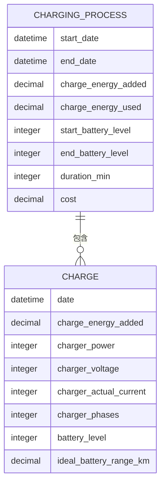
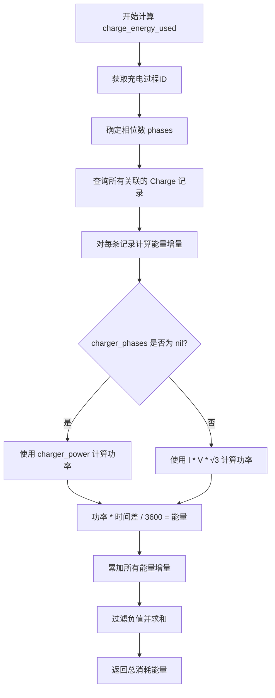

# 充电分析

<cite>
**本文档引用的文件**   
- [charging_process.ex](file://lib/teslamate/log/charging_process.ex)
- [charge.ex](file://lib/teslamate/log/charge.ex)
- [log.ex](file://lib/teslamate/log.ex)
- [calculate_charge_energy_used.exs](file://priv/repo/migrations/20191026185642_calculate_charge_energy_used.exs)
- [recalc_energy_used.exs](file://priv/repo/migrations/20191212230527_recalc_energy_used.exs)
- [add_cost_field_to_charges.exs](file://priv/repo/migrations/20191117042320_add_cost_field_to_charges.exs)
- [cost.ex](file://lib/teslamate_web/live/charge_live/cost.ex)
- [charges.json](file://grafana/dashboards/charges.json)
- [charging-stats.json](file://grafana/dashboards/charging-stats.json)
</cite>

## 目录
1. [引言](#引言)
2. [充电会话检测与数据模型](#充电会话检测与数据模型)
3. [能量消耗计算](#能量消耗计算)
4. [多相电源检测与校正算法](#多相电源检测与校正算法)
5. [充电成本跟踪](#充电成本跟踪)
6. [充电效率因子更新](#充电效率因子更新)
7. [Grafana仪表板与统计报表](#grafana仪表板与统计报表)
8. [结论](#结论)

## 引言
本文档详细阐述了TeslaMate系统中充电分析功能的实现机制。该功能涵盖了从充电会话的自动检测、能量消耗的精确计算，到充电成本的跟踪以及车辆效率因子的自动更新等核心环节。通过分析Elixir代码、数据库迁移脚本和Grafana仪表板配置，本文将深入解析系统如何利用SQL聚合函数、相位校正算法和成本计算规则来提供全面的充电数据分析。

## 充电会话检测与数据模型

充电分析功能的核心始于对车辆充电会话的准确检测。系统通过持续监控车辆状态，当检测到充电开始时，会创建一个新的`ChargingProcess`（充电过程）记录。该记录的生命周期从`start_date`开始，直到车辆停止充电并断开连接时，通过`complete_charging_process`函数完成，此时会填充`end_date`和其他聚合统计信息。

本功能主要依赖两个关键的数据模型：`ChargingProcess`和`Charge`。

- **ChargingProcess (充电过程)**: 代表一次完整的充电会话。它是一个聚合实体，包含了会话的起止时间、总充电能量、电池电量变化、持续时间、平均外部温度以及最终计算出的充电成本等宏观信息。它与`Charge`实体形成一对多的关系。
- **Charge (充电记录)**: 代表在充电过程中以高频率（通常每几秒）采集的单次车辆状态快照。每次采集都包含详细的充电参数，如充电功率、电压、电流、相位数、电池电量和理想续航里程等。

这种设计模式将高频的原始数据（`Charge`）与低频的会话摘要（`ChargingProcess`）分离，既保证了数据采集的完整性，又优化了查询和分析的性能。



**图源**
- [charging_process.ex](file://lib/teslamate/log/charging_process.ex#L8-L29)
- [charge.ex](file://lib/teslamate/log/charge.ex#L7-L30)

**本节来源**
- [charging_process.ex](file://lib/teslamate/log/charging_process.ex#L1-L60)
- [charge.ex](file://lib/teslamate/log/charge.ex#L1-L67)

## 能量消耗计算

`charge_energy_used`（实际消耗能量）是衡量充电效率的关键指标，它与车辆上报的`charge_energy_added`（添加能量）有所不同。`charge_energy_added`是车辆内部估算的值，而`charge_energy_used`是系统根据物理定律（功率 × 时间）直接从充电参数计算得出的更精确的值。

计算`charge_energy_used`的核心逻辑在`calculate_energy_used/1`函数中实现，其过程如下：

1.  **数据准备**: 首先，系统会确定本次充电过程的相位数（`phases`），这可能通过后续描述的相位校正算法得到。
2.  **能量增量计算**: 对于`ChargingProcess`关联的每一个`Charge`记录，计算其与前一个记录之间的时间间隔（`delta_t`，单位为秒），并计算该时间间隔内消耗的能量（`energy_used`）。
3.  **功率计算**: 能量计算的核心是功率。系统使用以下逻辑确定瞬时功率：
    -   如果`charger_phases`字段为`nil`（例如在直流快充时），则直接使用`charger_power`（充电功率，单位为kW）。
    -   如果`charger_phases`有值（例如在交流充电时），则使用三相电的功率公式：`功率 = 电流 × 电压 × √3`。在代码中，这体现为`charger_actual_current * charger_voltage * phases / 1000.0`，其中`phases`在此处代表`√3`（约1.732）。
4.  **时间积分**: 将计算出的功率（kW）乘以时间间隔（秒），再除以3600，即可得到该时间间隔内消耗的能量（kWh）。
5.  **聚合求和**: 将所有时间间隔的`energy_used`值求和，并过滤掉负值，最终得到整个充电过程的`charge_energy_used`。

该算法通过SQL窗口函数`lag()`来高效地计算连续记录之间的时间差，确保了计算的准确性和性能。



**图源**
- [log.ex](file://lib/teslamate/log.ex#L517-L541)
- [calculate_charge_energy_used.exs](file://priv/repo/migrations/20191026185642_calculate_charge_energy_used.exs#L73-L101)

**本节来源**
- [log.ex](file://lib/teslamate/log.ex#L517-L541)
- [calculate_charge_energy_used.exs](file://priv/repo/migrations/20191026185642_calculate_charge_energy_used.exs#L1-L102)

## 多相电源检测与校正算法

在交流充电场景中，车辆上报的`charger_phases`（相位数）有时可能不准确。为了解决这个问题，TeslaMate实现了一套智能的相位和电压校正算法，其核心函数为`determine_phases/1`。

该算法的逻辑如下：

1.  **数据聚合**: 从本次充电过程的所有`Charge`记录中，计算出四个关键的平均值：
    -   `p`: 通过`charger_power * 1000 / (charger_actual_current * charger_voltage)`反推计算出的理论相位数。
    -   `r`: 车辆上报的`charger_phases`的平均值。
    -   `v`: `charger_voltage`的平均值。
    -   `n`: 记录的总数量。
2.  **条件判断**: 算法通过一系列条件来判断是否需要校正：
    -   **直接匹配**: 如果上报的相位数`r`等于理论值`p`的四舍五入值（`round(p)`），则认为数据准确，直接返回`r`。
    -   **电压校正**: 如果上报为3相电（`r == 3`），但理论值`p`接近`√3`（约1.732），则判断为电压测量错误。系统会记录日志，并将电压值校正为`v / √3`，同时将相位数修正为`√3`（即1.732），以正确计算功率。
    -   **相位校正**: 如果理论值`p`与上报值`r`的差异在0.3以内，则认为上报的相位数有误，应修正为`round(p)`。
    -   **无校正**: 如果以上条件均不满足，则返回`nil`，表示无法确定或无需校正。

这套算法通过分析物理数据的一致性，有效纠正了因车辆固件或通信问题导致的充电参数错误，确保了`charge_energy_used`计算的准确性。

```mermaid
flowchart TD
A[开始 determine_phases] --> B[计算 p, r, v, n 的平均值]
B --> C{p > 0 且 n > 15?}
C --> |否| D[返回 nil]
C --> |是| E{r == round(p)?}
E --> |是| F[返回 r]
E --> |否| G{r == 3 且 abs(p / √3 - 1) <= 0.1?}
G --> |是| H[记录电压校正日志<br>返回 √3]
G --> |否| I{abs(round(p) - p) <= 0.3?}
I --> |是| J[记录相位校正日志<br>返回 round(p)]
I --> |否| K[返回 nil]
```

**图源**
- [log.ex](file://lib/teslamate/log.ex#L543-L579)

**本节来源**
- [log.ex](file://lib/teslamate/log.ex#L543-L579)

## 充电成本跟踪

充电成本的计算是一个灵活的规则系统，允许用户为不同的地理位置（通过地理围栏GeoFence定义）配置不同的计费方式。

### 成本计算规则

成本计算主要在`put_cost/2`函数中完成，其规则如下：

1.  **超级充电站免费**: 这是最高优先级的规则。如果充电发生在特斯拉超级充电站（`fast_charger_type`以"Tesla"开头）且车辆的`free_supercharging`设置为`true`，则无论其他设置如何，本次充电成本直接设为`0.0`。
2.  **按电量计费 (per_kwh)**: 如果地理围栏的计费类型为`per_kwh`，则成本计算为：`成本 = session_fee + (charge_energy_added 或 charge_energy_used 中的最大值) × cost_per_kwh`。
3.  **按时间计费 (per_minute)**: 如果计费类型为`per_minute`，则成本计算为：`成本 = session_fee + duration_min × cost_per_minute`。
4.  **无成本**: 如果以上规则均不匹配，则成本为`nil`。

### 用户交互与超级充电处理

用户可以通过Grafana仪表板或TeslaMate Web界面为历史充电会话手动添加成本。系统会检测到未添加成本的会话，并提示用户是否要“回溯添加成本”。对于超级充电站，系统会自动应用免费规则，即使用户手动设置了费用，最终成本也会被覆盖为0。

```mermaid
flowchart TD
A[开始计算成本] --> B{是否为特斯拉超级充电站<br>且免费超级充电已启用?}
B --> |是| C[成本 = 0.0]
B --> |否| D{计费类型为 per_kwh?}
D --> |是| E[成本 = session_fee + max(kWh_added, kWh_used) * cost_per_kwh]
D --> |否| F{计费类型为 per_minute?}
F --> |是| G[成本 = session_fee + duration_min * cost_per_minute]
F --> |否| H[成本 = nil]
C --> I[返回成本]
E --> I
G --> I
H --> I
```

**图源**
- [log.ex](file://lib/teslamate/log.ex#L582-L627)
- [cost.ex](file://lib/teslamate_web/live/charge_live/cost.ex#L40-L83)

**本节来源**
- [log.ex](file://lib/teslamate/log.ex#L582-L627)
- [add_cost_field_to_charges.exs](file://priv/repo/migrations/20191117042320_add_cost_field_to_charges.exs#L1-L9)
- [cost.ex](file://lib/teslamate_web/live/charge_live/cost.ex#L1-L127)

## 充电效率因子更新

车辆的效率因子（efficiency）是估算能耗和续航里程的关键参数。TeslaMate通过分析历史充电数据来自动重计算这个因子。

### 自动重计算机制

每当一个充电会话被完成（`complete_charging_process`），系统就会触发`recalculate_efficiency/3`函数。其工作流程如下：

1.  **数据筛选**: 查询该车辆过去所有符合条件的充电会话。条件包括：持续时间大于10分钟、结束时电池电量不超过95%、能量添加值大于0，且起止续航里程有效。
2.  **效率计算**: 对于每个符合条件的会话，计算其效率：`效率 = charge_energy_added / (end_range - start_range)`，单位为kWh/km。
3.  **分组与排序**: 将计算出的效率值按精度（小数点后位数）进行分组，并按出现次数降序排列。
4.  **阈值确认**: 系统会尝试从高精度到低精度（如4位、3位、2位小数）查找一个被多次确认（达到预设阈值）的效率值。
5.  **更新**: 一旦找到一个被足够多次数确认的效率值，就将其作为新的效率因子更新到车辆记录中。如果高精度值未达到阈值，则尝试低精度值。

这种机制确保了效率因子是基于大量可靠数据得出的稳健估计，避免了单次充电的异常值对整体估算造成过大影响。

**本节来源**
- [log.ex](file://lib/teslamate/log.ex#L632-L675)

## Grafana仪表板与统计报表

Grafana仪表板是展示充电分析结果的主要界面。`charges.json`和`charging-stats.json`等仪表板文件中的SQL查询直接利用了上述计算出的数据。

### 典型报表查询

-   **总能量与成本**: `charges.json`中的统计面板通过`SUM(charge_energy_added)`和`SUM(cost)`来展示选定时间段内的总充电量和总成本。
-   **平均成本**: `charging-stats.json`中的“平均每kWh成本”面板通过`SUM(cost) / SUM(GREATEST(charge_energy_added, charge_energy_used))`来计算整体平均成本。
-   **区分AC/DC成本**: 通过`CASE WHEN NULLIF(mode() within group (order by charger_phases),0) is null THEN 'DC' ELSE 'AC' END`来区分交流和直流充电，并分别计算其平均成本。

这些查询直接从`charging_processes`表中提取`charge_energy_used`和`cost`等已计算好的字段，实现了高效的数据可视化。

**本节来源**
- [charges.json](file://grafana/dashboards/charges.json#L1-L1526)
- [charging-stats.json](file://grafana/dashboards/charging-stats.json#L1-L2418)

## 结论

TeslaMate的充电分析功能通过精心设计的数据模型、精确的物理计算算法和智能的校正逻辑，实现了对电动汽车充电过程的全面监控和分析。系统不仅能准确计算实际消耗的能量，还能根据地理位置和充电类型灵活计算成本，并自动更新车辆效率因子。Grafana仪表板则将这些复杂的数据处理结果以直观的图表形式呈现，为用户提供了宝贵的充电行为洞察。整个系统的设计体现了从原始数据采集到高级数据分析的完整闭环。